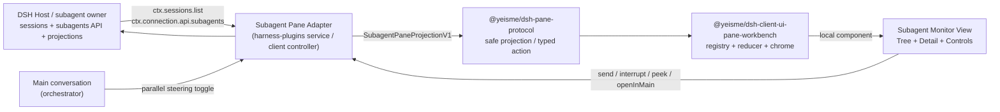

# DSH Pane Subagent Monitor Spec V1

> 状态：设计提案 + 首版实现中（Slice 1/2/3 部分完成）
> 范围：`packages/client/ui-pane-subagent/`、`packages/bundle/pane-subagent/`、可选 `packages/host/pane-subagent/`
> 前置：`dsh-pane-plugin-platform-v1`、`dsh-pane-workbench-interaction-v1`
> 目标：让 DSH 的主会话保持 orchestrator 位置，Subagent 以 Pane 工作台对象呈现，并提供只读详情、follow-up、interrupt 与并行引导。

## 1. 问题与目标

### 1.1 当前问题

- DSH Web 的 `ui-subagent` 使用 header catalog，打开 child 时会 `openSubagent()` 替换主会话，用户从 orchestrator 视角被切走。
- Subagent 状态只呈现 running/inactive，没有可靠的 completed/failed/cancelled outcome，难以形成 Codex Desktop 侧边栏那样的“并行工作台”心智。
- Pane Workbench 已经具备右侧/底部 region、Tab、拖拽、resize、preview/pin、retention，但还没有 Subagent 领域视图。
- Pane Workbench 的 `PaneLocalViewProps.projection` 目前未被 `PaneWorkbenchChrome` 实际传入，宿主投影到 view 的通道尚未闭环。

### 1.2 目标

- 主会话保持 orchestrator，Subagent 树在 Pane 中显示，用户不被迫离开主会话。
- 提供安全、有界、可恢复的 `SubagentPaneProjectionV1`。
- 提供不替换主会话的只读 transcript peek、continuable follow-up、interrupt。
- 提供可选的 Parallel/Swarm steering 开关，引导模型使用 DSH 原生 subagent 工具并行执行。
- 与现有 `ui-subagent` header catalog 共存；Pane 未安装时行为不回归。

### 1.3 Non-Goals

- 不实现客户端 scheduler、task ledger、writer lease、subagent 启动协议。
- 不复制 DSH `subagent` 状态机或创建第二份 subagent 树。
- 不把 subagent-origin Session 行重新塞回普通 sidebar。
- 不修改 DSH core 的 session/subagent 语义；outcome projection 以 additive DSH surface 为前置。
- 不在 Pane 中渲染 raw prompt、private tool arguments、provider payload、credential、绝对路径。

## 2. 架构



### 2.1 包职责

| 包 | 职责 |
| --- | --- |
| `packages/client/ui-pane-subagent/` | 浏览器视图、controller、projection selector、Pane view 注册、header action 入口 |
| `packages/bundle/pane-subagent/` | 可安装 profile 层，组合 client 视图与 pane-workbench bundle |
| `packages/host/pane-subagent/`（可选） | 若需要跨进程/跨 bundle 的 DSH adapter，则提供 host service；Web-only MVP 可先用 client controller |

### 2.2 数据来源

- 只读树：`ctx.sessions.list.getSnapshot().subagentsByParent`、`byId`、`projectionValues.subagentTiming`、`projectionValues.tokenUsage`。
- 刷新：`ctx.sessions.refreshSubagents(parentSessionId)`。
- 详情：`ctx.connection.api.subagents.history(...)`。
- Follow-up：`ctx.connection.api.subagents.prompt(...)`，仅 continuable。
- Interrupt：`ctx.connection.api.subagents.interrupt(...)`，仅 continuable running。
- 打开主会话：`ctx.sessions.openSubagent(address)`，仅显式用户动作。

### 2.3 安全投影

浏览器 View 只接收 `SubagentPaneProjectionV1`。所有字符串字段按 `@yeisme/dsh-pane-protocol` 的 safe ref/label/summary 规则校验，禁止绝对路径、URL、credential、raw prompt 字段名。

```ts
interface SubagentPaneNodeV1 {
  ref: string                 // childSessionId，opaque safe ref
  parentRef?: string
  label: string
  mode: 'one-shot' | 'continuable'
  status:
    | 'running'
    | 'idle'
    | 'ready'
    | 'inactive'
    | 'unknown'
  hasChildren: boolean
  depth: number
  timingMs?: number
  tokenUsage?: {
    input: number
    output: number
    cacheRead: number
    cacheWrite: number
  }
  updatedAt?: number
}

interface SubagentPaneProjectionV1 {
  rootSessionId: string
  nodes: SubagentPaneNodeV1[]
  runningCount: number
  totalTokens?: number
  freshness: 'fresh' | 'stale' | 'unknown'
  generation: number
}
```

## 3. Pane 视图与交互 Spec

### 3.1 注册

```ts
ctx.paneWorkbench.registerView({
  descriptor: {
    kind: 'subagent.monitor',
    label: 'Agents',
    componentKey: 'subagent-monitor',
    role: 'navigator',
    preferredRegion: 'right',
    retention: 'keep-alive',
    singleton: true,
  },
  component: SubagentMonitorView,
})
```

### 3.2 入口

- 在 `conversation.session.header.actions` 贡献 “Agents” 按钮。
- 点击后 dispatch `open_view` 到 `subagent.monitor`。
- Pane Workbench 未安装时保留现有 `ui-subagent` header catalog 作为 fallback。

### 3.3 布局

```text
┌─ Agents ─────────────────────────────────────┐
│ ● 3 running · 2 inactive · 12.3K tok        │
│                                              │
│ ▼ Orchestrator                               │
│   ● research-a    running   1:32  4.1K tok  │
│   │  └ last output: found 3 refs             │
│   ● research-b    running   0:58  2.0K tok  │
│   ○ writer        inactive        1.1K tok  │
│                                              │
│ ── Detail: research-a ──────────────────────  │
│  [Peek transcript] [Send follow-up] [Stop]   │
│  [Open in Main]                              │
└──────────────────────────────────────────────┘
```

### 3.4 树交互

- 树只读展示 DSH 投影；展开/折叠是本地 UI 状态。
- 每个节点显示 label、mode、status、duration、token count。
- 运行节点使用蓝色活动点，inactive 使用灰色，unknown/corrupt 显示诊断且禁用 mutation。
- `hasChildren` 决定是否显示展开箭头；叶子不显示箭头。
- 键盘：ArrowUp/ArrowDown 导航，ArrowRight/ArrowLeft 展开/折叠，Enter 选中，Escape 关闭。

### 3.5 Detail 交互

| 动作 | 行为 | 是否替换主会话 |
| --- | --- | --- |
| Peek transcript | `subagents.history()` 在 Pane 内只读渲染最近消息摘要 | 否 |
| Send follow-up | `subagents.prompt()`，仅 continuable；显示 accepted/rejected receipt | 否 |
| Stop / Interrupt | `subagents.interrupt()`，仅 continuable running；不乐观改状态 | 否 |
| Open in Main | `sessions.openSubagent(address)`，显式点击 | 是 |
| Refresh | `sessions.refreshSubagents(parentSessionId)` | 否 |
| Pin / Close | Pane reducer `pin_view` / `close_view` | 否 |

### 3.6 并行模式开关

- Pane 顶部提供 `Parallel` 开关，默认关闭。
- 开启后，主会话下一条 prompt 在 DSH 服务边界用固定、有界 steering 指令包裹，引导模型拆解任务并使用原生 subagent 工具并行执行。
- 该开关是 steering，不是 scheduler；模型可能拒绝并行，UI 明示“请求而非保证”。
- 指令文本固定英文、≤200 字符，不包含用户数据、ANSI、URL。

## 4. Pane Core 扩展点

### 4.1 必需：view 数据注入

`PaneLocalViewProps.projection` 目前未由 `PaneWorkbenchChrome` 传入。推荐两种落地方式：

1. MVP：在 `registerView` 时用闭包注入 `SubagentMonitorController`，View 通过 controller 订阅 `ctx.sessions.list`。
2. 正式化：给 Pane core 增加 `projectionFor(view)` resolver 或 `PaneViewHost`，让 host/event runtime 把 `PaneProjectionStateV1` 喂给 view。

### 4.2 可选：outcome projection

`SubagentCatalogSnapshot` 只有 `activity: running | inactive`。要显示 completed/failed/cancelled，需要 DSH 侧新增 additive outcome projection，例如从 `subagent/end.stopReason` 折叠 `subagentOutcome`。本 change 首版不猜结局，只显示 running/inactive/ready。

## 5. 任务拆分

### 5.1 Slice 1：Web-only 可运行 MVP

- [ ] 创建 `packages/client/ui-pane-subagent/`，初始化 package、README、tsconfig。
- [ ] 实现 `SubagentMonitorController`：订阅 `ctx.sessions.list`，生成 `SubagentPaneProjectionV1`。
- [ ] 实现 `SubagentMonitorView`：树 + running/inactive + tokens/time + refresh + open-in-main。
- [ ] 注册 `subagent.monitor` Pane view。
- [ ] 在 header actions 增加 “Agents” 入口。
- [ ] 增加 keyless unit/component tests，覆盖 projection、tree、入口、fallback。
- [ ] 验证：`pnpm --filter @yeisme/dsh-client-ui-pane-subagent run typecheck && pnpm --filter @yeisme/dsh-client-ui-pane-subagent run test && pnpm --filter @yeisme/dsh-client-ui-pane-subagent run build`。

### 5.2 Slice 2：Pane 内管理

- [ ] 接入 `ctx.connection.api.subagents.history/prompt/interrupt`。
- [ ] 实现 detail 只读 transcript、send follow-up、interrupt。
- [ ] mutation 使用 action receipt 语义展示 pending/accepted/rejected，不本地伪造成功。
- [ ] 增加 integration test 与真实 Web profile conformance。
- [ ] 验证：`pnpm --filter @yeisme/dsh-pane-subagent run test`。

### 5.3 Slice 3：Outcome 与并行体验

- [ ] 推动 DSH additive `subagentOutcome` projection。
- [ ] Pane 增加 completed/failed/cancelled 状态与失败筛选。
- [ ] 增加 Parallel/Swarm steering 开关。
- [ ] 验证：快照 + browser/Playwright（若 browser runner 可用）。

## 6. 验收标准

- 主会话保持 orchestrator，打开 subagent 不自动替换主会话。
- Pane 未安装时，现有 `ui-subagent` header catalog 行为不回归。
- 所有 browser 状态来自 DSH 官方 seam，不创建第二 subagent 树。
- 所有 mutation 走官方 API，失败不自动 retry，receipt 只反映 owner 结果。
- 所有投影字段通过 `@yeisme/dsh-pane-protocol` safe schema 校验。
- 新 package 的 typecheck/test/build 全绿。

## 7. Rollback

- 从 profile 移除 `@yeisme/dsh-pane-subagent` bundle。
- 插件 dispose 后移除 Pane view、header action、DOM listeners、timers、subscriptions。
- 不删除 DSH session/subagent 数据；不需要数据迁移。

## 8. 当前实现进度

- 已创建 `packages/client/ui-pane-subagent/`：projection selector、controller、React view、Pane view 注册、header “Agents” 入口。
- 已扩展 `packages/client/ui-pane-workbench/`：新增 `PaneWorkbenchController`，支持外部 `openView` dispatch。
- 已创建 `packages/bundle/pane-subagent/`：可安装 bundle，并通过 `dsh plugin --profile web add/remove` conformance。
- 已接入 `subagents.history/prompt/interrupt` 的 Pane 内 peek/send/stop。
- 已实现 Parallel/Swarm steering 指令与 Pane 内开关；DSH 侧 `SubagentListEntry.outcome` additive 字段已在 `client/deepseek-harness` 实现，Pane 已消费该 outcome。
- 当前 package 验证：`pnpm --filter @yeisme/dsh-client-ui-pane-subagent run typecheck`、`run test`、`run build` 全绿；bundle conformance 通过。

## 9. 参考

- `agent/harness-plugins/openspec/changes/dsh-pane-workbench-interaction-v1/`
- `agent/harness-plugins/openspec/changes/dsh-pane-plugin-platform-v1/`
- `client/deepseek-harness/packages/client/ui-subagent/README.md`
- `client/deepseek-harness/packages/subagent/subagent/README.md`
- `client/deepseek-harness/packages/host/apiproxy/src/api/subagents.ts`
