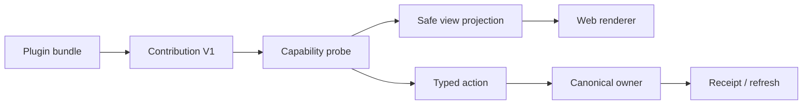

# DSH 个人编码基础包与结构化插件平台

状态：**Web-only experimental**（2026-09-03）

## 目标

把现有文件、Git、终端、命令和诊断插件收敛为一个最小完整的个人编码基础组合，同时建立 Web 可消费的稳定 projection/action/receipt 合同。

## 基础组合

已实现的 `@yeisme/dsh-personal-coding-base` 只组合：

- command experience；
- file/document 与 Git typed actions；
- terminal；
- devtools/diagnostics；
- plugin contracts；
- Ordo command capability projection。

Browser、Creator Studio、AI Drama、Personal Radar 等继续作为显式 packs。Catalog 保持构建时静态清单，不增加 marketplace、网络 registry 或 telemetry。

基础 bundle 是一个显式的组合声明（`dsh.bundle.composition=true`），由 toolchain 校验其已安装的 bundle 目标；它不复制或重新实现子 bundle 的 canonical state，也不会绕过现有 patch/命令目录。

## `dsh.plugin_surface.v1`



Contribution 包含 `id`、`contract_version`、`surfaces`、`commands`、`views`、`actions`、`health` 与 `dispose`。

View kinds 固定为：

- `status`
- `list`
- `table`
- `detail`
- `timeline`
- `diff`

Projection 只允许 bounded scalar、opaque ref、safe summary、revision/freshness 和 evidence ref。禁止 ANSI、任意 draw callback、DOM/React/HTML 跨表面组件、cookie/token、raw provider payload、private argv 和 full reasoning。

Action 必须声明 owner、effect、risk、preview policy、action ref 与 expected revision。客户端不得执行 label、fix 或 hint 中的 shell command string。

## 故障隔离

每个 contribution 独立投影 `available|degraded|disabled`、阶段、reason code、bounded fix 与 receipt ref。probe、registration、refresh、decode、action 或 dispose 失败只影响自身。

基础包 critical contribution 缺失会使 profile 如实 degraded/failed；可选 pack 缺失只标 optional degraded。unknown action outcome 只能 reconcile，不能自动 retry mutation。

## Web 合同一致性

共享 fixtures 固定 canonical command/view/action id、owner、effect/risk、schema version、capability state、disabled reason 和 sample receipts。不同 Web entry point 必须消费同一语义合同；parity 不比较 DOM 或像素。

Web 首版只完成 schema、probe、fixture 与 unavailable/degraded 语义，不交付新的同等视觉工作台。

## 兼容性

- `dsh-plugin-contracts` 只增加 exports/optional fields。
- 现有 pane/slot/bundle patch 不改变。
- V1 虽不承诺第三方 public semver，但对 Yeisme 内部 profile 视为稳定；未来 rename/removal 必须新版本、至少一个 release 双读和回滚。

当前 checkout 已包含基础 bundle、静态 catalog、SDK codec、parity/health checker、参考插件结构化 surface 与 Web consumer。基础组合通过普通 `dsh plugin --profile web add` 命令逐层安装；first-support 仍需单独的 Web 验收与晋级决策。

验证：

```bash
pnpm run test:personal-coding-integration
pnpm run typecheck
pnpm run test
pnpm run test:integration
pnpm run build
pnpm run check:bundles
pnpm run check:surfaces
pnpm run check:plugins
```

兼容性：当前 package 仍为 `0.1.0-rc`，Web-only target 在 first-support 前可继续收敛；发布后的 rename/removal 必须遵循新版本、双读和回滚窗口。
