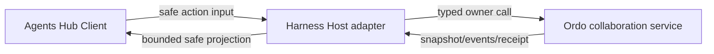

# DSH Web Ordo Team Hub V1

> 状态：Web 产品/交互/Host 合同规格完成，代码实现待 `openspec/changes/dsh-web-ordo-team-hub-v1/` 推进。现有 Ordo Agent Ops Pane 仍是当前可用 fallback。

## 结论

Ordo Team V1 继续落在 Harness Plugins，而不是创建独立 Web client。现有 Agents entry 打开统一 Hub：

```text
Agents Hub
├─ Session Agents       DSH session owner
└─ Ordo Teams           Ordo Delivery owner
```

Browser 只负责 presentation、selection、graph viewport、drawer/tab、Room draft 和 pending UI。Team/Delivery/task/Room/Activity/control/approval/receipt 真相全部来自 Ordo safe projection。

## Host/Client 边界



Host 负责：

- tenant/workspace/principal/runtime generation binding；
- snapshot、event cursor、seq/gap、backoff 和 freshness；
- token/broker/CLI environment isolation；
- action preview、approval、revision、idempotency 和 receipt；
- unload、HMR、context switch 和 disconnect dispose；
- browser 前 redaction/validation。

Browser 永不直接连接 Ordo broker 或 spawn CLI。

## Component tree

```text
AgentsHub
├─ HubHeader
├─ HubViewTabs
└─ OrdoTeamWorkspace
   ├─ DeliveryPicker / TaskQueue
   ├─ TaskAgentGraph
   ├─ ContextRegion
   │  ├─ Inspector
   │  ├─ Room
   │  └─ Activity
   └─ OwnerActionPalette / Confirmation
```

Task Queue 和 semantic relation list 提供完整可访问事实；graph 是关系增强，不是唯一信息源。

## Layout

### 1024px+

```text
┌ Task Queue 280 ┬──────── Task-Agent Graph ────────┬ Context 320 ┐
│ active/blocked │ role slots ↔ tasks              │ Inspector   │
│ candidates     │ dependency / handoff / clusters │ Room        │
│ filters        │ pan / zoom / select             │ Activity    │
└────────────────┴──────────────────────────────────┴─────────────┘
```

### 768–1023px

Task Queue 与 graph 保持主区；Context 使用 right drawer。resize 保留 selection、graph viewport、Room draft 和 read-only detail，mutation preview 在 context revision变化后重新验证。

### 小于 768px

不承诺 mobile graph editing。保留可读 task/relation list、freshness、control、top blocker和unsupported-editing guidance。

## Graph semantics

- task 与 stable role slot 分区；
- assignment/handoff 跨区；
- dependency 在 task layer；
- runtime/session/attempt是role binding detail；
- active、blocked、critical-path、selection 和直接邻居不可被 cluster隐藏；
- completed/idle 可按 owner grouping/status cluster；
- client 只计算坐标和LOD，不计算 runnable、acceptance、capacity或control。

## Snapshot/event lifecycle

```text
unavailable
  → loading snapshot
  → live(cursor, generation, freshness)
      ├─ duplicate → ignore
      ├─ gap/expired/drift → reload snapshot
      ├─ disconnect → stale read-only
      └─ HMR/context switch → dispose → new snapshot
```

browser reducer 按 generation 丢弃 late result，不维护离线 mutation queue。

## Action flow

所有动作来自 server-authored descriptor：

```text
select action
  → Host validates context/control/target
  → preview
  → show effect/risk/approval/evidence
  → explicit confirmation
  → Host revalidates and applies
  → receipt
  → owner event or refreshed snapshot
```

Client 不执行 arbitrary command/argv/URL，也不 optimistic 修改 owner task/control state。

## Room、Activity 与 control

Room 支持 Post/Reply/Promote，正文不会自动进入 agent context。Activity 只读，显示 owner facts和cross-links。

TUI/Web 同时可读，一个 holder可写。Web read-only时显示 current holder和 Take Control。成功 receipt/event 前不切可写；lost control会使 pending confirmations失效。

## Accessibility

- 完整 keyboard journey：打开 Hub、选 Delivery/task/role、Room、Activity、Action Palette、Take Control和confirmation。
- overlay/drawer close后focus回到trigger。
- status 同时使用 text、icon/shape、ARIA；不只依赖颜色。
- graph每个事实都有Task Queue/Inspector/semantic list替代。
- `prefers-reduced-motion` 禁用非必要tween/pulse。
- high contrast与screen reader不丢失 blocker、control或action availability。

## Security

Browser DOM/state/log/storage/screenshot/fixture 不得包含：

- broker credential、Authorization、cookie/token；
- raw URL、absolute path、PID；
- raw prompt、provider payload、tool args/result；
- credential、secret、未脱敏 Room 内容、reasoning 或完整思维链。

Browser DOM/React state 只可暂存当前可见的 bounded、redacted Room body；URL、storage、logs、telemetry 不得保存 Room body，evidence screenshot/fixture 只能使用 synthetic/redacted 内容。Host safe projection 只允许 opaque refs、bounded summaries、bounded redacted Room body、states、reason codes、versions、freshness、evidence refs 和 allowed actions。unsafe field 出现时 fail closed，不做 best-effort 渲染。

## Fixtures 与验证

Web 消费 Ordo共享fixtures，并维护1280/1024/800/<768、large graph、high contrast、reduced-motion、event gap、lost control和unsafe projection visual/behavior cases。

```bash
openspec validate dsh-web-ordo-team-hub-v1 --strict --no-interactive
pnpm run doc-sync
pnpm run typecheck
pnpm run test
pnpm run test:visual
pnpm run check:bundles
pnpm run check:surfaces
pnpm run build
```

## 回滚

禁用 Team V1 capability/view registration，Agents Hub继续提供Session Agents，旧Ordo Ops Pane继续作为fallback。Browser无domain migration或durable state需要清理。
