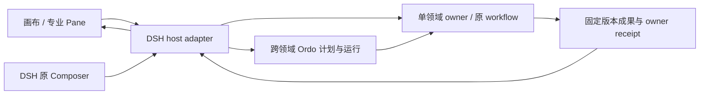

# DSH 创作工作台接口与验证合同

本文是八份创作 UI change 的共用约束。当前为消费设计，不宣称任何新 RPC、字段或 provider 已上线。具体 wire 名称与 schema 只在 owner/consumer 合同任务中根据现有代码冻结；不从本文生成第二套接口真源。

## 1. 现有接口与事实边界

| 领域 | 可复用依据 | 本轮仍需验证的部分 | 拥有配套任务的项目 |
|---|---|---|---|
| DSH Pane 与引用 | `packages/client/ui-pane-workbench`，`docs/plugin-tab-development.md`，既有 prepare/ack、PaneActionDescriptorV1/ReceiptV1、ArtifactRefV1 | 项目级 storage seam、会话切换后的媒体引用、主 Pane 双向绑定 | harness-plugins；必要宿主 seam 用 upstream-prs |
| Creator Studio | `packages/host/creator-studio/src/types.ts`、`packages/client/ui-creator-studio/src/artifact-workspace.tsx` | 已有 candidate/action/source revision 消费结构；各真实 owner 对应动作与 receipt 需逐项证明 | harness-plugins |
| Eikona | [consumer matrix](../../../../cli/eikona/docs/interfaces/consumer-contract-matrix.md)；generation、workflow、batch、asset/lineage/handoff 接口 | 遮罩/编辑动作的具体模型支持、候选映射、项目列表、真实生成/取消/交接 | cli/eikona |
| Anatomia | [公共接口](../../../../agent/anatomia/docs/contracts/public-interfaces.md)、[视频观察](../../../../agent/anatomia/docs/contracts/video-observation-contract.md) | 时间坐标、来源/关键帧访问、范围分析、审阅与固定版本参考包消费 | agent/anatomia |
| Scaena | [Production API](../../../../agent/scaena/docs/design/production-public-api-contract.md)、review-package application/transport | 镜头/资产/声音动作、候选 expected version/digest、编排与实际导出 | agent/scaena |
| Auctra | [Service API](../../../../cli/auctra/docs/service-api-interface.md)、[Working Copy](../../../../cli/auctra/docs/text-working-copy.md) | 各文本类型结构映射、编辑 body 授权读取、候选和版本链、真实保存/冲突恢复 | cli/auctra |
| Sonora | [workflow](../../../../cli/sonora/docs/commands/workflow.md)、[subtitle](../../../../cli/sonora/docs/commands/subtitle.md)、[tts](../../../../cli/sonora/docs/commands/tts.md) | 各 provider 声音/字幕/对齐能力及接入形态；现有 segment-to-cue 不等于 word-level alignment 或 SRT/VTT 导出 | cli/sonora |
| 跨领域执行 | [Ordo 托管工作](../../../../agent/ordo/docs/product/managed-work-experience.md)、既有 dsh-ordo-agent-ops | 从选定执行图到可预览、可确认的 Ordo 计划适配，以及五 owner 调用/回执传播；托管工作文档不是通用图编排已就绪证明 | agent/ordo |

上述检查基于仓库文档与局部源码，不是发布或真实接通证明。实施任务 1.1 必须重新核对 registry/handler/SDK，并记录确切版本或 digest、源码位置、支持/缺失/未验证及 consumer 验收项。不得把缺 canary 误称为缺 API。

## 2. 数据流与权威



浏览器只使用 host 提供的受控通道。owner 地址、凭据、私有路径在 host 配置或 credential owner 处理，不接受浏览器传入任意 endpoint/executable。不要为固定 provider 新建运行时或 BFF。

画布持久化与流程草案是呈现/意图，不是执行账本；领域内部 workflow spec 仍由该 owner API 创建与版本化。跨领域运行的身份、调度、预算与恢复由 Ordo 持有。DSH 会话状态仍由宿主拥有；不能将 Ordo run/session ref 当作 DSH conversation 的权威。

## 3. 最小消费接口要求

| 操作族 | 必要语义 | 禁止行为 |
|---|---|---|
| 项目/资源读取 | project scope、固定 owner/ref/version、freshness、分页/游标 | 从目录名猜项目，从列表顺序猜最新采用 |
| 成果打开 | 显式读取获准正文或媒体范围，内容与控制面摘要分离 | 把合法用户正文全面禁读，或把正文/raw payload写入日志 |
| 动作发现/预览 | server-authored descriptor、输入类型、权限、费用状态、expected revision | 前端自行授予 capability 或伪造成本 |
| 草案编辑 | base revision、有限变更集、摘要、撤销；图布局与 owner 文稿分开 | 原地修改 accepted artifact 或正在执行的快照 |
| 确认执行 | 固定计划/范围、idempotency、预算/权限复核、原 operation ref | 用 UI 成功 toast 代表领域成功，恢复后重新 submit |
| 观察/恢复 | 单资源订阅复用、游标恢复、scope/generation 检查、original-operation reconcile | 每 Pane 一条重复 SSE，迟到事件进入新项目 |
| 采用/保存/交接 | 分别取得 owner receipt、版本和目标 scope | 采纳自动写源文件或晋级 Canon，跨 owner 假事务 |

运行确认与执行连接仅是调用已批准动作的入口，不改变 owner 费用、权利、审批或版本要求。取消先请求，收到 owner 确认才显示 cancelled。部分成功保留已完成的成果与回执；只选择明确允许修复的失败部分，不扩大到整批重做。

## 4. 类型与兼容设计

- 复用 `ArtifactRefV1`、`PaneContextV1`、`PaneActionDescriptorV1`、`PaneActionReceiptV1` 以及 Creator Studio candidate/action/reference 类型；专业字段留各领域 normalizer，不放到万能可执行 JSON 表单。
- 新画布 document 描述项目 scope、document revision、camera、nodes、reference edges 和 execution edges；节点保存固定引用和草稿控制，不存 owner blob/credential。正式 schema 由 CLI/应用生成后固定，不能将 React Flow 原始对象当长期持久化格式。
- 节点与专业 Pane 的绑定包含 owner/ref/version/project；会话引用另带明确目标 session 与 draft revision。相同对象的查询和候选状态复用现有 runtime，不创建双份缓存权威。
- 默认所有修改为 additive；不向旧 closed schema 偷塞必需字段，不移除稳定 kind、命令或公开类型。若新增能力使用独立版本，旧客户端保留读取/禁用原因，未知 critical schema fail closed。
- 禁用某个 Pane 不删除其项目草稿或 owner 资源；对旧 in-flight operation 的观察与恢复不能依赖新画布开启。禁用跨领域编排不禁用单领域工作流。

## 5. UI 共用合同

完整页面使用 `ui-surface`；画布节点内嵌 renderer 使用 `ui-visual-kit`；原子控件、菜单、焦点与 overlay 复用官方 primitives 和 Pane 宿主。主视觉优先级为当前对象/成果、主要编辑动作、来源与技术详情。每个工作面一个 primary action，其他动作放工具条/菜单；禁用动作保留可理解原因。

每份 design 都必须填写 surface 分类、实际组件、滚动 owner、状态矩阵、≤420/421–720/>720 容器响应式、键盘/焦点/reduced-motion、视觉例外。专业能力不能因为窄 Pane 被删掉；复杂编辑通过放大 Pane 或明确单面切换处理。

## 6. 测试与证据合同

当前只验证 specs、tasks、链接与文档一致性，不运行真实模型或生成媒体，不安装依赖。后续所有 selector/测试文件必须由相应实施任务创建，不能把不存在测试、零匹配或 skip 当成功。

实现期用已有 Vitest/Node test 和现有 evidence runner；stable diff 后运行：

```bash
pnpm run typecheck
pnpm run test
pnpm run build
pnpm run check:bundles
pnpm run check:plugins
pnpm run check:surfaces
pnpm run test:visual
```

真实宿主验证先按 `docs/runtime/dsh-workbench.md` 执行：

```bash
pnpm dsh:workbench -- --check
pnpm dsh:workbench -- --no-open --port 40869
```

上述两条只验证/启动 preview，不等于任一专业流程验收。不要用全局旧版 DSH 混载新 Pane；测试结果记录版本、profile、owner capability、fixture/real、运行身份和检查范围。integration/component/system/e2e 经本项目 runner 写 `temp/integration-test-runs/<run-id>/` 的 summary/command/stdout/stderr/env/artifacts，失败保留原退出码。禁止记录凭据、私有路径、原始 prompt/provider payload/工具参数或完整思维链。

每个真实场景有正常、拒绝/冲突与恢复证据。布局恢复与执行恢复、saved 与 pending、adopted 与 delivered 必须分别断言。300节点性能记录固定样本和机器，60分钟内无持续订阅/DOM/heap 增长、无已确认保存丢失；不得用空白画布或未加载媒体代替压力样本。
