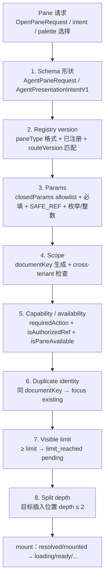
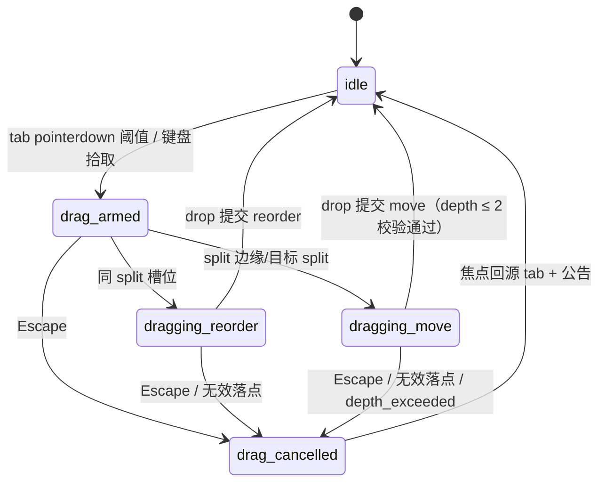

# Pane 交互模型（pane-interaction-model）

## 0. 文档定位

本文档定义 Agent-first Workbench 中 Pane 的布局 Schema、完整操作表、挂载前校验管线、交互状态矩阵、响应式 Sheet 规则与 SavedView 预留形态。它是 UI 基线与前后端合同在交互层的落地设计，供后续实现包（布局树 reducer、拖拽、SavedView 服务化）直接引用。

真源优先级（冲突时从高到低裁决）：

1. `docs/product/agent-workbench-blueprint.md`：应用级产品真源（§6 Pane 系统、§7 前端状态所有权、§12 响应式产品范围）。
2. `docs/ui/agent-first-workbench.md`：视觉与布局基线（§4 桌面布局、§5 Pane 系统、§7 状态与恢复矩阵、§9 组件树、§10 响应式与无障碍）。
3. `docs/interfaces/agent-pi-workspace.md`：前后端合同（§5 Pane catalog 与 layout contract、§6 Presentation intent）。
4. 本文档：交互与布局状态实现契约。本文档不得放宽上述三份文档的任何约束；发现冲突时改本文档。

视觉基线为 `prompts/product/ui-reference/workbench-agent-pane/deliverables/02-plugin-pane-workspace.png`（布局主基线），`01` 约束对话密度，`03` 约束审阅/证据表达。

### 0.1 现状锚点与实现状态

本文档区分三种状态，后续实现包不得把「预留」当「已实现」引用：

| 状态 | 含义 |
| --- | --- |
| 已实现 | 当前代码已交付，本文档记录其语义为回归基线 |
| 部分实现 | 底层原语已存在，交互尚未接入 |
| 预留 | 本文档定义合同，当前不实现 |

现状代码锚点：

- 布局状态与操作：`apps/web/src/workbench/agent/agent-pane-layout.ts`（open/focus/close/replace，已实现）。
- 桌面 dock 与 Sheet：`apps/web/src/workbench/agent/panes/agent-pane-dock.tsx`（已实现）。
- 命令面板：`apps/web/src/workbench/agent/panes/pane-command-palette.tsx`（已实现）。
- Pane 注册与解析：`apps/web/src/workbench/agent/agent-pane-registry.ts`、`apps/web/src/workbench/desktop/registry/pane-registry.ts`（已实现）。
- Presentation intent 解析：`apps/web/src/workbench/agent/agent-presentation-intent-resolver.ts`（已实现）。
- Desktop 领域/路由/生命周期/a11y 原语：`apps/web/src/workbench/desktop/{domain,registry,router,lifecycle,a11y}/`（部分实现：reducer/lifecycle/a11y 纯函数已存在，未全部接入 Agent dock）。
- 快捷键注册表：`apps/web/src/design-system/guidance/shortcuts.ts`（已实现，新增快捷键必须先在此注册）。
- 会话级装配与焦点恢复：`apps/web/src/workbench/agent/agent-conversation-workspace.tsx`（已实现）。

### 0.2 术语

- **Pane**：经 versioned registry 注册的有界热插拔功能面板，当前六个 kind：`context / run / review / evidence / operations / contextMap`。
- **PaneDocument**：pane 的 domain identity（`paneType + routeVersion + documentKey + params`），不含展示状态。
- **documentKey**：`tenantRef/workspaceRef/resourceRef` 三段 opaque key，不回显 title/path/payload。
- **dock**：桌面右侧 Pane 容器（`role="group"`，对话主画布的 complementary）。
- **Sheet**：平板/手机上的单 Pane 模态覆盖层（`role="dialog" aria-modal="true"`）。
- **pending pane**：`limit_reached` 时未插入、等待用户显式替换或取消的 pane。
- **trigger**：打开 pane 的真实 DOM 触发元素，用于焦点恢复（`PaneTrigger = HTMLElement | null`）。

## 1. 不变量（不可协商）

1. Agent timeline 与 composer 是不可关闭的布局锚点；任何 Pane 操作（含 drag、intent、布局恢复、SavedView 还原）不得关闭、替换或遮挡主对话与当前 session。
2. 桌面默认 1–3 个可见 Pane（`AGENT_PANE_DEFAULT_VISIBLE_LIMIT = 3`），硬上限 4（`AGENT_PANE_HARD_VISIBLE_LIMIT = 4`），split depth ≤ 2（`AGENT_PANE_MAX_SPLIT_DEPTH = 2`）。
3. 重复打开同一 documentKey 只 focus 已有实例（`instancePolicy: "singleton"`）；超限返回显式 `limit_reached`，由用户关闭或显式点名替换，绝不静默替换、绝不静默丢弃旧上下文。
4. 所有 Pane 由同一 versioned registry 解析；未知 type/version/params/cross-tenant ref 全部 fail closed。
5. Pane 不可用（`needs_contract / permission_required / offline / stale`）时诚实显示原因与恢复动作；禁止 mock fallback 冒充 Owner 数据，禁止伪造可用。
6. 浏览器不直连 Owner、不读取 session token；Pane descriptor 与 intent 不携带 dynamic component、远程 import、任意 URL、iframe、HTML、JavaScript、DOM selector、credential、raw prompt、provider payload 或私有路径。
7. Pane drag 只改变布局；Pane 内容中的对象 drag 必须转换为 typed intent 并重新经过 Owner gate，不得变成布局操作或浏览器侧 mutation。
8. 关闭 Pane 不取消 Task、不删除 projection、不删除 Owner state。
9. 每个 drag action 必须有 menu/keyboard 等价路径；桌面 complementary Pane 不 trap 焦点，Sheet 必须 focus trap + Escape + scroll lock + focus restore。
10. 所有用户可见文案（含 live region 公告）走 i18n：`api/locale/source/{zh-CN,en-US}/agent/*.json`，inline fallback 只是兜底；新增 key 后必须跑 `bun run compose:i18n && bun run check:i18n`。
11. 布局状态是 session-scoped 浏览器内存组合状态：deliver-now 不落 localStorage、不写后端、不声明 reload 后已恢复。

## 2. 布局 Schema

### 2.1 当前形态（已实现）：扁平数组

```ts
// apps/web/src/workbench/agent/agent-pane-layout.ts
interface AgentPaneLayoutState {
  panes: readonly ResolvedAgentPane[];   // 数组顺序 = dock 内视觉顺序（左 → 右）
  activeDocumentKey: string | null;      // 焦点/选中 pane；Sheet 模式下决定唯一可见 pane
}
```

- 状态按 session 隔离：`panesBySession: Record<string, AgentPaneLayoutState>`；切换 session 不互相污染，切换视口不清空。
- `visibleLimit` 是 `openAgentPane` 的参数，clamp 到 `[1, 4]`；默认 3。
- 当前 dock 是单行 flex：所有 pane 同属一个隐式 row group，宽度由 per-kind 偏好宽度（单 pane 时）与 `flex-1` 均分（多 pane 时）决定，尚无可拖 split handle。

### 2.2 目标形态（预留）：布局树 Schema V1

为支撑 split/resize 与 SavedView，布局状态演化为显式树。Schema 只描述组合，不持有 Pane data、Task、proposal 或 Owner state。

```ts
// 预留：AgentPaneLayoutTreeV1（不实现于本切片）
type AgentPanePlacement = "dock-right";        // v1 唯一 placement；新增区域属合同变更

interface AgentPaneLayoutTreeV1 {
  schemaVersion: 1;
  placement: AgentPanePlacement;
  visibleLimit: number;                        // ∈ [1, 4]，默认 3
  root: AgentPaneLayoutNode | null;            // null = 空布局
  activeDocumentKey: string | null;
}

type AgentPaneLayoutNode = AgentPaneSplitNode | AgentPaneLeafNode;

interface AgentPaneLeafNode {
  kind: "leaf";
  nodeId: string;                              // 稳定 opaque id；singleton 下等于 documentKey
  documentKey: string;
}

interface AgentPaneSplitNode {
  kind: "split";
  nodeId: string;
  direction: "row" | "column";                 // dock 内 row = 并排，column = 上下堆叠（right-stack）
  children: readonly AgentPaneLayoutNode[];    // ≥ 2；split 内有序
  sizes: readonly number[];                    // 与 children 等长；每项 ∈ [0.1, 0.9]；Σ = 1
}
```

约束（normalize 时 fail-closed，违反即拒绝整棵树，不部分应用）：

- **深度**：`depth(leaf) = 0`，`depth(split) = 1 + max(depth(children))`；不变量 `depth(root) ≤ 2`（`AGENT_PANE_MAX_SPLIT_DEPTH`）。即允许「split 内再嵌一层 split」，禁止第三层。
- **可见数**：树中 leaf 总数 ∈ `[1, 4]`；插入第 5 个 leaf 在 Schema 层即非法，与 `limit_reached` 语义一致（hard limit 4 只在显式把 `visibleLimit` 调到 4 时可达）。
- **sizes**：每项 ∈ `[0.1, 0.9]`（与 `resizeStep` 的 bounded 区间一致），归一化使 Σ = 1；像素宽度由 dock 容器宽度（`clamp(360px, min(46vw, 100vw-856px), 1180px)`）× ratio 派生，Schema 不存像素。
- **placement 推导**：descriptor 的 `preferredPlacement: "right" | "right-stack"` 是插入提示——`right` 追加为 root row split 的 leaf；`right-stack` 在 dock 内形成 column 嵌套 split（消耗一层深度预算）。placement 不是 leaf 的自由字段，由树路径表达。
- **identity**：leaf 的 `documentKey` 必须仍能通过 `desktop/domain/pane-document.ts` 的 `isValidDocumentKey` 与 cross-tenant 检查；树不引入新的 identity 来源。

### 2.3 扁平数组 → 树的演化（语义保持）

当前扁平数组是布局树的退化形态，迁移无损、可逆：

```text
扁平数组 [a, b, c]（active = b）
  ⇕ toTree / flatten（中序遍历 leaf，视觉顺序不变）
树：root = split(row, [leaf a, leaf b, leaf c], sizes = [1/3, 1/3, 1/3])，depth = 1
```

```mermaid
flowchart LR
  subgraph 演化前：扁平数组
    A1[panes: a, b, c<br/>activeDocumentKey: b]
  end
  subgraph 演化后：布局树 V1
    R[split row<br/>sizes 1/3 each] --> LA[leaf a]
    R --> LB[leaf b]
    R --> LC[leaf c]
  end
  A1 -->|toTree 无损| R
  R -->|flatten 中序| A1
```

语义保持对照表（演化后 reducer 必须逐条保持现有行为，作为回归基线）：

| 操作 | 扁平数组语义（已实现，`agent-pane-layout.ts`） | 布局树语义（预留，必须等价） |
| --- | --- | --- |
| open | 重复 key → 只 focus；≥ limit → `limit_reached` 不变状态；否则 append 到末尾并设为 active | 重复 key → 只 focus；leaf 数 ≥ limit → `limit_reached`；否则按 descriptor `preferredPlacement` 插入对应 split 末尾并均分 sizes、设为 active |
| focus | key 存在则更新 `activeDocumentKey`，否则状态不变 | 同左；树结构不变，sizes 不变 |
| close | 移除该 pane；active 被关时选同 index 的邻居，越界则选最后一个；空则 null | 移除该 leaf；单 child split 坍缩为其 child（深度 -1），空 root 归 null；active 回退规则同左（中序邻居，越界取最后一个）；sizes 重新归一化 |
| replace | 显式指定被替换 key；新 pane 占原 index（位置保留）并设为 active；新 pane 与现有重复时退化为 focus | 同左：替换发生在原 leaf 位置（同一 split、同一 child index），sizes 不变；重复退化为 focus |

补充不变量：

- `open` 是唯一受 `visibleLimit` 约束的操作；`replace` 不改变 leaf 总数，因此是超限后唯一合法的插入路径，且必须显式命名被替换 pane（dock banner 按钮逐个点名，见 §3）。
- 扁平数组语义由 `test/agent-pane-layout.test.ts` 固定；树 reducer 落地时必须复用同一组语义用例加树专属用例，不得改写旧断言的含义。

## 3. 操作表

每个操作列出：语义、键盘路径、菜单/dock chrome 路径、拖拽等价、焦点恢复、live region 公告。状态列标明「已实现 / 部分实现 / 预留」。

### 3.1 总表

| 操作 | 状态 | 键盘 | 菜单 / chrome | 拖拽等价 | 焦点恢复 | 公告（i18n key） |
| --- | --- | --- | --- | --- | --- | --- |
| open | 已实现（intent/palette/chrome） | `⌘K / Ctrl+K` 打开 palette → 搜索 → `Enter` | palette 项、dock `+ Pane` 入口、timeline 内 intent 激活按钮 | 无（不允许把对象拖成 pane） | 进入新 pane：桌面聚焦 pane header 焦点按钮；Sheet 聚焦关闭按钮 | `agent.pane.announce.opened` |
| focus | 已实现 | Tab 序列进入 dock；tab 上 `Enter/Space`（tablist 方向键为预留增强） | dock tab、pane header 焦点按钮、Sheet 内 tab strip | 点击 pane 任意处（`onClickCapture`）视覚等价 | 聚焦目标 pane 的 tab/header；后台 pane 更新不抢焦点 | `agent.pane.announce.focused` |
| close | 已实现 | `Escape`（palette 未开且有 active pane 时关闭 active pane）；Sheet 内 `Escape` | tab 上 `×`、pane header `×`、Sheet scrim 点击 | 无（不允许拖出即关闭，防误触丢上下文） | 恢复至记录的 trigger；无 trigger → 新 active pane 的 tab → composer | `agent.pane.announce.closed` |
| replace | 已实现（仅 limit_reached 路径） | banner 内按钮走 Tab 序列；无独立快捷键 | `limit_reached` banner 逐个「替换「{title}」」按钮 | 预留：拖到被替换 tab 上松手 = 命名替换（必须与 banner 同样显式） | 聚焦新 pane（Sheet 一次性聚焦关闭按钮）；被替换 pane 的 trigger 映射删除 | `agent.pane.announce.replaced` |
| reorder | 预留 | 注册后：`paneMoveLeft/paneMoveRight`（建议 `Ctrl+Alt+←/→` / `⌘⌥←/→`） | pane header 菜单「左移/右移」 | 拖 tab 到同 split 另一位置，drop indicator 落点 | 焦点跟随被移动 pane 的 tab（roving tabindex） | `agent.pane.announce.reordered` |
| move | 预留 | 注册后：`paneMoveToSplit` 组（建议 `Ctrl+Alt+Shift+←/→/↑/↓`） | pane header 菜单「移动到上/下/新 split」 | 拖 pane 到 split 边缘/另一 split 区域 | 焦点跟随 pane 到目标 split 的 header | `agent.pane.announce.moved` |
| resize | 预留（原语已有） | 注册后：`paneResizeGrow/paneResizeShrink`（建议 `Ctrl+Alt+=/-`），步进 0.05 | split handle 键盘可达（`role="separator" aria-orientation` + 方向键） | 拖 split handle | 焦点留在 handle（键盘）或不动（指针）；不打断 pane 内输入 | `agent.pane.announce.resized`（仅结束时公告一次） |

快捷键纪律：新快捷键必须先加入 `apps/web/src/design-system/guidance/shortcuts.ts` 的 `shortcutRegistry`（含 `ariaKeyshortcuts`、mac/other label、scope），经 `matchesShortcut` 统一匹配；上表建议组合与现有五项（`⌘K`、`⌘⇧Enter`、`⌘B`、`⌘⇧F`、`Esc`）无冲突，落地时仍需在 registry 层断言唯一性。

### 3.2 open（已实现）

- **语义**：`openAgentPane` 三态返回——`opened`（插入并激活）、`focused`（singleton 重复，只聚焦）、`limit_reached`（状态不变，pending pane 交给 UI）。
- **入口**：palette 选择、dock 入口、timeline 内 presentation intent 激活按钮、session rail/activity rail 的 typed 入口；所有入口共用同一个 `openPane(intent, trigger)`，先经 §4 校验管线。
- **焦点**：记录 `paneTriggersByDocument[documentKey] = trigger`；非桌面置一次性 `sheetFocusKey`，Sheet mount 后聚焦关闭按钮并立即清除该标记（一次性语义，防止后续重渲染偷焦点）。
- **公告**：`agent.pane.announce.opened`（zh-CN：`已打开{title}面板（{count}/{limit}）`；en-US：`Opened {title} pane ({count}/{limit})`）。`focused` 分支公告 `agent.pane.announce.focused`。

### 3.3 focus（已实现）

- **语义**：`focusAgentPane` 只改 `activeDocumentKey`；key 不存在时状态不变。
- **入口**：dock tab、pane header 焦点按钮（`aria-pressed`）、pane 内容 `onClickCapture`、Sheet tab strip。
- **纪律**：running pane 的后台数据更新只改内容不改 `activeDocumentKey`，不移动键盘焦点（UI spec §7「Run 自动更新但不抢焦点」）；Follow Pi 自动应用永不移动键盘焦点（合同 §6）。
- **公告**：`agent.pane.announce.focused`（zh-CN：`已聚焦{title}面板`；en-US：`Focused {title} pane`）。指针点击触发的 focus 可静默（用户已在目标上），键盘/菜单/intent 触发必须公告。

### 3.4 close（已实现）

- **语义**：`closeAgentPane` 移除 pane；active 被关时新 active = 同 index 邻居（越界取最后一个），空布局为 null。不取消 Task、不删 projection。
- **键盘**：workspace 级 `Escape` 在 palette 未开且存在 active pane 时关闭 active pane；Sheet 内 `Escape` 关闭 Sheet（`preventDefault + stopPropagation`，不冒泡成 workspace 级二次关闭）；palette 打开时 `Escape` 只关 palette。
- **焦点恢复**：`closePaneDocument` 查 `paneTriggersByDocument`：有 trigger → `trigger.focus()` 并删除映射；无 trigger → 焦点落到新 active pane 的 tab；布局空 → 回 composer。Sheet 关闭走同一映射（scrim 按钮 `tabIndex={-1}` 不作为恢复目标）。
- **公告**：`agent.pane.announce.closed`（zh-CN：`已关闭{title}面板`；en-US：`Closed {title} pane`）。
- **dirty rescue（部分实现）**：`desktop/lifecycle/pane-lifecycle.ts` 已有 dirty → `rescue-prompt` → confirm/cancel 状态机。Agent pane 当前全部只读（`permission: "read"`），不标 dirty；任何未来可编辑 pane 必须先接该状态机，禁止直接关闭丢输入。

### 3.5 replace（已实现，仅显式路径）

- **语义**：`replaceAgentPane` 是超限后唯一插入路径；被替换 pane 由用户在 `limit_reached` banner 中逐个点名（按钮文案 `替换「{title}」`），新 pane 占原位置并激活；新旧重复退化为 focus。banner `role="alert"`，并提供「取消」丢弃 pending pane。
- **焦点**：替换后聚焦新 pane（Sheet 置一次性 `sheetFocusKey`）；被替换 pane 的 trigger 映射删除（防止焦点恢复到已不存在的入口）。
- **公告**：`agent.pane.announce.replaced`（zh-CN：`已用{newTitle}面板替换{oldTitle}面板`；en-US：`Replaced {oldTitle} pane with {newTitle}`），区域用 `role="alert"`（与 banner 同级语义）。
- **拖拽等价（预留）**：允许把 palette 外的新 pane 落到现有 tab 上表达「替换它」，落点必须高亮整个目标 tab 并要求松手确认语义与 banner 一致；禁止拖到空白区隐式替换。

### 3.6 reorder（预留）

- **语义**：同一 split 内交换 child 顺序；`sizes` 跟随 child 一起换（尺寸绑定槽位还是绑定 pane，实现包需选定并在文档补充——建议绑定槽位，保持布局骨架稳定）。
- **键盘/菜单**：快捷键（表 3.1 建议组合）+ pane header 菜单「左移/右移」；每步移动一个槽位，越界循环或钳制由实现包定（建议钳制，与 `resizeStep` 的 bounded 风格一致）。
- **拖拽**：仅允许拖 tab（拖手在 tab 上），drop indicator 显示目标槽位；松手提交，Escape 或无效落点取消（见 §5 状态机）。
- **公告**：`agent.pane.announce.reordered`（zh-CN：`{title}面板已移动到第{position}位，共{count}个`；en-US：`Moved {title} pane to position {position} of {count}`）。

### 3.7 move（预留）

- **语义**：把 leaf 移到另一 split 或创建嵌套 split（column stack）；是唯一能增加树深度的用户操作，因此必须经过深度校验——结果树 `depth > 2` 时整体拒绝并公告，不部分应用。
- **菜单等价**：pane header 菜单「移动到下方堆叠 / 移出堆叠 / 移到最左/最右」。移动端无自由 docking（blueprint §12），move 仅桌面可用。
- **公告**：`agent.pane.announce.moved`（zh-CN：`{title}面板已移动到{target}`，`target` ∈ 预定义方位词；en-US：`Moved {title} pane to {target}`）。深度拒绝用 `agent.pane.announce.moveRejected`（zh-CN：`布局深度已达上限（2），未移动{title}面板`）。

### 3.8 resize（预留，原语已有）

- **语义**：调整 split `sizes`；`desktop/a11y/desktop-a11y.ts` 的 `resizeStep` 已定 bounded 语义：步进 0.05，钳制 `[0.1, 0.9]`。指针拖拽 continuous，提交时归一化；键盘步进 discrete。
- **a11y**：split handle 必须 `role="separator"`、`aria-orientation`、`aria-valuenow`（百分比）；方向键与表 3.1 快捷键双路径。
- **公告**：只在拖拽结束/键盘每步提交时公告一次，避免 live region 刷屏：`agent.pane.announce.resized`（zh-CN：`{title}面板宽度约{percent}%`；en-US：`{title} pane width about {percent}%`）。

### 3.9 live region 与文案规则

- 全 workspace 一个 polite 公告区：`role="status" aria-live="polite"` 的 `sr-only` 容器（现有 `followAnnouncement` 模式复用）；`limit_reached`、rescue、深度拒绝用 `role="alert"`。
- 同一文本 500ms 内重复只公告一次（去抖在 caller 层，纯函数保持无状态）。
- 上表所有 `agent.pane.announce.*` key 为预留合同：实现时双语写入 `api/locale/source/{zh-CN,en-US}/agent/pane.json` 并跑 `bun run compose:i18n && bun run check:i18n`。`desktop/a11y` 的 `announceForLiveRegion` 英文串保留为底层 fallback，Agent 作用域公告一律以 `t()` 渲染结果为准。
- 公告只含 pane title、数量、方位等安全元数据；不得包含 ref 明文以外的任何 payload（title 来自 catalog i18n key，不来自 Owner 数据）。

## 4. Resolver 挂载前校验管线

合同 §5.2 要求 resolver 在 mount 前验证 registry version、scope、params、capability、availability、duplicate identity、visible limit 与 split depth。本节固定校验顺序与失败映射；所有入口（palette、dock chrome、presentation intent、未来 SavedView 还原、深链）共用同一条管线，逐次激活重新执行，不缓存 capability 结论。



各步失败语义（fail-closed，短路，不继续后续步骤）：

| 步骤 | 失败码（typed） | UI 行为 |
| --- | --- | --- |
| 1 Schema | intent 侧：`unsafe_view_request / stale_view_request / scope_mismatch` 等 `AgentPresentationIntentFailureCode` | timeline system block（warning 语气）说明不可用原因；不打开 pane |
| 2 Registry version | `unknown_pane_type / unknown_pane_version`（已知 domain 未知版本单独区分，供 version negotiation 与 `unsupported_safe_view` 映射） | system block；palette 该项本就 disabled 时不会到此 |
| 3 Params | `invalid_params`（allowlist 拒绝未批准字段、缺必填、路径穿越/HTML/换行、SAFE_REF 不通过、revision 非正整数、requestedView 非枚举） | system block；不回显原始参数值 |
| 4 Scope | `invalid_document_key / cross_tenant_ref` | system block；cross-tenant ref 原子拒绝，不泄露目标 tenant 信息 |
| 5 Capability/availability | `scope_mismatch / unsupported_safe_view`；本地前置不满足时 palette 项 disabled 并显示 `disabledReason` | 诚实状态：`needs_contract / permission_required / offline` 文案 + 恢复入口；不伪造可用 |
| 6 Duplicate | 非失败：`focused` | 只聚焦已有实例，不新建 |
| 7 Limit | `limit_reached`（布局状态不变） | dock/Sheet 顶部 alert banner：列出可替换 pane + 取消；对话不受影响 |
| 8 Depth | 预留：`depth_exceeded` | 公告拒绝原因（§3.7），布局不变 |

实现锚点：

- 步骤 2–4 已由 `desktop/registry/pane-registry.ts` 的 `VersionedPaneRegistry.resolve` 实现（含 `createAllowlistParamsValidator`、`standardDocumentKey`、`checkCrossTenant`）。
- 步骤 1、5（intent 侧）由 `agent-presentation-intent-resolver.ts` 实现：先 `validateAgentPresentationIntent`（session/source turn/revision/expiry），再 authorized refs 全量检查，再 dedupe key `(sessionRef, intentRef, sequence)`，最后 `resolveAgentPane` + `isPaneAvailable`；replay 与 `request_review / prefill_draft / attention` 永不自动执行，Follow Pi 另有 `canAutoApplyFollowPi` 守卫（dirty draft、active review、modal 时暂停）。
- 步骤 5（本地侧）由 palette items 的真实前置派生（activeTurn、timeline outputs、注册合同），不从浏览器猜测服务端 capability。
- 步骤 7 由 `openAgentPane` 实现；步骤 8 随布局树落地（预留），当前单层 dock 恒 depth 1，不越界。
- `mounted` 只表示 renderer 已装载，不表示 capability ready；数据态（loading/ready/empty/stale/degraded/error）由 pane 内容按 server projection 自行诚实表达。

## 5. 状态矩阵

### 5.1 布局交互状态

| 状态 | 进入条件 | 对话主画布 | dock（桌面） | Sheet（平板/手机） | 焦点 | 公告 | 出口/恢复 |
| --- | --- | --- | --- | --- | --- | --- | --- |
| empty | 无 pane 且无 pending | 正常 | dock 整体不渲染 | 同左 | 留在 composer | 无 | open 任一 pane |
| opened | open 成功 | 正常，不抢焦点 | 新 pane 并列出现 | Sheet 滑出覆盖 | 进入新 pane（§3.2） | `opened` | focus/close/replace |
| focused | focus 成功 | 正常 | active pane 高亮（`data-agent-pane-active`） | Sheet 切换显示目标 pane | 目标 pane tab/header | `focused`（指针点击可静默） | 任意操作 |
| limit_reached | open 时 leaf 数 ≥ limit | 不受影响（不插入、不替换） | 顶部 alert banner + pending 标题 | 同左（banner 在 Sheet 内顶部） | 不强制移动；banner 按钮可走 Tab | `limit_reached`（alert） | 关闭一个 pane / 显式替换 / 取消 pending |
| drag_armed（预留） | tab 上 pointerdown 达到拖动手势阈值，或键盘「拾取」 | 正常 | 源 tab `aria-grabbed="true"`，半透明 | 不提供（移动端无自由 docking，用菜单等价） | 键盘模式：焦点在源 tab | `agent.pane.announce.dragStarted` | 移动指针/方向键 → dragging；Escape → 取消 |
| dragging_reorder（预留） | 拖过同 split 其他槽位 | 正常 | drop indicator 指示落点 | 不提供 | 同上 | 无（避免刷屏） | 松手提交 reorder / Escape 取消 |
| dragging_move（预留） | 拖到 split 边缘/另一 split | 正常 | 目标区域高亮；非法目标（对话区、超深位置）显示禁止态 | 不提供 | 同上 | 无 | 松手提交 move（先过深度校验）/ Escape 取消 |
| drag_cancelled（预留） | Escape、无效落点松手、指针取消 | 正常 | 布局零变化，indicator 清除 | 不提供 | 焦点回源 tab | `agent.pane.announce.dragCancelled` | 回到 idle |
| resizing（预留） | 按下 split handle / 键盘 resize | 正常 | handle 高亮，sizes 实时预览 | 不提供（Sheet 单 pane 无 split） | 焦点在 handle | 无 | 松手/步进提交 → 公告 `resized` 一次 |

拖拽状态机（预留合同）：



硬性规则：取消路径必须零布局变化（不部分应用）；对话区不是 drop target；drag 全程不触发任何后端调用、不取消 Task；drop 提交等价于调用 §3 对应操作（含校验管线与公告），不存在「拖拽专属特权路径」。

### 5.2 与服务端真话状态的交叠

布局状态与 pane 内容状态正交。内容态沿用 UI spec §7 矩阵（loading/empty/running/permission_required/cost_required/needs_contract/stale/offline/partial/unknown_accept），布局层只追加两条纪律：

- `unknown_accept` 的 pane 只允许 reconcile 入口，布局操作（含 close/replace）不受限但公告语义不变；不伪造成功或失败。
- `needs_contract / offline / stale` 的 pane 保留在布局中（不自动关闭），内容区显示原因与恢复动作；close 永远可用。

### 5.3 reduced-motion 与 200% zoom 行为

| 条件 | 判定（纯函数） | 布局与交互行为 |
| --- | --- | --- |
| prefers-reduced-motion | `shouldReduceMotion(true, breakpoint)` | 禁用 Sheet 滑入、drop indicator、resize 预览的过渡动画（状态瞬时切换，保留语义色与 indicator 静态显示）；公告、焦点恢复、校验语义不变；拖拽功能保留，仅去动画 |
| mobile breakpoint | `shouldReduceMotion(_, "mobile") = true` | 同上（移动端恒 reduce） |
| 200% zoom | `decideBreakpoint(viewportWidth, 2)`：effective < 768 → mobile，< 1024 → tablet | 1280px @200% → effective 640 → mobile：桌面 dock 降级为全屏单 Sheet；不产生页面级横向滚动；宽表在 pane 内滚动或转 label/value record list；布局状态保留（§6.3） |

动效预算沿用 UI spec §8：120–240ms，只解释 open/close/focus/reorder；任何超过 240ms 或非解释性动效视为越界。

## 6. 响应式 Sheet 规则

### 6.1 断点与呈现映射

| 视口（effective = width / zoom） | 呈现 | 规则 |
| --- | --- | --- |
| ≥ 1440px | 桌面 dock | session rail + conversation + 1–3 可见 pane；dock 为 complementary，不 trap 焦点 |
| 1024–1439px | 单 Sheet（tablet） | conversation 常驻；session rail 与 pane Sheet 互斥；Sheet 右侧固定 `w-[min(92vw,560px)]` |
| < 768px | 全屏 Sheet（mobile） | 单列 timeline；Sheet `inset-0` 全屏；仅浏览、审阅、批准与轻量动作；无自由 docking |

当前实现以 `desktopWide = (min-width: 1440px)` 与 `mobileViewport = (max-width: 767px)` 两条 media query 驱动；`decideBreakpoint`（含 zoom 因子）是 zoom 补偿与 a11y 决策的通用原语。两层规则必须一致：任何「桌面 dock」呈现都必须同时满足 ≥1440px effective；200% zoom 下经 `decideBreakpoint` 降级为 Sheet（§5.3）。

### 6.2 Sheet 行为合同（已实现）

- `role="dialog" aria-modal="true"` + 命名 label（`{title}面板`）；桌面 dock 用 `role="complementary"`，不 trap。
- focus trap：Tab/Shift+Tab 在 Sheet 内循环（`containOverlayFocus`）；scroll lock：Sheet 或互斥 rail 打开时 `body overflow hidden`，关闭恢复。
- Escape：关闭 Sheet（stopPropagation，不穿透到 workspace 级关闭）；scrim 点击等价关闭（scrim `tabIndex={-1}`，不进 Tab 序列）。
- 焦点：打开时一次性聚焦关闭按钮（`sheetFocusKey` 一次性语义）；关闭时按 §3.4 恢复 trigger。
- Sheet 内多 pane：顶部 tab strip 切换（同一布局状态，单可见 pane = `activeDocumentKey`）；limit banner 同样渲染在 Sheet 内。
- 互斥：Sheet 打开时 session rail 关闭（`showResolvedPane` 在非桌面先 `setSidebarOpen(false)`）；rail 打开时 dock 收空布局（`emptyAgentPaneLayout`），二者不同时可见。

### 6.3 隐藏布局保留（已实现 + 纪律）

- 视口跨越断点（桌面 ↔ 平板/手机，含 200% zoom 触发的降级）只改变渲染过滤，不清空 `panesBySession`：桌面下全部 pane 并列，非桌面下只渲染 active pane 的 Sheet，其余 pane 的布局位置、sizes（未来）、顺序原样保留。
- 隐藏 pane 不 suspend 数据、不取消 Task、不丢 trigger 映射；回到桌面断点时按同一状态复原。
- session 切换同样保留各 session 独立布局；authority 变更/tombstone 例外——按 `desktop-reducer` 的 `authority_changed / resource_tombstoned` 语义清空或关闭对应实例（不复活旧敏感 state）。

## 7. SavedView 预留（仅安全元数据，不实现持久化）

蓝图与合同定位：Pane layout 归 Workbench UI（deliver-now 内存态）；SavedView 后续服务化（retain-next），必须使用 expected revision/idempotency，仅持久化安全 layout metadata。本文档只固定元数据形态与还原纪律，不定义存储位置、不实现读写。

### 7.1 元数据形态（预留 Schema）

```ts
// 预留：AgentPaneSavedViewV1（本切片不实现）
interface AgentPaneSavedViewV1 {
  schemaVersion: 1;
  viewRef: string;                    // opaque safe ref（SAFE_REF 字符集）
  label: string;                      // 用户命名，bounded 短文本（≤ 80，无 HTML/换行）
  createdAtUnixMs: number;
  expectedRevision: number;           // 乐观并发/idempotency（合同 §5.3）
  layout: {
    placement: "dock-right";
    visibleLimit: number;             // ∈ [1, 4]
    activeDocumentKey: string | null;
    entries: readonly AgentPaneSavedViewEntryV1[];
  };
}

interface AgentPaneSavedViewEntryV1 {
  documentKey: string;                // tenant/workspace/resource opaque key
  paneType: string;                   // versioned paneType
  routeVersion: number;
  splitPath: readonly number[];       // 从 root 起每级 child index；[] = 未来单 pane 根
  sizeRatio?: number;                 // ∈ [0.1, 0.9]；缺省 = 均分
}
```

### 7.2 禁止字段与还原纪律

- 禁止：title（来自 Owner 数据）、path、payload、params 明文值、credential、URL、DOM selector、trigger 元素引用、draft 文本、任何 Owner artifact 内容。焦点恢复不落盘（trigger 是 DOM 引用），还原后首个 focus 目标按 §3 默认链推导。
- 还原不是回放：每个 entry 重新走 §4 完整校验管线（含 registry version、scope、capability、limit、depth）；任一 entry 失败 → 跳过该 pane 并公告 rescue（`announceForLiveRegion` 的 `rescue` 类），其余继续；不得为「凑齐视图」降级校验。
- 还原遵守当前上限与深度：视图内 entries 超过当前 `visibleLimit` 时按声明顺序截取并公告，不静默超限。
- tombstone/authority 语义不变：资源已 tombstone 的 entry 不复活旧敏感 state，按 `resource_tombstoned` rescue。
- 写路径（未来服务化时）：mutation 必须带 `expectedRevision` + idempotency key，经 TaskService/对应服务 gate；浏览器不直连存储。

## 8. 验收标准

布局与操作：

1. 桌面 ≥1440px 可同时插入、聚焦、关闭 1–3 个已注册 Pane；第 3 个之后的 open 返回显式 `limit_reached`，状态不变、对话不受影响，必须用户关闭或点名替换；任何路径不得静默替换。
2. 重复打开同一 documentKey 只 focus；replace 保留原位置并激活新 pane；close 后 active 回退到同 index 邻居（越界取最后），焦点恢复 trigger → 新 active tab → composer 的优先级链成立。
3. 布局树（落地时）满足：depth ≤ 2、leaf ≤ 4、sizes ∈ [0.1, 0.9] 且 Σ = 1，非法树整体拒绝；`toTree/flatten` 往返保持 open/focus/close/replace 语义（§2.3 对照表逐条有用例）。
4. reorder/move/resize（落地时）三者均有键盘 + 菜单 + 拖拽三条等价路径；拖拽取消零布局变化、焦点回源 tab、有公告；move 超深拒绝且不部分应用。

校验与安全：

5. 所有入口共用 §4 管线；unknown type/version/params/cross-tenant ref fail closed，失败 UI 不回显原始参数或敏感 ref 明文。
6. 无合同时 pane 诚实显示 `needs_contract`/disabledReason；不出现 mock fallback 冒充可用；descriptor/intent 不含 URL/iframe/HTML/JS/动态组件。

响应式与无障碍：

7. 1440×960、1024×768、390×844 三视口与 200% zoom 下：dock/Sheet 呈现符合 §6.1；无页面级横向滚动；Sheet 具备 focus trap、Escape、scroll lock、scrim 与焦点恢复；桌面 complementary 不 trap。
8. reduced-motion 下动效移除而语义不变；live region 公告覆盖 open/focus/close/replace/limit_reached（落地时含 reorder/move/resize/drag 取消），文案全部来自 i18n key。
9. 键盘全路径可走通：⌘K palette（搜索/方向键/Enter/Escape）、Escape 关 active pane/Sheet、tab 焦点链；新快捷键只在 `shortcutRegistry` 注册后启用；Axe 无违规。

SavedView：

10. 本切片不产生任何持久化读写；预留 Schema 仅含 §7.1 字段；落地包验收时补：逐 entry 重校验、超限截取公告、tombstone rescue、expectedRevision/idempotency gate。

验证命令（实现包完成时执行，本设计文档不含代码改动）：

```bash
bun run typecheck
bunx vitest run test/agent-pane-layout.test.ts test/agent-pane-dock.test.tsx test/agent-pane-palette.test.tsx test/agent-pane-registry.test.ts test/desktop-routing.test.ts test/desktop-registry.test.ts test/pane-registry.test.ts test/pane-lifecycle.test.ts
bun run compose:i18n && bun run check:i18n   # 新增公告/菜单文案后必须
# Playwright 视口/zoom/reduced-motion/keyboard/Axe 矩阵按 UI spec §12 执行，证据入 temp/integration-test-runs/<run-id>/
```
