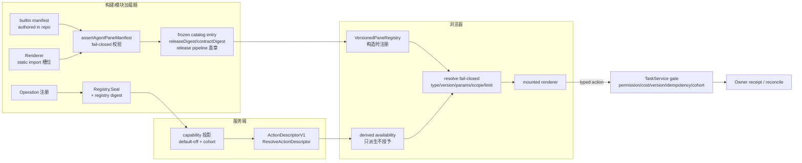

# Workbench 插件生态设计：First-party Plugin Pack

## 0. 文档定位与权威

本文是 Workbench Pane 插件生态的设计真源，定义 first-party plugin pack 的对象模型、manifest 合同、注册与构建流程、availability/permission 链路、版本演化规则与第三方车道边界。

上位权威（冲突时以上位文档为准，本文不得放宽其红线）：

- 产品模型与边界：[Agent-first 应用 Blueprint](../product/agent-workbench-blueprint.md) §6（Pane 产品模型）、§10（状态词汇）、§11（安全与隐私）。
- 前后端合同：[Agent workspace 接口合同](../interfaces/agent-pi-workspace.md) §5（Pane catalog 与 layout）、§10（Capability contract）、§12（Readiness 分层）。
- UI 呈现：[Agent-first Pane UI Spec](../ui/agent-first-workbench.md) §5（Pane 系统）。
- Harness 先例：`packages/task-sdk/src/harness/types.ts`、`harness/validate.ts`、`harness/iframe.ts`、`harness/registry.ts`。
- 当前实现：`apps/web/src/workbench/agent/agent-pane-manifest.ts`（manifest 合同与校验器）、`agent-pane-catalog.ts`、`agent-pane-registry.ts`、`apps/web/src/workbench/desktop/registry/pane-registry.ts`、`service/internal/registry/registry.go`。

本文不定义并列主壳，不引入运行时插件宿主，不为第三方生态预留任何 fail-open 执行口。文中标注"设计扩展"的字段/流程是尚未进入代码的演进方向，落地前必须按 §6 升级合同版本；未标注的内容均对应当前代码事实。

## 1. 设计目标与明确不做

### 1.1 目标

1. 把"一个功能 Pane"收敛为一个可审查、可版本化、可 digest 绑定的 **plugin pack**：版本化 manifest descriptor（蓝图 §6.2 字段 + `releaseDigest`/`contractDigest`）+ 构建期静态注册的 renderer + 零或多个服务端 sealed Operation。
2. 让蓝图 §6.2 的 descriptor 最小合同落地为带完整校验规则的 closed JSON manifest 合同；当前前端落地为 `AgentPaneManifestV1`（`agent-pane-manifest.ts`）。
3. 复用现有注册事实（builtin manifests、chrome catalog、版本化 pane registry、服务端 Operation registry），不发明第二套注册机制。
4. availability/permission 完全由服务端投影驱动，浏览器只派生、不授予；合同不足时诚实显示 `needs_contract` 等真实状态。
5. 为未来第三方生态划出唯一候选车道（Harness `sandboxed-iframe`），并列出其脱离 `needs_contract` 的全部前提。

### 1.2 明确不做

以下能力**不存在、不预留、不接受以 flag/配置名义引入**：

- **无运行时安装/更新/卸载 API**。Pane registry 仅在构建/模块初始化时构造，禁止运行时 `add/register` 未受控类型（`pane-registry.ts` 头部不变量）；manifest 校验失败在模块加载期直接 throw，不存在"带病注册"路径（`agent-pane-manifest.ts:8-10`）。服务端 Operation registry 在 `Seal()` 后拒绝新增（`registry.go:316-325`）。
- **无服务端下发可执行代码**。服务端只下发 descriptor 与安全投影数据；renderer 只来自构建产物的静态 import（`pane-registry.ts`：`component` 是静态引用，不接受动态 module URL）。
- **无 fail-open 预留口**。manifest 是 closed schema：未知字段报 `unknown_field`，component/URL/HTML/JS/DOM selector/credential 语义字段报 `forbidden_field`（`agent-pane-manifest.ts:84-122`）；无 `eval`/`Function`/不可信 dynamic import；无"预览模式"绕过校验。
- **浏览器不直连 owner**、不持有 owner credential/session token、不加载任意第三方 URL/iframe（蓝图 §6.1、§8 不变量）。
- **capability 不得来自浏览器侧事实**：query 参数、Vite 变量、localStorage、route/component state 均不能授予 capability（接口合同 §10）。
- **不用 mock fallback 冒充可用**：合同/权限/连接不足时显示真实 `needs_contract`/`permission_required`/`offline`/`stale`（蓝图原则 5、10）。

## 2. Plugin Pack 模型

### 2.1 组成

一个 first-party plugin pack 由且仅由以下三部分组成：

```text
Plugin Pack
├── AgentPaneManifestV1     版本化 manifest descriptor（蓝图 §6.2 字段 + releaseDigest/contractDigest）
├── Renderer                构建期静态注册的 React renderer（按 kind 绑定，不经 manifest 数据面引用）
└── Operations[0..n]        服务端 sealed Operation（v1 全部 pane 只读，恒为零个）
```

- **Manifest 是唯一身份事实**。`pluginId`、`paneType`、`routeVersion`、params 白名单、capability、呈现建议与 digest 都在 manifest 中闭合声明；catalog descriptor、registry entry、i18n key 都必须能回溯到某个 manifest。`builtinAgentPaneManifests` 是 catalog 的唯一数据来源（`agent-pane-manifest.ts:321-323`）。
- **Renderer 是代码，不是数据**。manifest **刻意不携带任何 renderer 引用**——`renderer`/`rendererId`/`module`/`url` 等字段名在禁用清单中（`FORBIDDEN_MANIFEST_FIELDS`）。蓝图 §6.2 的 `renderer_id` 概念在落地中等价于 registry entry 上的静态 `component` 槽位：renderer 经 `AgentPaneComponentRuntime` 按 kind 由宿主注入（`agent-pane-registry.ts:52-71`），manifest 数据面永远不是加载器。
- **Operation 是唯一的 mutation 通道**。pane 的每个副作用都应对应 `service/internal/registry` 中一个 sealed Operation，经 TaskService gate 执行；v1 全部 pane 为 owner-safe 只读投影（`permission: "read"`），Operations 恒为空。显式 `operations` 绑定字段是设计扩展，见 §3.6。
- **Pack 随 Workbench 发布包整体构建、审查、发布**。没有独立分发、独立安装或独立运行时更新。

### 2.2 与现有注册事实的映射

| 层 | 现有实现 | Plugin pack 中的角色 |
| --- | --- | --- |
| Manifest 合同 | `agent-pane-manifest.ts` `AgentPaneManifestV1` + `builtinAgentPaneManifests` | catalog 唯一数据来源；模块加载期 `assertAgentPaneManifest` 全量校验，失败即 throw |
| Chrome catalog | `agent-pane-catalog.ts` `AgentPanePluginDescriptor`（`Object.freeze`） | manifest 呈现组的消费形态（palette/dock tab 元数据） |
| 版本化 pane registry | `agent-pane-registry.ts` + `desktop/registry/pane-registry.ts` `PaneRegistryEntry` | `paneType`/`routeVersion`/closed params/`documentKey`/`requiredAction`/`fallback` 的 resolve 权威 |
| Renderer 绑定 | `AgentPaneRuntimeContext`（`agent-pane-registry.ts:52-71`） | 按 kind 注入的静态组件槽位；runtime 由宿主提供，descriptor/manifest 不携带组件 |
| 服务端 Operation | `service/internal/registry` `Operation` + `Seal()` | pack 的 mutation 通道；digest 见 §4.3 |
| Availability 投影 | 接口合同 §10 capability、`ActionDescriptorV1` | manifest 只声明 `availabilitySource: "server"`；运行值来自服务端 |
| 第三方车道（关闭中） | `harness/types.ts` `HarnessPluginDescriptor` + `HarnessSlotRegistry` | 非 first-party surface 的唯一候选车道，见 §7 |

### 2.3 数据流总览



关键不变量：

- 浏览器可见的每个 pane，其 `paneType + routeVersion` 必须在构建期 registry 中；未知类型/版本/参数一律 fail closed（§6.3）。
- 每个可见 enabled action 都能回溯到服务端 `ActionDescriptorV1`、capability cohort 与合同版本；descriptor 不能凭单个正向字段自我启用（`registerHarnessAction` 的 blockers 模型是先例，`validate.ts:393-414`）。
- layout reducer 只持有 composition state（open/focus/split/size），不持有 pane 数据、Task、proposal 或 owner state（接口合同 §5.3）。

## 3. Manifest 字段表

合同 identity：`workbench.agent-pane-manifest.v1`（`AGENT_PANE_MANIFEST_VERSION`）。相关合同：pane registry `workbench.pane_registry.v1`（接口合同 §2）。

manifest 是 **closed schema**：键层面校验顺序为 `forbidden_field` → `unknown_field` → `missing_field`，无 forward-compat 豁口；值层面逐字段校验类型/枚举/格式。全部失败以结构化 issue（`AgentPaneManifestIssue{code, field, detail}`）返回，`detail` 不回显原始值，避免把 credential 类内容写进日志。issue code 全集：`not_an_object | missing_field | unknown_field | forbidden_field | invalid_value | unknown_pane_type | duplicate_value | inconsistent_identity`。

### 3.1 身份与版本

| 字段 | 类型 | 校验规则 |
| --- | --- | --- |
| `manifestVersion` | string | 常量 `workbench.agent-pane-manifest.v1`，精确相等；其他值 `invalid_value`（不做版本猜测） |
| `pluginId` | string | `^workbench\.agent-pane\.[a-z][A-Za-z0-9]{0,63}$`；且必须与 `paneType` 反查出的 kind 一致（`workbench.agent-pane.<kind>`），否则 `inconsistent_identity`——防止 catalog 元数据与注册表漂移（`agent-pane-manifest.ts:244-249`） |
| `paneType` | string | 必须已注册在 `agentPaneTypes`（`agent.<domain>.v<N>` 形态，语法见 `pane-document.ts:55` `VERSIONED_PANE_TYPE_PATTERN`）；未注册 `unknown_pane_type` |
| `routeVersion` | number | 正安全整数（≥1）；与 `paneType` 版本后缀一致；只在破坏性变更时递增（§6.1） |
| `releaseDigest` | string | `^sha256:([0-9a-f]{64}\|build-placeholder)$`；源码树内携带 `sha256:build-placeholder`，release pipeline 打包时替换为发布产物 sha256 |
| `contractDigest` | string | 同上；对锁定合同内容的 sha256，由 release pipeline 写入 |

digest 语义边界（`agent-pane-manifest.ts:15-17`）：**digest 是 provenance 元数据，运行时不得据此做任何信任或执行决策**。运行时信任来自 registry 构造期注册 + 服务端 capability 投影；harness 车道的 digest 门禁（§7）是另一合同的独立语义，不反向适用于 agent pane manifest。

### 3.2 呈现

| 字段 | 类型 | 校验规则 |
| --- | --- | --- |
| `titleKey` / `descriptionKey` | string | dotted i18n key：`^[a-z][A-Za-z0-9]*(\.[A-Za-z0-9]+)+$`；必须已登记在 `api/locale/source/catalog-policy.json` 且 zh-CN/en-US source 均有条目 |
| `titleFallback` / `descriptionFallback` | string | 非空、≤240 字符；开发期兜底，不替代 i18n 登记 |
| `iconName` | string | closed enum：`context\|run\|review\|evidence\|operations\|contextMap`；新图标须先进静态 bundle 并扩 enum |
| `group` | string | closed enum：`context\|execution\|review\|operations`（palette 分组） |
| `preferredPlacement` | string | closed enum：`right\|right-stack` |
| `desktopWidthHint` | number | 整数，[240, 960]（蓝图 §6.2 示例值 420）；只是布局建议，不是授权 |
| `mobilePresentation` | string | 当前唯一合法值 `sheet`；新增移动端呈现形态必须升 manifest 版本（`agent-pane-manifest.ts:23-24`） |
| `permission` | string | 当前唯一合法值 `read`（v1 全部 pane 为 owner-safe 只读投影）；chrome badge 只反映注册表语义，**不授予权限** |

### 3.3 参数、能力与可用性

| 字段 | 类型 | 校验规则 |
| --- | --- | --- |
| `closedParams` | string[] | 参数名白名单，每项 `^[a-z][A-Za-z0-9]{0,63}$`，去重（`duplicate_value`）；**必须与 registry entry 的 allowlist params validator 一致**（`agent-pane-manifest.ts:37`）。运行时值规则由 `pane-registry.ts` 承载：string/number/boolean/string[]（≤32 项），string 拒绝 `..`/`<`/`\n`，safe ref 键过 `^[A-Za-z0-9][A-Za-z0-9._~:-]{0,255}$`，未列入白名单的键一律拒绝 |
| `requiredCapabilities` | string[] | 每项 `^[A-Za-z][A-Za-z0-9._-]{0,127}$`，去重；对应 registry entry 的 `requiredAction`（如 `agent.review.read`），须为接口合同 §10 已登记 capability；default-off |
| `roles` | string[] | 同 `requiredCapabilities` 格式；v1 全部 pane 对所有 session scope 可见，恒为 `[]`（`agent-pane-manifest.ts:40-41`） |
| `scopes` | string[] | 同上；v1 恒为 `[]` |
| `availabilitySource` | string | 常量 `server`；availability 永远来自 server capability 投影，本地 registry 只 derived-only |

实例/挂起/失败呈现策略（`instancePolicy`、`suspendPolicy`、`documentKey`、`fallback`）承载于 registry entry（`pane-registry.ts:41-52`），不进入 manifest 数据面：singleton 重复 `documentKey` 只 focus；`multiple` 必须在 descriptor 明确 instance identity（蓝图 §6.3）；documentKey 由 `tenantRef/workspaceRef/resourceRef` 组成，不含 title/path/payload。

### 3.4 Pack 绑定字段（设计扩展，未进入 v1 validator）

蓝图 §6.2 的 `data_contract`/`action_contract` 与 pack 模型层的 `operations` 绑定当前**不在** `AgentPaneManifestV1` 中，v1 的承载方式：

- **数据合同**：由 renderer 消费的 typed facade 投影类型承载（如 `AgentContextPackV1`、Task/event 投影、ProposalAuthority 投影），组件不得直接访问 owner 或复制状态机（接口合同 §5.4）。
- **Action 边界**：由 `requiredCapabilities`（= registry `requiredAction`）+ 服务端 `ActionDescriptorV1` 承载；v1 全部 pane 只读，mutation 面为空。
- **Operations**：v1 恒为空集。需要 mutation 的 pane 演进路径：先在 `service/internal/registry` 注册并通过 `Seal()`（§4.2），再在 manifest 合同升级（`workbench.agent-pane-manifest.v2`）中引入显式 `dataContract`/`actionContract`/`operations` 字段与校验规则，同时放开 `permission` 枚举。在 v2 落地前，任何 pane 不得声明可执行 mutation。

### 3.5 禁用字段与全局禁止内容

manifest 任意位置不得出现 component/renderer/module/URL/URI/href/src/endpoint/iframe/HTML/markup/template/script/JS/code/eval/DOM selector/credential/token/secret/apikey/password/sessiontoken/privatekey 语义字段（`FORBIDDEN_MANIFEST_FIELDS`，小写比较）。命中即 `forbidden_field`，不做转义或降级。这与接口合同 §5.1、UI §5.1 的"descriptor 不得携带 dynamic component/remote import/URL/iframe/HTML/JS/DOM selector/arbitrary props/credential/raw prompt/private path"一致；`harness/validate.ts:54` 的 `forbiddenFieldPattern` 是服务端投影侧的同原则先例。

## 4. 注册与构建流程

### 4.1 作者提交 → 构建期注册

1. **作者提交**：registry entry（`agentPaneTypes` + `PaneRegistryEntry`）、builtin manifest 条目、renderer 组件、i18n 条目与测试（步骤清单见 §8）。
2. **模块加载期校验**：`builtinAgentPaneManifests` 每条经 `defineManifest` → `assertAgentPaneManifest` 校验并 `Object.freeze`；任一 issue 在模块加载期 throw，构建/启动失败。i18n 经 `bun run compose:i18n && bun run check:i18n` 校验。
3. **静态注册**：Web 侧 catalog descriptor 冻结、`PaneRegistryEntry` 进入 `createVersionedPaneRegistry([...])`（重复 `paneType` 构造期 throw）；renderer 槽位注入 `AgentPaneComponentRuntime`。Server 侧 Operation `Register()` 后 `Seal()`。
4. **盖章**：release pipeline 把 `releaseDigest`/`contractDigest` 从 `sha256:build-placeholder` 替换为真实 sha256（provenance，§3.1）；源码树内任何人/Agent 不手写真实 digest（遵循仓库 CLI-authored structured asset 约束）。
5. **默认关闭**：新 pane 的服务端 capability 初始 default-off，经 cohort 灰度（§5.1）。

### 4.2 服务端 Operation 注册与 Seal

`service/internal/registry/registry.go` 的 `Seal()` 是 Operation 质量的硬门禁，pack 引入的每个 Operation 必须满足：

- `Type`、`Handler`、`Schema` 齐备；schema 为 object 根、仅原始类型或 typed array、拒绝未知字段。
- `Mutation → RequiresIdempotency`（`registry.go:332-334`）。
- `SupportsStreaming → SupportsEvents`。
- `Mode == owner → ProjectModes` 非空。
- `PersistSafeInput` 仅允许 owner mutation，且 schema/值受持久化安全白名单约束（`inputRef`、`maxConcurrent`、`maxEventBytes`、`maxDurationMs` 等有界字段）。
- `SupportsCancel/SupportsReconcile` 要求 persisted-safe owner mutation + `OwnerLifecycleHandler`。
- 四种投影（SDK/HTTP/gRPC/JSON-RPC）全部声明，保证四种调用面 parity（AGENTS.md 完成标准）。

### 4.3 digest 先例

- 服务端 Operation registry 已有 canonical digest：`registryDigest` 对排序后的 operation 集合 canonical JSON 取 SHA-256（`registry.go:416-449`）；单 schema 的 `SchemaRef` 形如 `data:application/schema+json;base64,...#sha256=...`（`registry.go:399-415`）。
- manifest 的 `releaseDigest`/`contractDigest` 复用同一 provenance 思路：release pipeline 对发布产物/锁定合同计算 sha256 并写回打包产物。二者只用于审计、对账与 release 证据，不构成运行时信任输入（§3.1）。

## 5. Availability 与 Permission 链路

### 5.1 服务端 capability 投影与 cohort

- 每个 pane/capability 由服务端独立投影，**default-off**：状态 ∈ `enabled|disabled|needs_contract|permission_required|offline|unsupported`，并携带 reason code、recovery hint、contract/version digest 与 scope（接口合同 §10）。
- **cohort** 决定 capability 对哪些 tenant/workspace/principal 暴露；mutation gate 同时校验 tenant、workspace/project scope、operation、permission、cost、expected version、idempotency 与 capability cohort（蓝图 §11）。production readiness 只证明已纳入 cohort 的 capability（接口合同 §12）。
- capability 可独立关闭；flag off 不删除/改写 Task、proposal、receipt、owner state，只影响 mount/action availability（接口合同 §13）。

### 5.2 ActionDescriptorV1

- 服务端经 `ResolveActionDescriptor`（`service/internal/agent/action_descriptor.go`）归一出单一版本化 `ActionDescriptorV1`：`{actionId, targetOperationType?, availability, reasonCode?, recoveryHint?, descriptorRevision?, tenantRef?, workspaceRef?}`。
- `availability` ∈ `ready|permission_required|needs_contract|stale|offline|unavailable|partial|conflict|unknown_accept`；**未知值归一为 `needs_contract`，绝不归一为 `ready`**（`agent-models.ts:411-415` `normalizeActionAvailability`；服务端 `NormalizeActionDescriptorV1` 同语义）。
- 只有 `availability === "ready"` 时 action 可执行（`IsExecutable`）；执行仍须过 TaskService gate，descriptor 不是授权事实。

### 5.3 客户端派生规则

pane 的可见可用性是**纯派生**（蓝图 §7：`Pane catalog availability = server capability + local registry → derived only`）：

```text
paneAvailability = derive(
  registry.has(paneType, routeVersion),        // 构建期事实
  serverCapability[requiredCapabilities],      // 服务端投影
  actionDescriptor.availability,               // ActionDescriptorV1
  contextReadiness                             // BFF context/transport 状态
)
```

- 任一输入缺失或未知 → 取更保守状态（`needs_contract` 兜底）；不得由浏览器补全。
- palette 中不可用项**保留并显示原因**（reason code + recovery hint），不从列表消失（UI §5.3）。
- mount 前 resolver 再次校验：registry version、scope、params、capability、availability、duplicate identity、visible limit（桌面默认 ≤3、硬上限 4）与 split depth（≤2）；超限返回显式 `limit_reached`，不静默替换（接口合同 §5.2/§5.3）。
- mutation 结果未知 → `unknown_accept`，只允许原 attempt reconcile，**禁止自动重试**（`mayAutoRetryHarnessAction` 恒为 `false` 是先例，`validate.ts:417-420`）。

### 5.4 状态词汇

pane 生命周期与状态显示复用全局词汇（蓝图 §6.3、§10）：`registered → available|needs_contract|permission_required|offline|unsupported → requested → resolved and mounted → ready|loading|empty|stale|degraded|error → focused/moved/replaced/closed`。`mounted` 不代表数据 ready，也不授予 mutation；`closed` 只删除 UI instance，不取消 Task、不删除 owner state。

## 6. 版本演化规则

### 6.1 paneType vN、routeVersion 与 manifestVersion

- `paneType` 形如 `agent.<domain>.vN`，`routeVersion` 与后缀 `N` 一致。
- **破坏性变更**（删除/重命名/重解释 params 键、instance identity 变化、数据/action 合同不兼容）必须注册新版本 `*.v(N+1)`：新增 `agentPaneTypes` 映射 + registry entry + manifest 条目；旧版本 entry 保留至迁移窗口结束，按 `fallback` 策略（含 tombstone）处理。
- manifest 合同自身的破坏性变更（字段增删/重解释、枚举新形态如 `mobilePresentation`）必须升 `manifestVersion`（`workbench.agent-pane-manifest.v2`…）并同步扩展校验器；closed schema 无 forward-compat 豁口（`agent-pane-manifest.ts:208`）。
- 已发布的 `paneType`、`pluginId`、operation type、error code 与 safe ref 语义不得静默重解释（接口合同 §2）。

### 6.2 additive 变更

同版本内只允许 additive 变更，且受 closed schema 约束：

- 新增**可选** params 键：旧校验器对携带新键的请求 fail closed，因此发送端（server/Agent presentation intent）必须只对协商支持该版本的构建发送——协商依据 `VersionedPaneRegistry.versionsFor(domainName)`（`pane-registry.ts:162-171`）。
- closed enum 新增取值时，消费端必须具备 safe-unknown 处理（未知 → `needs_contract`/丢弃该条目的先例，见 `normalizeActionAvailability`、`normalizeAgentOutputKind`）。
- manifest 顶层字段不接受 additive 渗透：`unknown_field` 直接失败；新字段必须随 manifest 版本升级引入。

additive 合同变化须使旧 `descriptorRevision`/合同版本投影判定为 `stale`：依赖新版本的 action 禁用并保留 last-confirmed 投影（蓝图 §6.3 `stale/degraded` 语义）。

### 6.3 fail-closed 未知版本

resolve 的全部失败出口是 typed reason，不猜测、不降级渲染（`pane-registry.ts:55-60`）：

| reason | 触发 |
| --- | --- |
| `unknown_pane_type` | paneType 未注册，且不属于任何已知 domain |
| `unknown_pane_version` | domain 已注册但版本/routeVersion 未知 |
| `invalid_params` | closed params 校验失败（含多余键、注入字符、类型错误） |
| `cross_tenant_ref` | documentKey 的 tenant/workspace 与 caller scope 不一致 |
| `invalid_document_key` | documentKey 生成失败或格式非法 |

### 6.4 退役

- pane 退役 = registry entry `fallback: "tombstone"` + 服务端 capability `disabled`/`unsupported`；已打开实例按 `suspendPolicy` 处理，不取消在途 Task。
- `pluginId`/`paneType` 永不复用；catalog 中保留 tombstone 条目以解释历史 deep link/saved layout。

## 7. 第三方车道边界

### 7.1 Harness sandboxed-iframe 先例

非 first-party surface 的唯一候选车道是 Harness 合同（`workbench.harness_studio.v1alpha1`）中的 `sandboxed-iframe` kind。它已经实现了完整的三段门禁，但**默认全部关闭**：

1. **schema 门禁** `validateHarnessPluginDescriptor`：closed 字段、slot/projection 绑定、`releaseDigest`/`contractDigest` 必须合法 digest、`iframe` 四元组（`origin`/`path`/`mediaType`/`artifactDigest`）+ `bridgeVersion` 齐备。
2. **静态 allowlist 门禁** `validateHarnessPluginDescriptorAgainstRegistry`：构建期 `HarnessSlotRegistry` 逐项比对 `approvedReleaseDigests`、`allowedSurfaceKinds`、`nativeRendererIds`、`iframeOrigins`、`allowedDeepLinkTargets`；**发现不等于授权**——`defaultHarnessSlotRegistry` 的 digest/renderer/origin 列表全部为空（empty-by-default，`harness/registry.ts:4-7`）。
3. **加载门禁** `gateHarnessIframeLoad`：实际 origin/path/mediaType/artifactDigest/releaseDigest 与 descriptor 精确相等，任一漂移 → `blocked_supply_chain`。

iframe 原语本身是 default-deny：`sandbox="allow-scripts"`（永不授予 `allow-same-origin`、forms、popups、downloads、top navigation）、`referrerPolicy="no-referrer"`、文档 CSP 全默认拒绝（`connect-src 'none'` 等）、bridge 仅 `harness-bridge.v1` 四种 message type（`bridge.handshake`/`bridge.ready`/`view.request`/`diagnostic.report`）、per-load `channelNonce`、消息源固定为 opaque origin `"null"`（`harness/iframe.ts`）。

### 7.2 启用前提

一个第三方 surface 要脱离 `needs_contract`，**以下全部**必须成立（缺一保持关闭）：

1. **Control Plane 签名发布**：release 由 Workbench 控制面签名与登记；浏览器只认 digest 比对，不自行验证签名、不接触发布通道。
2. **content-addressed artifact 存储**：artifact 以内容寻址存储，`artifactDigest` 绑定字节内容，加载前由 gateway/host 校验真实字节 digest。
3. **digest-pinned**：`releaseDigest`/`artifactDigest` 进入构建期静态 allowlist；运行时发现的 release 不得自我授权。
4. **默认拒绝执行面**：§7.1 的 sandbox/CSP/bridge/egress 全部维持 default-deny；action 与 navigation 永不跨 bridge。
5. **撤销与 kill switch**：capability cohort 可独立关闭该 surface，flag off 不影响既有 Task/receipt（接口合同 §13）。
6. **供应链审计与证据分层**：签名、digest、允许清单变更留审计；按接口合同 §12 分层取证（contract → transport → browser → real owner canary → deployment）。

### 7.3 当前姿态：一律 needs_contract

- 所有第三方/远端 surface descriptor 当前一律解析为 `needs_contract`；`harness/iframe.ts` 头注释明示"真实 catalog 供给仍为 `needs_contract`"。
- 蓝图 §6.1：未来第三方生态若存在，必须另建 sandbox、签名、权限、更新、供应链、数据泄露与撤销规范；**当前 Pane catalog 不预留 fail-open 执行口**。本文即该车道的设计落点；在 §7.2 全部前提交付前，任何"接入第三方插件"的请求都应直接回答 `needs_contract`。

## 8. 插件作者指南：新增一个 Pane

按顺序执行；任何一步失败即停止，不用 mock/fallback 推进。

1. **能力准入判定**：按子项目 `AGENTS.md` 判定 `fit|split-owner|reject-now`；领域规则、owner 状态机与资产真相不属于 Workbench pane。
2. **命名**：确定 `kind`、`paneType`（`agent.<domain>.v1`）、`pluginId`（`workbench.agent-pane.<kind>`）、`requiredAction`（`agent.<domain>.read`）与 capability id；capability id 须先在接口合同 §10 登记。
3. **注册 paneType 与 registry entry**（`agent-pane-registry.ts`）：`agentPaneTypes` 增加 kind → paneType 映射；增加 `entry(...)`（`closedParams` allowlist/required/requiredAny、`documentKey` 策略、`requiredAction`、`fallback`）；`AgentPaneComponentRuntime` 增加同名槽位并由宿主注入实现。
4. **登记 manifest**（`agent-pane-manifest.ts`）：在 `builtinAgentPaneManifests` 增加 `defineManifest({...})` 条目；字段规则见 §3。manifest 校验依赖第 3 步的 `agentPaneTypes` 映射（`unknown_pane_type`/`inconsistent_identity`），两处必须在同一变更落地；digest 一律写 `AGENT_PANE_DIGEST_PLACEHOLDER`，真实值由 release pipeline 替换。
5. **登记 catalog descriptor**（`agent-pane-catalog.ts`）：title/description key、icon、group、placement、badge，与 manifest 一致。
6. **i18n**：在 `api/locale/source/zh-CN/agent/*.json` 与 `en-US` 对应文件添加 title/description/palette 文案，在 `catalog-policy.json` 登记 key（`namespace`/`placeholders`/`maxLength`/`criticality`/`overridePolicy`/`protected`）；运行 `bun run compose:i18n && bun run check:i18n`。
7. **实现 renderer**：纯展示组件；数据只经 `WorkbenchClient` typed facade 获取；不 fetch owner、不持有 token、不复制服务端状态机；`stale/degraded` 态保留 last-confirmed 投影并禁用依赖新版本的 action。
8. **mutation（v1 不适用，设计扩展）**：当前全部 pane 只读。未来需要副作用时，先按 §3.4 路径注册 sealed Operation 并过 `Seal()` 全部门禁，服务端提供 `ActionDescriptorV1` resolver，capability 投影 default-off 并声明 cohort 计划，再随 manifest 版本升级引入显式 operations 绑定。
9. **测试**：manifest validator 单测（`agent-pane-manifest.test.ts` 先例）、registry resolve 单测（`unknown_pane_type`/`unknown_pane_version`/`invalid_params`/`cross_tenant_ref`）、redaction/security 测试（`tests/security/` 先例）、renderer component 测试；有 Operation 时补四种 transport parity 测试。
10. **证据与验证**：integration 运行写入 `temp/integration-test-runs/<run-id>/`（summary/command/stdout/stderr/env/artifacts，脱敏）；`bun run typecheck`、`bun test`、聚焦 vitest；触及 Go 时 `CGO_ENABLED=0 go test ./service/...`；触及 proto 时 `buf lint`。

## 9. 示例 manifest

以下为**教学示例**（`agent.files.v1` 对应蓝图 §6.4 retain-next 的 Files family；示例不代表该 pane 已批准或排期）。digest 使用构建期占位常量，真实值由 release pipeline 写入。

```json
{
  "manifestVersion": "workbench.agent-pane-manifest.v1",
  "pluginId": "workbench.agent-pane.files",
  "paneType": "agent.files.v1",
  "routeVersion": 1,
  "titleKey": "agent.detail.pane.files",
  "titleFallback": "文件",
  "descriptionKey": "agent.pane.catalog.files",
  "descriptionFallback": "查看主机文件的安全只读投影",
  "iconName": "context",
  "group": "context",
  "closedParams": ["sessionRef", "pathRef", "revision"],
  "requiredCapabilities": ["agent.files.read"],
  "roles": [],
  "scopes": [],
  "preferredPlacement": "right",
  "desktopWidthHint": 420,
  "mobilePresentation": "sheet",
  "permission": "read",
  "releaseDigest": "sha256:build-placeholder",
  "contractDigest": "sha256:build-placeholder",
  "availabilitySource": "server"
}
```

读法要点：

- 该 manifest 只有通过 §8 第 3 步把 `agent.files.v1` 注册进 `agentPaneTypes` 后才能通过校验；此前 `validateAgentPaneManifest` 报 `unknown_pane_type`——校验器以此保证 manifest 与 registry 不漂移。
- 只读互锁：`permission: "read"` + `availabilitySource: "server"` + 无 renderer/URL 字段；未来引入写操作须按 §3.4 升 manifest 版本，而不是在同版本内加字段（`unknown_field` 会拦下）。
- `closedParams` 即运行时 `validateParams` 白名单的声明式来源：`revision` 须为正安全整数（`agent-pane-registry.ts:97-99` 先例），ref 键过 SAFE_REF，多余键 resolve 时报 `invalid_params`。
- 在服务端 capability `agent.files.read` 被 cohort 启用前，palette 保留该 pane 入口并显示 `needs_contract` 与恢复提示，不隐藏、不伪造可用。

## 10. 验证清单

- manifest 校验：`assertAgentPaneManifest` 全量过 `builtinAgentPaneManifests`（模块加载期）；聚焦测试 `apps/web/test/agent-pane-manifest.test.ts`。
- i18n：`bun run compose:i18n && bun run check:i18n`。
- Web：`bun run typecheck`、`bun test`、pane registry/catalog/manifest 聚焦 vitest。
- Go（触及 Operation 时）：`CGO_ENABLED=0 go test ./service/...`、transport parity。
- 安全回归：redaction/sentinel 测试；第三方车道相关变更必须复跑 `blocked_supply_chain`/`deep_link_denied` 用例。
- 证据：integration 运行写 `temp/integration-test-runs/<run-id>/` 并保留失败证据与原始退出码。
