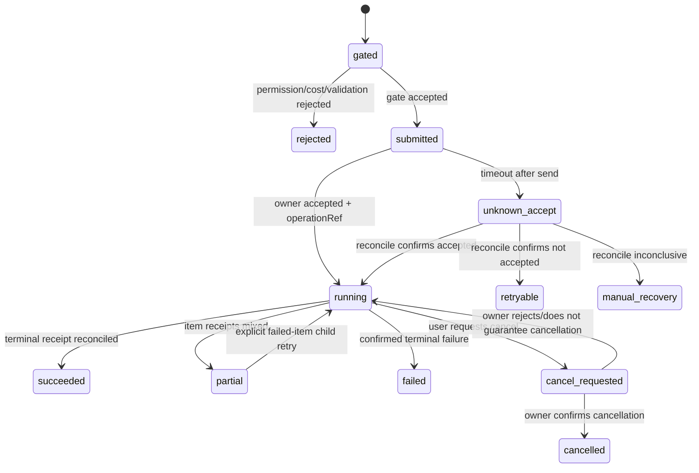

# Open Design Owner 合同交接稿

## 目的

本交接稿定义 Workbench 完整设计生产工作流所需的 Owner 语义。它是 Open Design Owner OpenSpec 的输入，不代表当前 `0.8.0` 服务已经实现这些能力，也不预设 REST 路径、数据库结构或生成引擎实现。

Workbench 只在 Owner 发布版本化、机器可校验的合同后启用生产读写。当前已验证的项目、文件、文本、预览和文件变更读取继续可用；Prompt、Candidate、Review、Handoff 与六个 mutation 保持 `needs_contract`。

## 当前 handoff 与就绪入口

本交接稿只记录合同边界与阻塞，不是 owner 状态副本。当前 Workbench Operation 规划以 [workbench-orbital-owner-operations](../../openspec/specs/workbench-orbital-owner-operations/spec.md) 为入口；Creator Studio consumer 的 planning/readiness 以 [creator-studio-owner-consumer-matrix](../../openspec/changes/archive/2026-09-01-workbench-owner-backend-integrations/details/creator-studio-owner-consumer-matrix.md) 为唯一状态口径；Auctra 由 [Service API interface](../../../../cli/auctra/docs/service-api-interface.md) 提供 owner 入口，Scaena 由其 owner repository 中的独立 handoff OpenSpec 承接。

这些链接不表示已实施或 live。浏览器只经 Workbench BFF / `workbenchd` 读取已批准的安全投影或打开 owner-issued descriptor；owner 以自身 session 重新授权。Workbench 不保存或推断 owner canonical state，也不以浏览器直连、共享 token、CLI/私有存储回退替代 owner contract。

## 权威边界

| 数据 | Canonical owner | Workbench 可保存 | Workbench 禁止保存 |
| --- | --- | --- | --- |
| 项目、Prompt、Reference | Open Design | opaque ref、版本、safe summary | raw prompt、私有路径 |
| Candidate、Preview、Evidence | Open Design | opaque ref、digest、MIME、尺寸、safe summary | artifact blob、provider payload |
| Review、Handoff、Export | Open Design | decision/manifest/receipt ref、状态摘要 | 完整内部推理、交付正文 |
| Task、Attempt、Event index | Workbench | gate、safe input refs、状态、cursor、receipt ref | Owner canonical state、credential |

## 能力文档

Owner MUST 发布 machine-readable capability document。获取方式由 Owner OpenSpec 固化，但文档至少包含：

- `contractVersion`、`minWorkbenchVersion`、`ownerApplicationVersion`；
- 支持的 read method id、operation id、event stream 与 reconcile method；
- 每个方法的 request/result schema version、最大 payload、稳定错误码；
- idempotency、expected owner version、cancel、partial result、receipt 和 cursor 支持；
- preview MIME、单资源大小、sandbox 与下载能力；
- opaque ref 的 workspace/project scope 与过期规则。

Workbench MUST 校验完整文档，不能用 `/api/version`、HTTP 200、页面文案或展示文件推断能力。缺少文档为 `needs_contract`；文档存在但版本或必需语义不兼容为 `contract_mismatch`。

Owner 发布候选合同后，先执行无 mutation canary：

```bash
task test:owner-contract-canary OPEN_DESIGN_CONTRACT_URL=https://owner.example/api/workbench-contract
```

该命令要求显式、无 userinfo/query/fragment 的 HTTP(S) URL，拒绝 redirect，限制响应大小，只输出合同版本和能力计数，并通过标准 runner 写入脱敏 evidence。它不调用任何项目 mutation，也不能替代后续 read projection 与真实工作流 canary。

## Read 方法映射

方法 id 是稳定语义标识；REST、RPC 或 local bridge 的具体绑定由 Owner 合同声明。

| Owner method id | Workbench projection | 必需输入 | 必需安全输出 |
| --- | --- | --- | --- |
| `design.workflow.get` | `GetDesignWorkflow` | `projectRef` | phase、overlay、ownerVersion、activeTaskRef、selectedCandidateRef、nextAction、freshness |
| `design.reference.list` | `ListReferences` | `projectRef`、page cursor | referenceRef、title、MIME、digest、previewRef、version |
| `design.prompt.version.list` | `ListPromptVersions` | `projectRef`、page cursor | promptVersionRef、parentRef、digest、safe summary、ownerVersion、createdAt |
| `design.prompt.version.get` | `GetPromptVersion` | `projectRef`、promptVersionRef | 同上；正文仅在显式编辑读取中返回且不得缓存 |
| `design.candidate.list` | `ListDesignCandidates` | `projectRef`、cursor、limit | candidateRef、promptVersionRef、lineage refs、preview refs、status、ownerVersion |
| `design.candidate.get` | `GetDesignCandidate` | `projectRef`、candidateRef | candidate safe projection、item status、receiptRef |
| `design.candidate.compare` | `CompareDesignCandidates` | `projectRef`、1–4 candidateRef、dimension ids | 同维度 safe diff、evidence refs、版本 |
| `design.review.evidence.list` | `ListReviewEvidence` | `projectRef`、candidateRef | evidenceRef、category、severity、safe summary、source refs |
| `design.review.status.get` | `GetReviewStatus` | `projectRef`、candidateRef | decisionRef、decision、reason summary、ownerVersion、receiptRef |
| `design.handoff.draft.get` | `GetHandoffDraft` | `projectRef` | handoffRef、target、manifestVersion、required/optional items、receipts |
| `design.handoff.validate` | `ValidateHandoff` | `projectRef`、handoffRef | blocker/warning、ready、validatedOwnerVersion |

所有列表 MUST 使用稳定 cursor；所有 projection MUST 提供 `observedAt`、`freshness` 或等价版本信息。Owner 私有路径、动态 URL、token、raw provider response 和完整推理不得出现。

## Mutation Operation 映射

所有写操作经 Workbench `TaskService` 调用，Owner 不接受浏览器直连。每个请求 MUST 带 `projectRef`、`expectedOwnerVersion`、`idempotencyKey` 和调用 principal 的授权上下文。

| Operation | 瞬时输入 | Owner 结果 | 终态前对账依据 |
| --- | --- | --- | --- |
| `design.prompt.save` | raw prompt、parentPromptVersionRef、safe source refs | promptVersionRef、ownerVersion、receiptRef | idempotency key 或 receipt status |
| `design.candidate.generate` | promptVersionRef、referenceRefs、skillRefs、designSystemRef、generation scope | accepted operation ref、candidate item refs、ownerVersion、receiptRef | operation status、item receipts、events |
| `design.candidate.cancel` | generation operation ref | `cancel_requested`、`cancelled` 或 `unsupported` | operation status；请求成功不等于已取消 |
| `design.review.decide` | candidateRef、`accept`/`reject`/`request_revision`、短理由、evidenceRefs | immutable decisionRef、ownerVersion、receiptRef | decision receipt/status |
| `design.handoff.prepare` | acceptedCandidateRef、target、selected item refs | handoffRef、manifestVersion、validation、receiptRef | manifest projection/status |
| `design.handoff.export` | handoffRef、manifestVersion、selected item refs | per-item status、per-item receiptRef、ownerVersion | export status、item receipts |

Raw prompt 只允许存在于浏览器内存和 Owner invoke 的瞬时 body。Workbench persistence、Task input snapshot、event、日志、trace、evidence 和错误响应 MUST 结构化剥离正文。

## Operation 状态机



Workbench MUST NOT 把 transport timeout 映射为普通 `failed`，不得自动重放 `unknown_accept`，不得因 cancel request 被接受而显示 `cancelled`。

## Event、Receipt 与 Reconcile

Owner event MUST 至少包含 `eventId`、`cursor`、`occurredAt`、`operationRef`、`operation`、`projectRef`、`ownerVersion`、状态、safe progress、safe refs 和可选 `receiptRef`。事件顺序在同一 operation 内单调，断点游标过期时返回稳定错误并要求 snapshot reconcile。

Receipt MUST 不可变，并至少包含：

- `receiptRef`、`operationRef`、`operation`、`projectRef`；
- `idempotencyDigest`、`acceptedAt`、`completedAt`、终态；
- `previousOwnerVersion`、`ownerVersion`；
- result refs 或 item receipts；
- stable error code 与 safe summary。

Reconcile MUST 支持按 `operationRef`、`receiptRef` 或 idempotency scope 查询。相同 idempotency key 与相同规范化输入返回同一接受结果；相同 key 与不同输入返回 `idempotency_conflict`。

## 稳定错误

Owner 合同至少定义：

- `validation_failed`：输入或 handoff blocker；
- `permission_denied`：缺少 scope；
- `version_conflict`：返回最新安全 ownerVersion/ref；
- `idempotency_conflict`：同一 key 复用不同输入；
- `not_found`：opaque ref 不存在或不属于 project；
- `unsupported`：cancel 或 preview 格式未支持；
- `payload_too_large`、`unsupported_media`；
- `rate_limited`、`owner_unavailable`；
- `cursor_expired`；
- `contract_mismatch`。

错误不得携带私有路径、credential、raw prompt、provider payload 或完整内部推理。

## Handoff 完整性

Manifest item MUST 有稳定 `itemRef`、kind、required、digest、ownerVersion、状态和可选 receiptRef。Required item 不能由客户端取消选择。Export partial 时成功 item 的 receipt 保留，child retry 只接收失败 item refs，并沿用同一 handoffRef 与 manifestVersion；manifest 版本变化时旧 retry MUST 返回 `version_conflict`。

## Preview 合同

首个 production 版本至少支持 raster preview。每个 preview ref 必须声明 MIME、byte size、digest、ownerVersion 和过期策略。HTML/interactive preview 只有在 Owner 明确声明且 Workbench sandbox 安全门禁通过后启用；不支持时返回 `unsupported`，不得回退为任意 URL iframe。

## Owner 验收场景

Owner 在合同晋级前 MUST 提供 fixture-free conformance 或官方 fake server，覆盖：

1. Prompt save success、validation、version conflict 与幂等冲突；
2. Candidate generate progress、partial、failed-item retry、unknown accept 与 reconcile；
3. Cancel unsupported、request accepted 但未取消、最终 cancelled；
4. Review 三种 decision 与 append-only receipt；
5. Handoff blocker、manifest version conflict、partial export 与 item retry；
6. Event reconnect、cursor expired 和 snapshot reconcile；
7. opaque ref 越权、SSRF、payload/MIME 上限和 redaction 负向测试。

晋级必须同时满足：Owner strict OpenSpec 通过、machine-readable contract 可获取、官方 conformance 通过、Workbench negotiation 通过、六个 Operation 不再为 `needs_contract`，以及真实 save→generate→review→handoff→export 主路径 evidence 完整。

## 当前取证结论

2026-07-19 对 `http://10.10.1.101:7456` 的只读取证显示应用版本为 `0.8.0`。基础项目和文件读取可用，但未发现上述 capability document、领域 read methods、六个 Operation、receipt/reconcile/idempotency/cursor 合同。因此当前阻塞项属于 Owner 合同与实现，不应通过 Workbench 本地数据库、CLI 文本解析、文件名推断或乐观 UI 状态绕过。

公开 source map 显示现有 `POST /api/projects/:id/finalize/:provider` 是同步长请求：Web 最长等待 130 秒，取消仅中止客户端请求，daemon 可能继续执行；它没有 operation ref、expected owner version、idempotency、receipt 或 status reconcile。现有 `POST /api/projects/:id/handoff` 面向 conversation transcript synthesis，以 `CONVERSATION_NOT_FOUND`、`EMPTY_TRANSCRIPT` 等错误描述输入，不提供 manifest version、required items、validation blocker、per-item receipt 或 partial retry。通用 `/api/runs/:id/cancel` 也没有发布到 Design 领域的稳定绑定。以上 legacy 能力可以由 Owner 在新合同内部复用，但 Workbench 不直接解析或推断它们。
