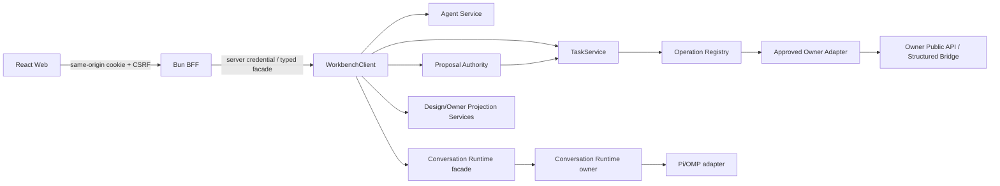

# Agent-first Workspace 前端与后端合同

## 0. 范围

本文定义 Workbench Agent-first 应用从 React Web 到 Bun BFF、TypeScript `WorkbenchClient`、Go shared services、TaskService 和 Owner adapter 的稳定边界。产品对象与页面组合见 [应用 Blueprint](../product/agent-workbench-blueprint.md)，布局和控件见 [UI Spec](../ui/agent-first-workbench.md)。Spatial V2→V3 的并行合同、Draft/presence 和回滚见 [Spatial Canvas V3 接口合同](spatial-canvas-v3.md)。

本文不是某次 dirty worktree 的 writer lease，也不把当前实现状态误写成最终 readiness。当前正式变更：

- `workbench-agent-pi-workspace-v1`：session、conversation、Pane、presentation intent。
- `workbench-agent-proposal-authority-v1`：proposal、decision、Task/receipt/reconcile authority。
- `workbench-spatial-canvas-experience-v3`：计划中的 additive viewport V3、Lens layout、view preference、Draft/presence 与 promotion；不修改现有 V2 identity。
- `workbench-agent-chat-canvas-convergence-v2`：Conversation Runtime content consumer、Session Profile/grant、selected-session merged stream、Canvas selection attachment 与单一自适应 shell。实现状态（2026-09-04）：消费面合同（SDK normalizer/BFF 白名单代理/TaskService grant 准入/sealed intent refs）fixture 阶段全绿；真实 provider digest 与 canary blocked（根 P1 canary 未执行）；`AgentTurnSubmitRequest` 的 `grantRef/turnIntentRef/profileRef` 为 additive safe refs（`breaking_surfaces=[]`）。
- 根 change `agent-conversation-runtime-workbench-integration-v1`：独立 Conversation Runtime owner、Runtime Plane fixed adapter、加密正文和跨项目 handoff。

后续项目连续性增量由 [Project Continuity 消费接口](project-continuity-workbench.md) 与 `workbench-project-continuity-desktop-v1` 承接：拟新增 project overview/continuity/prepare、Layout 安全项目视图和独立 action grant。它们保持本文件的 content/control、proposal/Task 与 owner 边界；旧 grant 不增加 mutation 权限，原 accepted attempt 的恢复不依赖新 UI capability。当前为设计合同，未声明方法注册或 provider digest 就绪。

## 1. 信任链



### 1.1 Browser

Browser 只拥有：

- UI composition、selected refs、per-session draft/scroll/layout memory；
- typed server projection 的 query cache；
- same-origin opaque session 与 CSRF 协议；
- server capability 结果的只读派生。

Browser 不得拥有或提交为授权事实：

- Workbench local session token、Owner/provider credential；
- caller-chosen principal/tenant/membership/role；
- Owner endpoint、任意 URL、private path、shell command；
- proposal basis/action/target/expected Owner versions 的 authority 副本；
- raw provider payload、完整 tool args 或 chain-of-thought。

### 1.2 BFF

BFF 负责同源 session、CSRF、request size/timeout、typed transport facade、preview proxy 和安全 header。BFF 不拥有 Task/proposal/Owner 状态机，不根据 route/query/localStorage 提升 capability，也不实现 operation-specific authorization。

### 1.3 Shared services

Go shared service 是 authorization、scope、revision、idempotency、状态转换、cursor 与 recovery 的唯一业务边界。HTTP、gRPC、JSON-RPC handler 只负责 decode、调用 service 和 canonical error mapping。

### 1.4 Owner adapter

Adapter 只调用获批的 versioned public API 或 structured local bridge，不读取 Owner 私有数据库/目录，不解析 human CLI output，不接收浏览器 credential 或 endpoint。Owner canonical state、receipt/status/reconcile 仍归 Owner。

## 2. Contract identities

| 合同 | Identity |
| --- | --- |
| Agent session workspace summary | `workbench.agent_session_workspace.v1alpha1` |
| Agent presentation intent | `workbench.agent_presentation_intent.v1` |
| Pane registry | `workbench.pane_registry.v1` |
| Agent proposal authority | `workbench.agent_proposal_authority.v1alpha1` |
| Agent JSON Schema | `workbench/agent/v1alpha1/agent.schema.json` |
| Task control | existing `workbench.task.v1alpha1` |
| Conversation runtime descriptor | `conversation.runtime_descriptor.v1alpha1` |
| Conversation session profile/grant | `conversation.session_profile.v1alpha1` / `conversation.session_grant.v1alpha1` |
| Conversation session/content | `conversation.session.v1alpha1` / `conversation.message_block.v1alpha1` |
| Conversation content event/receipt | `conversation.content_event.v1alpha1` / `conversation.content_receipt.v1alpha1` |
| Text Development document | `agent.text-development.v1alpha1` |
| Text selection anchor | `workbench.text_selection.v1alpha1` |
| Auctra Working Copy | `auctra.text_working_copy.v1alpha1` |
| Ordo Team control | `ordo.workbench.team_control.v1alpha1` |

合同演进只允许 additive field/message/method、closed enum 的安全 unknown 处理和显式 migration。已发布字段号、JSON property 语义、RPC identity、error code 和 safe ref 含义不得静默重解释。

### 2.1 Spatial Canvas V3 compatibility

现有 `workbench.spatial_viewport.v2`、`far | medium | near`、`QuerySpatialSurface` 和 `POST /v1/spatial/surfaces:query` 保持原义。V3 通过新 `workbench.spatial_viewport.v3`、新 method/path 和 TypeScript exports 并行加入；旧 method 只返回 V2 shape。`breaking_surfaces: []`，V2 移除不属于当前 change。

## 3. Session 与 Turn

### 3.1 Session identity

Agent session 是 accepted Agent turn Tasks 的派生分组，不是独立执行状态机。browser-local empty draft 不是 server session；首个 turn 被 TaskService 接受后才 materialize canonical session projection。

`AgentSessionWorkspaceSummaryV1` 可从 canonical Task/event/proposal/receipt safe indexes 重建，不存 raw prompt、provider payload、tool args、credential、private path 或 artifact blob。

`AgentSessionPresentationV1` 仅保存当前 principal 的安全 UI metadata：title override、pinned、archived、last-seen activity cursor、presentation revision。它不改变 Task、proposal、Owner 或 receipt 状态。

### 3.2 Turn submit

Browser/SDK 提交：

- `workspaceId` 与可选 project context；授权 tenant/principal 仍由 server context 解析；
- safe `sessionRef`；
- bounded turn intent/digest 或 sealed input ref；
- idempotency key；
- 可选 authorized `contextPackRef/contextPackRevision`；
- policy-bounded limits。

Browser 不把 raw prompt 持久化到 Task control plane。UI 只有在 TaskService 明确接受后才显示 canonical user turn；网络结果未知时保持 pending/uncertain，不伪造已提交。

### 3.3 Context Pack

Context Pack 必须显式 prepare、reauthorize、attach、refresh 或 detach。session summary 可以提供 last Context Pack safe ref/revision，但 session selection 和 presentation intent 不得自动 attach 或把过期 revision 替换为最新版本。

### 3.4 Conversation content 与 sealed turn intent

真实对话正文由独立 Conversation Runtime 加密保存。Browser 通过 Workbench BFF/`WorkbenchClient.agent.conversation` 使用 typed content facade；Workbench control plane 不保存正文、完整 model response 或 provider payload。

Turn 流程：

1. 用户确认 `SessionProfile`，服务端返回绑定 principal/workspace/session、runtime/model revision、tool/context scope、预算与 expiry 的 `SessionGrant`。
2. Composer 将 visible message、grant、exact Context Pack revision 与 approved artifact refs 发送到 Conversation Runtime，得到 sealed `turnIntentRef` 与 digest。
3. `submitTurn` 继续创建 `workbench.agent.turn.submit.v1` Task，input 只含 `turnIntentRef`、grant/profile/context refs/revisions 与 bounded limits。
4. Conversation content stream 输出 safe structured Blocks；Task stream 输出 lifecycle/gate/proposal/receipt。BFF 按 session/turn/attempt 合并为 selected-session projection，但保留独立 cursor/freshness/state。
5. ordinary read/chat turn 在有效 grant 内不重复 permission gate；mutation、敏感读取、runtime/model/tool/budget 越界仍进入独立 approval。

允许的 visible Block kind 为 `markdown|code|table|quote|artifact_ref|proposal_summary|status`。HTML/JavaScript、任意 URL、provider frame、隐藏 prompt/reasoning、credential、private args/path 必须在 owner 与 Workbench 两层 fail closed。

### 3.5 Canvas selection attachment

Canvas selection 先投影为 `PendingContextSelectionV1`，只含 safe ref、label、type、owner ref、projection revision、freshness 和 source document。用户显式选择“用于本次提问”后，Context service 重新授权全部 refs；任一 stale/revoked/mismatch 都阻止 attachment，必须 Refresh 或 Remove，不自动升级或静默省略。

### 3.6 Text Development selection 与 Working Copy

Text Development 继续使用同一 Conversation/Task 控制链，但正文和编辑 revision 归 Auctra：

1. Browser 通过 same-origin BFF 显式打开 `auctra.text_working_copy.v1alpha1`，只在 active document 保留当前 buffer/undo/selection。
2. Autosave 使用 revision/digest 绑定的 UTF-16 incremental patch；HTTP 成功不等于 saved，只有 Auctra receipt 可推进显示状态。
3. `workbench.text_selection.v1alpha1` 绑定 Working Copy/unit、revision/digest、UTF-16 range 与 selected digest；它不授予执行权限。
4. Ask/Rewrite/Polish 将 anchor 与 Working Set交给 Conversation Runtime seal intent，再沿既有 `workbench.agent.turn.submit.v1` 创建 Task。
5. Candidate accept 经 ProposalAuthority/TaskService/Auctra，只更新 Working Copy；Checkpoint、ReviewItem、Canon 仍显式分离。
6. Ordo Team Plan 通过 `ordo.workbench.team_control.v1alpha1` preview/simulate/start；Browser 不直连 Ordo，也不编辑 owner DAG。

完整 client、body boundary、egress、hot-switch、Team 与错误矩阵见 [Text Development Agent 与 Owner 接口](text-development-agent-interaction.md)。

## 4. Session directory 与事件

### 4.1 Stream ownership

一个 workspace supervisor 最多拥有：

- 一个 workspace directory resumable stream；
- 一个 selected-session detail stream，由 BFF 合并 Conversation content 与 Task/proposal/receipt lifecycle，同时保留两套 cursor/freshness。

不得为每个 session、proposal 或 Pane 建立独立 SSE。其他 transports 提供等价 cursor catch-up，不要求长连接形态完全相同。

### 4.2 Cursor 与 unread

Activity cursor 由服务端生成并持久化。Attention precedence：

```text
unknown_accept > waiting_review > permission_required > needs_contract > running
> queued_or_cancel_requested > partial > failed > stale_or_offline > idle
```

Browser 只有在 timeline foreground-visible 后才可提交 observed `seenThroughCursor`。选择 session、hover/focus row 或接收本地时间戳不能清除 unread。Read ack 与新 activity 竞争时，新 activity 必须仍 unread。

### 4.3 Reconnect

- stream disconnect 后保留 last-confirmed projection，标记 degraded/offline；
- 使用 opaque cursor catch-up，resync control cursor 不能被误当 activity cursor；
- fallback page/summary read 有界重试；
- server capability 被移除时立即停止对应 stream 和 effect consumer；
- reconnect 不重复 decision、Task submit、read ack 或 Pane intent effect。

## 5. Pane catalog 与 layout contract

### 5.1 Canonical resolver

项目只有一个 versioned Pane resolver/catalog。Pane descriptor 至少包含 closed pane identity/version、renderer ID、closed params schema、capabilities/roles/scopes、data/action contract、preferred placement、responsive presentation 和 server-authored availability。

Descriptor 不得携带 dynamic component、remote import、URL、iframe、HTML、JavaScript、DOM selector、arbitrary props、credential、raw prompt 或 private path。

### 5.2 Pane request

`OpenPaneRequestV1`/等价本地 reducer input 只引用：

- registered `paneType` 与 route version；
- current session/project/workspace safe refs；
- descriptor-approved closed params；
- source intent/action ref（如适用）。

Resolver 在 mount 前验证 registry version、scope、params、capability、availability、duplicate identity、visible limit 与 split depth。未知类型/version/params fail closed。

### 5.3 Layout state

Deliver-now layout 是 session-scoped browser composition state：open instances、active instance、placement/split、size 和 focus-return trigger ref。它不持有 Pane data、Task、proposal 或 Owner state。

- desktop 默认最多 3 个 visible Pane，hard max 4，split depth 2；
- duplicate request 默认 focus existing instance；
- limit reached 返回 explicit `limit_reached`，不能 silent replace；
- close Pane 不取消 Task、不删除 projection；
- tablet/mobile 只显示一个 labelled modal Sheet，但可保留隐藏的 session layout state；
- future SavedView 必须使用 expected revision/idempotency，仅持久化安全 layout metadata。

### 5.4 Pane data/action ownership

| Pane | Read source | Mutation path |
| --- | --- | --- |
| Context | Agent Context service | typed prepare/refresh/detach |
| Run | TaskService/event projection | cancel request/reconcile TaskService |
| Review | ProposalAuthority projection | typed decide/reconcile |
| Evidence | safe artifact/receipt refs | approved open/download only |
| Operations | Owner facade projection | ActionDescriptor → TaskService |
| Context Map | authorized relation projection | read-only v1 |
| Work Items | `workItems.listWorkItems/getWorkItem`（GET /v1alpha1/workitems，workitemshttp） | `update/transitionWorkItem`（POST /update /transition：Idempotency-Key header + expectedVersion；watch 事件源未实现，stream 优雅降级） |
| Workflows | `workflow.listDefinitions/listRuns/listRunEvents` | read-only；动作走 proposal/Task |
| Daily Ops | `dailyOps.listInboxItems/listApprovalItems/listActivity`（传输投影等 R3 gates，palette needs_contract） | `decideApproval/executeInboxAction`（typed client → TaskService） |
| Assets | `assets.listAssets/searchAssets/listCollections`（传输投影等 R3 gates，palette needs_contract） | read-only |
| Identity | `identity.getSession/getCurrentPrincipal/listTenants/listMembers/getReadiness` | read-only；palette 由 readiness 投影门控 |
| Gateway | `gateway.getOverview/listBackends/listApprovals/listActivity` | read-only；palette 由 capabilityState 门控（服务端 handler 属 MC 8.3） |
| Project Workspace | 既有 workItems 读接口（Table/Kanban/Todo 同缓存） | 既有 workItems typed mutation（workitemshttp wire 层）；服务端 ProjectQuery 语义后续替换 |

Pane component 不得直接访问 Owner、复制状态机或用 mock fallback 在 production 显示 ready。

## 6. Presentation intent

`AgentPresentationIntentV1` 是 allowlist UI presentation request，不是 browser command 或 mutation authority。

允许 kind：

- `open_pane`
- `focus_safe_ref`
- `show_evidence`
- `request_review`
- `prefill_draft`
- bounded attention/suggestion kind（若 schema 已注册）

每次 activation 必须重新验证 current session/source output、authorized safe refs、Context Pack revision、expiry、registry version、Pane availability 和 dedupe key `(sessionRef, intentRef, sourceSequence)`。

禁止 target：DOM selector/ID/XPath、任意 URL/HTML/JS/CSS、keyboard/form injection、dynamic component/props、tool args、credential/private path/provider payload。

默认 `suggest` 需要用户激活。临时 Follow Pi：

- server capability 由 `WORKBENCH_AGENT_FOLLOW_PI_COHORT` 的精确 principal 与 read-only、presentation-suggestions cohort 交集决定；当前 session 仍需明示 consent，默认 off，不持久化；
- 首批 canary 只自动处理 live foreground `open_pane/show_evidence`；`focus_safe_ref` 保持 suggest-only，等待后续 focus/typing/reduced-motion 晋级证据；
- dirty composer、active Review、external modal 时暂停；
- replay、focus_safe_ref、request_review、prefill_draft、attention 永不自动执行；
- 不移动 keyboard focus，不决定 proposal，不调用 backend mutation。

## 7. Proposal authority

Agent output 中可见 proposal 不是执行权威。可操作 proposal 必须在 `ProposalAuthorityService` 中有 canonical record、revision、closed descriptor、safe basis、target Operation 和 expected version refs。

### 7.1 Decision request

Browser 只提交：

- proposal ref；
- expected proposal revision；
- `accept | reject | request_changes`；
- idempotency key；
- policy-approved bounded reason metadata。

服务端重新解析 actor/scope，并重载 proposal、basis visibility、source/descriptor revision、target Operation、Owner capability、permission、cost、approval 和 expected domain versions。

### 7.2 Decision behavior

- `accept`：通过 `orbit.proposal.accept` 与现有 TaskService，sealed Task input 只引用 server decision ref。
- `reject/request_changes`：只更新 proposal decision metadata，不创建 Task/Owner mutation/Agent turn。
- accepted decision 与 target Task status 分开。
- any possible post-dispatch ambiguity → `decision_unknown`。
- unknown 只用原 attempt Task/receipt/correlation reconcile；不 replay、不换 provider/adapter、不创建 fallback Task。

主规范见 `openspec/specs/workbench-agent-proposal-authority/spec.md`；当前实现与
capability-scoped evidence 保留在 active change
`openspec/changes/workbench-agent-proposal-authority-v1/`。

## 8. Shared method matrix

### 8.1 Session workspace

| Shared method | HTTP | gRPC | JSON-RPC |
| --- | --- | --- | --- |
| list workspace summaries | `GET /v1alpha1/agent/session-workspace/summaries` | `ListAgentSessionWorkspaceSummaries` | `ListAgentSessionWorkspaceSummaries` |
| get presentation | `GET /v1alpha1/agent/session-presentations/{sessionRef}` | `GetAgentSessionPresentation` | `GetAgentSessionPresentation` |
| update presentation | `PUT /v1alpha1/agent/session-presentations/{sessionRef}` | `UpdateAgentSessionPresentation` | `UpdateAgentSessionPresentation` |
| acknowledge read | `POST /v1alpha1/agent/sessions/{sessionRef}:ack-read` | `AcknowledgeAgentSessionRead` | `AcknowledgeAgentSessionRead` |
| directory catch-up/watch | `GET /v1alpha1/agent/session-directory:watch` (SSE) | `WatchAgentSessionDirectory` | `WatchAgentSessionDirectory` |

### 8.2 Proposal authority

| Shared method | HTTP | gRPC | JSON-RPC |
| --- | --- | --- | --- |
| get proposal | `GET /v1alpha1/agent/proposals/{proposalRef}` | `GetAgentProposal` | `GetAgentProposal` |
| decide proposal | `POST /v1alpha1/agent/proposals/{proposalRef}:decide` | `DecideAgentProposal` | `DecideAgentProposal` |
| reconcile decision | `POST /v1alpha1/agent/proposals/{proposalRef}/decisions/{decisionRef}:reconcile` | `ReconcileAgentProposalDecision` | `ReconcileAgentProposalDecision` |

### 8.3 Conversation Runtime consumer（additive v1alpha1）

| Facade method | Same-origin HTTP/SSE | Owner contract |
| --- | --- | --- |
| list runtime profiles | `GET /v1alpha1/agent/conversation/runtime-profiles` | `ListRuntimeProfiles` |
| create session grant | `POST /v1alpha1/agent/conversation/session-grants` | `CreateSessionGrant` |
| revoke session grant | `POST /v1alpha1/agent/conversation/session-grants/{grantRef}:revoke` | `RevokeSessionGrant` |
| get conversation session | `GET /v1alpha1/agent/conversation/sessions/{sessionRef}` | `GetConversationSession` |
| create sealed turn intent | `POST /v1alpha1/agent/conversation/sessions/{sessionRef}/turn-intents` | `CreateTurnIntent` |
| watch selected-session content | `GET /v1alpha1/agent/conversation/sessions/{sessionRef}:watch` (SSE) | `WatchConversationContent` |
| retry known attempt | `POST /v1alpha1/agent/conversation/attempts/{attemptRef}:retry` | `RetryConversationAttempt` |
| delete session content | `DELETE /v1alpha1/agent/conversation/sessions/{sessionRef}/content` | `DeleteConversationContent` |
| export session content | `POST /v1alpha1/agent/conversation/sessions/{sessionRef}:export` | `ExportConversationContent` |

这些 method 是 pre-1.0 additive consumer surface；Browser 仍只访问 same-origin BFF。Conversation Runtime owner 的 wire identity、encryption/storage 和 Pi/OMP protocol 由根 change 与 owner OpenSpec 定义，Workbench 不把 SDK facade 当第四个 canonical transport。

SDK facade 不是第四 wire transport；它必须 strict-normalize 三种 wire transport 的同一 canonical result。Transport handler 不得拥有 operation-specific business logic。

## 9. Errors 与 UI mapping

| Canonical code/state | UI | Recovery |
| --- | --- | --- |
| `invalid_argument` | bounded field error | 修正输入；不回显 unsafe value |
| `permission_denied` | access-denied | 请求权限/切换授权上下文 |
| `capability_unavailable` / `needs_contract` | readable disabled Pane/control | 查看合同/连接要求 |
| `revision_conflict` | current server state + conflict | reload 后重新决定 |
| `idempotency_conflict` | duplicated-key error | 创建新的明确 action key |
| `proposal_expired/superseded` | proposal non-actionable | 请求新 proposal |
| `cost_confirmation_required` | cost gate | 明确批准或取消 |
| `approval_required` | permission/review gate | 完成所需审批 |
| `offline/stale` | last-confirmed + badge | retry read/refresh/re-authorize |
| `unknown_accept` | warning, no success/failure | reconcile only |
| `limit_reached` | Pane catalog remains open | close or explicit replace |
| `content_key_unavailable` / `content_integrity_failed` | message content unavailable，Task refs 保留 | restore key / export diagnostics；禁止 plaintext fallback |
| `runtime_profile_expired/revoked` | Composer blocked，content readable | confirm a new Profile |
| `budget_exceeded` | turn not dispatched | raise/replace session ceiling with explicit approval |
| `content_cursor_gap` | last-confirmed Blocks + degraded | bounded session refetch；不重启 turn |
| `attempt_partial` | confirmed Blocks + partial label | explicit Retry creates a new attempt |

错误详情必须稳定、bounded、可本地化；raw transport error、stack、URL、credential、private payload 不进入最终用户文本。

## 10. Capability contract

Server 独立投影以下 capability，均 default-off：

- `readOnlyUnifiedShell`
- `directoryStream`
- `presentationSuggestions`
- `followPi`
- `proposalRead`
- `proposalDecision`
- `proposalReconcile`
- `toolActionCanary`
- `conversationRuntime`
- `conversationContent`
- `sessionProfileGrant`
- `chatCanvasV2`
- per-pane/per-owner capability states

Capability 至少包含 `enabled|disabled|needs_contract|permission_required|offline|unsupported`、reason code、recovery hint、contract/version digest（如适用）和 scope。Browser query、Vite variable、localStorage、route/component state 不能授予 capability。

Proposal authority 的 runtime 授权使用四个 default-empty、exact-principal
cohort：`WORKBENCH_AGENT_PROPOSAL_READ_COHORT`、
`WORKBENCH_AGENT_PROPOSAL_DECISION_COHORT`、
`WORKBENCH_AGENT_PROPOSAL_RECONCILE_COHORT`、
`WORKBENCH_AGENT_PROPOSAL_TOOL_ACTION_COHORT`。Decision/reconcile 必须同时在
read cohort；accept 还必须同时在 decision 与 tool-action cohort。当前唯一完成
real Owner canary 的 action 是 exact `action:eikona:generation-submit` →
`eikona.generation.submit`，且 registry 必须为 `ModeOwner`；其他 action/Owner
继续保持 disabled/`needs_contract`。

## 11. Persistence 与隐私

Workbench 可持久化：Task metadata、attempt、event index、gate、safe refs、projection rows、proposal/decision metadata、receipt/correlation refs、presentation metadata、cursor/high-water、safe layout metadata 和 idempotency digest。Spatial V3 可新增 Workbench-owned Lens layout、user view preference、Draft document/object/event 和 promotion provenance；它们使用独立 revision、bounded fields 和 expand-only GORM tables。

Workbench 不持久化：raw prompt、完整对话 provider payload、chain-of-thought、credential/token、private path、arbitrary tool args、Owner private payload、artifact blob、signed download URL。

Spatial presence 仅是 TTL 有界的临时投影，不进入数据库、backup、audit 或 lifecycle export。Draft 对 Owner 的引用只保存授权 safe ref/revision；Draft 提升后的正式 mutation 仍经 ProposalAuthority→TaskService→Owner receipt/reconcile。

日志、metrics、traces、SSE、SDK fixture、截图和 evidence 使用低基数 reason/status 与受控 correlation；敏感 sentinel 测试必须覆盖所有出入口。

## 12. Readiness 与 evidence

| Tier | 证明内容 | 不能证明 |
| --- | --- | --- |
| contract/focused | schema、domain、service、SDK/component 语义 | browser、真实 Owner、部署 |
| transport parity | HTTP/gRPC/JSON-RPC 同语义 | UI journey、Owner success |
| browser/E2E | 用户路径、a11y、responsive、reconnect | production Owner/runtime |
| real Owner canary | selected owner operation + receipt/reconcile | 其他 owner/operation |
| deployment | process/config/network/rollback | production SLO |
| production | live SLO、incident、DR、audit | 未纳入 cohort 的 capability |

每个 enabled action 必须能追溯到 capability-scoped evidence、contract digest、environment、flag/kill switch 与 rollback owner。OpenSpec artifact complete、页面可打开、fixture 成功、mock 成功、HTTP 200 或截图相似不能替代 usable/readiness。

2026-08-23 proposal authority handoff 分层：component/restart/race
`temp/integration-test-runs/20260823151219-bc36bd64-521c-4a26-90c9-c23416130e5a/`；
browser 6/6 `temp/integration-test-runs/20260823151115-d96d9e6a-3449-4ca1-ba22-2165e9b73fa0/`；
real Identity/JWKS→Eikona selected-operation canary
`temp/integration-test-runs/20260823150803-736d20d2-d3bc-4200-9417-ed46397f6259/`。
这些证据不代表 staging/production 或其他 Owner readiness。

## 13. Rollback

- unified shell、directory、presentation suggestions、Follow Pi、proposal decision 和 tool action 可独立关闭。
- flag off 不删除或改写 Tasks、events、proposals、decisions、receipts、Owner state、presentation metadata 或 cursor。
- 关闭 decision 后保留 proposal read；accepted/unknown attempt 继续走原 Task/Owner completion/reconcile。
- 关闭 Pane capability 只影响 mount/action availability，不取消后台 Task。
- rollback 后 Browser 清除对应 query/effect consumer 的可执行状态，但保留 last-confirmed safe projection与真实 disabled reason。
