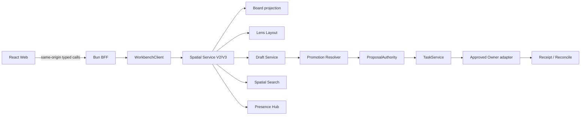

# Spatial Canvas V3 前后端与兼容合同

## 0. 范围

本文定义 Spatial Canvas V3 从 React Web、BFF、TypeScript `WorkbenchClient`、Go Spatial service、GORM repositories、ProposalAuthority/TaskService 到 Owner adapter 的计划合同。产品体验见 [语义无限画布产品设计](../product/spatial-canvas-experience.md)，控件和视觉见 [交互设计](../design/spatial-canvas-interaction.md)。正式实现 change 为 `workbench-spatial-canvas-experience-v3`。

本文不修改现有 V2 合同，也不表示这些 V3 methods 已在当前 runtime 注册或 production available。

## 1. 信任链与状态边界



Browser 可以持有 selection、hover、drag preview、query cache 和未提交的局部交互。Browser 不得提交为授权事实：

- principal、tenant、membership、role；
- Owner endpoint/credential/private path；
- target Operation、basis visibility、expected Owner versions；
- raw prompt、provider payload、完整 tool args 或 chain-of-thought；
- 任意 component/HTML/JavaScript/selector。

## 2. Contract identities

### 2.1 现有 V2，保持不变

| 合同 | Identity |
| --- | --- |
| Spatial surface | `workbench.spatial_surface.v1` |
| Spatial viewport | `workbench.spatial_viewport.v2` |
| Spatial Lens | `workbench.spatial_lens.v1` |
| Spatial watch event | `workbench.spatial_watch_event.v1` |
| Spatial change set | `workbench.spatial_change_set.v1` |
| V2 HTTP query | `POST /v1/spatial/surfaces:query` |
| V2 gRPC/JSON-RPC | `QuerySpatialSurface` |

`far | medium | near`、field numbers、HTTP path、method name、strict JSON shape 和 SDK exports 不得在 V3 change 中修改。

### 2.2 新增 V3

| 合同 | Planned identity |
| --- | --- |
| Spatial viewport V3 | `workbench.spatial_viewport.v3` |
| Lens layout | `workbench.spatial_lens_layout.v1` |
| User view preference | `workbench.spatial_view_preference.v1` |
| Draft document | `workbench.spatial_draft_document.v1` |
| Draft watch event | `workbench.spatial_draft_event.v1` |
| Presence | `workbench.spatial_presence.v1` |
| Draft promotion | existing `workbench.spatial_change_set.v1` proposal result |

V3 使用新 method/path。旧 V2 method 只返回 V2 shape；不能为了少一个 method 而让严格 V2 client 收到未知 V3 keys。

## 3. 核心类型

以下为设计级 TypeScript 形状；实现必须在 proto、Go、SDK 和三 wire transports 中保持同一 closed contract。

```ts
type SpatialSemanticLevelV1 = "atlas" | "cluster" | "object" | "detail";

interface SpatialViewportQueryV3 {
  contractVersion: "workbench.spatial_viewport.v3";
  surfaceRef: string;
  expectedBoardRevision: number;
  expectedLayoutRevision: number;
  bounds: SpatialBoundsV1;
  zoomBucket: number;
  semanticLevel: SpatialSemanticLevelV1;
  tileCursor: string;
  maxPrimitives: number;
  filter: SpatialViewportFilterV2;
}

interface SpatialRegionV1 {
  regionRef: string;
  kind: "section" | "frame" | "lane";
  parentRegionRef: string;
  bounds: SpatialBoundsV1;
  title: string;
  statusToken: string;
  count: number;
  collapsedByDefault: boolean;
}

interface SpatialViewportResponseV3 {
  contractVersion: "workbench.spatial_viewport.v3";
  surfaceRef: string;
  boardRevision: number;
  layoutRevision: number;
  semanticLevel: SpatialSemanticLevelV1;
  regions: SpatialRegionV1[];
  tiles: SpatialTileV1[];
  clusters: SpatialClusterV1[];
  nextCursor: string;
  provenance: SpatialProjectionProvenanceV1[];
  rendererCapability: SpatialRendererCapability;
}
```

约束：

- refs 使用既有 opaque safe ref 规则；
- bounds、count、arrays 和文本均有协议上限；
- Atlas 可以没有 nodes，但非空项目必须有 density/region/cluster aggregate；
- Detail 不在 viewport 内返回 Owner 大 payload；富详情通过现有 typed Owner projection 按选择加载；
- `boardRevision` 和 `layoutRevision` 分开，任何一个 stale 都返回 typed conflict/resync。

## 4. Lens Layout 与 View Preference

```ts
interface SpatialLensLayoutV1 {
  contractVersion: "workbench.spatial_lens_layout.v1";
  surfaceRef: string;
  lensKind: SpatialLensKind;
  layoutRevision: number;
  placements: SpatialPlacementV1[];
  regions: SpatialRegionV1[];
  updatedAtUnixMs: number;
}

interface PatchSpatialLensLayoutRequestV1 {
  surfaceRef: string;
  lensKind: SpatialLensKind;
  expectedLayoutRevision: number;
  operations: SpatialLayoutOperationV1[];
  idempotencyKey: string;
}
```

允许 layout operation：`move | resize | set_region | reorder | set_region_geometry | set_default_collapsed`。它们只能修改空间呈现，不能携带 Owner 内容、业务状态、dependency、approval 或 delivery terminal。

`SpatialViewPreferenceV1` 以 `(principal, project/surface)` 为 scope，保存 active Lens、camera、filters、temporary collapse/visibility、context rail tab 和 minimap state。Preference revision 与共享 layout revision 分开；写失败只表示视图偏好未保存。

## 5. Draft document

```ts
type SpatialDraftObjectKindV1 =
  | "note" | "text" | "ink" | "connector" | "frame" | "reference";

type SpatialDraftLifecycleV1 =
  | "active" | "locked" | "promoted" | "deleted";

interface SpatialDraftObjectV1 {
  draftRef: string;
  kind: SpatialDraftObjectKindV1;
  lensKind: SpatialLensKind;
  geometry: SpatialGeometryV1;
  styleToken: string;
  boundedContent: SpatialDraftContentV1;
  referencedSafeRef: string;
  referencedRevision: string;
  objectRevision: number;
  lifecycle: SpatialDraftLifecycleV1;
  authorSafeRef: string;
}

interface SpatialDraftDocumentV1 {
  contractVersion: "workbench.spatial_draft_document.v1";
  surfaceRef: string;
  draftRevision: number;
  objects: SpatialDraftObjectV1[];
  cursor: string;
}
```

`boundedContent` 是 closed union：note/text 限长文本、ink 为有界压缩点序列、connector 为 source/target Draft ref、frame 为标题和 style。不得存入 raw prompt、provider payload、credential、private path、signed URL、Owner private payload 或 artifact blob。

Patch：

```ts
interface PatchSpatialDraftDocumentRequestV1 {
  surfaceRef: string;
  expectedDraftRevision: number;
  operations: SpatialDraftOperationV1[]; // 1..200
  idempotencyKey: string;
}
```

每个 update/delete/lock operation 携带 expected object revision。服务端可以合并不同对象的并发操作；同对象同字段冲突返回 current safe object，不使用静默 last-write-wins。

Undo 是 inverse patch，不是 revision rewind。Promoted Draft 保留 proposal/Task/Owner refs，Undo 不删除 canonical result。

## 6. Presence

Presence contract 只允许：

```text
memberSafeRef
displayLabel/icon semantic
activeLens
worldCursor
selectedSafeRefs[]
viewportBounds (optional, bounded)
heartbeatUnixMs
```

限制：cursor ≤10Hz，selection/viewport ≤2Hz，TTL 15s，最多投影 32 名成员。超限返回 aggregate member count/Lens distribution。Presence 不写数据库、不进入 backup/audit/lifecycle export，也不构成 edit lock。

## 7. Draft promotion

```ts
interface PromoteSpatialDraftSelectionRequestV1 {
  surfaceRef: string;
  selectedDraftRefs: string[]; // 1..2000
  expectedDraftRevision: number;
  expectedLayoutRevision: number;
  expectedBoardRevision: number;
  lensKind: SpatialLensKind;
  targetHints: SpatialPromotionTargetHintV1[];
  idempotencyKey: string;
}
```

`targetHints` 只能表达 closed type/Owner preference，不能覆盖服务端解析的 Operation、basis visibility、permission、cost 或 expected Owner revision。

服务端必须：

1. 重载 Draft 文档和 object revisions；
2. 校验 Owner safe refs 和当前 visibility；
3. 重载 Board/Lens/type registry；
4. 生成 mapping、依赖、影响、风险和成本；
5. 注册 canonical `SpatialChangeSetProposalV1`；
6. 由 ProposalAuthority 执行 accept/reject/request_changes；
7. accept 经 TaskService 和 Owner receipt/reconcile；
8. terminal receipt 后 refetch canonical projection，再标记 Draft promoted。

partial 或 `unknown_accept` 不删除 Draft。Unknown 只允许原 decision/Task attempt reconcile。

## 8. Planned method matrix

所有方法进入同一 application service。HTTP/gRPC/JSON-RPC handler 只 decode/map；SDK facade 不是第四 wire transport。

| Shared method | HTTP REST/SSE | gRPC | JSON-RPC |
| --- | --- | --- | --- |
| Query V3 surface | `POST /v2/spatial/surfaces:query` | `QuerySpatialSurfaceV3` | `QuerySpatialSurfaceV3` |
| Watch V3 surface | `GET /v2/spatial/surfaces:watch` | `WatchSpatialSurfaceV3` | `WatchSpatialSurfaceV3` |
| Get Lens layout | `GET /v2/spatial/lens-layouts` | `GetSpatialLensLayout` | `GetSpatialLensLayout` |
| Patch Lens layout | `POST /v2/spatial/lens-layouts:patch` | `PatchSpatialLensLayout` | `PatchSpatialLensLayout` |
| Get view preference | `GET /v2/spatial/view-preferences` | `GetSpatialViewPreference` | `GetSpatialViewPreference` |
| Save view preference | `PUT /v2/spatial/view-preferences` | `SaveSpatialViewPreference` | `SaveSpatialViewPreference` |
| Spatial search | `POST /v2/spatial/search` | `SearchSpatialObjects` | `SearchSpatialObjects` |
| Get Draft | `GET /v2/spatial/drafts` | `GetSpatialDraftDocument` | `GetSpatialDraftDocument` |
| Patch Draft | `POST /v2/spatial/drafts:patch` | `PatchSpatialDraftDocument` | `PatchSpatialDraftDocument` |
| Watch Draft | `GET /v2/spatial/drafts:watch` | `WatchSpatialDraftEvents` | `WatchSpatialDraftEvents` |
| Promote selection | `POST /v2/spatial/drafts:promote` | `PromoteSpatialDraftSelection` | `PromoteSpatialDraftSelection` |
| Publish presence | `POST /v2/spatial/presence:publish` | `PublishSpatialPresence` | `PublishSpatialPresence` |
| Watch presence | `GET /v2/spatial/presence:watch` | `WatchSpatialPresence` | `WatchSpatialPresence` |

HTTP uses same-origin session/CSRF plus `Idempotency-Key` and expected revisions. gRPC/JSON-RPC carry equivalent typed fields. Watch cursor identity includes surface, Lens, contract and principal scope；跨 Lens、V2 和 V3 的 cursor 不可复用。

## 9. Errors and recovery

| Code/state | Meaning | Recovery |
| --- | --- | --- |
| `invalid_argument` | closed schema/limit/ref 失败 | 修正输入，不回显 unsafe value |
| `permission_denied` | principal 不可访问 surface/object | 请求权限或移除目标 |
| `needs_contract` | V3/Lens/Owner 合同未就绪 | 使用 V2/read-only/deep link |
| `revision_conflict` | Board/layout/Draft/object revision stale | refetch、compare、重新提交 |
| `idempotency_conflict` | 同 key 不同 digest | 新建明确 key |
| `resync_required` | watch gap 或 projection revision drift | canonical query 后重连 |
| `presence_degraded` | presence unavailable/backpressure | 保持 Draft revision 协作 |
| `not_projected_in_lens` | target Lens 无投影 | 显示相关对象/其他 Lens |
| `proposal_expired/superseded` | promotion proposal 不再可执行 | 重新解析选择集 |
| `unknown_accept` | Owner 可能已接受 | 原 attempt reconcile only |

错误必须 bounded、可本地化，并携带 safe current revision/recovery hint。Raw transport error、stack、credential、URL、private payload 不进入用户文案或 evidence。

## 10. Persistence

新增 GORM tables 使用 expand-only migration：

- spatial lens layouts/placements/regions；
- spatial user view preferences；
- spatial Draft documents/objects/events/idempotency；
- Draft promotion provenance。

表必须包含 tenant/workspace/project/surface scope、revision、safe refs、bounded fields 和 lifecycle class。普通业务访问只通过 GORM repository；例外 SQL 仅限 migrations 或 repository 内无法由 GORM 表达的并发操作，并需参数绑定和设计说明。

Presence 不持久化。Draft/layout/view preference 注册为 Workbench-owned data classes，遵循 project/tenant deletion、legal hold 和 export policy；Owner payload 不进入这些表。

## 11. Compatibility, deprecation and rollback

| Surface | Change class | V2 treatment |
| --- | --- | --- |
| Proto/RPC | additive | old numbers/methods retained |
| HTTP/JSON-RPC | additive new version identity | `/v1` methods retained |
| TypeScript public API | additive exports/methods | V2 imports retained |
| Database | additive tables/indexes | existing rows untouched |
| Capability/config | additive default-off keys | existing flags keep meaning |

本 change 的 `breaking_surfaces: []`。V2 至少保留到 V3 GA 后一个发布周期，本 change 不指定 removal release。未来移除 V2 必须另建 OpenSpec，包含 consumer inventory、deprecation warning、removal release 和 rollback。

Rollback 顺序：

1. 关闭 `spatialDraftCollaboration` 和 `spatialPresence`，Draft 数据转只读保留。
2. 关闭 `spatialCanvasShellV3`，恢复现有 Spatial layout。
3. 关闭 `spatialViewportV3`，Web/SDK 只调用 V2。
4. 不删除 additive tables；已创建 proposal/Task/receipt 继续 completion/reconcile。

## 12. Validation commands

实现阶段使用项目真实命令：

```bash
openspec validate --all --strict
buf lint
CGO_ENABLED=0 go test ./service/...
CGO_ENABLED=1 go test -race ./service/...
bun run typecheck
bun test
bun run build
bun run test:contract
bun run test:integration
```

性能证据在批准的 Chromium host 运行：

```bash
WORKBENCH_SPATIAL_PERF=1 bunx playwright test apps/web/e2e/agent-spatial.spec.ts
```

Integration/component/system/E2E 的正式运行必须经项目 evidence wrapper 写入 `temp/integration-test-runs/<run-id>/`，并保留原始退出码和脱敏检查结果。
