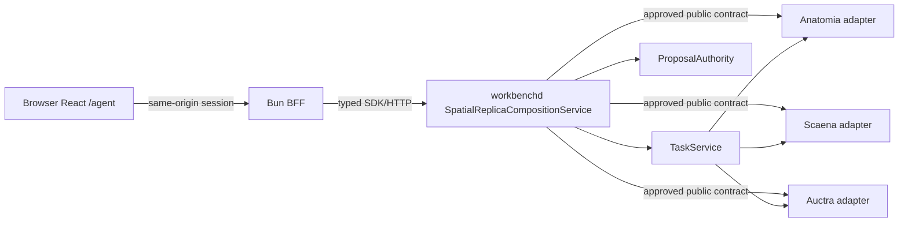

# Spatial Replica Review 前后端与 owner 合同

> 状态：`v1alpha1` 设计合同，未实施
> 对应 OpenSpec：`workbench-spatial-replica-review-v1`
> 本文定义 Workbench consumer boundary；Anatomia、Auctra、Scaena 各自拥有并发布 domain contract。

## 1. 合同目标

本合同让 Workbench 在不复制 canonical state 的前提下完成：

- exact multi-owner safe projection；
- source/evidence/ReplicaStage/timeline 同步审阅；
- independent owner freshness/availability；
- typed inquiry、mutation、review/freeze 与 receipt/reconcile；
- browser same-origin、single-stream 与 no-fourth-state 安全边界。

合同名称固定为：

```text
workbench.spatial_replica_workspace_projection.v1alpha1
```

Pane type 固定为：

```text
agent.spatial-replica.v1
agent.spatial-replica-inspector.v1
agent.auctra-screenplay.v1
agent.scaena-storyboard.v1
agent.owner-receipts.v1
```

这些 surface 均为 additive、experimental、default-off。本文不修改现有 Agent、Pane、Task、ProposalAuthority、Spatial Surface 或 owner contract 的原义。

## 2. Trust chain



Invariants：

1. Browser 只能访问 Workbench same-origin BFF，不持有 owner credential/session token。
2. BFF 只处理 session/CSRF/proxy/transport bounds，不拥有 action domain rules。
3. Composition service 负责 principal/scope、contract/version、exact join、freshness、capability、action descriptor 与 receipt composition。
4. Owner adapters 只能访问 owner 已批准 public API 或结构化 bridge，不读 owner 私有 DB/filesystem/CLI human output。
5. TaskService 与 ProposalAuthority 负责既有执行/批准控制面；Workbench 不复制 owner 状态机。
6. `composition_token`、browser selection 或 local draft 都不是 mutation authority。

## 3. Operation surface

以下名称是目标 operation identity；三种 wire transport 必须共享同一 service implementation 与语义：

| Operation | 性质 | HTTP 表达 | gRPC / JSON-RPC 语义 |
| --- | --- | --- | --- |
| `GetSpatialReplicaWorkspace` | read | `GET /v1alpha1/spatial-replica/workspaces/{workspace_ref}/shots/{shot_ref}` | unary / request-response |
| `WatchSpatialReplicaWorkspace` | read stream | `GET .../events?cursor=`（SSE） | server stream / cursor catch-up |
| `AskSpatialReplica` | bounded inquiry | `POST .../inquiries` | unary / request-response |
| `ExecuteSpatialReplicaAction` | mutation intent | `POST .../actions/{descriptor_id}:execute` | unary / request-response |
| `ReconcileSpatialReplicaAction` | recovery read/action | `POST .../actions/{task_ref}:reconcile` | unary / request-response |

TypeScript SDK 通过 `WorkbenchClient.spatialReplica` 暴露这些 operation；SDK facade 不是第四种 wire transport。

## 4. Workspace projection

### 4.1 Top-level shape

以下为概念模型；最终字段号与 JSON Schema 以生成合同为准：

```ts
interface SpatialReplicaWorkspaceProjectionV1Alpha1 {
  contract: "workbench.spatial_replica_workspace_projection.v1alpha1";
  workspaceRef: SafeRef;
  projectRef: SafeRef;
  episodeRef: SafeRef;
  shotRef: SafeRef;
  compositionToken: OpaqueDigest;
  composedAt: Timestamp;
  atomicity: "non_atomic_owner_projection";
  segments: SpatialReplicaOwnerSegmentV1[];
  source?: SpatialReplicaSourceProjectionV1;
  stage?: SpatialReplicaStageProjectionV1;
  screenplay?: SpatialReplicaScreenplayPanelProjectionV1;
  storyboard?: SpatialReplicaStoryboardPanelProjectionV1;
  inquiry?: SpatialReplicaInquiryCapabilityV1;
  actions: SpatialReplicaActionDescriptorV1[];
  receipts: SpatialReplicaReceiptPageV1;
  workspaceCursor?: OpaqueCursor;
  limitations: SpatialReplicaLimitationV1[];
}
```

`compositionToken` 由 exact segment identity/version/digest、policy digest 与 contract registry digest 计算。它用于 UI stale detection；action submit 时 service 必须重新加载 current descriptor 与 owner state。

### 4.2 Exact owner segment

```ts
interface SpatialReplicaOwnerSegmentV1 {
  owner: "anatomia" | "auctra" | "scaena" | "workbench";
  contract: StableContractName;
  contractVersion: StableVersion;
  resourceRef: SafeRef;
  resourceVersion?: StableVersion;
  digest?: OpaqueDigest;
  readiness:
    | "available"
    | "degraded"
    | "offline"
    | "needs_contract"
    | "contract_mismatch"
    | "permission_required"
    | "unavailable";
  currentness: "current" | "last_confirmed" | "stale" | "revoked" | "unknown";
  lastConfirmedAt?: Timestamp;
  ownerCursor?: OpaqueCursor;
  limitations: SpatialReplicaLimitationV1[];
}
```

Rules：

- `resourceRef` 必须是 owner 发布的 opaque safe ref。
- Workbench 不按 title/name/index 合并对象。
- Identity/version/digest 无法闭合时返回 `identity_mismatch`，不生成“近似 join”。
- 一个 segment degraded/offline/stale/revoked 不抹掉其他 current segment，但依赖该 segment 的 action 必须 unavailable。
- `last_confirmed` 必须显示确认时间与可能过期的边界。
- Transport 的 `permission_denied`/`not_found` 必须使用既有 existence-hiding safe error 语义；UI readiness 统一投影为 `permission_required` 或 `unavailable`，不得泄露资源是否存在。
- Human subject 只能使用 project-scoped pseudonymous actor safe ref；biometric template、face embedding、跨项目身份关联键与未授权真实身份标签不得进入 projection、cache、log、receipt 或 evidence。

## 5. Source 与 evidence contract

### 5.1 Playback projection

```ts
interface SpatialReplicaSourceProjectionV1 {
  sourceRef: SafeRef;
  mediaPreviewRef: PreviewRef;
  duration: RationalTime;
  timebase: Rational;
  ptsMapRef: NumericArtifactRef;
  framePolicy: "owner_pts_map";
  layers: SpatialReplicaEvidenceLayerManifestV1[];
}
```

`PreviewRef` 只能用于渲染/播放；`NumericArtifactRef` 必须具备 schema、coordinate、unit、lineage 和 authorized fetch semantics。SDK 必须在类型与 runtime validator 两层阻止 preview ref 进入数值 inquiry/geometry API。

### 5.2 Evidence layer manifest

```ts
interface SpatialReplicaEvidenceLayerManifestV1 {
  layerRef: SafeRef;
  kind: "grayscale" | "depth" | "mask" | "flow" | "skeleton" | "camera" | "quality";
  previewRef?: PreviewRef;
  numericArtifactRef?: NumericArtifactRef;
  snapshotRef: SafeRef;
  bundleRef?: SafeRef;
  ptsCoverage: PtsRange[];
  coordinateFrameRef?: SafeRef;
  unit?: StableUnit;
  scaleTier: ScaleTier;
  quality: SpatialReplicaQualitySummaryV1;
  currentness: SpatialReplicaCurrentnessV1;
  limitations: SpatialReplicaLimitationV1[];
}
```

Workbench 不得从 preview 像素自行产生 canonical depth/camera/mask。Renderer 可以做局部显示变换，但不得把结果写成 evidence。

## 6. 时间合同

### 6.1 Rational time

```text
RationalTime = integer value / integer timescale
PTS range = [start, end)
```

规则：

- Source video 的 owner PTS map 是时间主真源。
- Browser confirmed cursor 来自 `requestVideoFrameCallback` 或能力受限时的明确 fallback。
- VFR/cut/gap/discontinuity 不得通过 `time * fps` 映射。
- Overlay sample、stage pose 与 timeline event 必须声明 exact PTS 或覆盖 interval。
- 无 exact sample 时可显示 source，但 layer/stage 必须 hidden/frozen + `sync_degraded`。
- “一帧 drift”按当前 source PTS map 中相邻 frame interval 定义，不使用固定 FPS。

### 6.2 Sample resolution

```text
confirmed media PTS
  -> owner PTS map interval
  -> authorized overlay sample(s)
  -> Scaena pose/camera sample(s)
  -> timeline cursor/events
```

插值只能用于 owner 明确标注 `render_interpolation_allowed` 的 production/display sample；不得把插值标成 evidence observation。

## 7. 坐标、尺度与 claim

### 7.1 Coordinate frame

每个 numeric/stage artifact 必须引用 versioned coordinate frame，至少包含：

- handedness；
- up/forward axis；
- origin definition；
- unit or unitless；
- transform parent/ref；
- valid PTS/range；
- calibration/capture profile ref；
- uncertainty/limitations。

Scaena P1 stage 约定右手系、`+Y` up、camera look direction `-Z`。Workbench renderer 可以做明确、可逆的 display transform，但必须保留原 coordinate ref；不得把 working scale 误称 metric scale。

### 7.2 Scale tier

```text
unknown
relative
metric_approximate
metric_verified
```

`metric_verified` 需要 owner-published capture profile、quality/currentness 与 review receipt。Workbench 只展示 claim，不执行校准或升级。

### 7.3 Claim scope

Claim 必须限定：

- resource/shot/PTS range；
- objects/relations；
- quantity 与 unit；
- tolerance/uncertainty；
- evidence lineage；
- excluded/unknown region；
- review/freeze receipt。

“一比一复刻”若没有以上 scope，UI 必须降为视觉/相对参考说明。

## 8. ReplicaStage safe projection

```ts
interface SpatialReplicaStageProjectionV1 {
  stageRef: SafeRef;
  stageVersion: StableVersion;
  mode: "reference_evidence" | "screenplay_driven";
  evidenceBinding: SpatialReplicaOwnerBindingV1;
  screenplayBinding?: SpatialReplicaOwnerBindingV1;
  coordinateFrameRef: SafeRef;
  scaleTier: ScaleTier;
  claimScope: SpatialReplicaClaimScopeV1[];
  objects: SpatialReplicaObjectSummaryV1[];
  motion: SpatialReplicaMotionProjectionV1;
  candidates: SpatialReplicaCompletionCandidateSummaryV1[];
  frozen?: SpatialReplicaFrozenStageSummaryV1;
  browserBudget: SpatialReplicaBrowserBudgetV1;
  derivatives: SpatialReplicaDerivativeRefV1[];
  quality: SpatialReplicaQualitySummaryV1;
  limitations: SpatialReplicaLimitationV1[];
}
```

允许的 P1 object primitive：

- camera/path/frustum；
- ground/plane/box/capsule/bounds/low-poly proxy；
- actor placeholder、skeleton/rig joints；
- contact/constraint/occlusion marker；
- completion ghost/summary；
- GLB/control pass 的授权 derivative ref。

不允许：

- private filesystem path；
- owner credential/signed internal URL；
- 任意 executable shader/script；
- 未预算的 full production mesh/texture；
- 由 Workbench 解释并保存的 canonical geometry graph。

当 browser budget 超限时返回 `view_too_large` + bounded summary/deep link，而不是静默简化后继续声称一致。

## 9. Inspector truth contract

每个 selected object/relation/claim 使用以下层次：

```ts
interface SpatialReplicaTruthStackV1 {
  evidence: SpatialReplicaEvidenceTruthV1;
  candidates: SpatialReplicaCandidateTruthV1[];
  productionOverride?: SpatialReplicaProductionOverrideV1;
  frozen?: SpatialReplicaFrozenTruthV1;
  unknownRegions: SpatialReplicaUnknownRegionV1[];
  allowedClaims: SpatialReplicaClaimScopeV1[];
  limitations: SpatialReplicaLimitationV1[];
}
```

Rules：

- Candidate selected 后仍保留 Evidence 与 unknown。
- Production Override 必须引用 candidate/manual edit、author/principal、base version、receipt。
- Frozen 必须引用 immutable owner receipt/version。
- UI 不得把“selected”翻译为“verified”，不得把“frozen”翻译为“production video complete”。

## 10. Inquiry contract

```ts
interface SpatialReplicaInquiryRequestV1 {
  workspaceRef: SafeRef;
  shotRef: SafeRef;
  question: BoundedUserText;
  ptsRange?: PtsRange;
  selectedRefs: SafeRef[];
  expectedSnapshotRef?: SafeRef;
}

interface SpatialReplicaInquiryResultV1 {
  resultRef: SafeRef;
  answer: BoundedDisplayText;
  status: "answered" | "partial" | "unknown" | "insufficient_evidence";
  snapshotRef: SafeRef;
  bundleRefs: SafeRef[];
  ptsRange?: PtsRange;
  coordinateFrameRef?: SafeRef;
  unit?: StableUnit;
  confidence?: BoundedConfidence;
  evidenceRefs: SafeRef[];
  limitations: SpatialReplicaLimitationV1[];
}
```

`question` 是用户输入，不得被写入日志、receipt、fixture 或 evidence；服务日志只能记录 redacted request ref、scope 与 status。Result 不包含 raw reasoning、system prompt、tool args 或 Provider payload。

## 11. Action descriptor 与执行

### 11.1 Spatial wrapper 与既有共享 descriptor

Workbench 已有共享 `ActionDescriptorV1`，字段与语义由 Agent contract 维护：`actionId`、`targetOperationType`、`availability`、`reasonCode`、`recoveryHint`、`descriptorRevision`、`tenantRef`、`workspaceRef`。本 change 不修改、不复制也不重类型该合同。

空间复刻只 additive 新增 domain binding wrapper：

```ts
interface SpatialReplicaActionDescriptorV1 {
  bindingRef: SafeRef;
  actionDescriptor: ActionDescriptorV1; // existing shared contract, unchanged
  owner: "anatomia" | "auctra" | "scaena";
  targetRef: SafeRef;
  expectedOwnerVersion: StableVersion;
  requiredCapability: StableCapabilityId;
  inputSchemaRef: SafeRef;
  confirmation: "none" | "confirm" | "review_required";
  executionPath: "direct_task" | "proposal_then_task";
  idempotencyScope: OpaqueDigest;
  expiresAt: Timestamp;
  receiptContract: StableContractName;
  reconcileOperation: StableOperationName;
}
```

`SpatialReplicaActionDescriptorV1` 不拥有独立 availability/permission。只有 base descriptor ready 且 wrapper/binding current、scope/operation 一致时 action 才可用；任一侧缺失、不一致或过期都 fail closed。

Browser 只能提交 binding ref + 既有 action id/descriptor revision + expected owner version echo + validated input + idempotency key；owner/endpoint/action/expected version 由 server 重新加载 current wrapper、base descriptor 和 owner state 决定。

### 11.2 Canonical routes

| Intent | Owner | Default path |
| --- | --- | --- |
| evidence observation/correction | Anatomia | direct Task 或 review-gated Task |
| proxy/keyframe/retarget/contact/completion | Scaena | direct Task 或 proposal，按 risk policy |
| stage review/freeze | Scaena | explicit confirmation/review + Task |
| screenplay mutation | Auctra | 仅在 Auctra published descriptor 后 |
| Agent-generated intent | 对应 owner | ProposalAuthority → approved → current descriptor revalidation → Task |

### 11.3 Execution state

```text
draft (browser-only)
  -> submitted
  -> accepted | conflict | rejected | duplicate | unknown_accept
  -> running
  -> succeeded | failed | cancelled-by-owner
  -> owner projection confirmed / reconcile required
```

- `submitted/accepted/running` 不改变 canonical projection。
- `succeeded` 也必须加载 owner current projection/receipt 后才更新 Frozen/current。
- `unknown_accept` 禁止等价重提，必须 reconcile 原 idempotency/Task/receipt。
- Workbench 不在 owner 确认前显示 fabricated `cancelled` 或成功。

## 12. Receipt 与 event stream

### 12.1 Event shape

```ts
interface SpatialReplicaWorkspaceEventV1 {
  workspaceCursor: OpaqueCursor;
  source: "workbench" | "anatomia" | "auctra" | "scaena";
  ownerCursor?: OpaqueCursor;
  ownerSequence?: string;
  eventRef: SafeRef;
  kind: StableEventKind;
  eventTime?: Timestamp;
  observedAt: Timestamp;
  resourceRef?: SafeRef;
  resourceVersion?: StableVersion;
  taskRef?: SafeRef;
  receiptRef?: SafeRef;
  safeSummary?: BoundedDisplayText;
}
```

只有一个 browser workspace stream。它不承诺跨 owner global exactly-once 或 transaction order；UI 同时展示 owner sequence 与 Workbench observed order。

### 12.2 Resume

- 有效 cursor：bounded catch-up → live stream。
- duplicate：按 event ref/workspace cursor 去重。
- cursor too old/gap：复用既有 `resync_required` control/error，并携带重新获取 projection snapshot 的安全 hint。
- Browser 获取新 projection 后，才应用 fence 之后的事件。
- Owner receipt gap 期间 action 保持 unknown/reconcile_required。

## 13. Pane contract

每个 Pane descriptor 至少包含：

- pane type/version；
- closed params：workspace/episode/shot/selected safe ref；
- required server capability；
- owner segment dependencies；
- preferred/min width；
- modal/Sheet/complementary behavior；
- availability/error/focus-return；
- deep-link policy；
- no-private-client marker。

Visible Pane 继续遵循 preferred 1–3、hard 4。达到上限返回 `limit_reached`；不得静默关闭 active draft、conversation 或 Pane。

## 14. Same-origin media proxy

Browser 使用 opaque preview/media ref，例如：

```text
GET /bff/spatial-replica/media/{opaque_media_ref}
Range: bytes=...
```

BFF 必须：

- 从 server/session 解析 opaque ref，拒绝任意 upstream URL；
- 验证 principal/project/shot/layer scope 与 ref expiry；
- 限制 method、range、response bytes、timeout、redirect、content type 和 cache；
- 移除 owner/internal headers、cookies、credential 和 private locator；
- 对 error/log 使用 bounded redaction；
- 对 source 与 evidence layer 分别授权，source permission 不自动授予 numeric artifact。

## 15. Error taxonomy

| Code | 含义 | Client 行为 |
| --- | --- | --- |
| `identity_mismatch` | owner refs 无法 exact join | 不组合，显示 owner dependency |
| `contract_mismatch` | schema/field/budget/safe-ref 失败 | 拒绝 affected segment，redacted details |
| `needs_contract` | owner 未发布所需 capability/version | metadata/deep link only，动作禁用 |
| `stale_projection` | segment/descriptor 非 current | refresh/reload descriptor |
| `permission_denied` | transport 拒绝 principal scope；安全摘要不泄露资源存在性 | 清 sensitive cache，并把 UI 投影为 `permission_required`/unavailable |
| `revoked` | capability/scope 已撤销 | stop stream/action，卸载相关 renderer |
| `sync_degraded` | 当前 PTS 无法确认 layer/stage | source 继续，禁用不可信 layer |
| `view_too_large` | stage 超 browser budget | summary/object list/deep link |
| `duplicate_action` | 等价 pending/terminal idempotency | 展示原 Task/receipt |
| `unknown_accept` | 不知道 owner 是否接受 | 禁 retry，仅 reconcile |
| `resync_required` | event cursor gap / retention floor | 获取新 projection 后续接 |
| `unsupported_version` | client 不支持 contract/Pane | fail closed，不隐式 downgrade |

错误 payload 不得包含 tenant existence、credential、private path、raw prompt、Provider payload 或 owner internal response。

## 16. Persistence boundary

Workbench 允许保存：

- 既有 Task metadata/attempt/event index/transport receipt；
- ProposalAuthority 已定义的数据；
- safe refs、owner/contract/version/digest；
- layout/presentation metadata（按既有合同）；
- bounded cursor/high-water 与短 TTL 可丢弃 cache。

Workbench 禁止保存：

- owner screenplay/storyboard/stage/motion canonical payload；
- dense evidence、artifact bytes、GLB/texture canonical copy；
- browser edit draft；
- owner credential/private URL/path；
- biometric template、face embedding、未授权真实身份标签或跨项目 person key；
- raw prompt/reasoning/tool args/Provider payload。

本 change 不需要新 canonical persistence migration。若实现发现 durable domain state 需求，必须停止并重新做 owner-fit 设计。

## 17. Compatibility 与 rollout

- 新 proto/schema/SDK fields 和 methods additive；旧 Pane/routes 保持原义。
- Client 对未来 optional field 忽略或显示 unsupported，不把 unknown enum 当 enabled。
- 每个 capability 独立 default-off，server capability 是唯一 enable authority。
- Capability off 时停止 stream、卸载 Three、清 session draft/cache，保留 conversation/Task/proposal/receipt。
- No DB destructive migration；rollback 是 config/capability rollback。

## 18. 验证矩阵

| 层 | 必测内容 |
| --- | --- |
| Contract | proto/schema/Go/SDK parity、future enum、unsafe/oversize reject |
| Service | exact join、partial/freshness、cache fence、scope、single stream |
| Transport | HTTP/gRPC/JSON-RPC parity、SSE resume、bounded errors |
| Security | tenant/project/shot isolation、SSRF、deep link、credential/raw payload sentinel |
| Media | range、VFR/gap、preview/numeric split、sync degraded |
| Action | expected version、idempotency、duplicate、unknown/reconcile、revoked |
| Web | Pane limits、truth layers、owner availability、WebGL fallback、draft guard |
| A11y | keyboard/focus/DOM mirror/200% zoom/reduced motion/Axe |
| Performance | lazy chunk、first frame、selection、long task、heap/disposal |
| Evidence | `temp/integration-test-runs/<run-id>/` redacted per-run packet |

所有 local fixture 必须明确标注 fixture，不得被当作真实 Anatomia/Auctra/Scaena runtime、Provider 或 production evidence。
