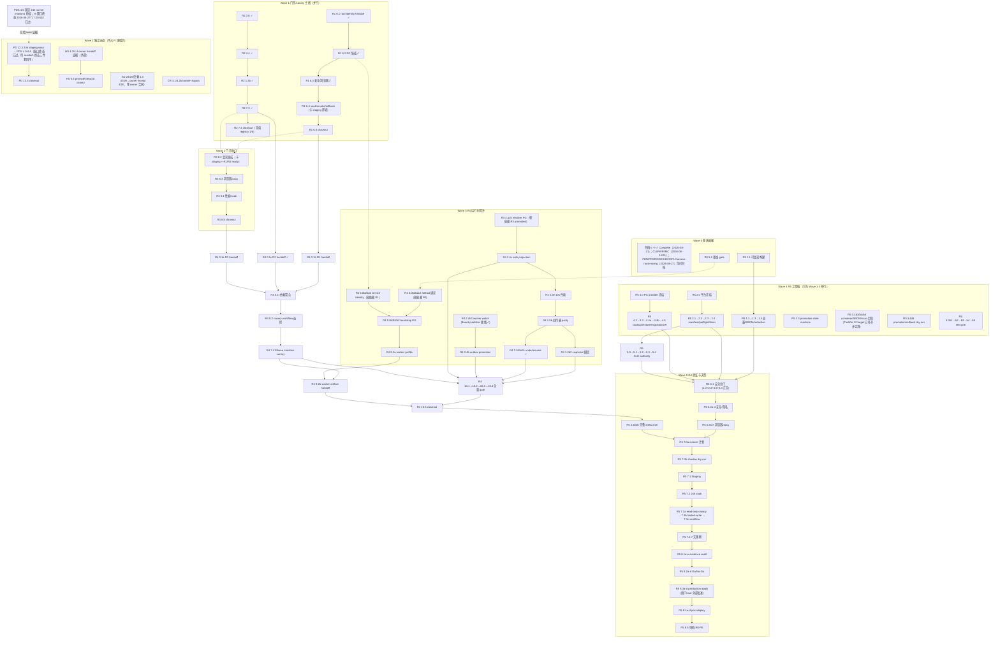

# Workbench 活跃任务推进 DAG

本文是**执行层快照**：把当前全部 active change 的剩余任务组织成可并行推进的依赖图，标出立即可执行前沿、关键路径与外部阻塞。跨 Release 交接的 canonical 合同（Provider Ready / Consumer Done、`INT-*` 交接包、Lane 写入租约、失败路由）仍以
`openspec/changes/workbench-production-ga-r5/details/cross-release-integration-delivery-dag.md` 为准，本文不重复定义，只对齐它的执行顺序。

维护方式：任务勾选后重跑 `bun scripts/execution-dag-snapshot.ts` 重新生成前沿与阻塞清单，再更新本文波次状态。

## 1. 快照（2026-08-27 第十七次刷新；2026-08-28 第十八次增量见下）

**第十八次刷新（2026-08-28）**：① AD `workbench-ai-drama-show-control-room-v1` 4.3 关闭（DSH→向导→提交链 + 投影成功链 e2e，evidence `20260828110200-6bf05ca3`）并**归档**（25/25，主 spec 已同步）；② R5 1.1 关闭——上会话 141 文件在制工作提交（`4552335`）+ `.gitignore` 补 `/data/` 后 `build:reproducibility` 首次全绿（source_dirty=false、22/22），R5 现 **24/103**；③ R3 8.2 真实栈勘察：新增 `service/test/dailyopsintegration/real_stack_test.go` + Taskfile `daily-ops-integration:real-stack:scenario`，mutation 授权结构性阻塞钉死（workbenchd `identity.NewService(profile, auth, nil)` Provider 合同 needs_contract；staging principal 钉死 compose 拓扑），与「R1 integration-ready」依赖一致，保持 pending；④ R2 7.4 复测 handoff 1/6 ready 确认。**完成路径设计已单列：`docs/operations/project-completion-dag.md`**（决策门 D1-D8、本仓解锁 W1-W4、四条收口链与两个汇合点、波次计划）。


| Key | Change | 状态 | 剩余 | 首要阻塞 |
| --- | --- | --- | --- | --- |
| R0 | `workbench-production-foundation-r0` | 15/16 | 5.2 基线 gate | 无（可立即执行） |
| R1 | `workbench-identity-tenant-access-r1-gates` | 3/5 | 6.4（staging 外部）→6.5 | 6.4 需 staging 环境（24h soak/JWKS 轮转/rollback drill；`identity:soak`/`release:rollback:dry-run` 目标亦未建），R1 本地段全部完成 |
| R2 | `workbench-owner-backend-integrations` | 33/34 | 7.4 | CLI handoff 已登记 `INT-R2-01`，全局 registry 为 1/6 ready，剩余 release 不得由 R2 代签 |
| R3 | `workbench-daily-operations-r3-gates` | 0/4 | 8.2→8.3→8.4→8.5 全链 | 8.2 需 R1/R2 integration-ready + staging 环境 |
| R4 | `workbench-spatial-workflow-automation-r4` | 98/118 | 20 | Board publisher 接线已完成（`cmd/workbench-worker --enable-board-publisher`，in-process broker sink + outbox role 约束 fail-closed，PG 矩阵 PASS，见 `details/r4-frontier-report.md` 追加节）；0.1b/e 仍等 R1/R3 closeout，跨进程 sink 拓扑与进程级 crash/reclaim 证据等 root 决策，另有 managed worker（2.4b2/b、5.0b2b2*）与 2.4c5/7.4 外部链 |
| R5 | `workbench-production-ga-r5` | 23/103 顶层（含嵌套 51/278） | 顶层 80 / 含嵌套 227 | 开放集中度 Lane C 78 / Lane F 53 / Lane G 31（占全部开放 71%）；切片治理方案见 `openspec/changes/workbench-production-ga-r5/details/r5-open-slice-governance-plan.md`，八份切片报告齐备：`details/r5-slice-{c1,c2,c3,c4,c5,f1,f2,f6}-report.md`；stable v3 manifest schema 已落地（解锁 C-1/C-2 正路径），本地可实现面已基本榨干，剩余全部外部依赖；GA 链等 R4 closeout |
| PD | `workbench-project-data-workspaces-v1` | 60/62 | 12.3→13.3 | 12.3 待 staging 24h soak 证据：r5 已作废（终态握手 2026-08-27T17:20:50Z+30min 错过 + 冻结后源码树变动），2026-08-28 用户授权重开 r6（完整 24h、新 worker/rotation ID），操作包 `details/master1-soak-restart-operator-pack.md` 与 kiki-infra playbook 套件已备好（本地分支待推送 + master1 执行通道待确认），由 PDS 4.5/4.6 回填后才能勾选；13.3 依赖 12.3 |
| HS | `workbench-harness-studio-v1` | 19/22 | 4.3、4.4、5.5 | 4.4 待 Identity/Harness/DSH/Eikona/Scaena/Anatomia/MCP/Ordo owner 侧 handoff 证据（外部）；5.5 需真实 BFF/owner 合同证据 |
| AD | `workbench-ai-drama-show-control-room-v1` | 24/25 | 4.3 | Create Show proposal/review Operation、projection query、六面板、Playwright e2e（9 测试三断点 + a11y + 跨入口恢复）全交付；仅剩 4.3（DSH→Workbench→owner receipt E2E，等 owner 合同） |
| PDS | `workbench-project-data-staging-soak-v1` | 30/32 | 4.5、4.6 | 4.5 固定 24h runner + 短寿命 principal refresh 执行：r5 作废（终态握手错过 + 源码树变动），r6 重开已获用户授权（2026-08-28），操作包与 Ansible 套件就绪，待推送与 master1 执行通道；4.6 证据六件套 + 回填 PD 12.3/13.3 |
| CR | `workbench-client-runtime-promotion-gates` | 0/3 | 3.1、4.2b、4.4b | 4.2b 需 Aigora 5.3（外部）；非首租户主链 |

快照脚本 `scripts/execution-dag-snapshot.ts` 的 `CHANGE_KEYS` 已收录 AD/PDN/PDS/SGE/HBC/DPL，全部被跟踪 change 的计数回归自动口径；PDN/PDSR/SGE/HBC/DPL/harness-route-wiring 已归档，不再出现在脚本输出中。

6 个 ✓ Complete change 已于 2026-08-21 归档（commit `c63af8f`，strict 33/33）；CLI/PA/PI/MC 四个 change 已于 2026-08-24/25 归档；PDN/PDSR/SGE/HBC/DPL/harness-route-wiring 六个 change 已于 2026-08-27 归档（见下方第十六、十七次刷新记录）。

**基线健康（2026-08-22 深度 review）**：曾有两类红基线，均已修复——
1. go1.26 `t.TempDir()` 改为 `0777&~umask`（umask 022 → 0755），击穿 `security.EnsurePrivateParent` 的 0700 不变量，86 个测试跨 6 包失败；修复 = 各包 `privateTempDir` 助手（commit `77b291d`，evidence `20260822022442`）。另有 `backend-server/client-runtime` 子模块未初始化 + 上游 `403c070` 把 `cmd/client-runtime` 改名 `cmd/yeisme-runtime`，runtime 安全测试构建目标同步更新。
2. Web 侧 3 个过期断言（OperationTable 响应式双渲染后 `getByText` 命中两份；studio 预览 aria 已是 zh-CN），commit `9a88a1b`。

当前门禁状态：`go test ./...` 150/151 包绿（唯一红在并行会话在途文件 `missionbrief_migration_test.go`，已树内修好待其提交）；vitest 987/987、server 141/0、task-sdk 361/361、typecheck ✓。注意：裸 `bun test`（根目录）会误入 `apps/web/src` 下共置组件测试且无 DOM——Web 单测一律走 `task web:test`（vitest），`bunfig.toml` 的 ignore 列表只覆盖 `apps/web/test/**`。

**三线推进（2026-08-22 晚）**：① R1 0.1 关闭——根 change 2.1/2.2 交付 `backend-server/identity-platform`（本地子模块 develop `198d580` + 根登记 `d971f123`，`internal/contract` fail-closed 合同库 + strict-valid change）；验证三连全过；消费侧 PG 双门禁证据 `20260822035258`/`20260822035422`（两任务须各用 disposable 库）。② R2 3.6 关闭——offline/tombstone 真实进程矩阵 `20260822034320` + 消费侧 archived 投影修复（`e50d44c`）。③ R4 5.0b2b2c2b worker wiring 落地（`201aeeb`）——`ReleaseManifestPath` 启动零 claim 校验，evidence `20260822033711`。回归 `go test ./...` **153/153 全绿**（missionbrief 修复在树内生效）。

**R1 6.2 关闭（2026-08-22 第四次刷新）**：provider 侧 identity-platform 从合同骨架推进到 17/17 全勾（`4f9246d` JWT PrincipalContext + tenant-scoped membership commands）——三处消费端合同漂移修正（compact JWT 化、`actor_type` human/service、`scope` JSON 数组）。全链（Kratos v26.2.0 two-step login→exchange→tenant select→delegation→membership commands→revoke/replay 404）evidence `20260822102119`；消费端 `identity.Validator` 用真实 JWT+JWKS 加密验证 evidence `20260822102347`（commit `f720ce6`）；合同 canary `20260822085940`。诚实边界：key rotation/outage 演练归 6.4 staging；unknown_accept 归 R2 receipt 域；Google/Lark 生产 OAuth 凭据未开通（Kratos native password 流承载测试身份）。R1 前沿 = 6.3（`task test:identity-security && task test:identity-e2e`，本地可执行）。

**R1 6.3 关闭（同日第五次刷新）**：双 gate 绿——security（四包 `-race` + BFF CSRF/redaction + typecheck）`20260822102723`、e2e（server-authoritative switch/cross-tenant 任务落点/Axe critical=0/mobile degraded 救援态）`20260822103215`。前置修复：identity-team e2e spec 8 处过期英文断言对齐 zh-CN 实际文案（与 9a88a1b 同因；provider 透传诊断文本保持英文属合同行为）。R1 本地链 0.1/6.2/6.3 全关，**6.4 为 staging 外部门控**（24h soak/JWKS 轮转演练/rollback；Taskfile 的 `identity:soak`/`release:rollback:dry-run` 目标未建，属 staging operator 面），6.5 closeout 等其完成。

**R2 4.4 关闭（同日第七次刷新）**：生产 registry JWT canary `temp/integration-test-runs/20260822170843-ac4f4cef-b2ad-4f06-83ea-9373fa506092/` passed。`TestProductionRegistryDelegatedMutationCanary` 经 `newRegistryWithLocale` 提升 `eikona.generation.submit` / `review.decide` / `handoff.prepare` 为 `ModeOwner`，Identity HTTP exchange + Eikona JWKS 换发，submit `status=succeeded` receipt `own_c8ca15938f6afe2fd59ba393`。浏览器/无效 JWT 不建 receipt；review cancel fail-closed。catalog capability 保持 `needs_contract`/`offline`，未晋级 `available`；Kratos 登录链未接入 mint helper。R2 前沿 = `1.3b` 四面 live conformance。PA 8.1 现可独立关闭 selector validate。


**归档记录（2026-08-23）**：`workbench-agent-pane-direct-interfaces` 已归档（archive/2026-08-23-workbench-agent-pane-direct-interfaces，主 spec `workbench-agent-pane-interfaces` 落位，8 requirements）。其交付面：/agent 壳 8 个直连 pane kind（workItems/projectWorkspace 经 Phase 2 `workitemshttp` 传输投影真实可用；identity/workflows 可用；gateway offline 诚实；assets/dailyOps/cli needs_contract）、workspace 分组、两层可用性门控（TRANSPORT_READY 静态表 + readiness 探测）、Project 预切片三视图。后续翻转点：dailyOps/assets 传输（需 approval-decide 服务层）、Gateway Pane 的 server-declared availability 接线、cli-pane-v1 合同 lane。

**MC 8.3 关闭（2026-08-23）**：Gateway owner 的归档 change `2026-08-12-gateway-workbench-console-contract` 已记录真实 checked-in Workbench adapter → built Gateway binary 的本地 loopback consumer canary；协商 owner digest 后执行 `gateway.runtime.reload`，返回安全 receipt `receipt:8ab77a0bebfa16d2`。Workbench release 文档已绑定 durable owner evidence refs、capability flag、loopback trust boundary 与 rollback；MC 现 22/22、可归档，但不提升为 remote/staging/production ready。

**R2 1.3b / 7.3 关闭，7.4 结构化推进（2026-08-23 第九次刷新）**：真实 Eikona read/mutation 与四面 consumer evidence 已关闭 1.3b；最终聚合门禁 evidence `temp/integration-test-runs/20260823120024-8b0f3889-64bb-4a1e-b8b6-73e40b6ceee2/` 在 858.9s 内通过 strict OpenSpec 36/36、buf、CGO0、全 race、typecheck、Bun、build、contract、integration、Web E2E，关闭 7.3。release CLI 已创建 integration handoff registry revision 5，并为 `INT-R2-01` 记录四项带 digest 的 gate，验证结果为结构有效的 **1/6 ready**；7.4 继续 pending，因为 R0/R1/R3/R4/R5 包尚未就绪，且 R2 不得代签其他 release。Scaena/Auctra/Pinax/Sonora 继续 disabled/needs_contract。

**R4 0.1c 关闭（同日第十次刷新）**：R4 接收 `workbench.owner.v1alpha1` 正式合同、Eikona pinned schema/SDK digest、真实 mutation receipt/reconcile/cancel/no-duplicate evidence与 `INT-R2-01` 四门；关闭前 component 重跑 evidence `temp/integration-test-runs/20260823122520-73fa0f3d-f0d1-4b74-b1c0-d9adda4c4e0c/` passed（97.739s、redaction 0）。R2 7.4 的全局 1/6 状态与其他 Owner 的 disabled/needs_contract 边界保持不变。

**R4 2.2d3e2c 关闭（同日）**：内部依赖 1.5b 已满足；undo transport evidence `20260823122903-54653f50-e4f4-407e-957f-a10ef53c8b28`、共享 contract evidence `20260823123006-4c5e29ca-bab5-4839-a9de-6bece4dfb705` 均 passed/redaction 0，Studio resume 19/19。a11y/keyboard/mobile/restore 复用本日独立全绿 Web E2E `20260823114434-0ab4531e-71fe-4e7b-a8cd-49c3c398f460`（96 passed）。

**PI 8.2–8.4 关闭（同日第十一次刷新）**：`workbenchd` 新增 default-off `WORKBENCH_AGENT_FOLLOW_PI_COHORT`，只有同一精确 principal 同时进入 read-only、presentation-suggestions 与 Follow Pi cohort 才投影 `followPi=enabled`；tool/proposal mutation capability 不提升。首批自动跟随只允许 `open_pane/show_evidence`，`focus_safe_ref` 保持 suggest-only。component evidence `20260823124343-861f3b6c-874b-4a95-8938-b0f323fecdfa` 通过 CGO0/race、六包 transport/repository、SDK、108 Web tests 与 typecheck；Chromium evidence `20260823124857-f3452caf-2ed9-4f5d-9fa8-068884063eab` 9/9，通过 directory resume、responsive rollback、reduced motion、focus containment 与 Axe serious/critical 0。PI 现仅剩 7.4，继续等待 PA/真实 approved adapter；不宣称 Owner/Provider、staging、deployment 或 production ready。

**PA 8.2 关闭（同日第十二次刷新）**：修复 `orbit.proposal.accept` 此前无法真正委托 Eikona 的 operation/project-mode/version/lifecycle 缺口；只有 PA flag 与 Eikona Identity HTTP exchange/JWKS contract 同时完整时，sealed proxy 才晋级 persisted-safe `ModeOwner`，permission/cost/idempotency/expected-version gate 与唯一 Task 状态机仍在 Workbench。component evidence `20260823132113-5be6fb3a-207b-43d1-8cb3-9ebfb0547bd7` 通过 CGO0/race/vet；真实 loopback evidence `20260823131904-3d53d0cf-3c5d-44dc-8f03-5eccaa17c7d3` 经当前 Identity signing key、HTTP delegation exchange、JWKS 与 Eikona disposable `proj_canary` 返回 `status=succeeded`、safe receipt `own_c8ca15938f6afe2fd59ba393`，单一 canonical Task、redaction 0。flag/contract 任一缺失仍 fail closed。PA 前沿为 8.3 浏览器三 viewport/a11y/reconnect journey；PI 7.4 继续等待 PA closeout，不能仅引用 8.2 提前勾选。

**PA 8.3 关闭（同日第十三次刷新）**：SDK workspace normalizer 与 Web 决策消费链现保留 server-authored `proposalDecision`，所有 accept/reject/request-changes/reconcile 控件由 capability projection + canonical proposal status/revision 双门控，exact tool descriptor join 才允许从 `needs_contract` 晋级，closed/unknown/query error reload 后 fail closed。component evidence `20260823140356-6e8d6b0e-93e5-4016-a812-662f6a7bff4e` 通过 91 Web + 7 SDK tests、typecheck/i18n；Chromium evidence `20260823140507-d4276cb4-86f1-4731-a5d8-697bd0d5598d` 5/5 覆盖 desktop/tablet/mobile、200%-effective zoom、keyboard/focus/reduced-motion/Axe/no overflow、single-flight、stale reload/recompare、unknown 原 attempt reconcile、permission/offline/rollback，4 张 screenshot digest 写入 receipt、redaction 0。PA 前沿为 8.4 server cohort 与 process restart rollback；PI 7.4 继续等待 PA closeout。

**PA 8.4 关闭（同日第十四次刷新）**：新增 default-empty exact principal read/decision/reconcile/tool-action 四 cohort，并在 proposal service repository claim 前强制交集；Agent capability 的 proto/schema/HTTP/gRPC/JSON-RPC/SDK parity 补齐，catalog 仅 exact Eikona selected descriptor + `ModeOwner` 可晋级。同步修复 accept/reconcile completion 曾返回空 canonical proposal、事件 revision/status 为空，以及 decision rollback 后 Web 未独立消费 reconcile capability 的缺陷。component/restart evidence `20260823143744-1530b9de-2a75-4f1b-a1ea-545c61824c72` 通过 CGO0/race、proto/SDK、92 Web tests/typecheck，SQLite close/reopen 后新 decision 在 claim 前停止、unknown 原 attempt 可收敛；重启 disposable Identity/JWKS 与 Eikona 后 real evidence `20260823143329-811e3da9-d40c-48ca-94df-fbe0dd441bd8` 返回 succeeded + safe receipt；browser rollback `20260823143909-cf4fc4df-a309-4a0b-9344-640db4f42d2f` 5/5，在 decision off/reconcile on 下只协调原 decision。redaction 全通过；临时 private-key/process 目录已删除。PA 前沿 = 8.5 root stable-diff correctness/security/evidence review，再 8.6 sync/handoff；不宣称 staging/production。

**PA 8.5–8.6 与 PI 7.4 关闭（同日第十五次刷新）**：stable diff root review 已补齐 accept 与 stale-revision 的 HTTP/gRPC/JSON-RPC parity、closed error 映射、四类 decision conflict 的统一 reload/recompare，以及浏览器 metadata-conflict journey；review report 无未解决 P0/P1/P2。最终 component/restart evidence `20260823151219-bc36bd64-521c-4a26-90c9-c23416130e5a` 通过 focused CGO0/race、三 transport、SDK 25 tests、Web 93/93 与 typecheck；browser evidence `20260823151115-d96d9e6a-3449-4ca1-ba22-2165e9b73fa0` 6/6；真实 Identity/JWKS→Eikona evidence `20260823150803-736d20d2-d3bc-4200-9417-ed46397f6259` 返回 succeeded、safe owner receipt `own_c8ca15938f6afe2fd59ba393`，并断言 canonical proposal accepted/revision/task/active decision。`workbench-agent-proposal-authority` 主规格已同步，strict OpenSpec 37/37；PA 40/40、PI 88/88，均仅声明本地/component/browser/真实 loopback 完成，不宣称 staging/production，也未在无明确请求时归档。

**第十六次刷新（2026-08-27）：归档、新 change 与 R5 切片治理**。① CLI/PA/PI/MC 四个 change 已归档（`2026-08-24-workbench-agent-cli-pane-v1`、`2026-08-25-workbench-agent-pi-workspace-v1`、`2026-08-25-workbench-agent-proposal-authority-v1`、`2026-08-25-workbench-mcp-gateway-console`），对应独立泳道移出执行 DAG；其诚实边界（不宣称 staging/production）随归档记录保留。② PD 从 3/62 推进到 **60/62**：7.x–13.2 全部关闭（真实 Owner mutation canary、50k WorkItem/64 字段容量、200 流 watch 扇出、schema 字段替换迁移引擎、automation binding/trigger 链、两阶段 create-and-place、13.1/13.2 review/sync），仅剩 12.3（staging 24h soak）→13.3（closeout）。③ 新增 4 个 change：AD 做剧控制室薄工作区（3/25）、PDN next-slice ledger（0/5）、PDS staging soak 拓扑与 24h runner（30/32，剩 4.5/4.6）、PDSR soak review remediation（6/6，可归档待用户请求）。④ R5 任务含嵌套从顶层 103 膨胀到 278（开放 227），开放集中于 Lane C 78 / Lane F 53 / Lane G 31，已新增 `details/r5-open-slice-governance-plan.md` 按 C-1…C-6 / F-1…F-6 / G-1…G-4 重新切片并给出每片出口标准。关键路径不变：R1 6.4→6.5 与 R3 8.2–8.5 仍卡 staging 环境。

**第十七次刷新（2026-08-27）：本地可实现面榨干，剩余全部外部依赖**。① 六个 change 已归档：PDN next-slice ledger（`2026-08-27-workbench-project-data-next-v1`，决策台账 5/5）、PDSR soak review remediation（`2026-08-27-workbench-project-data-staging-soak-review-remediation-v1`）、SGE/HBC/DPL 三个 2026-08-27 批次 change，以及追溯 change `2026-08-27-workbench-harness-route-wiring-v1`。② AD 从 3/25 推进到 **24/25**：Create Show proposal/review Operation、projection query、六面板与 Playwright e2e 全交付，仅剩 4.3（DSH→Workbench→owner receipt E2E，等 owner 合同）。③ Taskfile 补齐 12 个 target（`data-lifecycle:system`、`security:repository:scan`/`security:generated:scan`/`security:evidence:scan`、`supply-chain:image:plan`/`verify`/`test`、`test:board-event-watch:postgres` 等，均已实测），`service/cmd/workbench-diagnostics` 新增 `scan` 子命令。④ R5 切片报告齐备（`details/r5-slice-{c1,c2,c3,c4,c5,f1,f2,f6}-report.md` 共八份），stable v3 manifest schema 落地并解锁 C-1/C-2 正路径；本地可实现面已基本榨干，剩余开放项全部依赖外部。⑤ R4 Board publisher 接线完成（`cmd/workbench-worker --enable-board-publisher`，in-process broker sink + outbox role 约束 fail-closed，disposable PG 矩阵 PASS），`details/r4-frontier-report.md` 有追加节；跨进程 sink 拓扑保持 root 决策。⑥ 稳定窗口证据收口：多个 concurrent failed run 已重跑为 passed。⑦ PD/PDS：24h soak r5 窗口终态时间（2026-08-27T17:20:50Z）已过，但 master1 operator 终态三件套尚未回传本地，PDS 4.5/4.6 与 PD 12.3/13.3 保持 open。

## 2. 结构 DAG（change 级）



虚线 = 软依赖/证据汇合（任务未在 `Dependencies:` 字段里硬声明，但验收语义要求对方先产出真实证据）；实线 = tasks.md 声明的硬依赖。

## 3. 关键路径

**R1 门禁链 → R4 handoff gate → R4 运行时链 → R5 GA 链**（约 40+ 节点，最长）：

```
~~R1 0.1 → 6.2 → 6.3~~ → **6.4（卡 staging）** → 6.5
  → R4 0.1b → 0.1f → 0.2 → 7.4 → 9.2b → 10.1 → 10.2 → 10.3 → 10.4 → 10.5
  → R5 3.4b2b →（汇合 6.1 的四条工程链）→ 6.1 → 6.2a-d → 7.0b → 7.1 → 7.2 → 7.3a-c → 7.4
  → 8.1a-e → 8.2a-d → 8.3a-d → 8.4a-d → 8.5
```

竞争路径（长度相近，须并行推进否则互相等待）：

- **R2 链**：~~3.6 → 4.4 → 1.3b → 7.3 → R4 0.1c~~；独立的 7.4 跨 release closeout 仍 pending。`INT-R2-01` 已就绪，但全局 registry 仍为 1/6。
- **R4 内部链**：2.4c5 → 2.4c → ~~2.3e → 1.5b → 1.2d2 / 2.2d3e2c~~；本地 undo/resume 分支已全关，Board publisher 接线已落地（`details/r4-frontier-report.md` 追加节）。剩余 5.0b2b2* → 9.2a、managed worker（2.4b2/b）与 2.4c5/7.4 外部链，在 10.1 全量 gate 上游。

结论：当前跨 release 关键入口仍是 **R1 6.4→6.5**（卡 staging：24h soak/JWKS 轮转/rollback drill，对应 Taskfile 目标未建）与 **R3 8.2→8.5**（卡 staging 环境 + R1/R2 integration-ready）；R2/Eikona 已被 R4 接收，仅剩 7.4 等全局 registry。并行近端：**PD 12.3** 待 PDS 4.5/4.6 回填 soak 证据——r5 窗口终态时间（2026-08-27T17:20:50Z）已过，master1 operator 终态三件套未回传本地；**HS 4.3/4.4** 待各 owner handoff 证据；**AD 4.3** 待 owner 合同。**本地可实现面已穷尽**——R5 八份切片报告齐备、stable v3 manifest 落地、Taskfile 12 target 补齐实测后，剩余开放项全部挂在 §6 的外部依赖上，无 staging 环境与 owner 回传期间无可推进的本地正路径。

## 4. 执行波次

| Wave | 内容 | 前置 | 备注 |
| --- | --- | --- | --- |
| 0 | 归档 6 个 ✓ Complete（2026-08-21 已执行）；CLI/PA/PI/MC（2026-08-24/25 已归档）；PDN/PDSR/SGE/HBC/DPL/harness-route-wiring（2026-08-27 已归档）；R0 5.2；R5 1.1 | 无 | — |
| 1a | R1 6.4→6.5 | staging 环境（外部） | 0.1/6.2/6.3 已关闭；关键路径第一段 |
| 1b | R2 7.4 | 全局 handoff registry 其余 release 包 | `INT-R2-01` 已记录为 1/6 ready；R2 不得代签 |
| 1c | R4 内部：2.4b2/b、2.4c5/c→2.3e→1.5b→1.2d2/2.2d3e2c、5.0b2b2c2/d/e→b2→9.2a | 软依赖 R0 5.2、R1 6.2 | Board publisher 接线已完成；跨进程 sink 拓扑等 root 决策；与 1a/1b 并行 |
| 1d | R5 工程链：Lane A 1.1-1.4、Lane B 2.0-2.4、Lane C 切片 C-1…C-6、Lane D 4.0-4.5、Lane E 5.x、Lane F 切片 F-1/F-2/F-6（不依赖 6.1 汇合门） | 各自链内 | 切片与出口标准见 `r5-open-slice-governance-plan.md`，八份切片报告齐备（`r5-slice-{c1,c2,c3,c4,c5,f1,f2,f6}-report.md`），stable v3 manifest 已解锁 C-1/C-2 正路径；租约见 §5 |
| 1e | 独立泳道：PD 12.3（经 PDS 4.5/4.6）、HS 4.3/4.4/5.5、AD 4.3、CR 3.1/4.2b | 全部为外部 owner/staging/master1 依赖 | PDN 已归档；AD 仅剩 4.3（等 owner 合同） |
| 2 | R3 8.2→8.5；R4 0.1b/e→0.1f→0.2 | Wave 1a 完成 + staging 环境；R2 0.1c 已接收 | 剩余 Identity/Daily 双向 handoff 汇合 |
| 3 | R4 7.4→9.2a/b→9.3→10.1→10.2→10.3→10.4→10.5 | Wave 2 + 1c | R4 closeout |
| 4 | R5 3.4b2b（C-2）；6.1 汇合门（F-3）；6.2/6.3 链（F-4/F-5） | R4 10.5 + R5 工程链 | — |
| 5 | R5 7.0a→…→7.4（G-1…G-4 严格串行）→8.1-8.5 | Wave 4 | 8.3b 需用户/root 外部批准 |

## 5. 执行规则

- **写入租约**沿用 canonical DAG §5：`api/proto|api/schema`（Contract）、`service/internal/<domain>`（Backend）、`packages/task-sdk`（SDK/BFF）、`apps/web/src`（Web）、`deploy|release CLI|Taskfile`（Release）各自单 writer；R 线（R1/R2/R3/R4 closeout gate）同一时间只推进一条，独立泳道（PD/HS/AD/PDS/CR）不占 R 线租约。
- **证据纪律**：每个 gate 任务产出脱敏六件套（`temp/integration-test-runs/<run-id>/`）；fixture 不替代 provider 真实 process；capability 晋级以 CLI/服务生成状态为准，Markdown/任务勾选不直接晋级。
- **外部阻塞升级**：§6 清单中的节点若 owner 侧 48h 无响应，在对应 change 记录 exact missing evidence 并保持 pending，不绕过。
- **每完成一个 Wave**：重跑 `bun scripts/execution-dag-snapshot.ts`，更新 §1 快照与 §4 波次状态；R5 切片进度同步核对 `r5-open-slice-governance-plan.md` 的开放集中度。

## 6. 外部依赖清单（按阻塞方/解锁条件组织）

**统一主题：本地可实现面已穷尽。** R5 八份切片报告齐备、stable v3 manifest schema 落地、Taskfile 12 个 target 补齐并实测、R4 Board publisher 接线完成后，全部剩余开放项都挂在外部依赖上；本地无可推进的正路径，只能等下列阻塞方回传。

| 阻塞方 | 解锁条件 | 受影响节点 |
| --- | --- | --- |
| staging 环境 / staging operator + operations | 提供 staging 环境并执行 24h soak、JWKS 轮转/revoke 与 rollback drill（`identity:soak`/`release:rollback:dry-run` 目标未建）；R3 另需 R1/R2 integration-ready（R1 6.5 closeout 未出） | R1 6.4→6.5；R3 8.2→8.5 |
| master1 operator（终态证据） | r5 24h soak 窗口终态时间（2026-08-27T17:20:50Z）已过；回传终态三件套 + 短寿命 principal refresh 记录，PDS 4.6 收集六件套并独立校验 staging receipt 后回填 | PDS 4.5/4.6 → PD 12.3→13.3 |
| owner 合同 / 签收 | DSH owner receipt 合同（AD 4.3 的 E2E 前提）；Identity/Harness/DSH/Eikona/Scaena/Anatomia/MCP/Ordo owner 侧环境与 handoff 证据；真实 BFF/owner 合同证据 | AD 4.3；HS 4.3/4.4/5.5 |
| 各 release owner + release integrator | canonical release handoff registry 补齐 R0/R1/R3/R4/R5 包与 per-owner disabled 子状态（当前 1/6 ready，`INT-R2-01` 已登记） | R2 7.4 |
| R1 provider / Identity 平台 owner | WP-I10 provider process、managed TLS/service mesh、issuer/JWKS/delegation authority；approved communication bridge | R5 6.3d1b1b1；R5 3.4d2b2b3b2；R4 5.0b2b2d 链 |
| container daemon / registry / KMS owner | deployment/registry/KMS owner 可用，承载 container/SBOM/scan 目标的远端执行面（本地 Taskfile target 已就位并实测） | R5 3.4b4b2a；R5 1.1→1.4 容器链远端段 |
| approved scanner / 安全审批 | selector 独立批准、managed PG restore 权威、review approvers、SLO/soak authority、approved scanner 接入 | R5 C-5 / F-6；R5 3.4d2b2b5b2（WP-SV3-A-H） |
| R1/R2 handoff 汇合 | R1/R2 Provider Ready/Consumer Done 交接完成 | R5 6.0a1d/d1；R5 7.0a1 |
| aigora owner（非首租户主链） | Aigora 5.3 安全复核 + shared broker 合同稳定 + owner adapters | CR 4.2b/4.4b；CR 3.1 |
| 用户 / root | production deployment 明确批准；R4 跨进程 sink 拓扑 root 决策 | R5 8.3b；R4 2.4b2 后续（进程级 crash/reclaim 证据） |
