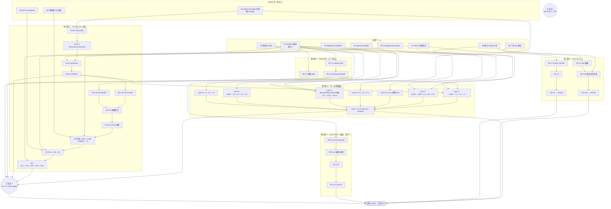

# Workbench 项目完成 DAG（Completion DAG）

> **当前决策包指针（2026-09-02，superseding note）**：生产候选仍为 **NO-GO**。D1–D4 的当前只读审计与签收字段以 [`workbench-production-decision-pack.md`](workbench-production-decision-pack.md) 为准；本文下方保留的 2026-08-28 D1–D8 历史 DAG 仅作历史记录，若状态或边界不一致，以当前决策包为准，不得据此宣称任何外部 gate 已完成。

本文回答一个问题：**从当前状态到全部 change 归档（项目 GA），依赖图长什么样，按什么顺序推进。**

与 `docs/operations/active-execution-dag.md` 的分工：那篇是**执行层快照**（随任务勾选刷新波次状态）；本文是**完成路径设计**（决策门、并行轨、关键路径与责任归属），只在依赖结构变化时更新。任务级 canonical 合同仍以 `openspec/changes/workbench-production-ga-r5/details/cross-release-integration-delivery-dag.md` 与各 change tasks.md 的 `Dependencies:` 为准。

快照基线：2026-08-28（第十八次刷新口径）。剩余 11 个 active change、共 125 个顶层任务（新增 `workbench-identity-provider-contract-v1` 5/8）；其中 R5 占 79 项（含嵌套 227 项中占大头），是绝对长杆。

**2026-08-28 晚间增量**：W1 slice 1 已交付（消费端合同+实现+default-off 接线，commits `7592c15`）——W1 剩余 = slice 2（identity-platform owner 跨仓端点）+ slice 3（真实栈转绿）；W5 三执行器已交付（`405e846`）+ 阻断面扩展到 board/asset/search（`0a16e48`）+ 写阻断与全部类目归属查询面/asset 类目登记（`1acb3d1`）——6.0b2 本地实现面已尽，勾选等 D1 staging evidence；W4 部分交付（Taskfile 5 targets + runbook，`469af16`）；**W2 已完成并关闭 R4 2.4b2/2.4b**（`f415cc2`，跨进程 sink + 五项进程级测试 + reconcile receipt，双 evidence run passed）——R4 剩余 18 项。

## 0. 一句话结论

**项目完成 = 8 个外部决策门 + 2 类本仓解锁（设计缺口 W1 + 执行器/决策面 W2-W5）+ 4 条可并行收口链 + 2 个汇合点。** 当前没有任何"缺实现"的本地任务——本地可实现面已榨干（八份 R5 切片报告 + 2026-08-28 R3 8.2 真实栈勘察一致确认）；剩余全部阻塞在：master1 执行通道、三个 R5 平台决策、独立 reviewer、owner 合同、以及 identity Provider 合同这一处真正的本仓设计缺口。

## 1. 决策门（D 系：人做决定，不是写代码）

| 门 | 内容 | 责任 | 解锁什么 | 状态 |
| --- | --- | --- | --- | --- |
| **D1** | kiki-infra `feat/workbench-staging-soak` 推送确认 + master1 SSH 执行通道 | **用户**（本机无凭证，两组 SSH 身份均被拒） | PDS 4.5/4.6、R1 6.4/6.5、R0 5.2、R3 8.3-8.5、R4 10.4、R5 Lane E/G | 操作包 `openspec/changes/workbench-project-data-staging-soak-v1/details/master1-soak-restart-operator-pack.md` 已备好，r6 已授权 |
| **D2** | deployment platform 决策包（R5 2.0b2a：provider/repository/versioned API/signer/rollback） | root/operations + platform/security owners | R5 2.0b2b2*→2.0→2.2→2.3→2.4、3.3b、3.4c | 决策建议单已写（`details/`），待签收 |
| **D3** | approved builder provider（R5 3.4b4b2a：两个隔离 instance、runner digest、registry、Ed25519 signer、managed trust） | root/operations + CI/platform + security + registry | R5 BUILDER 全链（3.4b4b2→b4b4→b4c→b4→b2b） | GitHub Actions+独立 repo+digest registry 建议单待批 |
| **D4** | managed PostgreSQL provider（R5 4.0：HA/TLS/backup/PITR/retention/RPO-RTO/failure owner） | operations/database owner | R5 Lane D（4.1-4.5）与 3.4d2b2b2b restore authority | 未启动 |
| **D5** | 独立 reviewer 池（security/privacy/ui/operations/test） | root | R5 F-3(6.1)/F-4(6.2)/F-5(6.3e)、CR 4.2b、R4 10.5 与各 closeout 的 review 门 | 未分配 |
| **D6** | broker（client-runtime）/Aigora/credentialctl **tag 发布** | 各 sibling 仓 owner | CR 3.1 →（4.2b 还需 D5+Aigora 5.3）→ 4.4b | 三仓均 dirty/dev 版本在途 |
| **D7** | owner 合同签约批次（Scaena、Auctra、Pinax、Sonora、Ordo、Anatomia、DSH、Harness Control Plane） | 各 owner | HS 4.3/4.4/5.5、R2 7.4 的 P0 面、R4 2.4c5/7.4、AD 后续 owner receipt e2e | Eikona 已 Provider Ready；其余 needs_contract |
| **D8** | 可用容器 runtime（本地沙箱内核禁 runc/无 registry；须 approved builder 环境或解封宿主） | 环境提供方（与 D3 可同一环境） | R5 1.2/1.3/1.4、3.4b3c、R4 9.2a 容器部分 | 本机 dockerd 可起但 `unshare: operation not permitted` |

## 2. 本仓设计解锁（W 系：唯一值得立即开工的代码工作）

| 项 | 内容 | 解锁什么 | 依据 |
| --- | --- | --- | --- |
| **W1** | **identity Provider 合同**：workbench 侧 HTTP Provider 实现（`identity.Provider` 五方法）+ identity-platform 侧 AllowedActions/角色映射端点 + `runtime.go:796` 从 `NewService(profile, auth, nil)` 接到真实 provider。需新 OpenSpec change（消费端授权合同是 R1 未完成设计面，勿塞进 R3/R4） | R3 8.2 全链真实栈转绿；R4 0.1b 的消费面证据；R5 3.4d2b2b3b2 与 7.0a1 的 R1 依赖分量；为 R1 6.5 closeout 提供消费端 handoff | 2026-08-28 勘察：workbench 侧零 Provider 实现，identity-platform API 也无 AllowedActions 端点；staging 替代路径（identity-staging-principal）钉死 compose 拓扑，见 `MEMORY.md` 与 daily-ops 8.2 任务注记 |
| **W2** | R4 2.4b2 跨进程 Board publisher sink 拓扑 root 决策（in-process broker → 跨进程投递面）+ 进程级 crash/reclaim 证据 | R4 2.4b2 → 2.4b | `details/r4-frontier-report.md` 勘察结论：保持 root 决策，不伪造跨进程投递 |
| **W3** | R5 C-1/C-5 剩余消费接线（真实 v3 candidate 生成、stage authority resolver 消费 D2/D3 产物）——**前置是 D2/D3**，代码框架已就位 | R5 3.3a2→3.3、3.4d2b2b5b* | c1/c5 切片报告：实现完成，正路径在 manifest 门 fail-closed 等外部 authority |
| **W4** | R4 9.3 Taskfile/evidence/runbooks 扩展（不含 9.2a 容器 smoke 的部分可先行） | R4 9.3（容器部分挂 D8） | tasks.md 依赖链 |
| **W5** | **lifecycle 执行器接线**（R5 6.0b1-b3 的 repository/service 执行点）：① 行级导出执行器（按 data class export_policy 从真实 store 导出并写入 f2 交付的 export plan/manifest 合同）；② delete/tombstone 读取阻断执行点（查询层消费 DeletionRecord 权威标记）；③ 派生投影重建 purge 执行器 | R5 6.0b1-b3 实现面闭环——勾选仍等 `data-lifecycle:system ENV=staging`（D1），但执行器就绪后 staging 排窗即可跑 | `details/r5-slice-f2-report.md` §6 建议 2：合同层（plan/record/manifest/reconcile CLI）已交付，执行点在本片租约外 |

## 3. 完成路径 DAG

（图中边为"解锁/依赖"方向；同一收口链内部串行，链间完全并行。R5 各 Lane 内部子链以切片治理方案 §3-§5 为准。）

## 4. 关键路径

**最长链在 R5 Lane C**（决策最深、串行子链最长）：

> D3（builder provider 决策）→ BUILDER P1-P5（3.4b4b2 链）→ joint + rotation/revoke 演练（3.4b4b4）→ image inventory/SBOM（3.4b4c 链）→ 3.4b4 → artifact set + approved builder（3.4b2b，另需 R4 9.2b/10.5）→ authorized container plan（3.4b3b2b，另需 D2 的 3.3a2 侧）→ stable v3 聚合（3.4d2b2b5b 链，另需 D4 restore authority + D5 review authority + D7 handoff authority）→ promotion 状态机正路径（3.3a2/3.3）→ C-6 操作面（3.4c-3.4e，另需 D1 staging soak）→ Lane G（7.x，另需 R1 6.5 + R3 8.5）→ Lane V（8.x Go/No-Go）

次长链：**D1 → R1 6.4（24h soak）→ 6.5 → R4 0.1b → …→ R4 10.5** 与 **W1 → R3 8.2 → 8.3 → 8.4（24h soak，需 D1）→ 8.5**——这两条同时是 R5 Lane G 的前置，因此 **D1 和 W1 是全局最早的两个应做动作**：D1 不花钱只等通道，W1 是唯一能立刻开工的代码工作。

## 5. 推荐波次（Wave 计划）

| 波 | 时窗 | 动作 | 出口判据 |
| --- | --- | --- | --- |
| **Wv0（立即，本地）** | 本周 | ① W1 identity Provider 新 change（PRD/owner fit/合同+实现+真实栈测试复用 `real_stack_test.go` 转绿）；② W2 拓扑决策记录；③ W4 R4 9.3 可先行部分；④ R4 10.1 全量本地 gate 复跑留档 | W1 change 进入实现；R3 8.2 的 gate 在 loopback 真实栈转绿 |
| **Wv1（等 D1）** | D1 后 1-3 天 | PDS 4.5 r6 24h soak → 4.6 → PD 12.3/13.3 归档（**最快消灭 2 个 change**）；R1 6.4 soak 并行排窗 | PD/PDS 归档；identity soak evidence 六件套 |
| **Wv2（等 D2/D3/D4 决策）** | 决策后 1-2 周 | R5 Lane B/D 真实 adapter 实现；BUILDER/SC 链在 approved builder 上执行；Lane A 随 D8 | 2.0/2.2-2.4、4.0-4.5、3.4b4* 证据齐 |
| **Wv3（R3/R4 收口）** | W1+D1 后 | R3 8.2→8.5；R4 尾链 9.x→10.x；HS/CR 随 D6/D7/D5 推进 | R3/R4 closeout；HS/CR 归档 |
| **Wv4（汇合）** | R4 10.5 + R5 各 lane 后 | R5 C-6 → Lane G staging 24h + rollback drill → Lane V Go/No-Go → R2 7.4 六包齐 → 全部归档 | `release:handoff:validate` 6/6 ready；openspec list 清空 active |
| **Wv5（GA 后）** | — | 主 spec 全量同步复核；R5 8.x closeout 文档；运营 runbook 交接 | 项目 GA |

## 6. 诚实的边界

- **"没有本地可做的事"指的是 tasks.md 勾选面**：每个开放任务都已被切片报告或本会话实测钉死在外部依赖上；伪造关闭（fixture 冒充、手写 JSON、代签 provider）被 tasks.md 的 Failure recheck 条款明确禁止。
- **W1 是例外**：它不在任何现有 change 的任务清单里，而是 R3 8.2 勘察暴露的设计缺口。做它的正确姿势是新开 change（走 `fit|split-owner` 判定：跨 Workbench/identity-platform 两仓、属消费端授权合同——fit，但 owner 路由须经 identity-platform 侧 OpenSpec）。
- **R5 的 79 项里约 30 项是"决策包+执行"**（2.0b2*、3.4b4b2*、4.0、F-1 签收），其余是执行/证据/评审——决策一旦做出，吞吐主要受 staging 排窗与 reviewer 带宽限制，不是工程难度。
- **顺序不可交换的硬点**：soak 都是墙钟 24h（压缩 TTL 不算数，PD r5 已因此作废一次）；Provider Ready 与 Consumer Done 不得互签；promotion 只认 stable v3。
