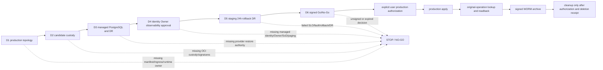

# Workbench 生产候选决策包（D1–D6）

**日期：** 2026-09-03  
**结论：** **NO-GO**。仓内 release-candidate 代码、合同、clean-module 和完整 race 门已通过；D1–D6 的外部权威、staging 现场证据、签名 Go/No-Go 与用户生产授权仍缺失。本包是只读审计和停止条件，不是部署授权，也不构成任何外部平台、Provider、Owner 或数据库事实。

## 1. 当前边界与快照

本轮本地里程碑证明本仓入口在缺少权威运行器、候选 custody 或 managed authority 时 fail-closed，并证明当前候选可由 clean module 构建、通过完整非 race/race 测试和合同验证；它仍没有证明 staging、production、Provider、Owner、Ingress、数据库恢复或告警成功。上下文快照为：

| 字段 | 值 | 解释 |
| --- | --- | --- |
| snapshot HEAD | `4bbe06e96a5465c5e80839099c0e704703f3e4f1` | 审计起点；不是发布签名 |
| candidate tracked fingerprint | `sha256:111ef97cd6a5f8b5a79d5a41b9f557516805ccaf24362161996a53e1407e5a44` | 排除并发 UI/OPC 三个 tracked 文档 lane；不得替代 source/OCI/manifest 签名 digest |
| candidate untracked artifact fingerprint | `sha256:c0e6b4261f548cb7fef168b123471b10840c7d280579f60d016388f34bef20e8` | 覆盖 CI、delivery、modular CI、D1 intake contract/实现与 race-tag 候选文件；有意排除本决策包自身、并发 Agent UI/OPC 和 `repository.test`，避免自引用 |
| production decision | `NO-GO` | 外部权威、签名证据与用户授权均缺失 |
| local RC result | passed, external evidence excluded | 可证明仓内代码/合同/race/clean-module；不能证明 staging 或 production |

2026-09-03 本地里程碑（均为本地证据，不是 D1–D6 receipt）：

| Gate | Result |
| --- | --- |
| `CGO_ENABLED=0 go test ./service/... -count=1` | pass |
| `CGO_ENABLED=1 go test -race -timeout=20m ./service/... -count=1` | pass；无 race report、panic 或失败包 |
| `bun test` | 861 pass、8 条显式条件 skip、0 fail |
| `bun run test:contract` | 530 pass、0 fail |
| typecheck/build/web build/integration | pass；最新本地 integration evidence 位于 `temp/integration-test-runs/20260902174029-f6ead4bd-f4d5-4921-8e50-379a2af63cc9` |
| OpenSpec/Buf/Actions syntax | 67/67、Buf lint、actionlint 均通过 |
| independent review/security | D1 intake 第三版复审无 P0–P3；结论限定为仓内 release-candidate，不包含外部系统 |
| D1 platform intake | `workbench.platform_decision_intake.v1alpha1` 的 init/inspect/validate、custody、严格 JSON、脱敏输出与 Task shell 边界通过；完整 draft 仍固定 exit 5，不能授权 production |
| production target registry | `temp/release/production-targets-20260903-d1-intake-v2.json`，0600；32 total、8 available、3 diagnostic、14 planned、7 provider-blocked；validate 按合同 exit 5 |
| `task release:readiness ENV=production` | `evidence_readiness_blocked`，exit 5；未提升 production authority |

证据路径（均为仓内合同或本地测试，不是外部事实）：

- `/home/yeshugen/workplace/yeisme-agent/client/yeisme-workbench/scripts/staging-gate-entrypoints.ts:100-145`：入口在输入检查、spawn、evidence 前阻断 identity/release/workflow-canary。
- `/home/yeshugen/workplace/yeisme-agent/client/yeisme-workbench/Taskfile.yml:4150-4213`：三个公开入口为 provider-blocked 文案并直接调用阻断入口。
- `/home/yeshugen/workplace/yeisme-agent/client/yeisme-workbench/deploy/staging/compose.yaml:1-25,101-157,219-264`：仅 staging compose，包含隔离网络、digest image 输入、数据库和 evidence volume 边界。
- `/home/yeshugen/workplace/yeisme-agent/client/yeisme-workbench/docs/operations/project-data-staging-soak.md:1-21,291-383`：本地合同与 24h 证据要求，明确不等同 production。
- `/home/yeshugen/workplace/yeisme-agent/client/yeisme-workbench/service/cmd/workbench-release/production_targets.go:64-90`：target registry 的当前状态与 `ProductionAuthorized=false` 投影来源。
- `/home/yeshugen/workplace/yeisme-agent/client/yeisme-workbench/service/cmd/workbench-release/platform_intake.go`：D1 operator draft 的 source binding、严格 schema、私有 custody、内容寻址 registry ref 与永久非授权语义。
- `/home/yeshugen/workplace/yeisme-agent/client/yeisme-workbench/openspec/changes/workbench-production-ga-r5/details/platform-decision-intake-contract.md`：D1 intake 合同；明确不关闭 R5 `2.0b2`。
- `/home/yeshugen/workplace/yeisme-agent/client/yeisme-workbench/temp/integration-test-runs/20260902185910-c0dc7a7e-8288-42c3-b896-ba6a43d82d10`：D1 intake 本地 component evidence；仅诊断，不是平台批准或部署证据。

## 2. 决策 DAG 与停止边

Edges are dependencies, not evidence of completion. No edge may be skipped. An uncertain external write is reconciled by looking up the original operation and idempotency key; it is never replaced by a second apply.

## 3. Gate contracts

### D1 — Production topology and deployment authority

- **Owner role:** deployment-platform owner plus operations and security reviewer.
- **Required signed inputs:** immutable manifest digest; environment and region; image/worker digests; ingress/LB/TLS certificate and CA digests; network-policy digest; runtime service-identity refs; deployment API version; lookup/rollback API refs; signer identity, signature, issued-at and expiry; approved change/incident reference.
- **Current evidence:** staging-only compose at `/home/yeshugen/workplace/yeisme-agent/client/yeisme-workbench/deploy/staging/compose.yaml:1-25,101-157,219-264`; staging runbook says it is not promotion at `/home/yeshugen/workplace/yeisme-agent/client/yeisme-workbench/docs/operations/project-data-staging-soak.md:1-21`. The repository now has a private, source-bound D1 operator-draft intake contract and CLI, but it deliberately cannot choose a platform, consume approval, call a provider adapter, or set `production_authorized=true`. No production manifest, public ingress/LB/TLS, runtime owner, signed platform decision, or provider deployment receipt is present.
- **Acceptance command (read-only/planned):** actual platform owner first supplies a private source record for `task release:platform-intake:init SOURCE=<private-source> OUTPUT=<new-private-intake>`; `task release:platform-intake:validate INTAKE=<private-intake> SOURCE=<same-private-source>` must remain exit 5 until a future separately reviewed signed-approval consumer exists. Only after that authority exists may `task deploy:preflight ENV=production`, provider-owned `deployment:plan`, and `deployment:receipt:validate` run against the same immutable manifest. None of these commands are evidence until the platform supplies signed receipts.
- **Success:** manifest renders deterministically; ingress/TLS/network policy and runtime identities are provider-attested; deploy, lookup and rollback APIs return signed receipts bound to the manifest digest.
- **Stop:** any missing/expired signature, mutable tag, absent runtime owner, unbound lookup/rollback, or claim that staging compose is production.
- **Rollback/retention:** do not apply; retain the rejected plan and signed reason under the platform retention policy. If an apply was already accepted, lookup the original operation and use the provider rollback receipt.

### D2 — Candidate custody and supply chain

- **Owner role:** release engineering, approved builder, registry and security/licensing reviewers.
- **Required signed inputs:** complete source digest covering Dockerfile, `.dockerignore`, `go.work`, `go.work.sum`, all referenced modules and external runtime-plane inputs; two independent builder receipts; immutable OCI manifest/index digest; registry readback; SBOM; SLSA/in-toto provenance; signer/trust-bundle digests; vulnerability/advisory and license policy receipts; worker handoff metadata.
- **Current evidence:** `runtime-plane` is pinned to an immutable pseudo-version with `go.sum` verification, the local workspace `replace` is removed, and CI Actions are pinned to full commit SHAs. Local source and staging image variable contracts remain at `/home/yeshugen/workplace/yeisme-agent/client/yeisme-workbench/deploy/staging/compose.yaml:3,102-138`; no approved builder, registry readback, signature, attestation, advisory or license authority is recorded. A local image ID is not an OCI registry digest and cannot authorize release.
- **Acceptance command (read-only/planned):** `task release:handoff:validate COMPONENT=workbench-worker ENV=integration` and `task build:reproducibility`; execute only in the approved builder/registry environment with signed receipts.
- **Success:** both builders independently produce the same immutable OCI digest and complete provenance; registry GET/readback matches; worker handoff binds source, artifact, contract and step-registry digests.
- **Stop:** any omitted source/runtime-plane input, local-only image ID, digest mismatch, unsigned/expired attestation, unresolved advisory/license policy, or fixture substituted for builder/registry truth.
- **Rollback/retention:** quarantine candidate and preserve all receipts/manifests; never retag or overwrite the digest. Rebuild only as a new candidate after a new decision.

### D3 — Managed PostgreSQL, backup and disaster recovery

- **Owner role:** managed database provider, DBA/operations owner, and recovery reviewer.
- **Required signed inputs:** provider-owned instance/cluster ref, roles and least-privilege grants, TLS/CA digest, HA/failover mode, WAL/PITR configuration, backup schedule and retention, restore target, RPO and RTO, failure owner/on-call, restore-authority contract v2, and full application-consistency readback digest.
- **Current evidence:** local database contract and staging volume are visible at `/home/yeshugen/workplace/yeisme-agent/client/yeisme-workbench/deploy/staging/compose.yaml:6-25,101-121,252-264`; `disaster-recovery:drill` is absent from Taskfile and is registry `provider_blocked` at `/home/yeshugen/workplace/yeisme-agent/client/yeisme-workbench/service/cmd/workbench-release/production_targets.go:75`.
- **Acceptance command (read-only/planned):** `task db:backup ENV=staging DRY_RUN=1` is non-destructive; `task db:restore:verify ENV=staging` is destructive and currently provider-blocked before target inspection, runner spawn, receipt, or evidence. A provider-owned restore authority v2 and `disaster-recovery:drill ENV=staging` target are required before execution. A local logical `pg_dump`, database-name/env heuristic, caller confirmation, SQLite test, or CLI-authored `workbench.restore_verification.v1` receipt is insufficient for PITR authority; v1 remains integration evidence only.
- **Success:** provider attests HA, WAL/PITR, backup and retention; signed restore demonstrates **RPO ≤ 5m** and **RTO ≤ 30m** (or an explicitly signed alternative); all application stores reconcile and read back consistently.
- **Stop:** absent provider attestation, missing DR target, failed restore/reconcile, unknown role ownership, or unbounded retention. Keep `ProductionAuthorized=false`.
- **Rollback/retention:** preserve backup/restore receipts and legal retention; destroy only disposable restore targets after signed reconciliation and retention confirmation.

### D4 — Identity, Owner, observability and approval authority

- **Owner role:** Identity platform, Owner/provider owners, security/SRE, approval authority and incident/paging owner.
- **Required signed inputs:** workload identity registration; JWKS CA pin and keyset digest; issuer/audience/algorithm; Owner URL allowlist and contract/schema digest; idempotency and unknown-outcome reconcile contract; tenant/project/cost/approval refs; separation-of-duties reviewer identities; paging route and acknowledgement; WORM audit/readback refs; expiry and kill-switch/rollback refs.
- **Current evidence:** staging worker identity/JWKS inputs are contract-only at `/home/yeshugen/workplace/yeisme-agent/client/yeisme-workbench/deploy/staging/compose.yaml:129-157`; public canary and identity soak are blocked before caller input inspection at `/home/yeshugen/workplace/yeisme-agent/client/yeisme-workbench/scripts/staging-gate-entrypoints.ts:116-138`. No public canary success path exists until managed authority is provisioned.
- **Acceptance command (read-only/planned):** `task identity:contract:test`; provider-owned workload/JWKS readiness and Owner contract canary; `task tenant:cutover:workflow-canary ENV=canary DRY_RUN=1` remains a blocked sentinel until managed authority exists.
- **Success:** managed workload identity validates pinned JWKS; Owner allowlist/contract and idempotency are current; unknown outcomes reconcile by original operation; SoD, paging/ack, WORM and readback receipts are signed and unexpired.
- **Stop:** caller-supplied trust, fixture/loopback substituted for managed authority, missing CA pin, stale contract, missing SoD/paging/WORM, or any unknown outcome without reconciliation.
- **Rollback/retention:** disable new claims through the managed kill switch, drain in-flight work, preserve original idempotency keys and receipts, and retain audit evidence.

### D5 — Real staging 24h soak, rollback and DR

- **Owner role:** staging operations owner with independent test/security reviewer.
- **Required signed inputs:** the exact D1 manifest, D2 OCI/source/trust digests, D3 database/restore refs, D4 identity/Owner/observability refs, opaque task/scope, start/action/rollback receipts, alert delivery/ack records and expiry.
- **Acceptance command (planned external execution):** `task release:soak ENV=staging SCENARIO=project-data` followed by `task release:rollback:dry-run ENV=staging`; then provider fault/failover/DR drill and readback. Current release soak is intentionally blocked and produces no acceptance evidence.
- **Success:** the same candidate/manifest/trust digests remain bound for at least 24 wall-clock hours; latency/error/availability/error-budget, observation-gap, duplicate/unknown, open P0/P1 and `unknown_accept` SLOs pass; failover, rollback, drain, DR restore, alert escalation/ack and application consistency all pass.
- **Stop:** any digest drift, short/interrupted window, missing/duplicate receipt, failed alert/ack, unreconciled unknown, failed rollback/drain/DR, or evidence generated by a local contract runner.
- **Rollback/retention:** stop new mutations, drain, reconcile the original operation, preserve all redacted receipts and evidence; no replacement mutation.

### D6 — Signed Go/No-Go and user authorization

- **Owner role:** release owner, independent security/operations reviewer, product owner and final user authorizer.
- **Required signed inputs:** D1–D5 receipt digests, candidate/manifest/trust equality proof, expiry, residual risks, rollback/kill plan, paging/ack proof, legal-retention/WORM refs, reviewer identities and explicit decision signature.
- **Acceptance command (read-only/planned):** `task release:readiness ENV=production` is the current local command and calculates readiness only. There is no local `release:receipt:validate` target; final signed Go/No-Go validation is provider-owned/planned and must consume the D1–D5 signed receipt set. A production apply requires a separate user-authorized command and must not be inferred from readiness.
- **Success:** all gates are current, signed, mutually bound and unexpired; Go decision has SoD signatures; user explicitly authorizes production apply; original-operation lookup is available.
- **Stop:** unsigned/expired decision, any unresolved external blocker, digest mismatch, or absent explicit user authorization.
- **Rollback/retention:** keep candidate outside production; if authorized apply returns unknown, look up the original operation and retain the full decision/receipt chain.

## 4. D5/D6 acceptance matrix

| Check | Required invariant | Stop edge |
| --- | --- | --- |
| Candidate identity | identical source/OCI/manifest/trust digests from D2 through D5/D6 | any digest drift |
| 24h soak | complete wall-clock window and all SLO samples | gap, duplicate, unknown, P0/P1 |
| Fault/failover/DR | provider receipts and application-consistency readback | missing restore authority or failed reconcile |
| Rollback/drain | kill switch, bounded drain, original idempotency key | replacement apply or orphan attempt |
| Observability | alert delivery, escalation and human acknowledgement | silent/missed alert |
| Go/No-Go | signed SoD decision with expiry and evidence digests | unsigned/expired decision |
| Production apply | only after explicit user authorization; lookup original operation | duplicate apply or inferred authorization |

## 5. Decision record

| Field | Current value / required entry |
| --- | --- |
| status | `NO-GO`; local release-candidate and D1 intake mechanics pass, D1 signed platform authority and D2–D6 external evidence remain incomplete |
| owner_ref | D1–D6 role refs plus final user authorizer (opaque, signed) |
| contract_ref/digest | production topology, candidate custody, PG/DR v2, identity/Owner/observability and release contracts with digests |
| expiry | explicit UTC expiry for every receipt and final decision |
| evidence refs/digests | absolute repo contract paths for local evidence; external signed receipt refs/digests when authorized; never raw payloads/credentials |
| rollback/kill | managed kill switch, bounded drain, original-operation lookup, provider rollback receipt |
| next recheck command | platform owner supplies the D1 private source, then `task release:platform-intake:init` and `task release:platform-intake:validate`; afterward rerun `task release:readiness ENV=production` |
| decision | remain `NO-GO`; do not deploy, clean external evidence, or promote staging |

## 6. Rejected alternatives

- **Staging compose as production:** rejected; it is an isolated staging topology and does not provide public ingress/LB/TLS, production runtime ownership, deployment receipts or rollback authority.
- **Logical `pg_dump` as PITR:** rejected; it does not prove WAL continuity, timed restore, HA failover, RPO/RTO or full application consistency.
- **Local image ID as registry authority:** rejected; it lacks immutable OCI registry readback, independent builders, signatures, provenance, SBOM and policy receipts.
- **Caller-supplied trust:** rejected; trust bundles, approval files and plan values must be managed-authority inputs; public canary remains blocked before inspection.

## 7. Cleanup and retention policy

Never delete external evidence before signed archive/WORM confirmation, readback, retention and legal-hold checks, cleanup authorization, and a deletion receipt. The current local `temp/` and evidence directories remain retained for review; this decision pack does not delete or rewrite them. Cleanup is a post-production, user-authorized operation and cannot be used to hide a failed or unknown release.
