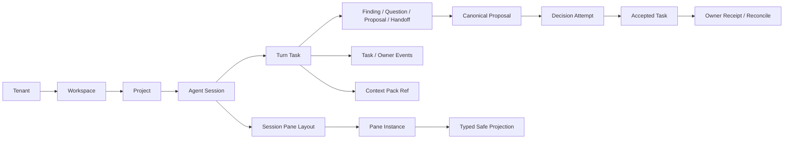
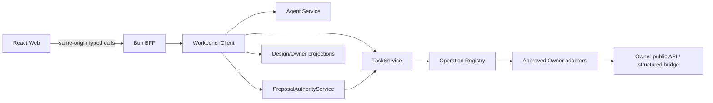

# Yeisme Workbench Agent-first 应用 Blueprint

## 0. 文档权威

本文是 Workbench 应用级产品与系统组合真源，回答“这个应用是什么、用户如何完成工作、页面和 Pane 如何组织、前后端如何接通、何时算可用”。

- 产品与 owner 边界：本文 + [Workbench 平台设计](workbench-platform.md)。
- 视觉、布局、控件和响应式：[Agent-first Pane UI Spec](../ui/agent-first-workbench.md)。
- UI 管理、route/Pane/Lens 分类、设计债务与长期门禁：[Workbench UI 设计治理与一致性合同](../design/workbench-ui-governance.md)。
- 前端/BFF/service/Owner 数据合同：[Agent workspace 接口合同](../interfaces/agent-pi-workspace.md)。
- Spatial Canvas V3 产品、交互与兼容合同：[语义无限画布产品设计](spatial-canvas-experience.md)、[交互设计](../design/spatial-canvas-interaction.md)、[接口合同](../interfaces/spatial-canvas-v3.md)。
- 当前实现变更：Agent runtime 基线由已归档 `workbench-agent-pi-workspace-v1` 承接，v1 跨壳层视觉收敛由已归档 `workbench-agent-ui-unification-v1` 承接；真实 Chat 与 Canvas convergence 由 active `openspec/changes/workbench-agent-chat-canvas-convergence-v2/` 承接。
- 跨项目 Conversation Runtime owner、加密内容和 Runtime Plane handoff 由根 change `../../../../openspec/changes/agent-conversation-runtime-workbench-integration-v1/` 定义。
- Spatial Canvas V3 计划变更：`openspec/changes/workbench-spatial-canvas-experience-v3/`。
- proposal 决策权威：`openspec/specs/workbench-agent-proposal-authority/spec.md`；active implementation/evidence change 为 `openspec/changes/workbench-agent-proposal-authority-v1/`。
- 视觉参考：`prompts/product/ui-reference/workbench-agent-pane/`，其中图 02 为主基线。

若历史 R0–R5、Studio、Canvas、Orbit 或旧页面文档与本文冲突，以本文定义的主产品壳和 capability/owner 边界为准；历史 change 只继续拥有尚未完成的基础设施或专业能力，不再定义并列主壳。

## 1. 产品定义

Workbench 是以项目与成果为工作重心、以 Agent 持续交互为锚点，通过受控 Pane 组合上下文、执行、审查、证据与 Owner 专业能力的工作环境。用户应能打开项目找到当前成果和已有决定，并在明确授权范围内继续推进。

2026-09-05 产品决定由 [项目连续性工作台](project-continuity-workbench.md) 和 `workbench-project-continuity-desktop-v1` 承接：个人高频通用 Agent、桌面 Web、部署端使用工具、跨会话续接。新姿态与独立 action grant 均须通过服务端 capability 和真实 owner evidence 晋级；当前不表示这些功能已交付。后续多租户、Team 与专业 Lens 能力保留原 owner 与实现计划。

它不是：

- Dashboard 页面集合；
- Owner Studio 的统一复制品；
- 可加载任意第三方代码的 IDE 插件宿主；
- 由浏览器直接调用模型、Owner、Terminal 或文件系统的客户端；
- 第二套 Task、Workflow、审批或领域状态机。

### 1.1 用户要完成的核心工作

> 在同一个项目中找到并持续推进成果：通过 Agent session 描述目标、授权上下文、观察执行、处理阻塞、审查建议、批准真实动作，并从 receipt/evidence 确认结果；换会话或隔天回来仍可核验地接续。

产品必须始终回答：

1. Agent 正在处理什么？
2. 它使用了哪些受权上下文？
3. 当前 Task/Owner 的真实状态是什么？
4. 哪一步需要我决定，风险和成本是什么？
5. 我可以安全执行什么，失败后如何恢复或对账？

### 1.2 目标用户

| 用户 | 主要任务 | Workbench 价值 |
| --- | --- | --- |
| 个人创作者/开发者 | 跨多个 Yeisme 工具推进任务 | 一个 Agent session 组合上下文和 Owner Pane |
| 个人编剧/OPC | 编排 Scene/Beat、核对双时间轴与剧情约束、写单场正文并送审 | `/agent` Spatial Screenplay Room 组合 Auctra owner projection/action，不复制剧本状态 |
| 团队成员 | 查看运行、审查 proposal、交接证据 | 统一 attention、Review、receipt 与 deep link |
| 管理员/运营 | 查看权限、成本、连接和异常 | 受控 Operations/Activity/Settings Pane |
| 自动化 Agent/CLI | 提交和观察 Task | 稳定 typed SDK/transport，不依赖页面文本 |

## 2. 产品原则

1. **Conversation is the anchor**：Agent timeline 与 composer 是不可关闭的布局锚点。
2. **Capability, not page proliferation**：功能优先成为注册 Pane；只有设置、全局目录或专业深链才保留独立 route。
3. **Server-authored truth**：状态、权限、成本、版本、availability、unread 与 receipt 由服务端提供，浏览器不猜测。
4. **One mutation chain**：所有副作用都经过 typed action/proposal → TaskService gate → Owner receipt/reconcile。
5. **Truthful unavailable**：合同不足时显示 `needs_contract/offline/stale/permission_required`，不使用 mock fallback 冒充可用。
6. **Context is explicit**：Context Pack 必须显式 prepare/authorize/attach；session 切换不自动换成“最新上下文”。
7. **Unknown is a real state**：`unknown_accept` 只允许 reconcile，不自动重试、不伪造成功或失败。
8. **Owner remains owner**：Workbench 组合体验和安全投影，不复制 Eikona、Scaena、Anatomia 等 canonical state。
9. **Accessible by construction**：每个拖动、hover、图标和 overlay 都有 keyboard、focus、reduced-motion 和移动端等价路径。
10. **Evidence before readiness**：component、browser、real Owner、deployment、production 证据分层，不以截图或单测宣称已接通。

## 3. 应用信息架构

### 3.1 一级产品壳

```text
Workbench
├── Agent      /agent      默认入口，持续 session + Pane dock
├── Plugins    /plugins    Pane catalog、能力状态和连接说明
├── Activity   /activity   跨 session attention、gate、unknown、failed 摘要
└── Settings   /settings   布局、快捷键、身份/租户、连接与安全设置
```

紧凑 product rail 只包含以上四类。租户、项目和全局搜索属于 Trusted Chrome，不作为第五套业务页面。

### 3.2 旧入口迁移规则

| 旧入口/能力 | 新归属 | 稳定链接策略 |
| --- | --- | --- |
| Overview | Agent 空/恢复态 + Activity 摘要 | 旧 route 可重定向到 `/agent` 或只读 advanced route |
| Orbit / Spatial Operations | Operations、Context Map、Inspector Pane | 保留 advanced route 用于诊断，不作为主控制面 |
| Boards / Canvas | Context Map/Workflow Pane 或 Owner deep link | 不在主导航创建永久空 Canvas |
| Open Design Studio | registered Studio/Preview/Review Pane + Open Design deep link | 现有稳定 Studio URL 保留兼容，不复制 Owner mutation |
| Gateway Console | Operations/Diagnostics Pane | 独立 route 仅用于高级管理和兼容 |
| Knowledge/Pinax review | Review/Evidence Pane + Owner deep link | 无真实 facade 时显示 `needs_contract` |
| Daily/Assets/Work Items | Activity、Assets、Task/Operations Pane | R3 保留 backend capability，不定义第二主壳 |

迁移不得破坏外部书签。旧 route 应显式标注 `advanced/legacy-compatible`，在可解析当前 session/project 时提供“在 Agent Pane 中打开”；不能静默改变 mutation 语义。

### 3.3 UI 统一基线（workbench-agent-ui-unification-v1）

`/agent` 与所有已注册 Pane 共享一套可见层级和交互语法：

```text
Trusted Chrome
└── Compact product rail
    └── 可折叠 Session rail
        └── Agent conversation + composer（不可关闭锚点）
            └── Spatial canvas / registered Pane surface
                └── 单一 context rail：Detail / Inspector / Review / Evidence
```

- 桌面默认保留可折叠会话栏；Spatial Focus 只把中央画布提升为主视觉，不创建第二 composer、第二 event stream 或第二业务侧栏。
- Auctra Screenplay Room 是 Creative Production 的 closed 专业子模式：中央 surface 使用叙事顺序 + 故事时间双轨，Scene/Graph/Review/Evidence 进入同一 context rail；Agent conversation/composer 仍保留。完整 UI 合同见 [Auctra Screenplay Room](../ui/auctra-screenplay-room.md)。
- 选择对象只更新安全上下文投影；加入 composer、附加 Context Pack、打开 Pane、应用 presentation suggestion 和执行恢复动作都必须由用户明确触发，且不抢键盘焦点。
- `needs_contract`、`permission_required`、`offline`、`stale`、`unknown_accept` 和 renderer degraded 在原位置保留；使用“影响说明 → 一个主恢复动作 → 技术详情”的顺序。ready 时不渲染多余告警块。
- 空 session、空目录和空 Spatial 投影各提供一个真实起步动作，不使用演示数据填充，不复制 composer 的 attach/send affordance。
- 导航、按钮、状态和恢复说明中文优先；sessionRef、Task、receipt、版本、Pane/Lens 类型等技术值保持英文等宽次要信息。所有新增文案必须进入双语 locale source。

该基线只规范前端组合，不改变 Task/Proposal/Owner/Spatial 合同；详细实现顺序与验收见 `openspec/changes/workbench-agent-ui-unification-v1/`。

### 3.4 真实 Chat 与 Canvas convergence（workbench-agent-chat-canvas-convergence-v2）

v2 不再把 Conversation、Split、Spatial Focus 当作三套一级模式，而是在同一 session-scoped layout 中稳定呈现：

```text
Trusted Chrome
└── Compact product rail
    ├── Session drawer（默认收起，可 pin）
    └── Adaptive Agent workspace
        ├── Chat rail：timeline + persistent composer
        ├── Document dock：Spatial Canvas + registered Pane documents
        └── Shared Context rail：Detail / Inspector / Review / Evidence
```

- 宽屏默认左 Chat、中 Canvas/Pane document dock、右 Context；Canvas 是 canonical Pane/document registry 中的第一类 document，不再与 conversation 形成两个 route-owned sibling 应用。
- Chat 内容由独立 Conversation Runtime 加密保存并以 safe structured Block 投影；Workbench TaskService 继续只持有 `turnIntentRef`、Context/artifact refs、attempt、gate、event 与 receipt。
- 首次会话通过 Profile 明确确认 Pi/OMP runtime、model profile、tool/context scope、预算上限、期限与 soft-follow；范围内 ordinary chat 不再逐回合等待 permission，mutation/敏感读取/超预算仍独立 gate。
- Canvas selection 先进入 Composer 的“待附加”托盘；用户显式确认后，Context service 按 exact revision 重新授权。stale/revoked/mismatch 必须 Refresh 或 Remove，不自动升级或静默丢弃。
- 回答默认 soft-follow：只允许临时高亮/预览并更新 Context rail，不移动键盘焦点/相机，不写 composer/Context/Draft，不决定 proposal 或执行 mutation。
- 持久 Canvas 回写继续是一个 server-authored 原子 change-set，经 ProposalAuthority/TaskService 整包 Accept、Reject 或 Request Changes；`unknown_accept` 只 reconcile 原 attempt。
- `<1024px` 提供真实 Chat、选择摘要、可访问对象列表和 Review Sheet，不挂完整无限画布编辑器。

v2 首批以 Creative Production 为 first-support vertical slice，但 selection、Context、structured content、soft-follow 和 change-set 合同必须保持 Lens-neutral，后续 Workflow/Run/Review/Evidence 复用同一内核。

实际 ready 状态（2026-09-04，随 change 7.7 收口记录）：

- **fixture/reference 阶段已实现并验证**：SDK conversation 合同与 sealed-intent safe refs、BFF same-origin 白名单代理、TaskService grant 准入与 attempt lifecycle 映射、v2 单一 shell/layout/responsive/a11y/i18n、Profile Sheet send gate、Creative Production vertical 浏览器流。验证：SDK/component 574+985 绿、Go 全包绿、e2e 210/0（evidence `temp/integration-test-runs/20260904051106-a2b87e5d`）。
- **real 阶段 blocked（truthful）**：真实 Pi/OMP opt-in canary 未执行——根 change `agent-conversation-runtime-workbench-integration-v1` 2.3 `P1-real-canary` open、Runtime Plane adapter 未 real-ready、本环境无 provider 授权。reference adapter fixture 不计 real evidence，不宣称 local-beta/production。
- **Aigora amendment（8.x）blocked**：`aigora.access_context.v1alpha1` 字段级 wire digest 未冻结（根 5.2 open、Aigora owner change 0/17）；消费面 spec 已 additive 冻结，provider digest 就绪后实施。
- **兼容与回滚**：全部 surface additive（`breaking_surfaces=[]`）；v2 shell 由 server cohort capability `chatCanvasV2` 门控，关闭即回退 v1 legacy conversation 路径（modebar/逐回合 permission 语义保留）。

### 3.5 Text Development domain lens

`workbench-text-development-studio-v1` 在同一 `/agent` Shell 内增加长期文本开发能力，不恢复独立 Studio：

```text
Agent Chat rail
  + Document Dock: Working Copy editor / candidate compare / Team Plan
  + Context rail: Structure / Review / Versions / Team
```

- Auctra 拥有正文、Working Copy、Checkpoint、ReviewItem 与 Canon；Workbench 只持当前 editor buffer、selection、layout/query cache 和 safe refs。
- Conversation Runtime 拥有 Pi session、project-full retrieval、web search、Profile/Grant、visible Blocks 和 egress receipt；Workbench 不保存 raw prompt/provider payload。
- Ordo 拥有 Team Profile、Plan、DAG、writer lease、run 与 evidence；Workbench 只提供 typed preview/simulate/start/status/reconcile UI。
- Agent/Team 修改始终先成为 candidate；接受 candidate 只更新 Working Copy，不自动 Checkpoint、submit Review 或晋级 Canon。
- Create/Collaborate 是同一 layout 的姿态；1280–1535px 不同时扩大 Chat 与 Context，`<1024px` 保持只读正文、diff、comment 与 decision 等价路径。

Novel 为 first-support local Beta，Screenplay 复用现有 Screenplay Room 并保持 candidate maturity，Self-media 为 exploratory。详细产品、UI 与接口见 [Text Development Workbench](text-development-workbench.md)、[UI Spec](../ui/text-development-workbench.md) 和 [Owner 接口](../interfaces/text-development-agent-interaction.md)。

### 3.6 项目连续性与成果优先桌面姿态

`workbench-project-continuity-desktop-v1` 在同一 `/agent` 增加经服务端明确启用的项目姿态，不建立新 route-owned 主壳。已授权的显式 document/Spatial 深链优先，其次恢复最近合法成果，最后显示注册的项目续接 document；Chat/composer 保持同一实例，Context 按需打开，项目目录复用既有 drawer/session directory。

- Workbench 只组合 ProjectWorkspace、会话、运行和成果 safe refs；canonical Project/工作目录仍归批准 owner。
- Pinax 提供 continuity、来源、冲突与长期决定；Conversation Runtime 提供正文与运行时摘要。summary 不自动成为 confirmed memory。
- `getOverview/getContinuity/prepareContinuation` 为拟新增 project facade 能力。打开项目只恢复视图；用户继续时重新验证 binding、source revision、授权和原 attempt。
- Layout service 可保存 principal/project 安全 view metadata；session 草稿仍隔离，正文不进入 layout/metadata。此项通过正式 delta 扩展旧 browser-local 布局要求。
- 独立 action grant 才能支持有界自主动作；每个 proposal 仍经服务端准入。旧 chat/access grant 不升级，未知操作与高影响动作遵循原决定流程。
- 本地与远程 Web 是同一产品的部署位置：使用部署端工具，不默认连接用户电脑或同步不同部署。远程仍满足现有 managed Identity/HTTPS/BFF 条件。

产品、控件、接口、P0–P3 和场景验收分别见 [产品设计](project-continuity-workbench.md)、[UI](../ui/project-continuity-workbench.md)、[接口](../interfaces/project-continuity-workbench.md) 与 [tasks](../../openspec/changes/workbench-project-continuity-desktop-v1/tasks.md)。能力关闭时原会话/Spatial 行为、专业 Pane 和稳定深链保持可用。

## 4. 核心对象模型

Ordo 托管工作通过 [managed consumer](../../openspec/changes/workbench-ordo-managed-work-v1/design.md) 接入既有 registered Pane。Ordo 拥有 work/run/lease/恢复真相，Workbench Task只映射owner operation与receipt；独立Ordo网页是另一个产品入口，不改变本主壳。共享协议/呈现语义，使用本地design-system，不加载对方React/CSS或iframe。Text Development通用adapter由新consumer task2.1接收，领域Team deck保持原owner。



| 对象 | Canonical owner | Workbench Web 可持有 |
| --- | --- | --- |
| Tenant/User/Membership | Identity Platform | authenticated projection/query cache |
| Project domain state | 对应 Owner | safe project ref、summary、deep link |
| Agent Session | Task-derived server projection | selected ref、draft、scroll、layout composition |
| Turn/Task/Event/Gate | Workbench TaskService | typed projection/query cache |
| Context Pack | Workbench Context service + source owners | authorized ref/revision、显式 attachment state |
| Proposal/Decision | ProposalAuthorityService | safe projection、pending UI state |
| Owner artifact/receipt | 对应 Owner | safe ref、summary、preview capability |
| Pane layout | Workbench UI；SavedView 后续服务化 | session-scoped reducer，安全 descriptor refs |

## 5. Agent session 工作流

### 5.1 首次进入

1. BFF 解析可信 principal、tenant/workspace/project context。
2. Web 获取 server-authored Agent capabilities 与 session directory page。
3. capability 未就绪时仍显示 conversation fallback，并解释原因；不得用 URL/localStorage 开启功能。
4. 选择最近 session 或创建 browser-local draft；空 draft 不是服务端 session。
5. timeline、composer 和当前上下文状态先可用，Pane 可按需加载。

### 5.2 提交 Turn

1. 用户输入保持 browser-local，选择或 prepare Context Pack。
2. SDK 提交 bounded turn intent/digest 和 authorized Context Pack ref/revision。
3. TaskService 接受后才把本地 pending 意图映射为 canonical turn；网络结果未知不能伪造用户消息已提交。
4. selected-turn stream 展示 Task/event；workspace directory stream更新后台 session attention。
5. 用户可切换 session，后台 Task 不被取消或重复提交。

### 5.3 Agent 建议打开 Pane

1. Agent 输出可附带 closed `AgentPresentationIntentV1`。
2. resolver 校验 session/source/safe refs/Context revision/expiry/registry/capability。
3. 默认显示 suggestion；用户明确激活后才打开 Pane。
4. 临时 Follow Pi 只能自动执行允许的 presentation effect，不能决定 proposal、提交 Task 或移动键盘焦点。
5. 达到 Pane 上限返回 `limit_reached`，不得静默替换。

### 5.4 Proposal 审查与执行

1. Review Pane 读取 canonical proposal projection，而不是浏览器 output 拼装的 authority。
2. 用户明确选择 accept/reject/request changes。
3. ProposalAuthorityService 重载 scope、basis、descriptor、versions、permission、cost 与 capability。
4. `accept` 通过现有 TaskService 创建 sealed action Task；其他决策不调用 Owner。
5. decision、Task、Owner receipt 分开显示。
6. dispatch 结果未知进入 `decision_unknown`，只允许原 attempt reconcile。

## 6. Pane 产品模型

### 6.1 Pane 不是任意插件

v1 Pane 是 Workbench 发布包内注册的 first-party renderer + server-authorized typed contract。它可以热插拔布局，但不能热加载任意 JavaScript、remote component、iframe、URL、HTML、shell 或 Owner credential。

未来第三方生态若存在，必须另建 sandbox、签名、权限、更新、供应链、数据泄露与撤销规范；不在当前 Pane catalog 中预留 fail-open 执行口。

### 6.2 Descriptor 最小合同

```yaml
pane_type: agent.review.v1
renderer_id: agent-review
title_key: agent.pane.review.title
category: review
route_version: 1
closed_params_schema: AgentReviewPaneParamsV1
required_capabilities: [proposalRead]
required_roles: []
preferred_placement: right
desktop_width: 420
mobile_presentation: sheet
data_contract: AgentProposalProjectionV1
action_contract: AgentProposalDecisionV1
availability_source: server
```

Descriptor 只声明 closed identity、renderer、params、capability 和呈现建议。数据与 action 分别来自 typed facade；layout reducer 不拥有业务状态。

### 6.3 Pane 生命周期

```text
registered
  -> available | needs_contract | permission_required | offline | unsupported
  -> requested
  -> resolved and mounted
  -> ready | loading | empty | stale | degraded | error
  -> focused / moved / replaced / closed
```

- `requested` 必须再次校验 session/scope/params/version/visible limit。
- `mounted` 不代表数据 ready，也不授予 mutation。
- `stale/degraded` 保留 last-confirmed 投影并禁用依赖新版本的 action。
- `closed` 只删除 UI instance，不取消 Task、不删除 Owner state。
- 同一 `paneType + canonical params` 默认去重并 focus；需要多实例的 Pane 必须在 descriptor 明确 instance identity。

### 6.4 Pane catalog

| Pane family | v1 | 数据合同 | Action 边界 |
| --- | --- | --- | --- |
| Context | deliver-now | Context Pack projection | prepare/refresh/detach typed action |
| Run | deliver-now | Task/attempt/event | cancel request/reconcile TaskService |
| Review | deliver-now | canonical proposal/action descriptor | ProposalAuthorityService |
| Evidence | deliver-now | safe refs/receipt summary | read/open-approved only |
| Operations | contract-gated | approved Owner facade | typed ActionDescriptor → TaskService |
| Context Map | read-only first | authorized relation projection | no graph mutation in v1 |
| Spatial Canvas | planned V3, capability-gated | exact-revision Owner projection + Workbench Lens layout/Draft | canonical mutation 走 ProposalAuthority/TaskService；Draft 与纯布局使用独立版本合同 |
| Work Items | deliver-now（Phase 2 传输投影已落地） | WorkItemService typed projection（workitemshttp 直连 RPC） | update/transition 经 wire 层进 wiservice：authorization/版本 CAS/acceptance gate |
| Workflows | deliver-now（直连接口） | workflow definition/run/event projection | 只读观察；动作走 proposal/Task |
| Daily Ops | 注册+渲染器就绪，needs_contract | inbox/approval/activity projection | decide/execute 经既有 typed client → TaskService（传输投影等 R3 gates） |
| Assets | 注册+渲染器就绪，needs_contract | asset 安全投影/collection/saved view | 只读；Owner 动作走 deep link（传输投影等 R3 gates） |
| Identity | deliver-now（直连接口） | principal/session/tenant/member/readiness | 只读；palette 由 readiness 门控 |
| Gateway Console | deliver-now（直连接口，只读） | overview/backend/approval/activity 投影 | 只读；SDK 路由已注册，服务端 handler 属 MC 8.3（offline 诚实呈现） |
| Project Workspace | deliver-now（随 workItems 传输启用；服务端 ProjectQuery 语义留 project change） | 既有 WorkItem 接口上的 Table/Kanban/Todo 同源多视图 | transition/update 经 typed client + wire 层 |
| Terminal | needs_contract（注册已就位） | audited command session | closed command catalog；no arbitrary shell（`workbench-agent-cli-pane-v1`） |
| Files | retain-next | host file projection | allowlisted read/write contract；no arbitrary path |
| Browser Preview | retain-next | safe preview proxy | no browser automation in v1 |
| Saved View | retain-next | layout metadata | expected revision/idempotency |

直连接口批次（Workflows/Daily Ops/Assets/Work Items/Identity/Gateway/Project 预切片）由已归档的 `2026-08-23-workbench-agent-pane-direct-interfaces` 交付（主 spec：`workbench-agent-pane-interfaces`）：不新增后端 Operation，mutation 只走既有 typed SDK client；可用性按「传输真值 + 服务端真实投影」两层派生——SDK 方法没有浏览器传输投影的面以 `needs_contract` 传输原因在 palette fail-closed（落地后翻转静态表即启用），传输已注册的面由 readiness/capabilityState 门控或 Pane 内四态诚实呈现。

## 7. 前端状态所有权

| 状态 | Owner | 存储 |
| --- | --- | --- |
| session directory、attention、unread | server | query cache + durable cursor |
| selected turn/events | server | query cache + one resumable stream |
| Task/gate/receipt/reconcile | TaskService/Owner | typed projection |
| proposal/decision | ProposalAuthorityService | typed projection |
| Pane catalog availability | server capability + local registry | derived only |
| open/focus/split/size | Web layout reducer | memory in deliver-now |
| composer draft/selection/scroll | Web | per-session memory，not localStorage |
| saved layout | future SavedView service | server metadata，no business payload |
| Spatial Lens shared layout | Workbench Spatial service | project/surface scoped revisioned metadata |
| Spatial camera/filter/rail preference | Workbench user view preference | principal + project/surface scoped metadata |
| Spatial Draft document | Workbench Draft service | project/surface scoped versioned document/event |
| Spatial presence | ephemeral presence hub | TTL bounded；不进入 audit/backup |

React component 不得复制 server state machine。Optimistic UI 只可用于可撤销的纯呈现状态；Task submit、cancel、accept、read ack 和 Owner mutation 必须等 server observation 后显示已确认。

## 8. 前后端边界



不变量：

- Browser 不持有 Workbench session token、Owner credential 或 arbitrary endpoint。
- BFF 负责同源 session/CSRF/transport facade，不拥有领域授权规则。
- shared service 拥有 authorization、revision、idempotency 和状态转换；transport handler 只 decode/map。
- Owner adapter 只调用版本化公开 API 或获批 structured local bridge，不解析 human CLI output。
- Workbench persistence 不保存 Owner payload/artifact blob/raw prompt/provider payload/private path。

详细 method、stream、error、reconnect 与 capability contract 见 [Agent workspace 接口合同](../interfaces/agent-pi-workspace.md)。

## 9. Capability 与 Owner 台账

| 能力 | 状态 | Canonical owner | 当前产品呈现 | 晋级条件 |
| --- | --- | --- | --- | --- |
| Agent Task/session control projection | committed | Workbench TaskService | Chat/Run detail | existing Task/event/receipt parity |
| Conversation content/session Profile | required/split-owner | Conversation Runtime | Chat rail/Profile Sheet | root owner contract + Pi/OMP protocol canary |
| Chat/Canvas adaptive shell | required/deliver-now | Workbench Web | 左 Chat + 中 document dock + 右 Context | v2 component/browser matrix |
| Canvas selection → Context Pack | required/deliver-now | Workbench Context/Spatial services | Composer pending tray | exact-revision/stale/revoke evidence |
| Answer → Canvas soft follow | required/deliver-now | Workbench presentation state | Canvas/Context rail | no-focus/no-mutation evidence |
| Answer → atomic Spatial change-set | required/deliver-now | ProposalAuthority + Spatial owner | Review rail | preview/accept/conflict/reconcile evidence |
| Multi-Pane dock | required/deliver-now | Workbench Web | 1–3 Pane | tasks 10.5/10.9 |
| Pane command palette | required/deliver-now | Workbench Web | `Cmd/Ctrl+K` | task 10.6 |
| Proposal read | committed/default-off cohort | ProposalAuthorityService | Review read-only | exact principal read cohort + canonical projection |
| Proposal decision | committed/canary-scoped | ProposalAuthorityService | gated controls | decision cohort + three-wire/SDK/browser evidence |
| Proposal reconcile | committed/canary-scoped | ProposalAuthorityService | unknown original-attempt reconcile | reconcile cohort + durable restart rollback |
| Owner mutation | per-owner gated | corresponding Owner + TaskService | Operations/Review | approved adapter + receipt/reconcile |
| Open Design read/preview | committed baseline | Open Design | Studio/Preview Pane/deep link | current safe read contract |
| Open Design mutation | needs_contract | Open Design | disabled explanation | versioned owner workflow/receipt |
| Eikona generation | selected-operation canary | Eikona | Review/Owner Pane/deep link | exact `eikona.generation.submit` descriptor + Identity/JWKS + receipt/reconcile evidence；其他 Eikona mutation 不随此晋级 |
| Scaena production | split-owner | Scaena | summary/deep link | Scaena consumer contract |
| Anatomia workspace | retain-next/split-owner | Anatomia | specialized Pane family/deep link | typed projections/actions/receipts |
| Files/Preview/Assets | required retain-next | host/Owner | catalog placeholder | safe data/action contract |
| Terminal | required retain-next | approved host runtime | catalog placeholder | closed command/audit/kill switch |
| Multi-agent DAG | not current | future runtime owner | none | separate PRD/OpenSpec/user decision |

## 10. 全局状态与恢复词汇

所有页面、Pane、toast、event 和 SDK 应复用同一状态词汇：

| 状态 | 含义 | UI 行为 |
| --- | --- | --- |
| `ready` | capability 和当前数据可用 | 允许符合 descriptor 的 action |
| `running` | canonical Task 正在执行 | 持续观察，可切换 session |
| `permission_required` | 缺少服务端确认权限 | 显示范围和请求路径 |
| `cost_required` | 等待显式成本确认 | 不乐观提交 |
| `needs_contract` | 目标合同/adapter 未批准 | 保留入口和原因，action disabled |
| `stale` | revision/freshness 不足 | refresh/re-authorize，禁用旧版本 mutation |
| `offline` | owner/service 不可达 | 显示 last-confirmed 与 retry read |
| `partial` | 部分 item 成功 | 成功证据保留，只修复失败子项 |
| `unknown_accept` | mutation 可能已被接受 | reconcile only |
| `conflict` | expected revision/idempotency 冲突 | 展示 current server state，要求重新决定 |
| `limit_reached` | Pane 可见数达到上限 | 关闭或显式替换，不静默丢弃 |

禁止使用模糊 `success` toast 掩盖 Task/Owner 尚未终止、把 HTTP 200 当领域成功、把 `healthy` 当 capability ready。

## 11. 安全与隐私

- principal/tenant/membership 只从可信 server context 解析。
- mutation 同时校验 tenant、workspace/project scope、operation、permission、cost、expected version、idempotency 和 capability cohort。
- Pane params、presentation intent、deep link 和 safe refs 采用 closed schema；任意 URL/DOM/HTML/JS/component props fail closed。
- raw prompt、完整对话内容、provider payload、chain-of-thought、credential、private path、signed URL、artifact blob 不进入控制面、日志、trace、截图或 evidence。
- 用户可见 reasoning 仅为 Agent 生成的 bounded rationale/summary，不展示隐藏思维链。
- destructive/costly/security-sensitive action 必须显式确认；hover/focus/drag/intent 不得触发。

## 12. 响应式产品范围

| 视口 | 结构 | 支持范围 |
| --- | --- | --- |
| `>=1440` | rail + optional session rail + conversation + 1–3 Pane | 完整创建、运行、审查、布局 |
| `1024–1439` | conversation + 互斥 session/Pane Sheet | 创建、运行、审查、轻量管理 |
| `<768` | 单列 conversation + 全屏 Sheet | 浏览、输入、审查、批准、reconcile；无自由 docking |

移动端不是缩小的桌面 IDE。复杂图、宽表和拖拽使用 record list、Sheet 和显式菜单替代；专业生产编辑优先 deep link 到 Owner 产品。

## 13. Definition of Usable

一个 capability 只有同时满足以下条件，才可在产品中标为“可用”：

1. 有 canonical owner 和 versioned typed contract。
2. Pane/route 从 server capability 获取真实 availability。
3. loading/empty/error/offline/stale/permission/cost/unknown/recovery 均已定义。
4. 每个可见 control 有真实行为；未接通的 action 明确 disabled reason，不是假按钮。
5. mutation 通过 TaskService/ProposalAuthority/Owner receipt 链，不由浏览器直连或拼装权威输入。
6. focused contract/unit tests 通过。
7. browser journey 覆盖 happy path 和至少一个 failure/recovery path。
8. 若包含 Owner mutation，必须有真实 owner contract、receipt/status/reconcile 和 rollback evidence。
9. capability-scoped handoff 明确环境、版本、flag、kill switch、owner 和证据路径。

“页面能打开”“组件渲染成功”“mock 返回成功”“截图像参考图”“OpenSpec artifact complete”都不等于 capability usable。

## 14. 实施切片

### Slice A：应用主壳可用

- `/agent` 成为默认入口；compact rail + session rail + persistent conversation。
- desktop multi-Pane reducer 接入真实 UI，1–3 默认、4 hard max、split depth 2。
- command palette、Pane focus/close/replace、keyboard/focus restore。
- Context/Run/Review/Evidence/Operations 进入同一 catalog/dock。
- 旧入口迁移为 Pane/advanced/deep link，稳定 URL 保留。

### Slice B：Review 真正接通

- 完成 `workbench-agent-proposal-authority-v1`。
- Review Pane 使用 canonical proposal projection 和 typed decide/reconcile。
- 选择一个低风险真实 Owner Operation 完成 accept→Task→receipt→reconcile canary。

### Slice C：Owner Pane 从“能看”到“能做”

- 按 owner matrix 逐个接通 Eikona/Open Design/Scaena/Pinax 等 typed projection/action。
- 每个 Owner 独立 availability、flag、receipt、rollback 和 evidence；不按 change 一次性宣称全部 ready。

### Slice D：工作环境扩展

- Files、Browser Preview、Assets、Terminal 的安全 host contract。
- SavedView、跨设备安全布局同步、project presets。
- Activity/Plugins/Settings 完整 route 与搜索。
- Spatial Canvas V3 在 `/agent` 内提供四级语义缩放、五 Lens、HUD/搜索/小地图、项目 Draft、轻量 presence 和选择集提升；不创建第二 composer、第二 Task control plane 或 Owner 状态机。

### Slice E：托管与团队

- Identity/tenant instance、成员、审计、用量、配额、provisioning、migration 和 DR。
- 不改变 Agent-first 主壳，也不把 tenant/workspace 字段混作授权事实。

## 15. 应用级验收

- 新用户进入后首个视觉焦点是 Agent timeline/composer，并能完成一个真实 turn。
- 用户无需离开主对话即可打开 Context、Run、Review、Evidence，并理解每个 Pane 的数据来源和可用状态。
- 桌面可同时显示最多 3 个有用 Pane；移动端能完成同一审查/批准核心路径。
- 所有旧主要能力都有明确 Pane、advanced route 或 Owner deep link 归属，没有无主页面。
- 任一 visible enabled action 都有后端合同和 failure/recovery；无静态假控件或 production mock fallback。
- Spatial Focus 在 1024px 桌面仍保留可用画布和常驻 composer；Atlas/Cluster 对非空项目必须提供可见且可访问的聚合摘要，不能出现“有数据但空白”。
- 用户能从 proposal/Task/receipt/evidence 追踪一次真实动作，并在未知结果时只 reconcile。
- 1440×960、1024×768、390×844、200% zoom、keyboard、Axe、reduced motion 和无页面级横向溢出通过。
- 浏览器网络面只有 Workbench same-origin BFF/typed facade，不出现 Owner credential、arbitrary endpoint 或 private payload。
