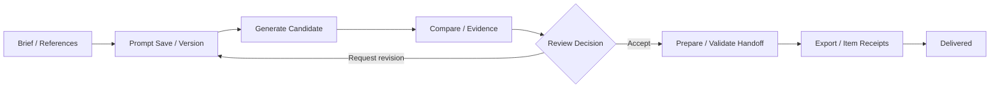

# Open Design Studio 页面矩阵

本矩阵描述 Open Design advanced compatibility route 内部对象和状态，不定义 Workbench 一级导航。新主壳中的对应能力按 [Agent-first 应用 Blueprint](agent-workbench-blueprint.md) 组合为 Studio/Preview/Review/Evidence Pane 或 Owner deep link。

> 当前 `open-design-studio-experience` 只代表已实现的只读体验基线。prompt、candidate、review、handoff
> 生产闭环不在当前交付范围；下表保留 `needs_contract` 作为未提供能力的诚实状态，不代表活跃实施计划。
> 后续若重新启动完整闭环，必须由新的 OpenSpec change 重新定义范围、Owner 合同和发布门禁。

## 共享外壳

所有页面使用同一 Apple Spatial Workbench 外壳：左侧悬浮图标栏、顶部 Focus Lens、中央 Design Spine、右侧上下文 Inspector。导航默认只显示图标，Hover 或键盘 Focus 才显示当前 locale Tooltip。英文只用于品牌名、文件名、路径、稳定 ID、Skill、Design System 和快捷键。

## 页面与真实功能

| 页面 | 用户问题 | 主对象 | 核心控件 | 必须状态 | 合同姿态 |
| --- | --- | --- | --- | --- | --- |
| Project Studio | 项目现在处于什么状态，下一步处理什么？ | Brief、References、Prompt、Candidate、Review Gate、Handoff | 选择对象、打开来源、观察运行、打开 Inspector | ready、running、awaiting review、blocked、offline | projects/files/status 已发现；候选与审查需合同 |
| Prompt Library | 哪个文件和版本生成了当前结果？ | Collection、prompt file、version、diff、usage | 搜索、分类筛选、版本切换、比较差异、复制 ref、请求生成 | empty、selected、modified、stale、invalid、unavailable | 文件读取可映射；prompt version/run mutation 需合同 |
| Candidate Compare | 哪个候选最符合 Brief，差异在哪里？ | 2–4 candidates、visual diff、source graph、quality checks | 聚焦候选、双选比较、证据开关、接受、调整 | loading、partial、awaiting review、accepted、rejected、contract blocked | candidate/read projection 与 review mutation 需合同 |
| Review Evidence | 为什么接受、退回或阻塞？ | decision、risk、evidence refs、run events、contract gap | 风险筛选、证据展开、添加理由、接受、退回、复制诊断 | no evidence、conflict、high risk、stale evidence、unavailable | 必须是 path-free safe projection；禁止 raw payload |
| Handoff | 哪些设计资产可以交给实现 owner？ | UI spec、assets、tokens、contract gaps、manifest | 选择交付项、检查阻塞、预览 manifest、复制命令、导出 | draft、ready with blockers、ready、exporting、partial、failed | handoff manifest 与 export receipt 需 owner 合同 |

## 完整生产工作流

完整版本使用两层状态：业务 phase 表达 `draft`、`generating`、`awaiting_review`、
`revision_requested`、`accepted`、`handoff_ready`、`exporting`、`delivered`；连接与恢复 overlay
表达 `offline`、`contract_mismatch`、`permission_required`、`partial` 和 `unknown_accept`。
网络故障不得把业务状态改写为失败，未知接受不得自动重试。

### 完整功能晋级条件

- `design.prompt.save`、`design.candidate.generate`、`design.candidate.cancel`、
  `design.review.decide`、`design.handoff.prepare`、`design.handoff.export` 全部进入 TaskService。
- 主路径支持真实 owner version、idempotency、permission/cost gate、event、receipt 和 reconcile。
- Prompt Library、Candidate Compare、Review Evidence、Handoff、Activity/Evidence 均完成正常、空、
  partial、offline、conflict 和恢复状态。
- strict OpenSpec、四 transport parity、pure-Go/race、Web、Playwright、安全、脱敏 evidence 门禁全部通过。

## Prompt Library

### 信息结构

- 左侧空间对象：owner、asset type、collection 三层分类，不按 provider 或模型分类。
- 中央主对象：当前提示词文件与版本；相邻对象显示上一版本和关联参考图。
- 下方 Evidence 节点：file ref、reference SHA、run refs、使用候选数量。
- Inspector：文件名、collection、version、modified state、source refs、last run、safe usage summary。

### 控件

- `⌘K` 全局命令；`⌘P` 打开提示词文件。
- 搜索仅匹配标题、标签、摘要和 safe refs，默认不建立 raw prompt 全文索引。
- Diff 支持当前版本与任意历史版本比较；未保存修改和 run-owned snapshot 必须区分。
- “生成”在写合同缺失时显示 `Needs contract`，不得直接创建本地成功状态。

## Candidate Compare

### 信息结构

- 主舞台同时保留一个主候选与最多三个相邻候选。
- Compare Lens 只显示用户主动开启的差异：layout、hierarchy、density、interaction、accessibility。
- 每个候选显示同一套来源锚点：prompt version、references、Skill、Design System、run ref。
- Inspector 只跟随当前焦点候选；双选比较时变为差异 Inspector。

### 控件

- 单击聚焦；`Shift`+单击加入比较；`Esc` 退出比较。
- 证据开关不改变候选，只显示或隐藏来源连线。
- 接受与调整必须写 owner review decision；合同不存在时按钮进入 gate，而非假 toast。

## Review Evidence

### 信息结构

- 中央对象是 Review Gate，不是候选缩略图墙。
- 证据按 Brief、References、Prompt、Run、Quality、Contract 六类组织。
- 风险按 permission、cost、stale source、missing contract、quality 和 accessibility 分类。
- Inspector 显示 decision state、reason summary、reviewer、version condition 和下游影响。

### 控件

- 风险筛选不会删除证据，只改变可见性。
- 任何接受或退回动作必须附短理由；完整内部推理不得持久化。
- 版本条件过期时禁止接受，并提供重新加载与比较最新版本动作。

## Handoff

### 信息结构

- 交付包固定包含 UI Spec、视觉参考、tokens、component inventory、interaction inventory、contract gaps 和验证清单。
- 每个交付项显示 owner、版本、可用状态和安全 ref。
- 阻塞项与可交付项可以并存；整体状态允许 `ready with blockers`。
- Inspector 显示目标 owner、manifest version、包含项、阻塞项和 export receipt。

### 控件

- 用户可以选择交付范围，但不能移除强制的 contract gaps 与验证清单。
- 导出前展示 manifest 预览与目标位置；不得写入 owner 私有目录。
- 部分失败逐项返回结果，可重试失败项，不重复导出成功项。
