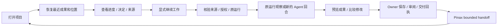

# 项目连续性与桌面 Agent 工作台

状态：已确定产品方向，实施与真实使用验证待完成。实现任务真源：[workbench-project-continuity-desktop-v1](../../openspec/changes/workbench-project-continuity-desktop-v1/tasks.md)。应用级权威仍为 [Blueprint](agent-workbench-blueprint.md)。

## 1. 产品承诺与投入依据

打开一个项目，就能找到当前成果、理解已有决定，并让 Agent 接着推进工作。首要用户是长期使用多个工具、持续推进多个项目的个人；通用能力通过研发、调研、文本和多模态场景共同验证。

现有 ProjectWorkspace 的数据集、字段与多视图继续保留，作为可插入的项目记录能力。新主线强调文件/成果、会话、运行和长期决定的关联，不把数据集表格当作项目的全部内容。

2026-09-05 用户已确定：个人高频使用；通用 Agent；上下文与成果连续性；项目与成果优先；授权范围内自主推进；桌面 Web；同一 C/S 产品部署在哪里就使用哪里的工具。未要求跨部署执行/同步、原生安装包或公开 SaaS 商业化。

参考 Open Design 在同一个项目中组织会话、生成文件与预览的方式；只采用体验组织原则，不复制运行时或视觉系统。[官方说明](https://github.com/nexu-io/open-design/blob/main/README.md)

## 2. 能力清单与 owner

| ID | 能力 | 准入 | 状态/阶段 | 真源 | 用户可见入口 |
|---|---|---|---|---|---|
| C1 | 通用 Agent 与真实成果 | split-owner | required，P1 | Conversation Runtime、工具/领域 owner | Agent + document dock |
| C2 | 项目与成果优先桌面工作区 | fit | required，P0–P2 | Workbench composition | `/agent` |
| C3 | 跨会话和重启续接 | split-owner | required，P1 | Pinax、Runtime、成果 owner | 项目续接视图 |
| C4 | 有界自主执行及随时介入 | split-owner | required，P1–P3 | ProposalAuthority、TaskService、owner | Profile、Run、Review |
| C5 | 本地/远程同一版本部署 | fit + split-owner | required，P1–P3 | Workbench、Identity、部署端服务 | 同一 Web |
| C6 | 广泛场景覆盖 | split-owner | exploratory，P2 | 既有领域 owner | 共用 Pane/Lens |
| C7 | 稳定深链和专业能力 | fit + split-owner | committed，持续保留 | 既有 owner | registered Pane/approved deep link |

Workbench 只管理组合 metadata、安全引用和必要控制面记录。正文、媒体、工作目录、长期记忆、领域正式版本和 Team 调度保持原 owner。能力与证据登记方式见 owning proposal，不在此复制 tasks 状态。

## 3. 产品行为

- 项目入口绑定已有 safe `projectRef` 与获批部署端 workspace ref；目录绑定由运行时 owner 管理。首次无绑定时提供明确 setup，不自动扫描全部目录。
- 打开项目恢复最近仍有权限的成果；对象缺失、版本过期或无历史时显示续接视图。不会自动运行 Agent、附加新 Context 或重放命令。
- 项目续接视图展示目标、最近成果、关键决定、阻塞、来源新鲜度与一个下一动作。Pinax 未连接时只呈现已确认会话/Task/成果事实，并说明续接缺口。
- “继续”先 prepare：运行中附着原运行；unknown 只对账；已终结则准备当前会话的下一回合；用户选择换 Agent 时创建同项目新会话并使用经授权的 continuity pack。
- Agent 输出形成可打开的文档、文件、预览或候选。`saved` 只来自 owner 回执；编辑缓冲、待保存、未知结果必须区分。候选接受仍遵循各领域规则，不能自动晋级 Canon。
- 授权范围内的工作可连续执行；batch grant 由服务端逐次验证。高影响操作、未声明工具效果和范围升级在执行前需要相应决定。
- 关闭 Pane 或浏览器不等于取消任务；重连读取原 cursor/attempt。服务重启不能证明工具可恢复，不支持的情况显示明确限制和原操作状态。

## 4. 场景矩阵

以下是待验证样本，不是既成使用/市场证据。所有场景复用项目、会话、Context、Run、Artifact、Review、Receipt 内核。

| Scenario ID | 用户 / Job | 必要成果 | Gate / Review | Evidence | Export / Handoff | 验证 selector | 当前成熟度 |
|---|---|---|---|---|---|---|---|
| `research-report` | 研究者：资料→报告→隔天修订 | 来源 refs、报告、revision/diff | 引用有效、来源冲突、授权 | 同下方 per-run 路径，`WB-PC-RESEARCH` | 成果 owner 导出 + Pinax handoff | `WB-PC-RESEARCH` | exploratory；核心验证目标 |
| `software-project` | 开发者：目标→修改→测试→审阅 | 计划、patch/diff、测试 receipt | workspace scope、effects、writer/预算 | per-run，`WB-PC-SOFTWARE` | 项目文件/差异包；push 另行决定 | `WB-PC-SOFTWARE` | exploratory；核心验证目标 |
| `text-authoring` | 作者：提纲→正文→候选→版本 | Working Copy、candidate、Checkpoint | Auctra 保存/审阅/正式版本边界 | per-run，`WB-PC-TEXT` | Auctra export/receipt + handoff | `WB-PC-TEXT` | exploratory；复用已有 Text Development 计划 |
| `multimodal-production` | 创作者：参考→生成→比较→交付 | source、候选、选定资产、export receipt | 对应 owner 权限/预算/版本 | per-run，`WB-PC-MEDIA` | Eikona/Scaena/Sonora 等获批 export | `WB-PC-MEDIA` | exploratory；不宣称专业流程已接通 |

每次运行由既有 runner 写入 `temp/integration-test-runs/<run-id>/`，至少包含 `summary.json`、`command.txt`、`stdout.log`、`stderr.log`、`env.json` 和 `artifacts/`。scenario ID、fixture/real、部署类别、版本和来源证据由 runner/服务生成，不手写验收 metadata。

实现任务必须添加对应 Playwright 用例。其后在子项目运行实际入口，例如 `bun run web:e2e --grep WB-PC-RESEARCH`；其余场景替换对应 selector。当前缺用例/真实 owner 时不能把空匹配或 skip 当 pass。

## 5. 推进顺序

| 阶段 | 交付 | 退出条件 |
|---|---|---|
| P0 | owner packet、UI Contract、三个交互原型、旧行为基线 | 已明确原型验证与 provider 缺口，不让 prototype 授予 capability |
| P1 | 真实 Agent→部署端工具→真实成果→Pinax 续接；桌面主路径 | 完成创建/打开、产物、关页、再打开、续接；没有 fixture fallback |
| P2 | 研发/调研共同验证，文本/多模态复用；搜索、比较、项目切换 | 不新增第二套状态 owner 即可处理不同成果 |
| P3 | 同版本 local/remote、性能、权限、重启/回滚、持续使用 | 真实使用指标与技术门通过；本地通过不能代替远程通过 |

首版交付包含本地与远程 Web 两种部署验证；P1 可以先建立受控 canary，P3 前二者都必须验证。云端不是后续可静默省略的能力。公开注册、计费、多租户实例编排不作为个人首版前置，但远程认证与隔离不可省略。

## 6. 成功指标与停止条件

默认实验标准：至少三个真实项目、两类工作完成成果交付；十次跨会话/重启续接至少八次在三十秒内找到正确成果与下一步；连续六十分钟已确认保存的内容零丢失、已接受动作零重复执行。

五秒内能识别项目、当前成果、保存/运行状态和下一动作；五分钟内完成一次选择上下文→Agent→成果预览/比较；六十分钟内切换项目、恢复和取消不破坏工作。

三十秒从项目内容可见开始计时，到用户定位正确成果并选择正确继续动作为止；等待登录/网络记录为独立时间。断网样本不得从失败分母中静默删除。六十分钟记录保存确认数、恢复数、重复操作数和用户纠正次数；不收集全文、prompt 或私有工具参数。

这些指标是规划目标，尚无实际任务样本证明。若用户仍需频繁重述背景或离开 Workbench 找成果，优先修正续接/成果操作，再扩展新界面。团队协作、多运行时和专业能力继续保留在原 owner 计划中。

## 7. 关联文档

- [UI 与状态](../ui/project-continuity-workbench.md)
- [接口与恢复合同](../interfaces/project-continuity-workbench.md)
- [实施设计和依赖](../../openspec/changes/workbench-project-continuity-desktop-v1/design.md)
- [根级 owner 合同](../../../../openspec/changes/workbench-project-continuity-program-v1/design.md)
