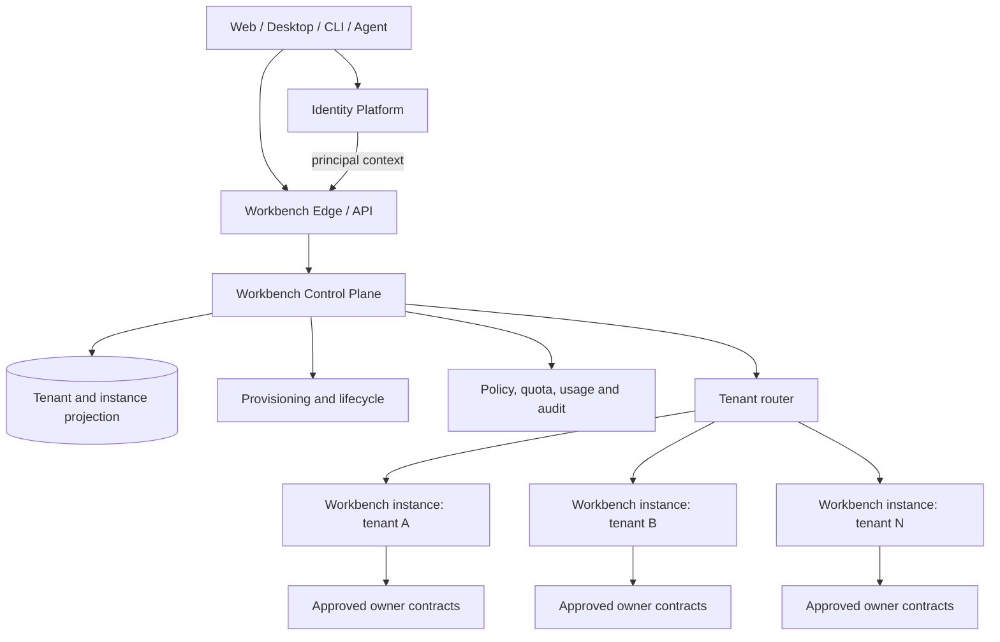

# Workbench 通用平台与多租户设计

## 1. 产品定位

Yeisme Workbench 是连接用户、团队、项目、Agent、Skill、任务和领域 owner 的可选通用工作平台。它的主产品体验是一个 Agent-first 工作区：用户持续在主对话中交互，并按当前任务热插拔 Context、Run、Review、Evidence、Operations 等受控 Pane。Workbench 提供项目与 consumer 目录、任务控制、审查证据、安全摘要和外部深链，让 Scaena、Auctra、Eikona、Sonora 等产品保持各自的领域真相源、独立产品入口和部署节奏。

Workbench 不作为这些专业产品的宿主，也不是购买或使用它们的前提。Scaena 当前通过 backend/API/worker 和获批消费者合同提供生产能力；Workbench 的价值是帮助同时使用多个产品的个人、团队或企业定位工作、查看跨产品摘要并跳转到已批准的专业消费入口。

租户、项目和协作模型参考 Linear 的信息架构、速度与上下文切换；主交互布局参考 Codex Desktop / OpenCode Web UI 一类 Agent 工具工作区，但不复制其视觉资产、品牌、插件执行模型或领域对象。应用主壳、对象模型、页面/Pane 归属、前后端组合和可用性标准以 [Agent-first 应用 Blueprint](agent-workbench-blueprint.md) 为真源；最终界面以 [Agent-first Pane UI spec](../ui/agent-first-workbench.md) 和三张受版本管理的 Eikona 参考图为当前视觉基线。

### 1.1 当前首版与后续托管平台的关系

2026-09-05 已确定当前优先交付个人高频使用的 [项目连续性桌面工作台](project-continuity-workbench.md)：项目与成果优先、Agent 持续协作、授权范围内自主推进。同一套 Web/BFF/服务合同在本地或服务器部署，使用本部署的工具、文件和执行环境。桌面 Web 为完整工作面，窄屏以查看/对话/审阅为主。

首版必须验证同版本本地与受控远程形态；不需要先完成 provisioning、公开注册、计费或多租户实例编排。远程认证、CSRF、权限和数据隔离继续复用既有 managed 基础，不能降级为公开 local token。下面的多租户架构是保留的后续平台方向，不是把当前项目重新变成团队平台的要求。

当前只完成 [owning OpenSpec](../../openspec/changes/workbench-project-continuity-desktop-v1/design.md) 的规划资产；真实 Runtime、Pinax、成果与部署 readiness 独立判定。

## 2. 用户与核心场景

### 目标用户

- 个人创作者：需要一个私有空间组合多个 Yeisme 工具和本机 Agent。
- 创作团队：需要共享项目、角色、审查、交付和可追溯任务记录。
- 工作室与企业：需要独立实例、统一身份、配额、审计、升级窗口和数据边界。
- 自动化与 Agent：需要稳定的 SDK、HTTP、gRPC、JSON-RPC 和事件合同，而不是依赖页面状态或人工 CLI 文本。

### 后续托管平台核心工作流

1. 用户通过统一身份平台登录，进入最近使用的个人或团队租户。
2. 用户在租户切换器中选择工作空间；客户端获得带 audience、tenant、membership version 的可信 principal context。
3. Workbench 控制面解析租户实例映射，将请求路由到该租户的活动实例。
4. 用户进入 Agent 主对话；session、timeline 和 composer 保持为主工作区，需要的 Context、Run、Review、Evidence 或 Operations 通过受控 Pane 打开。
5. 租户实例通过 owner capability catalog 解析 Pane availability，并执行权限、成本、版本与幂等 gate；不可用能力显示 `needs_contract`，不由浏览器伪造。
6. 领域 mutation 由 owner 公开合同执行；Workbench 只保存任务控制面的安全投影、引用与回执索引。
7. 控制面汇总实例健康、用量、版本、审计和生命周期状态，不跨租户读取领域内容。

专业创作任务采用松耦合跳转：Workbench 展示 owner-authored 摘要并按获批合同打开专业消费者；它不在自己的 React 应用中加载 Scaena 页面或复制专业领域状态机。

## 3. 多租户原则

Workbench 的多租户以**多实例 + 控制面**为主，而不是把所有租户数据混在一个业务实例中再依赖每次查询正确过滤。

这里的 `instance` 是一个可独立路由、隔离存储、控制生命周期和验证版本的逻辑运行单元。它可以落在独立进程、容器、数据库或专属部署中；即使低成本环境复用部分基础设施，也不能弱化 tenant binding、存储命名空间、密钥、路由和审计边界。

### 身份与授权事实

- Identity Platform 持有全局 `User`、`Identity`、`Tenant` 和 `Membership` 真相。
- Workbench 不创建第二套用户、租户或成员关系真相源，只保存必要的 tenant safe projection、实例映射和授权版本引用。
- 客户端提交的 `tenant_id`、`user_id`、role 或 workspace 不能直接作为授权事实；服务必须从可信 session/token context 解析。
- membership 撤销、角色变化或版本过期后，旧上下文必须被拒绝或重新解析，不能依赖长期缓存继续访问。

### 隔离模型

- 一个 tenant 在任一时刻绑定一个活动 Workbench instance；迁移期间可存在 source/target 两个实例，但只有控制面决定读写路由。
- 默认数据边界是 tenant instance。Task metadata、Attempt、Event index、Gate、Receipt、查询缓存和安全引用按实例隔离。
- 高等级租户可使用独立计算、独立数据库、独立密钥和独立升级窗口；开发或低成本环境可以使用共享基础设施，但逻辑实例、存储命名空间、凭据和路由仍必须隔离。
- 跨租户搜索、报表或运营视图只能读取控制面批准的聚合指标和脱敏审计投影，不能直接联查租户领域数据库。

### owner 边界

- Workbench instance 组合 owner capability，但不成为 owner canonical state 的副本。
- owner adapter 只能调用批准的公开 API 或结构化 local bridge，不读取 owner 私有数据库、目录、credential 或 human CLI output。
- 原始 prompt、provider payload、artifact blob、完整思维链和私有路径不得进入控制面或跨租户索引。

### Tenant、Workspace 与 Project 边界

- `Tenant` 是身份、成员关系、策略、实例和计费边界，对应个人空间或组织。
- `Workspace` 是 tenant 内的产品视图或协作分组，可以用于组织项目，但不能作为授权根或实例路由依据。
- `Project` 是 owner 领域资源与 Workbench 任务的主要工作上下文，必须属于当前 tenant。
- 当前 v1alpha1 Task 合同中的 `workspace_id` 只是本机任务作用域字段，不等同于可信 `tenant_id`。未来接入多租户时必须以 additive contract 增加服务端解析的 tenant context，并提供版本化迁移；不得直接把 caller 传入的 `workspace_id` 升格为租户授权事实。

## 4. 目标架构



### 控制面职责

| 能力 | 职责 |
| --- | --- |
| Tenant resolution | 校验可信 principal context，将 tenant 映射到活动实例与区域 |
| Instance registry | 记录 instance ID、tenant binding、版本、状态、endpoint、capacity class 和健康摘要 |
| Provisioning | 创建、初始化、暂停、恢复、迁移和退役租户实例 |
| Routing | 处理 slug/tenant 到实例的路由，阻止 caller 自选未授权 endpoint |
| Policy and quota | 投影套餐、并发、存储、operation、owner 与成本策略 |
| Usage and billing refs | 汇总脱敏 usage meter 与账单引用，不复制领域内容 |
| Upgrade and recovery | 灰度升级、兼容检查、备份、恢复、迁移和回滚 |
| Audit | 记录登录上下文、管理动作、实例生命周期和策略决策的安全摘要 |

### 租户实例职责

| 能力 | 职责 |
| --- | --- |
| Project experience | 提供租户内项目、视图、筛选、收藏、通知与最近访问体验 |
| Task control | 运行统一 Operation registry、Task 状态机、幂等、gate、事件和 receipt |
| Owner composition | 调用已批准的 Scaena、Auctra、Eikona、Sonora 等公开合同 |
| Local projections | 保存 Task metadata、safe refs、查询缓存和必要的 UI 组合状态 |
| Tenant enforcement | 所有查询、mutation、事件订阅和 artifact ref 都绑定已解析 tenant context |
| Evidence | 为 integration、component、system 和 e2e 运行生成脱敏证据 |

## 5. Linear 式产品模型

Workbench 使用以下层级建立清晰的多租户体验：

```text
Global User
  -> Tenant（个人空间或组织）
      -> Membership / Role
      -> Workspace Views
      -> Projects
          -> Tasks / Runs / Reviews / Handoffs
      -> Agents / Skills / Owner Connections
      -> Settings / Usage / Audit
```

### 关键交互

- **租户切换器**：显示个人空间与已加入组织，切换后刷新全部项目、任务、搜索、通知和命令上下文。
- **稳定 URL**：URL 使用 tenant slug 与稳定资源 ID；服务端必须重新解析 slug，不能把 slug 当作授权依据。
- **邀请与成员**：邀请、接受、移除、角色变更由 Identity Platform membership 合同驱动，Workbench 展示投影与产品权限结果。
- **角色模型**：首期保持 `owner`、`admin`、`member`、`guest` 四级；领域 owner 可以在自己的资源上增加更细权限，但不能提升 tenant membership。
- **个人与团队空间**：个人空间使用同一 tenant 模型，不建立特殊的旁路数据结构。
- **快速操作**：命令面板、键盘导航、全局搜索和最近访问始终限定在当前 tenant；跨租户操作必须显式切换或进入受控聚合视图。
- **状态真实**：实例 provisioning、迁移、owner unavailable、permission gate 和 cost gate 必须显示真实状态，不使用前端假成功。

## 6. 控制面关键状态

### Tenant instance lifecycle

```text
requested -> provisioning -> ready -> active
                         \-> failed
active -> suspended -> active
active -> migrating -> active
active -> retiring -> retired
```

- `provisioning` 期间只允许查看进度和安全诊断，不接受领域 mutation。
- `suspended` 禁止新 mutation，但保留符合策略的只读访问、导出或申诉入口。
- `migrating` 由控制面执行单写路由、版本检查和切换；客户端不得同时向 source/target 写入。
- `retired` 不可恢复路由；恢复必须创建新的受审计生命周期动作。

### 请求路由不变量

1. 先验证身份，再解析 membership，再确定 tenant instance。
2. 实例 endpoint 只来自控制面 registry，不能由请求参数覆盖。
3. 下游调用携带短期、限定 audience 的 instance context，不传播外部 provider token。
4. mutation 同时校验 tenant、project、operation、permission、cost、expected version 和 idempotency scope。
5. 实例不可达时返回明确的 unavailable/maintenance 状态，不静默路由到其他租户或空实例。

## 7. 当前范围与非目标

### 当前已实现

- 本机 loopback-only 单实例 `WorkbenchTaskService`。
- TypeScript SDK、REST+SSE、gRPC、JSON-RPC 2.0 的共享 Task 语义。
- Operation registry、状态机、幂等、permission/cost gate、事件和 receipt 安全投影。
- GORM + pure-Go SQLite 的本机私有 metadata store。
- 单一 `/agent` conversation workspace、session rail、timeline、composer、versioned Pane registry 与首批 Context/Run/Review/Evidence/Operations/Context Map Pane；当前 desktop 仍主要是单 Pane 呈现，多 Pane dock 属于 `workbench-agent-pi-workspace-v1` 的下一实现切片。

### 下一阶段

- 接入统一身份平台的可信 principal context。
- 定义 tenant context、instance registry、tenant router 和 provisioning 合同。
- 建立实例健康、版本、配额、用量、审计、备份、恢复和迁移流程。
- 在 Web 客户端实现租户切换器、成员设置、实例状态和项目级导航。
- 将 `/agent` 升为默认产品入口，交付 compact product rail、desktop 1–3 Pane dock、command palette，并把旧并列页面迁成 Pane、advanced route 或 Owner deep link。
- 为 dedicated tenant instance 与本机 personal instance 提供同一 Task/Operation 合同。

### 明确非目标

- 不让 Workbench 取代 Identity Platform、领域 owner、credential vault 或支付系统。
- 不把所有 tenant 的领域数据放进一个可任意联查的 Workbench 数据库。
- 不允许浏览器绕过 Workbench/owner 合同直接执行 mutation。
- 不在当前本机版本宣称 cloud hosting、企业 SSO、SCIM、跨区域容灾或计费已经可用。
- 不复制 Linear 的代码、品牌、设计资产或专有实现。
- 不成为各领域 owner 的统一前端宿主、强制登录入口或同步发布单元。
- 不复制 Scaena 图片/视频抽卡、Candidate Wall、Production Canvas、production acceptance、Assembly 或 Delivery 等专业工作流。
- 不通过 iframe、Module Federation、远程组件或共享浏览器 store 嵌入独立 Studio；首选集成是经独立鉴权校验的 HTTPS 深链。

## 8. 验收标准

目标多租户架构进入正式实现前，至少满足以下设计验收：

- Identity Platform 与 Workbench 对 `tenant_id`、membership version、audience、role projection 和撤销语义有版本化合同。
- 任一请求都能从可信身份上下文解析到唯一活动 instance，且 caller 不能覆盖路由目标。
- 两个租户使用相同 resource ID、project ID 或 idempotency key 时不会读取、复用或冲突对方数据。
- tenant suspend、membership revoke、instance unavailable 和 migration cutover 都有 fail-closed 行为及可验证状态。
- 控制面日志、usage 和 audit 不包含 credential、Authorization、raw prompt、provider payload、私有路径或完整思维链。
- dedicated、local personal 与未来 pooled deployment 复用同一 Operation/Task 合同，不产生前端特判状态机。
- integration、component、system 和 e2e 测试写入 `temp/integration-test-runs/<run-id>/`，并覆盖跨租户拒绝、路由、迁移、撤销和恢复证据。

## 9. 交付边界

本文是产品和目标架构说明，不代表多租户托管能力已经实现。正式交付需要在 Workbench 子项目创建独立 OpenSpec change，明确控制面 API、数据模型、实例编排、迁移、回滚、安全威胁模型、兼容窗口和验证命令；统一身份、Aigora、MCP Gateway 与 owner subproject 的实现仍由各自 OpenSpec owner 承接。

Creator consumer 的当前 owner 对接同样仍是 planning/readiness：Workbench Operation 规划见 [workbench-orbital-owner-operations](../../openspec/specs/workbench-orbital-owner-operations/spec.md)，浏览器 consumer 的唯一状态口径见 [creator-studio-owner-consumer-matrix](../../openspec/changes/archive/2026-09-01-workbench-owner-backend-integrations/details/creator-studio-owner-consumer-matrix.md)，Auctra 侧以 [Service API interface](../../../../cli/auctra/docs/service-api-interface.md) 为 owner 入口，Scaena 侧由其 owner repository 中的独立 handoff OpenSpec 承接。浏览器始终只经 Workbench BFF / `workbenchd` 消费安全投影；不得据此宣称 owner contract、direct browser transport 或 mutation 已 live，也不得在 Workbench 复制 owner canonical state。
