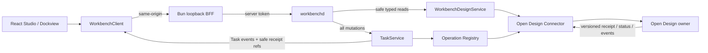
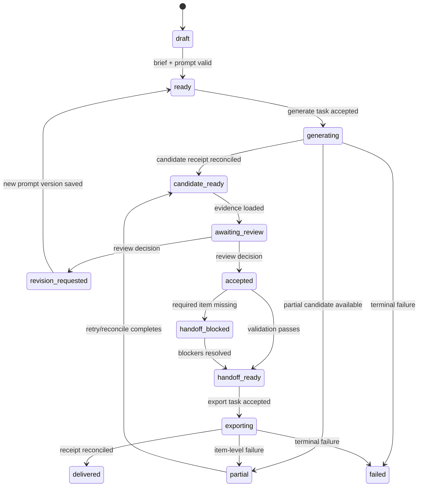
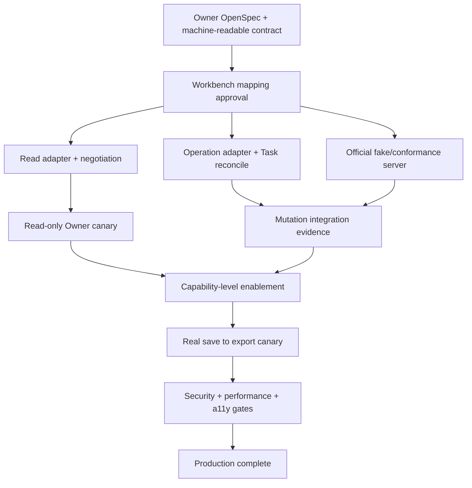

## Context

`open-design-studio-experience` 已交付 React 19 + Dockview 工作区、Bun loopback BFF、`WorkbenchClient.design` 只读安全投影、文件预览和真实 capability gate。当前主要缺口不是视觉完整度，而是生产闭环：prompt 无法保存为 owner version，candidate 无法真实生成与取消，review 无法写回，handoff 无法校验和导出，页面只能把这些动作标为 `needs_contract`。

本设计面向本机 loopback 单用户的完整产品版本。完整的定义是：用户可以从项目输入开始，完成提示词编辑、生成、比较、审查、修订、交付和恢复；所有副作用都可追踪、可对账、可安全失败。它不要求在同一版本加入多租户、多人实时协作或通用设计编辑器。

参与边界：

- Open Design 持有项目、prompt、reference、candidate、review、handoff 和 artifact 的 canonical state。
- Workbench 持有 UI 组合状态、查询缓存、Task metadata、attempt、event index、safe refs 和 receipt ref。
- 浏览器只访问同源 Bun BFF；BFF 注入用户级 session token；`workbenchd` 连接固定配置的 owner endpoint。
- 所有 mutation 进入既有 Operation registry 与 `TaskService`，不得创建 Design 专用旁路状态机。

## Goals / Non-Goals

**Goals:**

- 交付从 Brief 到 Export 的单用户生产闭环，主路径不再出现 `needs_contract`。
- 让每个 candidate、decision 和 handoff 都能追溯到安全 source refs、owner version、Task、event 与 receipt。
- 统一 REST、gRPC、JSON-RPC 与 TypeScript SDK 的 additive contract 和错误语义。
- 在 offline、partial、conflict、permission denied、cost rejected、unknown accept 与 SSE reconnect 后提供可理解的恢复动作。
- 保持 Workbench 无设计正文持久化、无私有路径、无 owner credential、无 artifact blob。
- 让完整功能可以按合同、服务、UI、验证四条独立 lane 实施，并有明确晋级门槛。

**Non-Goals:**

- 多用户实时协作、评论线程、组织权限、多租户托管和云端部署。
- 在 Workbench 内实现 Figma 类自由画布、像素级图形编辑或 owner provider 配置。
- 复制 Open Design 数据库、目录、状态机或生成引擎。
- 使用 CLI human output、任意 shell、动态 URL 或浏览器直连 owner 作为生产 transport。
- 自动重试 `unknown_accept`、自动接受 review、自动绕过 permission/cost/version gate。

## Decisions

### 1. 采用“读 projection + 写 Task Operation”的双通道

Design reads 保持快速、无持久化的 typed projection；Design writes 注册为标准 Operation 并复用 permission、cost、expected-version、idempotency、attempt、event、receipt 和 reconcile。相比新增 `DesignMutationService`，该方案避免第二套任务状态机和 transport-specific handler。

### 2. Open Design connector 必须版本化且机器可校验

connector capability document 至少声明 `contractVersion`、read methods、operations、event stream、max payload、idempotency、version precondition、cancel、receipt 和 reconcile 支持。启动时协商失败返回 `contract_mismatch`；禁止根据 HTTP 200 猜测能力。

owner 未完成合同前，先在 Open Design 子项目创建独立 OpenSpec handoff。Workbench adapter 只能消费批准的公开 API 或结构化 local bridge，不能解析 CLI 文本或读取私有目录。

#### Owner 合同取证记录（2026-07-19）

对当前 `http://10.10.1.101:7456` 的只读取证确认服务版本为 `0.8.0`，且目标项目 `open-design-studio-experience` 可通过公开 HTTP API 获取安全项目摘要、文件清单、原始文件和项目文件变更 SSE。已验证的只读接口包括：`GET /api/version`、`GET /api/health`、`GET /api/projects`、`GET /api/projects/:id`、`GET /api/projects/:id/files`、`GET /api/projects/:id/files/:path`、`GET /api/projects/:id/raw/:path`、`GET /api/projects/:id/events`、`GET /api/skills`、`GET /api/design-systems` 与 `GET /api/agents`。因此 Workbench 可以真实交付项目浏览、文件展开、显式文本读取、安全 HTML `srcDoc` 预览和文件清单刷新，不应把这些能力误报为 demo。

公开 source map 同时包含 `@open-design/contracts` 的运行时代码，确认 `FINALIZE_SCHEMA_VERSION = 1`、`HANDOFF_SCHEMA_VERSION = 2`，以及 `POST /api/projects/:id/finalize/:provider` 等现有能力。但这些常量和 finalize 请求并不构成本设计需要的 capability document：当前 API 没有发布 `contractVersion`、prompt version、candidate projection、review decision、handoff manifest/item receipt、idempotency、expected owner version、cancel、status reconcile 或 mutation event cursor 的完整领域语义。`GET /api/version` 返回的是应用版本，不得替代合同版本协商。

进一步检查公开业务 source map 后确认：现有 finalize hook 使用最长 130 秒的同步 `POST`，用户取消只执行 `AbortController.abort()`，源码注释明确说明 daemon synthesis 可能仍在运行，timeout 后也可能继续；它没有 operation ref、幂等、receipt 或 status reconcile，不能安全映射为 `design.candidate.generate/cancel`。现有 handoff 的错误语义是从 conversation transcript 合成结果（例如 `CONVERSATION_NOT_FOUND`、`EMPTY_TRANSCRIPT`），不是 required/optional item、manifest version、validation blocker、per-item receipt 与 partial retry 合同，不能映射为 `design.handoff.prepare/export`。`/api/runs/:id/cancel` 等通用运行接口同样不能在缺少领域绑定与 receipt 语义时被推断为 Design Operation。

基于这些证据，Workbench 将已验证的 project/file/text/agent/skill/design-system reads 标记为 `available`，把六个 mutation 与 workflow/candidate/review/handoff typed reads 保持 `needs_contract` 或 `contract_mismatch`。不得从通用 chat/finalize payload、前端文案或项目文件命名反推领域状态，也不得把 `candidate-compare.html`、`review-evidence.html`、`handoff.html` 等展示文件解释为 canonical candidate、decision 或 receipt。

当前实现阶段的能力矩阵：

| 能力 | Owner 证据 | Workbench 状态 | 晋级条件 |
| --- | --- | --- | --- |
| 项目摘要与文件清单 | versionless typed HTTP JSON | `available` | 保持字段白名单、大小限制与私有路径剥离 |
| 显式文本/HTML 预览 | opaque `fileRef` 重新解析后读取公开 raw/file endpoint | `available` | MIME、大小、CSP、sandbox、无凭据子上下文通过测试 |
| 文件变更观察 | project SSE `ready` / `file-changed` | `available`（无 cursor） | 已完成同源脱敏代理与失效刷新；Owner 发布 cursor 后再晋级断点恢复 |
| workflow/prompt/candidate/review/handoff reads | 无版本化领域 read contract | `needs_contract` | owner 发布机器可校验 read schema 与稳定错误 |
| 六个 Design mutation | 无 receipt/reconcile/idempotency 合同 | `needs_contract` | owner 发布完整 write/event/receipt/cancel/reconcile 合同 |

owner 晋级时必须一次性交付：

1. 可获取且版本锁定的 machine-readable contract；
2. capability negotiation 与最小/最大兼容版本；
3. prompt/candidate/review/handoff typed request、result 与 stable error；
4. event cursor、receipt/status reconcile、cancel 语义与 unknown-accept 处理；
5. `workspaceRef`/`projectRef`/opaque resource ref 的作用域规则；
6. expected owner version、idempotency、payload 上限与 redaction 约束。

Workbench 已将待 Owner 确认的方法 id、字段语义、Operation 状态机、event/receipt/reconcile、稳定错误、Handoff item receipt 与验收场景整理到 `docs/implementation/open-design-owner-contract-handoff.md`。该文档是 Owner OpenSpec 的输入，不是当前服务能力声明；具体 transport binding 由 Owner 批准合同决定，Workbench 不预设私有 endpoint。

#### Owner 方法到 Workbench 的唯一映射

| 领域阶段 | Owner read method id | Workbench read projection | Owner mutation operation |
| --- | --- | --- | --- |
| Workflow | `design.workflow.get` | `GetDesignWorkflow` | 无；由 Owner + Task projection 合成 |
| Prompt | `design.prompt.version.list/get` | `ListPromptVersions` / `GetPromptVersion` | `design.prompt.save` |
| Candidate | `design.candidate.list/get/compare` | `ListDesignCandidates` / `GetDesignCandidate` / `CompareDesignCandidates` | `design.candidate.generate` / `design.candidate.cancel` |
| Review | `design.review.evidence.list` / `design.review.status.get` | `ListReviewEvidence` / `GetReviewStatus` | `design.review.decide` |
| Handoff | `design.handoff.draft.get` / `design.handoff.validate` | `GetHandoffDraft` / `ValidateHandoff` | `design.handoff.prepare` / `design.handoff.export` |

映射遵守“一种用户动作只有一个 canonical Owner mutation”原则。Workbench 的 reload、retry、reconcile 与 panel 操作不是新的领域 mutation；partial retry 创建 child Task，但仍调用原 Operation 且只携带失败 item refs。

### 3. 工作流是 projection，不是新的 canonical state

`DesignWorkflowSummary` 由 owner projection 与 Workbench Task projection 合成，用于导航和下一步建议，不单独写入数据库。

`offline`、`contract_mismatch`、`permission_required` 和 `unknown_accept` 是覆盖态，不改写 owner canonical phase。UI 同时展示 phase 与 overlay，避免把网络故障误写成业务失败。

### 4. Prompt 与 revision 只在 owner 保存

Prompt editor 在浏览器内持有未保存文本和 dirty 状态；保存调用 `design.prompt.save`，成功后返回新的 opaque `promptVersionRef` 和 owner version。Workbench 不把正文写入 localStorage、Task payload、event、receipt 或日志。离开 dirty editor 时必须警告；断网期间允许复制文本，但不显示“已保存”。

选择该方案而不是浏览器 IndexedDB 草稿，是为了保持默认最小数据驻留。未来若需要离线草稿，必须单独设计加密、清理和敏感内容策略。

### 5. Candidate 生成、比较与 lineage

`design.candidate.generate` 输入只包含 `projectRef`、`promptVersionRef`、`referenceRefs`、`skillRefs`、`designSystemRef`、安全 options、`expectedOwnerVersion` 与 `idempotencyKey`。生成正文和 provider payload 由 owner 解析。

候选 projection 至少包含：opaque candidate ref、状态、preview ref、prompt/reference/skill/design-system lineage、可选 `supersedesCandidateRef`、可选 `revisionDecisionRef`、quality summary、created time、owner version、Task ref 和 receipt ref。两个 revision lineage 字段为 additive safe refs：Proto 使用新字段号 14/15，旧 consumer 可忽略；回滚只停止发送并隐藏新字段，不重用字段号、不改变既有字段语义。比较最多同时加载四个 candidate；preview 采用 owner 批准的短期同源 proxy URL，不把私有路径暴露给浏览器。

### 6. Review 使用 append-only decision 与乐观并发

`design.review.decide` 支持 `accept`、`reject`、`request_revision`，必须提交短理由、candidate ref、evidence refs、`expectedOwnerVersion` 和 idempotency key。owner 生成不可变 decision receipt；Workbench 只保存 receipt ref 和安全摘要。

版本冲突返回 `version_conflict` 并附最新安全 version/ref，UI 强制重新加载和重新比较，不能静默覆盖。完整内部推理、raw prompt 和 hidden evaluation 不进入理由或 evidence。

### 7. Handoff 是可校验 manifest，不是文件复制

handoff draft 固定包含 UI spec、visual references、tokens、component inventory、interaction inventory、contract gaps、verification checklist 与 target owner。`design.handoff.prepare` 生成 owner manifest version；`ValidateHandoff` 返回 item-level blocker/warning。强制项不能由 UI 移除。

`design.handoff.export` 只向 owner 批准的目标执行并返回 item receipts。部分失败保持已成功 item 的 receipt，失败项可用新的 idempotency key 和 `parentTaskId` 重试；Workbench 不写 owner 私有目录。

### 8. Operation 与 read contract

新增只读方法：

- `GetDesignWorkflow`
- `ListDesignReferences`
- `ListPromptVersions` / `GetPromptVersion`
- `ListDesignCandidates` / `GetDesignCandidate` / `CompareDesignCandidates`
- `ListReviewEvidence` / `GetReviewStatus`
- `GetHandoffDraft` / `ValidateHandoff`

新增 Operation：

- `design.prompt.save`
- `design.candidate.generate`
- `design.candidate.cancel`
- `design.review.decide`
- `design.handoff.prepare`
- `design.handoff.export`

所有注册成功的 Operation 必须自动投影到 SDK、HTTP、gRPC 和 JSON-RPC，并共享错误码、task ID、event、receipt、idempotency 和 reconcile 语义。request 仅保存 safe refs；若 transport payload 包含 prompt body，TaskService 必须在进入 persistence/event 前将其封装为瞬时 owner invoke body 并显式标记 `non_persisted`。

### 9. Event、reconcile 与未知接受

浏览器分别维护 Task SSE cursor 与 Design projection freshness；重连先恢复 Task event，再按受影响 refs 刷新 owner projection。event 只包含 task state、progress、safe refs、error class 和 receipt ref。

owner timeout 且不能确认是否接受时，Task 进入 `unknown_accept`：

1. 禁止自动重放 mutation。
2. 使用 idempotency key 或 owner receipt query 对账。
3. 确认未接受后才允许用户显式 retry。
4. 确认已接受后补齐 receipt 并刷新 projection。
5. 无法对账时保留人工恢复指引，不伪造 failed/cancelled。

### 10. UI 信息架构与工作流机制

| Surface | 完整职责 | 主要动作 | 空态/失败恢复 |
| --- | --- | --- | --- |
| Project Studio | 展示 workflow phase、来源、活动与下一步 | 打开来源、继续当前步骤 | connector diagnostics、重新连接 |
| Prompt Library | 编辑、保存、版本、diff、lineage | 保存版本、选择生成输入 | dirty warning、冲突 reload |
| Candidate Compare | 1–4 候选预览、差异和证据 | 生成、取消、比较、送审 | partial retry、preview fallback |
| Review Evidence | 风险、证据、版本条件、决策 | 接受、拒绝、请求修订 | conflict refresh、gate explain |
| Handoff | manifest、blocker、目标与 receipts | prepare、validate、export、retry item | partial export recovery |
| Activity / Evidence | Task、event、receipt 与 diagnostics | 过滤、复制 safe ref、reconcile | SSE reconnect、unknown accept |

每个页面复用 Dockview panel registry。文件、candidate preview 和 manifest preview 支持面板内最大化、恢复、浮动和重置；移动端改为受控 Tab/Sheet，不开放自由 docking。命令面板只显示 capability 允许的动作，并在执行前展示 permission、cost 与 version gate。

### 11. 一致错误模型

| Error/overlay | 是否重试 | 用户动作 |
| --- | --- | --- |
| `offline` | 查询可退避重试 | 重连、查看 diagnostics |
| `contract_mismatch` | 否 | 升级 owner/Workbench，复制版本诊断 |
| `permission_required` | 否 | 查看缺失 scope，不提升本地权限 |
| `cost_rejected` | 需重新确认 | 修改范围或显式批准 |
| `version_conflict` | 否 | 刷新并重新比较 |
| `partial` | 仅失败项 | 选择失败项显式重试 |
| `unknown_accept` | 禁止自动重试 | reconcile 后决定 |
| `validation_failed` | 否 | 修复 prompt/handoff blocker |

### 12. 安全、隐私与审计

- BFF 忽略浏览器 `Authorization`，仅使用服务端 token；Origin、Host、redirect、SSE 和 preview proxy 均执行 loopback allowlist。
- owner endpoint 只来自启动配置；opaque ref 必须由服务端重新解析，不允许 URL/path 拼接。
- 日志、event、Task DB、evidence、截图和错误不得包含 raw prompt、provider payload、credential、Authorization、私有路径或完整思维链。
- mutation receipt 记录 principal ref、operation、project ref、owner version、permission/cost decision、idempotency digest、时间与结果摘要；不记录正文。
- candidate preview 设 MIME、size、CSP、download 与 cache 边界；HTML preview 必须 sandbox，禁止继承 BFF session。

### 13. 性能与容量

- 首屏只加载 workflow summary、项目安全摘要和最近活动；prompt body、candidate preview、evidence 和 manifest 按需加载。
- candidate 列表分页，默认 24 项；比较并发上限 4；preview 使用取消信号并避免后台全量预取。
- Task SSE 重连采用游标与指数退避；projection query 使用短 TTL、ref/version key 和失效刷新，不跨用户持久化。
- 目标：本机 warm first shell < 1.5s、常规 panel 切换 < 100ms、无正文 projection p95 < 300ms；owner 生成耗时不计入 UI latency，但必须持续显示事件或 heartbeat。

### 14. 可观测性与测试证据

统一关联字段：`taskId`、`attemptId`、`operation`、`projectRef`、`ownerRef`、`ownerVersion`、`idempotencyDigest`、`receiptRef`、`eventCursor`。浏览器 diagnostics 只显示安全字段。

测试分层：

- unit：状态转换、overlay 组合、gate、redaction、layout migration。
- contract：Proto/JSON Schema/SDK 与四 transport parity。
- integration：真实 TaskService + connector fake server，覆盖成功、partial、conflict、unknown accept、cancel、reconcile。
- component：Vitest + Testing Library + MSW，覆盖六个 surface 和错误恢复。
- e2e：Playwright 覆盖 save→generate→compare→review→revise/accept→handoff→export，以及 reload/offline/a11y。
- security：token、SSRF、ref traversal、HTML preview sandbox、日志/evidence redaction。

2026-07-19 浏览器基线证据：`temp/integration-test-runs/20260719191819-f9c5b5ea-415a-44a2-a824-06fbbfa9bcb5/summary.json` 记录 25/25 Playwright 场景通过，覆盖四档 viewport、固定移动标签、reduced motion、Prompt 内存编辑/diff/脏状态保护、Candidate versioned generation 的 BFF input 与非乐观输出、Review expected-version 冲突后的锁定与 Owner reload、完整 prompt save→generate→request revision→new version→regenerate→lineage→accept→handoff→export 恢复链、430×932 Handoff prepare/export/partial child retry、required/optional item、item receipt、移动端无自由 docking、文件 preview 浮窗/最大化/恢复、opaque 文件 SSE 失效刷新、raster 同源 BFF 边界、浏览器无 Authorization 与 Axe critical/serious 清零。Dockview 7.0.2 会给浮窗 `role="dialog"` 添加不允许的 `aria-level="0"`，Workbench 在 Studio 容器内局部移除该属性并保留 dialog 语义，单元测试确保不影响合法 treeitem 层级。该基线仍使用浏览器路由夹具，不构成真实 save→export 主路径验收。

integration、component、system 和 e2e 入口写入 `temp/integration-test-runs/<run-id>/`，至少包含 `summary.json`、`command.txt`、`stdout.log`、`stderr.log`、`env.json` 和 `artifacts/`，失败保留原退出码和脱敏证据。

### 15. 实施工作流与能力级晋级

完整功能采用“Owner 合同先行、Workbench additive 落地、逐能力 canary、真实闭环发布”的机制。UI 完成不等于功能晋级；每个能力必须同时具备合同、adapter、Task、projection、恢复和证据。

实施分为五个波次：

1. **Contract wave**：Owner 批准合同版本、method binding、schema、errors、events、receipts 与 conformance；Workbench 完成唯一映射。
2. **Connector wave**：实现版本协商、typed reads、六 Operation invoke、cancel/reconcile 与官方 fake server；此阶段 UI 仍 fail-closed。
3. **Workflow wave**：按 Prompt → Candidate → Review → Handoff 顺序启用真实 projection 和 Task，Activity/Evidence 同步提供恢复入口。
4. **Canary wave**：先执行无 mutation 的 negotiation/read canary，再在专用测试项目执行真实 save→export；禁止对用户项目做自动写入探测。
5. **Release wave**：完成 security、performance、a11y、transport parity、redaction 与文档门禁后，才声明完整功能。

能力开关以 read method 和 Operation 为最小粒度，由 capability negotiation 结果驱动；不能使用单一 `production=true` 掩盖部分不兼容。某个 Operation 只有在下列条件同时满足时为 `available`：

- 合同版本兼容，request/result/error schema 可校验；
- permission、cost、expected owner version 和 idempotency gate 可执行；
- receipt、terminal status 和 unknown-accept reconcile 可用；
- 对应 read projection 可观察 mutation 结果；
- integration 与真实 Owner canary evidence 均通过。

`DesignCapabilities` 保留 `promptGenerate`、`reviewWrite`、`handoffExport` 等旧粗粒度字段以兼容现有消费者，并 additive 增加 `promptSaveOperation`、`candidateGenerateOperation`、`candidateCancelOperation`、`reviewDecideOperation`、`handoffPrepareOperation`、`handoffExportOperation`。新字段对旧消费者可选；缺失时 readiness 必须按 `needs_contract`，禁止由旧字段反推六个 Operation。字段号只新增不复用，回滚时停止发送新字段但不删除已发布定义。

关闭或降级任一能力时，进行中的 Task 继续可观察和 reconcile，但禁止新提交；UI 保留 safe refs、receipts 和恢复入口。回滚不得删除合同字段、历史 Task 或 Owner receipt，也不得把已知 partial/unknown 状态改写为 failed。

### 16. 完整功能 Definition of Done

| 层级 | 完成条件 |
| --- | --- |
| Owner | 合同已批准并发布；官方 conformance 可运行；六 Operation、event、receipt、reconcile 语义稳定 |
| Connector | 无 CLI 文本/私有目录依赖；版本协商、URL/ref/redaction 边界通过；timeout/unknown accept 可对账 |
| Task | permission、cost、version、idempotency、cancel、partial child retry 与四 transport parity 通过 |
| Projection | Prompt、Candidate、Review、Handoff 可从 Owner safe state 重建，含 freshness、pagination 和 lineage |
| Web | save→generate→compare→review→revise/accept→prepare→export 可完成；刷新、离线、冲突、partial 可恢复 |
| UX | Pane maximize/restore/float、移动 Tab/Sheet、键盘、focus、live region、reduced motion 与安全 preview 通过 |
| Evidence | unit/contract/integration/component/e2e/security/performance evidence 脱敏、可追踪、失败保留原退出码 |
| 发布 | 真实测试项目完成 save→export；主路径 capability 无 `needs_contract`；无 blocker/high risk |

任何一层未满足时，只能声明对应已验证能力，例如“项目浏览和安全文件预览可用”或“fixture 工作流测试通过”，不能声明 Open Design Studio 已 production complete。

2026-07-20 合同 canary 基线：`scripts/owner-contract-canary.ts` 已提供显式 URL、SemVer、无 credential/query/fragment/redirect、Content-Type、流式 1 MiB 上限和安全错误的 machine-readable contract 校验；7/7 单元测试确认读取在越界后立即取消且不回显原始 Owner 值。`temp/integration-test-runs/20260719193630-a11a5ed9-107c-4c3c-9112-177834bc433a/summary.json` 记录当前 Owner `/api/version` 被预期拒绝为 `contractVersion is required`。这份失败证据确认 fail-closed 行为正确，不代表 Owner 合同已交付。

## Migration Plan

1. **Contract promotion**：Open Design 完成并发布版本化 read/write contract；Workbench 添加 capability negotiation 与 fixture-free conformance server。
2. **Read model**：additive 扩展 proto/schema/SDK/Design service，发布 workflow、prompt、candidate、review、handoff projection；旧页面仍可运行。
3. **Mutation registry**：注册六个 Operation，完成 owner adapter、gate、receipt、cancel 与 reconcile；通过四 transport parity 后再开放 UI feature flag。
4. **Workflow UI**：按 Prompt → Candidate → Review → Handoff 顺序替换 `needs_contract`，Activity/Evidence 提供统一恢复入口。
5. **Hardening**：完成浏览器、race、安全、性能、redaction 和 evidence 门禁；主路径 capability 全部为 `available` 后移除 production flag。
6. **Rollback**：关闭 mutation feature flag 并禁用 connector operation capability，UI 回退到只读体验基线；additive contract 和已有 Task receipt 保留，无数据 migration 回滚。

发布晋级条件：主路径六个 Operation 不得为 `needs_contract`；所有 transport parity、`CGO_ENABLED=0`、race、Web、E2E、security 与 strict OpenSpec 门禁通过；不存在未解释 blocker 或高风险脱敏问题。

## Risks / Trade-offs

- **[Owner 合同尚未实现]** → 先完成 owner OpenSpec handoff；Workbench lane 可并行做 schema/UI fake server，但不得宣布完整功能。
- **[projection 与 Task 短暂不一致]** → 同时显示 owner version、Task state 和 freshness；终态后强制 reconcile refresh。
- **[raw prompt 经过 mutation transport]** → 标记瞬时 non-persisted body，在 registry/persistence/event/log 边界做结构化剥离和 redaction 测试。
- **[partial export 重复副作用]** → item-level idempotency 与 receipt，对失败项创建 child retry task。
- **[复杂状态淹没 UI]** → phase + overlay 双层模型，页面只展示当前可执行下一步，完整诊断放 Activity/Evidence。
- **[候选 preview 成为内容注入面]** → MIME allowlist、大小限制、同源 proxy、sandbox CSP 和无凭据子上下文。
- **[范围继续膨胀]** → 完整版限定单用户 production loop；协作、多租户、自由画布另立 change。

## Open Questions

- Open Design owner 的合同版本与 endpoint 名称由 owner OpenSpec 最终确认；Workbench 只依赖本设计列出的语义，不预设私有实现。
- `design.candidate.cancel` 在 owner 无法保证取消时必须声明 `unsupported`，但生成、比较、审查和交付主闭环仍须完整；UI 展示“停止请求”不能伪造 `cancelled`。
- candidate preview 的具体资源格式由 capability 宣告；首发至少支持安全 raster image，HTML/interactive preview 只有通过 sandbox 安全评审后晋级。
