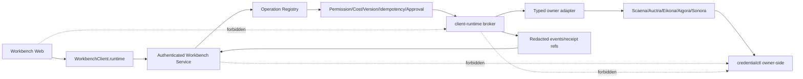

## Context

Workbench 已有 loopback-only Go runtime、session token、统一 `TaskService`、Operation registry、HTTP/gRPC/JSON-RPC transport、Owner service 和 `WorkbenchClient`。因此它不应另建前端 runtime BFF，而应把 Local CLI/BYOK runtime 纳入现有 service/SDK；只读 descriptor/readiness 复用统一 `clientruntime.Source`，未来 mutation 才进入 Operation registry/admission。当前 service 仍有多个 active OpenSpec 和未提交实现，runtime change 必须取得独立 path lease 后分阶段落地。

## Goals / Non-Goals

### Goals

- 为 SDK/Go service/Web 提供统一 `client_runtime.v0.1` descriptor/readiness。
- 通过 Operation registry 暴露 connection test 与未来 run/event/cancel/reconcile，保持四种 transport parity。
- 所有 mutation 复用 permission、cost、expected-version、idempotency、approval 与 receipt gate。
- 只组合 owner safe projection，不保存 raw owner payload、secret、private path 或 provider output。

### Non-Goals

- 不让 Web 直连 broker或 owner，不读取 session token。
- 不在 Workbench 复制 Scaena/Auctra/Eikona/Sonora/Aigora state machine。
- 不把 owner diagnostics command 当 arbitrary shell 执行。
- 不在 shared broker/owner adapter 缺失时伪造 run/event/cancel。

## Decisions

### 1. Runtime 是 WorkbenchClient 的第四个 facade

新增 `WorkbenchRuntimeClient`，`WorkbenchClient` 组合 `task/design/owner/runtime`。HTTP 与 JSON-RPC 使用同一 typed transport；Go 端以一个 secret-free `clientruntime.Source` 作为唯一状态/业务投影，HTTP/gRPC/JSON-RPC handler 仅做协议转换，protobuf 与 JSON schema 使用同一模型语义。未来有副作用的 runtime operation 进入现有 registry/admission，禁止在 transport 中实现独立 runtime 状态或 gate。

### 2. 分两阶段交付

阶段 A 不依赖共享 broker：

- `GetRuntimeDescriptor`
- `GetRuntimeReadiness`
- owner/broker unavailable diagnostic
- Web runtime settings/panel

阶段 A 的独立 Go core可以提前提供公共 broker SDK source，但在 registry/transport path lease、tagged dependency和integration evidence完成前不接主服务路由。monorepo canary可临时使用 sibling `replace`，正式发布必须切换为可验证的 broker module tag。

Phase A 的 broker-backed read path 复用共享 Go SDK `ProjectModule` 作为 descriptor/readiness 到 Local CLI/BYOK mode、adapter operation gate 的统一投影层，Workbench 仅将该安全快照转换为既有 DTO。全局 readiness 只能降低能力，显式 disabled 优先于 aggregate unavailable；按 owner/adapter 查询时，另一个 ready owner 不得提升当前 degraded/unavailable owner。共享投影解析失败统一返回安全 `broker_unavailable`，不得把底层错误、token、private path 或 provider detail带入 transport。该接入不改变既有 HTTP/gRPC/JSON-RPC/schema shape，也不等于启用 mutation。

Workbench TypeScript SDK 与 Web 不再复制 Local CLI/BYOK action gate 和 runtime input 白名单，而是通过 file-pinned `@yeisme/client-runtime/client-module` canary 使用共享 browser-safe projector。Workbench 仍拥有额外的产品门：固定 `aigora/aigora.text` binding、Operation registry mode/mutation/events、permission、cost 与 `projectModes=runtime` 必须全部成立后，才把共享 projector 的 `enabled` 设为 true。descriptor 与 readiness capability 先取交集再交给共享 projector，避免任一投影单独提升能力；危险 revision、未知 capability、partial/degraded/disabled 状态均 fail closed。该依赖在 `0.1.0-dev` 阶段只用于 monorepo canary，正式发布前仍需切换到可验证 tag。

Workbench 的产品入口采用 Connections 内的单一“Local CLI & BYOK”能力中心，而不是按 owner 复制设置页。页面保持紧凑 diagnostics/control surface：每个固定 adapter/mode 同时展示 readiness、稳定 diagnostic code、生命周期 capability 列表、安全 remediation 与经过 Workbench gate 的可用动作。浏览器不提供 raw key 输入、CLI 命令执行、任意 provider 配置或直连 broker；未完成的 lifecycle、未知 capability 与默认关闭的 generate canary 必须明确显示为不可用，而不是隐藏系统状态或暗示已生产晋级。

阶段 B 依赖 broker/owner adapter：

- `TestRuntimeConnection`
- `StartRuntimeRun`
- `WatchRuntimeEvents`
- `CancelRuntimeRun`
- `ReconcileRuntimeRun`

阶段 B 在 security/integration evidence 前保持 registry gated。`connection_test` 可以早于 run/event/cancel/reconcile 做 capability-by-capability 晋级，但只允许固定 owner/adapter/action registration，且必须由独立 feature flag、当前 descriptor capability 与 broker instance revision 三重授权；回滚只需关闭该 flag 并重启 Workbench，不改变 task/owner canonical state。

共享 broker Go SDK 的 typed event stream 可以先接入独立 `service/internal/clientruntime` source：Workbench 只映射 allowlisted event type、run ref、sequence、cursor、code、safe ref 与 progress，并将 `cursor_expired`/`cursor_invalid` 投影为稳定 repair error。该 source 不注册 Operation、HTTP/gRPC/JSON-RPC route 或 Web action；缺 SDK event capability 时返回 gated，双 owner 与四 transport evidence 完成前 mutation/UI 仍保持 disabled。

### 3. Admission 绑定 runtime scope

mutation 必须绑定 owner、adapter、capability、operation、project/user、expected version、idempotency key、Workbench approval scope/expiry 和 resource budget。adapter/binary/workspace/profile revision 变化返回 `runtime_changed`，不得静默继续。`unknown_accept` 只能 reconcile，不能自动 retry。

独立 runtime operation handler 复用 `TaskService` 已完成的 permission/cost/version/idempotency gate，并在 dispatch 边界再次固定 scope：owner、adapter、action 与 Workbench operation type只能由注册配置给出；project、user、expected owner revision 与 idempotency key 只能从 trusted Task 生成；caller input 只允许 safe input ref 和三个扁平 resource limit 字段。approval 不来自 caller input：handler 必须通过只读 gate authority 再次确认该 task 所需 permission/cost gate 均为 approved、属于同一 task、具有 resolution timestamp，且未超过配置的短期 approval max age；随后用 task/gate authority 派生 broker approval ref、audience、revision 与 expiry。handler 与 registry 共用 exact additive schema，拒绝 nested approval/process/provider/credential 字段和 partial/ceiling-escalating limits。该 handler 在注册前只是 production-ready port，不改变现有 Operation catalog。

`connection_test` 首个 production wiring 固定为 `workbench.runtime.aigora.connection_test` → `aigora/aigora.text/connection_test`。Web 不直接调用 runtime mutation endpoint，而是从 Operation catalog 确认该 operation 已注册，再以当前 readiness revision 提交普通 Task；Task 页面复用现有 gate review。只有最终 gate 被批准后 TaskService 才会 dispatch，handler 再验证 gate authority 后调用 broker。浏览器不提交 host、provider、model、credential、approval ref 或 process 参数。

Workbench 现有非 synthetic dispatch input 默认只驻留进程内存，这是普通 owner payload 的安全默认，但会让待审批 runtime task 在服务重启后无法继续，也无法为后续 cancel/reconcile 恢复原始 safe scope。为此 registry 增加仅服务端可见的 `PersistSafeInput` 授权位：默认 false；只有 exact schema 已证明仅含 safe ref 与有界数字、且 handler 不接受 secret/provider/process/approval 字段的固定 runtime operation可以设为 true。TaskService 只持久化 registry 校验后的 canonical JSON，并在 dispatch/restart replay 时重新执行同一 schema 校验与 request digest 比对。未授权 owner operation、schema 漂移、digest 不匹配或新增字段一律 fail closed，绝不回退到任意 payload 持久化。

broker 返回 accepted/running 时 Workbench task 保持 running；terminal/rejected/unknown/cancel-requested 按固定映射处理。dispatch transport error 可能发生在 owner acceptance 后，因此保守进入 `unknown_accept` 并要求 reconcile，绝不自动 retry。`TaskService` 将成功 dispatch attempt 与 owner 生命周期分开记录：accepted/running 发 `task.accepted`，不确定接受发 `task.unknown_accept`，取消请求发 `task.cancel_requested`，只有 terminal result 发 `task.completed`；安全 owner receipt ref 继续作为 execution receipt 保存。真正注册前仍需完成 registry wiring 与四 transport parity。

该不确定接受规则只适用于 broker 提供稳定 reconcile 入口的持久 owner run。`connection_test` 是一次性 preflight，当前 broker 不提供 connection-test reconcile；若 transport 在探测期间失败，Workbench 必须返回固定、可重新由用户显式提交的 terminal unavailable/failed 结果，不得把 Task 留在无法恢复的 `unknown_accept`。这不是自动 retry：Workbench 不重发 probe，用户的新测试使用新的显式 Task/idempotency scope。未来若 broker 为 connection test 增加稳定 lookup/reconcile contract，必须先更新本 Spec、registry capability 与兼容性证据后才能改变该语义。

持久 owner run 的 cancel/reconcile 是原 Task 的 lifecycle command，不是新的 Operation catalog submission。可取消/可对账的 fixed start handler 通过内部 optional lifecycle interface 暴露 `Cancel`/`Reconcile`；`connection_test` 与未声明该接口的 owner operation 不具备 lifecycle capability。TaskService 必须先校验 task version/state、重新验证 `PersistSafeInput` 的 schema/digest，并把新的 `AttemptCancel` 或 `AttemptReconcile` 以 `started` 状态持久化成功，随后才能越过 broker side-effect boundary。原 task 的 permission/cost gates 仍须属于同一 task且全部 approved；它们证明基础授权但不被伪装成新的短期批准。新持久化 control attempt 的 ID、task、kind、created-at 与短期 max age 共同形成 cancel/reconcile broker approval scope，approval ref 使用 attempt ID，expiry 由 attempt created-at 派生。错误 kind、跨 task、未持久化/非 started、过期 attempt 或 unsafe ID 必须在 broker 前拒绝。

首个持久run registration固定为`workbench.runtime.aigora.generate` → `aigora/aigora.text/start`，并在registry内部声明`PersistSafeInput`、events、cancel与reconcile；owner/adapter/action仍只能来自registration。该registration函数可以独立实现和测试，但在真实Aigora generate owner binding、broker event/cancel/reconcile system evidence、独立feature flag与SDK/Web promotion gate全部完成前，不得由`workbenchd`主registry调用，因此Operation catalog与浏览器保持不变。connection-test独立flag不得顺带启用generate。

owner reconcile 的事实来源只能是 broker typed snapshot/event/receipt；caller 不能提交 observed terminal status 或 receipt ref 来替代 owner lookup。现有 synthetic/manual reconciliation 保持兼容，但 owner runtime task若未注册 lifecycle handler、缺 safe replay input、缺 approved gates或control attempt无法持久化，TaskService必须在改变task状态和调用broker前fail closed。broker返回cancel-requested时task保持`cancel_requested`；返回terminal/cancelled、running、rejected或unknown时按固定状态机与safe receipt投影，transport ambiguity继续进入`unknown_accept`且绝不自动retry。

### 4. Credential resolution 永远在 owner

Workbench 只传 `credential_ref` 与 scoped operation context。共享 broker 与 Workbench service 都不得 Resolve secret；Aigora/Eikona/其他 owner 在自己的进程内向 credentialctl 请求 grant 并执行 SSRF-safe probe/provider call。

### 5. Event 与 receipt 复用现有 Task 语义

runtime event 有单调 cursor、stable event type、redacted payload 和 task/attempt/receipt refs。断线续传与 cursor expiry 进入 reconcile；receipt 只保存安全摘要、owner refs、exit taxonomy 和 evidence refs，不保存 stdout/stderr/provider payload。

Task需要持久化最小、secret-free的runtime event checkpoint：`runtime_run_ref`、`runtime_event_cursor`与`runtime_event_sequence`。这些字段只属于Go control plane/GORM内部状态，阶段B promotion前不加入公开Task SDK/protobuf/JSON shape。首次支持events的dispatch只能从handler返回的validated `run_` safe ref绑定`runtime_run_ref`；之后event必须来自typed broker source、匹配同一run、cursor为safe `cursor_` ref且sequence严格连续。相同sequence+cursor作为幂等replay忽略；旧sequence、同sequence不同cursor、sequence gap、run漂移或unknown outcome均fail closed并要求reconcile，不猜测缺失事件。

TaskService把allowlisted event outcome映射到既有Task状态机，并在一个GORM optimistic mutation中同时推进task version/checkpoint、写safe summary event以及可选receipt/evidence ref。accepted/running保持running，terminal→succeeded，rejected→failed，unknown_accept→unknown_accept，cancel_requested→cancel_requested；不允许event绕过`CanTransition`。receipt/evidence只接受safe ref，分别写入现有Receipt/Artifact，不保存event raw JSON、stdout/stderr、provider payload或private path。该checkpoint新增持久字段需使用GORM schema version升级与migration test，不允许手写SQL。

`service/internal/clientruntime`提供有界Task event pump，把`EventSession`的typed projection转换为`core.OwnerEvent`并调用一个窄`OwnerEventSink`；生产sink由TaskService实现。pump从Task持久化run-ref/cursor与当前version开始，成功投影后使用返回的新version继续，exact replay由session/sink双层幂等。terminal/rejected完成后停止，EOF正常结束；cursor expired/invalid、session repair failure、sink gap/version conflict或达到max-events上限均停止且返回稳定reconcile/unavailable错误，不重发owner operation。该bridge不创建transport route、goroutine supervisor或browser action；runtime wiring必须在后续feature gate中显式拥有其生命周期和shutdown。

Connection-test 的系统验收必须从真实`WorkbenchTaskService`开始：Task先持久化并完成permission/cost gate，workbenchd再使用自己的facade token调用真实broker binary；broker只把safe refs交给显式启动的Aigora connection-only owner CLI；Aigora通过credentialctl readiness绑定当前revision并在owner进程内解析一次scoped credential。测试provider只允许一次probe，最终Task为`succeeded`。Aigora owner或broker process output、Workbench evidence中出现secret、Authorization、provider body/URL或private path均判失败。该证据只晋级`connection_test`，不能提升generate/events/cancel/reconcile。

Generate 的真实first-support路径只接收Aigora `operator-input put`签发的`input:vault:sha256:<digest>`。Workbench permission/cost gate与broker admission后，Aigora把safe binding写入现有Operator plan，worker一次性lease加密input、解析scoped credential并经GatewayService执行；broker event stream以已授权request做bounded reconcile，生成accepted/running/terminal cursor。背景轮询的瞬时不确定性只重试观察，不发unknown终止事件；显式unknown仍不自动retry。Queued cancel必须在provider前使用Aigora canonical事务完成。该能力继续受独立generate flag控制，且在security/tag/promotion完成前默认关闭。

## Contract and errors

- Contract: `client_runtime.v0.1` experimental additive。
- Stable mode: `local_cli | byok`。
- Readiness: `ready | degraded | partial | unavailable | disabled`。
- Mutation outcome: `accepted | rejected | unknown_accept`。
- Stable errors: `runtime_unavailable`、`runtime_changed`、`approval_required`、`approval_scope_mismatch`、`credential_grant_scope_mismatch`、`permission_denied`、`cost_limit_exceeded`、`version_conflict`、`idempotency_conflict`、`cursor_expired`、`reconcile_required`。
- 未知 enum/error/event 必须 fail closed 并保留原始安全 code ref，不得映射为 success。

## Risks / Trade-offs

- [Workbench 成为第二个 broker] → registry/admission 只代理固定 broker contract，不做 discovery/process execution。
- [四 transport 漂移] → registry/schema export/parity tests 是 promotion gate。
- [active changes 重叠] → 先完成 path lease；优先新增 `packages/task-sdk/src/runtime-*`、`service/internal/clientruntime/**` 等独立路径，再串行修改 registry/runtime wiring。
- [event SDK存在但owner operation未晋级] → 独立event source只作为typed dependency；registry/transport/Web未注册时保持`runtime operation gated`，不得用fixture stream提升readiness。
- [credential confused deputy] → service/broker 均无 Resolve 权限，grant audience 只能是 owning adapter。

## Migration and rollback

阶段 A 只添加新 SDK property、operations、routes 和 UI panel。旧 constructor 可通过 overloaded/default runtime client 保持 pre-v1 source compatibility；若 constructor shape 需要 breaking change，必须先提供 factory compatibility window。阶段 B feature flags 默认关闭。首个 connection-test flag 为 additive local configuration；关闭后 operation 不进入新 registry catalog，已有 terminal task/receipt 保持可读，未 dispatch task继续按既有 task/gate语义处理，不自动重放。`PersistSafeInput` 复用现有 Task replay-input 列，不新增数据库迁移；回滚关闭 operation 后数据保持 inert，普通 owner operation仍不持久化 input。回滚不改 Task/Owner canonical state或持久化 schema。

## 当前收口状态

截至 2026-07-22，Workbench 内部实现已覆盖 descriptor/readiness、connection-test admission、固定 Aigora generate registration、permission/cost/version/idempotency gate、持久 owner event cursor、restart recovery、typed SDK lifecycle methods，以及默认隐藏的 Web generate canary。`WORKBENCH_RUNTIME_GENERATE_ENABLED` 与 `VITE_WORKBENCH_RUNTIME_GENERATE_CANARY_ENABLED` 默认均为关闭；connection-test flag 不会提升 generate。

当前 change 仍不能完成 Phase B promotion，阻塞均位于 Workbench 之外或要求独立角色签字：

- shared broker 仍通过本地 Go `replace` 与 TypeScript `file:` 接入，TypeScript package 为 private `0.1.0-dev`，没有可验证的 tagged consumer dependency；
- Aigora 当前验证对象是 dirty 工作树，不能替代稳定 owner release、credentialctl dependency tag 与 owner production gate；
- 实现者安全自检和现有 system evidence不能替代跨 Workbench、broker、Aigora、credentialctl/provider 边界的独立安全评审；
- 在以上门禁完成并形成 promotion receipt 前，generate capability 必须保持默认 disabled/hidden，现有 terminal history可读，任何 non-terminal task不得自动重发。

## Open Questions

- runtime operations 是否进入独立 protobuf package `workbench.runtime.v1alpha1`，建议是，以避免污染 Task contract。
- 是否将 Connections 中的单一能力中心扩展为跨 owner aggregate dashboard，需等待 Aigora first-support usage evidence；在此之前不新增第二套 runtime 设置页。
