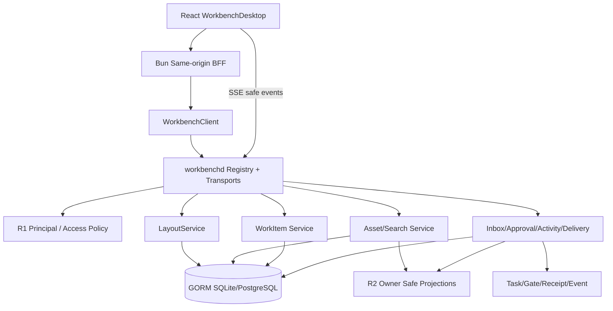
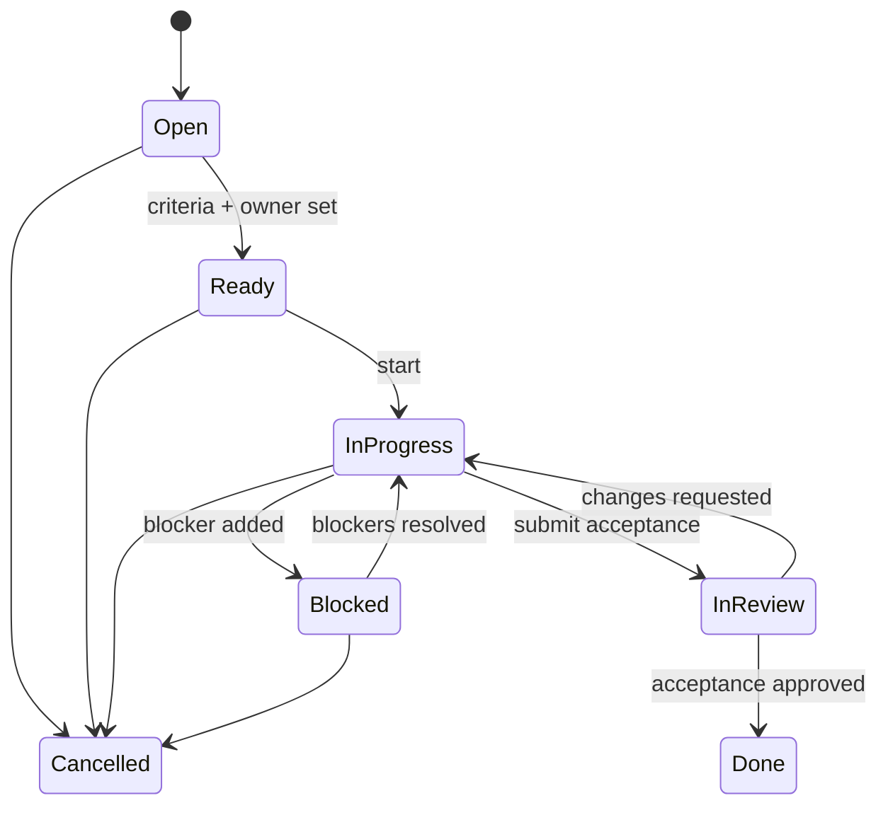

# Workbench Desktop 与 Daily Operations R3 设计

## Context

当前 Web 已使用 Dockview、React Router、TanStack Query、Bun same-origin proxy 和 typed `WorkbenchClient`。`apps/web/src/workbench/shell.tsx` 已能打开 workspace Pane、最大化/恢复部分 panel，并展示 Owner/Task safe projection；但 window chrome、floating rail、Overview/Connections routing 仍是 Dockview 外部结构，`apps/web/src/workbench/layout.ts` 将 layout 按 owner/project/route 写入 `localStorage`，没有服务端版本、tenant isolation、冲突或损坏恢复。Action Inbox、Task timeline、Resources、Activity 等主要是现有 Task/Owner 数据的面板投影，不等于生产 Asset/WorkItem/Approval/Delivery service。

R3 必须建立两个清晰边界：

1. `workbench-pane-desktop` 只拥有用户工作空间、Pane identity、layout、route 与交互状态。
2. `workbench-daily-operations` 只拥有 Workbench 运营 metadata、状态机、索引和队列；Owner canonical content/state 继续由 R2 providers 拥有。

R3 依赖 R1 的 Principal/tenant/access 与 R2 的 Owner safe projection/receipt/descriptor。依赖未晋级时，R3 UI 必须显示真实 degraded/needs-contract 状态，而不是切回 fixture。

## Goals / Non-Goals

**Goals:**

- 所有核心业务页面都成为可打开、移动、分组、最大化、全屏、关闭、恢复和深链的 Pane。
- Layout v3 由服务端 versioned GORM service 持久化，支持 conflict/corruption rescue 与跨设备安全恢复。
- 用户能完成 Action Inbox → Asset → WorkItem → Task/Gate/Approval → Delivery 的日常闭环。
- 100k assets、50k WorkItems、20 restored panes 与 200 SSE sessions 有分页/虚拟化/性能证据。
- 所有数据按 R1 tenant/principal/access 裁剪，所有 Owner 内容只通过 R2 safe projection/descriptor/receipt。

**Non-Goals:**

- 不实现创作编辑器、ProductionGraph、screenplay/image/audio canonical content。
- 不实现 Identity provider、Owner adapter promotion 或跨 Owner workflow worker。
- 不让浏览器直接调用 Owner 或编排 saga。
- 不把 localStorage layout、MSW fixture、截图或静态 mock 当作 production data source。
- 不在 R3 实现 Spatial Board；它属于 R4。

## Architecture



## Decisions

### 1. Root Desktop 管理整个业务 viewport

`WorkbenchAppShell` 只保留不参与 layout 的最外层安全边界：error boundary、session rescue、global dialogs/notifications 与 root accessibility landmarks。Window chrome、navigation、Overview、Connections、Workspace、Task、Team、Diagnostics 和所有业务功能都注册为 PaneDocument，通过 `WorkbenchDesktop` 的 root Dockview 管理。

`PaneDocument` 是可深链的逻辑文档：

```text
pane_type, tenant_ref, workspace_ref, owner_ref?, resource_ref?, view_mode?, route_version
```

`PaneInstance` 是一次打开实例：

```text
instance_id, document_key, group/position, title_projection,
dirty/rescue state, focus/maximize/fullscreen/suspended state
```

`PaneContext` 只提供 safe refs、Principal/allowed actions、query client、navigation 与 command dispatch，不携带 token、raw Owner payload 或 private path。

同一 document 默认聚焦已有 singleton Pane；显式 `open copy` 才创建新的 instance。Task/WorkItem/Asset detail 可多实例，但必须由稳定 document key 去重。

### 2. Route/history 由纯 reducer 单向驱动

路由状态与 Dockview action 通过纯 reducer 互相映射：

```text
Browser URL/History Event
  -> parseRoute
  -> DesktopAction
  -> next DesktopState + DockCommands
  -> render/apply
```

Dockview 用户动作只有在 canonical route/document 改变时才写 history。focus/resize/drag 不滥用 pushState；back/forward 解析为 desktop action，不由 effect 双向监听导致循环。未知 Pane type/version 进入 Diagnostics/Recovery，不执行任意 dynamic import 或恢复不可信 params。

### 3. LayoutService v3 是 canonical layout owner

Layout profile 按 `tenant + principal + workspace + device_class + profile_name` 隔离，保存：schema version、layout JSON、pane documents/params、preset、revision、created/updated、source device 与 safe checksum。禁止 token、正文、raw payload、private URI、未验证 URL 或 ephemeral query cache。

写入使用 expected revision；冲突时客户端保留当前 unsaved layout，并提供 reload、save copy 或显式 overwrite（需要新 revision/permission）。损坏或不兼容 layout 不覆盖原记录，而是创建 recovery event 并加载安全 preset。

现有 localStorage layout 只允许一次性 shadow import：解析/清洗后写入 v3 draft；失败丢弃并保留 Recovery preset。成功晋级后 localStorage 仅可保存非敏感 bootstrap hint，不再是 canonical。

#### 3.1 合同演进与回滚

Layout 合同以新增 `workbench.layout.v1alpha1` proto package、`workbench.layout.v0.1` JSON/TypeScript contract 和独立 SDK client 引入，不重命名、不删除也不重解释现有 Task/Design/Identity/Owner 字段。请求 scope 只接受 tenant/workspace/device/profile；principal 和 membership 必须由 R1 server context 注入，禁止浏览器指定或覆盖。

Dockview payload 是版本化 adapter 数据，不是 canonical Pane 参数。canonical `LayoutPaneDocument` 只允许 pane type、route version、document key、tenant/workspace/owner/resource opaque ref、view mode 与 instance policy。adapter payload 必须有大小、深度、节点数和敏感 key sanitizer；出现 token、cookie、credential、private path 或 raw payload 时整个 revision fail-closed。

本阶段不需要 deprecation window，因为全部 surface 为 additive 且没有既有 Layout API consumer。实现期默认由 `layout_v3` capability flag 控制；回滚关闭 flag 后继续读取 legacy layout，但不得删除已写入 revision。再次启用时按 revision/checksum 继续，不执行 destructive downgrade。

### 4. Pane lifecycle 支持 maximize/fullscreen/suspend/rescue

- maximize：Dockview group 内最大化，可恢复原布局。
- fullscreen：使用浏览器 Fullscreen API 或受控 CSS fallback，仅针对当前 Pane；退出后恢复 focus/group。
- suspend：非活动重 Pane 可停止 subscription/render，但保留 document/scroll/selection 的有限 UI state；重新激活时重新授权和刷新数据。
- dirty/rescue：仅 Workbench-owned form 可声明 dirty；Owner Studio dirty state 由 Studio 自己管理。关闭时提示 discard/save draft，session revoke/tenant switch 必须清除敏感 draft 或转入允许的 encrypted local rescue。

### 5. Asset Catalog 只索引 Owner safe projection

`AssetEntry` 保存：tenant/workspace、owner/resource opaque refs、projection type、safe title/summary/status、version/digest、freshness/observed time、rights/lineage/review/delivery summaries、allowed actions、tombstone 与 search facets。Asset blob、private path、raw prompt/provider payload、完整 script/body 不进入 Workbench DB。

`Collection` 和 `SavedView` 是 Workbench-owned organization metadata；它们只引用 tenant-bound AssetEntry。`AssetRelation` 必须来自批准 relation type，不能声明或修改 Owner canonical relation。

Projection ingestion 使用 owner cursor/version 幂等 upsert；失权/删除转为 tombstone 并从搜索/preview cache 清除。Owner offline 保留最后 safe projection并标 `stale/degraded`，不能声称 current。

### 6. Search 是 tenant-trimmed typed query

Search query 明确定义 resource types、text tokens、facets、status、owner、rights/review/freshness、sort 和 opaque cursor；设置长度、token、facet、page size、timeout 与 complexity budget。服务端先执行 tenant/access trim，再查询索引；禁止浏览器下载全量数据筛选。

Search result 返回 safe summary、score bucket、highlights 的受控片段、source version/freshness 和 allowed actions。不得高亮或索引未经授权完整正文。

### 7. WorkItem 有独立于 Task 的状态机

WorkItem 表达人的运营承诺，Task 表达机器/Owner mutation execution。状态：



不变量：

- `Done` 必须满足 acceptance checks 或批准的 override audit；Task success 只更新 link/evidence，不自动转 Done。
- assignment、status、acceptance、dependency、due date 和 links 使用 expected version。
- dependency graph 禁止自环和 cycle；blocked 可来自显式 blocker、未通过 Gate、Owner offline、stale permission 或 dependency。
- 删除使用 tombstone/archive，不级联删除 Asset/Task/Owner resource。

### 8. Inbox/Approval/Activity/Delivery 是可追溯投影

`InboxItem` 聚合需要用户行动的来源：Task Gate、`unknown_accept` reconcile、failed/partial Task、stale Owner projection、WorkItem blocker/review、identity/permission rescue、delivery blocker。每项保存 source type/ref/version、priority/due、reason code、allowed actions、freshness 和 resolution receipt；不复制 source payload。

`Approval` 是 source Gate/Identity/Owner review 的统一安全投影，不成为新的批准真源。approve/reject/request-changes 调用 source typed command，并等待 receipt/event 确认。

`Activity` 合并 source-local event stream，但保留 source、cursor/sequence、occurred/observed time，不伪造全局 exactly-once order。

`Delivery` 索引 Owner delivery/handoff/export readiness、blockers、version、receipt/grant、rights/audit summary。真实 export/handoff 仍由 Owner/Task 执行。

### 9. Daily Operations 闭环由链接和 receipt 驱动

标准闭环：

```text
Inbox item
  -> inspect Asset/WorkItem/source
  -> update WorkItem or submit Task/Gate action
  -> observe Task/Owner receipt and events
  -> satisfy acceptance/review
  -> Delivery readiness/result
  -> resolve Inbox item with evidence refs
```

任何步骤失败、offline、stale、permission denied、version conflict 或 unknown_accept 都保留原输入/receipt 并进入 rescue；UI 不通过 optimistic state 伪造完成。

### 10. Authorization 与 cache 使用 R1 authority

所有 service/repository 查询必须包含 tenant/principal context；object-level authorization 在服务端执行。cache key 至少包含 tenant、subject/membership version、resource ref/version、capability/policy version。tenant switch/revoke 清除 layout bootstrap、queries、SSE cursor、Pane selection、draft 与 recent items。

Team Pane 只消费 R1 projection。R2 Owner resource 无 capability/permission 时，对应 Pane 保留位置并显示 `permission_required`/`needs_contract`/tombstone，而不是泄露旧缓存。

### 11. Responsive、a11y 与 interaction budgets 是合同

- desktop：multi-group Dockview；tablet：减少并列 group、保持 tab/inspector；mobile：stacked single active Pane + drawer/tab switch，limited edit。
- 所有 drag/drop、resize、move、connect 等操作提供 keyboard equivalent；焦点在 Pane open/close/maximize/fullscreen 后可预测恢复。
- 200% zoom、reduced motion、高对比度、screen reader landmarks/name/state 必须通过。
- Pane interaction p95 目标 <100ms；大列表使用 server pagination + virtualization；suspended Pane 不保留无限 subscription。

### 12. Service 与 transport 不创建 feature-specific旁路

Layout/Asset/Search/WorkItem/Inbox/Approval/Activity/Delivery operations 全部注册到 Operation/Service registry，并通过 HTTP、gRPC、JSON-RPC 与 TypeScript SDK 共享模型、错误、pagination、version 和 receipt 语义。BFF 仅执行 same-origin/session/stream proxy 与 Web-specific aggregation，不拥有状态机或任意 Owner URL。

## Data and Migration

新增 GORM models 必须 additive、带 tenant/index/unique/version/timestamp，并由独立 migration command执行。建议表：

```text
layout_profiles, layout_revisions
asset_entries, asset_relations, collections, collection_entries, saved_views
work_items, work_item_dependencies, work_item_links, work_item_acceptance
inbox_items, approval_projections, activity_index, delivery_index
projection_cursors
```

R3 migration 流程：schema expand → shadow projection/backfill → compare/read shadow → cutover read → enable mutation → retire localStorage/legacy projection。所有 cursor/backfill 可暂停/恢复，checksum mismatch 阻止 readiness。Rollback 关闭 feature flags并回到上一 read path，不删除新表/字段；已经产生的 WorkItem/receipt 继续可读导出。

## Error and Rescue

稳定错误至少包括：`permission_denied`、`resource_tombstoned`、`version_conflict`、`layout_conflict`、`layout_corrupt`、`owner_offline`、`projection_stale`、`contract_mismatch`、`needs_contract`、`unknown_accept`、`invalid_transition`、`dependency_cycle`、`approval_required`、`rate_limited`、`query_too_complex`。

每个 Pane 必须具备 loading/empty/partial/stale/error/offline/permission/contract/rescue 状态。Diagnostics 显示 safe contract/version/freshness/correlation/evidence ref 和可运行救援命令，不显示 token、private path、raw payload 或内部堆栈。

## Performance and Capacity

- Asset search p95 <500ms，page size/complexity bounded；100k AssetEntry 不全量进入浏览器。
- WorkItem board/list query p95 <500ms；50k active items 使用 cursor/aggregate indexes。
- Pane focus/open/command p95 <100ms；20 Pane restore 不产生 N×重复请求。
- SSE reconnect p95 <10s；200 sessions/instance 有 backpressure、connection limit 和 source cursor recovery。
- 所有目标必须用 production-like fixture/disposable service benchmark，不以空数据或浏览器 mock 证明。

## Migration Plan

1. 冻结 v3 Pane/Layout 与 Daily Operations contracts，建立 four-transport parity。
2. 新建 GORM schema/migrations；local/managed fresh/upgrade/checksum tests。
3. 实现 root Desktop/Pane registry/route reducer，保留现有 shell作为 feature-flag rollback。
4. Layout v3 shadow save/compare，导入清洗现有 localStorage layout，再切 canonical read。
5. Asset/Search shadow ingest R2 safe projection，完成 access/tombstone/freshness/performance。
6. WorkItem 状态机与 services 上线，Task/Asset links 只读 canary 后开放 mutation。
7. Inbox/Approval/Activity/Delivery 投影与 daily loop E2E。
8. desktop/tablet/mobile/a11y/performance canary；逐 capability晋级。

Rollback：关闭 `desktop_v3`、`asset_catalog`、`workitems`、`daily_ops` 独立 flag；保留 additive data 和旧 shell/Task views。不得回滚到跨 tenant localStorage、fixture owner 或跳过 receipt/version 的 mutation。

## Test and Evidence Plan

- Unit/property：route reducer、Pane registry、layout sanitizer/conflict、WorkItem transitions/dependency cycle、query complexity、projection reducer。
- Contract：Layout/Asset/Search/WorkItem/Inbox/Approval/Activity/Delivery 四 transport parity。
- Component：Pane lifecycle、fullscreen/focus、virtual list、forms/conflict rescue、all UI states、a11y。
- Integration：SQLite/PostgreSQL、R1 auth trim、R2 Owner projection/event、Task/Gate/receipt、SSE reconnect。
- E2E：restore/deep link/back-forward、daily operations loop、owner offline、unknown_accept、tenant switch/revoke、Studio handoff。
- Performance：100k assets、50k WorkItems、20 Pane restore、200 SSE sessions。
- Evidence：所有 integration/component/system/e2e/performance 写六件套，包含 contract/app/dependency versions、profile、redaction、trace/screenshot/profile artifacts。

## Risks / Trade-offs

- **[R3 同时触及 UI 与多个服务]** → 两个 capability、独立 feature flags、分 Lane 路径租约和纵向 canary，避免一次性大爆炸。
- **[Layout schema 绑定 Dockview vendor JSON]** → 外层保存稳定 PaneDocument/metadata，Dockview JSON 作为 versioned adapter payload，可迁移/清洗。
- **[Owner projection 被误当 canonical]** → schema 命名/文档标 projection，保存 source version/freshness/tombstone，mutation 只走 Owner/Task。
- **[Inbox 聚合造成隐藏业务逻辑]** → Inbox 只索引 action-required source refs，不决定 source 状态或批准结果。
- **[大规模数据拖慢浏览器]** → server pagination/facets、virtualization、suspend、query dedup 和性能 gate。
- **[localStorage 迁移泄漏旧敏感参数]** → allowlist sanitizer、一次性 shadow import、失败丢弃、不得上传未知字段。

## 已冻结的 R3 首发决策

- Layout v3 R3 首发支持个人 profile、built-in default/recovery preset；tenant 管理员共享 preset 延后到具备 R1 admin action、审计和发布/撤销合同的独立 capability，不在 R3 暗中复用个人写接口。
- WorkItem assignment schema 保留 `user/team/automation` typed actor；R3 production 先开放 user/team，automation 在 R1 actor/delegation 与 R4 workflow actor 合同晋级前固定返回 `needs_contract`。
- Search 首发采用 local SQLite bounded safe-metadata query + managed PostgreSQL FTS/trigram repository adapter，GORM 仍是正常业务访问层；外部索引只有在 100k/50k capacity evidence 证明该方案不足且新 OpenSpec 通过后才引入。
- Delivery first-support 只覆盖 Eikona 与 Open Design 已批准 projection/handoff 类型；Scaena/Auctra 在各自 R2 provider event/mutation/receipt/reconcile evidence 完成前保持 `needs_contract`，不通过通用 raw payload 扩展。
