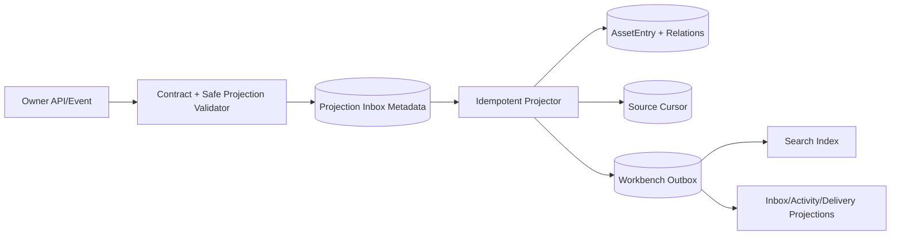

# Daily Operations 生产业务闭环与对接计划

## 1. 产品目标

Daily Operations 的核心用户是制作负责人、项目经理、审核人和交付操作者。他们需要在一个 tenant/workspace 内发现待办、理解 Asset/WorkItem/Task 上下文、执行批准动作、观察真实 Owner receipt/event、处理异常并完成交付。

当前 Workbench 只有 Owner/Task safe projection 面板和空态占位，尚无 Asset Catalog、WorkItemService、Inbox/Approval/Delivery repository，也没有真实 Owner mutation→receipt→reconcile→delivery 闭环。因此页面可见不等于业务能力完成。

生产目标：

```text
Owner projection/event
  -> Asset Catalog/Search
  -> WorkItem context and acceptance
  -> Action Inbox / Approval
  -> Task or Workflow dispatch
  -> Owner receipt/status/event/reconcile
  -> Review / Delivery readiness
  -> Delivery child receipts
  -> Inbox resolution + audit/evidence
```

## 2. 数据权威边界

| 对象 | Canonical owner | Workbench 持久化 | 禁止持久化 |
| --- | --- | --- | --- |
| Asset/resource | 外部 Owner | safe projection、source version/cursor、freshness、rights/review/lineage refs | bytes、raw payload、prompt、private path、完整内容 |
| Collection/SavedView | Workbench | organization metadata、typed query、member safe refs | Owner mutation side effect、cross-tenant ref |
| WorkItem | Workbench | state/version/assignment/dependencies/acceptance、safe links | Owner canonical status、raw artifact |
| Task/Gate/Attempt | Workbench Task control plane | existing task/permission/cost/attempt/receipt refs | browser-created success、raw Owner response |
| InboxItem | Workbench projection | source ref/version、action kind、priority/due、resolution projection | source canonical state |
| ApprovalItem | Source system | safe queue projection、expected source version、decision receipt | local-only approval truth |
| Activity | 各 source | source/cursor/sequence、safe summary/ref、observed time | 伪造全局顺序、raw event |
| Delivery | Owner + Workbench orchestration | readiness/blockers、manifest ref、child receipt/status projection | export bytes、grant secret、synthetic completion |

Workbench projection 的删除默认是 tombstone，不级联删除 Owner resource、receipt、audit 或 WorkItem 历史。

## 3. Asset Catalog 模型

`AssetEntry` 至少包含：tenant/workspace、owner/connector、resource ref、projection type、source version、source cursor、projection digest、title/summary 的 safe bounded projection、status、freshness、observed/occurred time、rights/review/lineage/evidence safe refs、allowed actions snapshot、tombstone reason/version。

Workbench-owned metadata 独立存放：Collection、CollectionMember、SavedView、AssetTag/Note（只允许短文本且不复制 artifact 内容）。Owner projection 更新不能覆盖用户 organization metadata。

Projection state：

```text
missing -> current -> stale -> current
current|stale -> tombstoned
current|stale -> permission_hidden
permission_hidden -> current  (fresh authority + full resync only)
```

- `stale` 保留 safe projection但禁用 mutation，显示 freshness 和刷新动作。
- `permission_hidden` 清除 title/summary/preview/search material，只保留 opaque tombstone/ref。
- tombstone 只有 source version/cursor 更高且事件合同允许 restore 时才能复活，防止 out-of-order resurrection。

## 4. Projection ingestion 和 rebuild



- Connector 必须先把 provider payload 转成 typed safe projection；Workbench 不把 raw Owner payload 写入 inbox、dead letter 或 evidence。
- 幂等键固定为 `(tenant, owner, stream, eventId)`；source cursor/version 决定 apply、duplicate、out-of-order 或 gap。
- Apply 在单一事务中更新 AssetEntry/relations、source cursor 和 outbox；部分写入不得推进 cursor。
- Gap 进入 `resync_required`，停止该 source incremental apply；执行 `list snapshot at fence -> apply snapshot -> tail from fence`。
- Rebuild 使用新 generation，完成校验后原子切换；失败保留旧 generation 并标 stale，不先清空线上索引。
- Membership revoke 高优先级处理：暂停该 authority worker、清 preview/search cache、写安全 tombstone，再允许新 authority resync。

## 5. Search 策略

Search query 是 typed contract：text、projection type、owner、status、rights、review、freshness、collection、sort、page size、opaque cursor。禁止 arbitrary field、raw SQL、regex、script 和浏览器全量筛选。

Backend strategy：

- local SQLite：只针对 safe normalized metadata 做 bounded query，明确 local data ceiling。
- managed PostgreSQL：优先 GORM repository；FTS/trigram 等数据库函数若 GORM 无法表达，只能集中在 `repository/search` adapter，使用参数绑定并在 design/review 记录例外。
- Search backend、index generation 和 schema digest 进入 readiness；不兼容或 rebuild 中返回 stale/degraded，而不是混合新旧 cursor。
- Cursor 绑定 tenant/workspace、query digest、sort、index generation 和 last tuple，tamper 或 query drift 返回 `invalid_cursor`。
- highlight 只来自 safe indexed metadata，长度/片段数有上限，不返回完整 content。

初始 production budget：100k AssetEntries/workspace，page size ≤100，query tokens ≤16，facets ≤8，p95 <500ms，response ≤256KiB。最终预算由 PostgreSQL capacity evidence确认。

## 6. WorkItem 状态机

WorkItem states：

```text
draft -> ready -> in_progress -> in_review -> done
ready|in_progress|in_review -> blocked
blocked -> ready|in_progress
draft|ready|in_progress|blocked|in_review -> cancelled
done|cancelled -> archived
```

不变量：

- 只有 WorkItemService 验证 transition；repository/transport/UI 不直接写 status。
- 所有 mutation 使用 expected version 和 idempotency；冲突返回当前 safe version/diff hint并保留用户 draft。
- `done` 要求所有 mandatory acceptance checks resolved，或具备权限的显式 override + reason + audit。
- linked Task succeeded 只增加 evidence/link，不自动完成 WorkItem。
- blocked reason 是 typed source：dependency、approval、owner_offline、permission、delivery、manual；解除必须由对应 source version证明。
- dependency graph 禁止 self/cycle/cross-tenant；并发加边在事务/CAS 后再次验证。
- assignment 支持 `user`、`team`、`automation` typed ref；automation 在 R1/R4 actor/delegation合同未晋级前保持 `needs_contract`。
- archive 不删除 links、acceptance、receipt/evidence/audit；tombstoned Asset link 不泄露旧 metadata。

## 7. Action Inbox

InboxItem key：`(tenant, sourceType, sourceRef, actionKind)`；states：`open`、`deferred`、`resolved`、`stale`、`tombstoned`。

Action kinds 首批包括：Task gate、unknown_accept reconcile、failed/partial task、WorkItem blocked/review、Owner stale/offline、permission/session rescue、Delivery blocker/partial。

- Inbox 只索引 source action-required 状态，不决定 Task/WorkItem/Approval/Delivery 成功。
- `resolve` 必须调用 source typed command或确认 source version已解决；本地不能直接改成 resolved。
- `defer` 是 Workbench metadata，可设置 bounded due time；source 变更仍可重新打开或升级 priority。
- 同一 source 新 version 幂等更新 existing item；已 resolved 的旧事件不能重开。
- priority 是可解释规则结果，保存 rule version；不使用不可审计模型输出直接改变权限或执行顺序。

## 8. Approval Queue

ApprovalItem 投影包含 source type/ref/version、required action、requester、approver policy、safe summary、expiry、decision state 和 receipt ref。决策流程：

```text
open -> deciding -> approved | rejected | changes_requested
open|deciding -> stale | expired | revoked
```

- approve/reject/request-changes 调用 source command并携带 expected source version/idempotency。
- UI optimistic state 只能显示 `deciding`，receipt/event 确认前不能显示最终 approved。
- dispatch 前重新验证 R1 authority；approval 后 membership revoke 必须阻止后续 mutation。
- 高风险双人审批、自审批限制和 break-glass 由 source policy 决定；Workbench只投影 policy和执行 typed command。
- stale/expired/revoked decision 不自动重试；刷新 source 后由用户重新决定。

## 9. Receipt 和 Reconcile

统一 execution outcome：`not_dispatched`、`accepted`、`running`、`succeeded`、`rejected`、`failed`、`unknown_accept`、`cancel_requested`、`cancelled`、`partial`。

规则：

- 发送 mutation 前持久化 Task attempt、stable idempotency 和 dispatch intent。
- timeout-before-send 只在合同允许时 safe retry；timeout-after-send 一律 `unknown_accept`。
- `unknown_accept` 只允许 receipt/status/reconcile；禁止自动重复 mutation。
- reconcile 读取 Owner canonical receipt/status，用 expected attempt version 更新 Task/Inbox/Activity/Delivery projection。
- receipt mismatch、unknown receipt、contract drift 进入 operator rescue，不映射成 failed 或 succeeded。
- cancel requested 不等于 cancelled；只有 Owner acknowledgement/terminal status 才能确认。

## 10. Activity Timeline

Activity item 保存 source、source cursor/sequence、event id/type、safe subject/action/result refs、occurredAt、observedAt 和 trace/evidence ref。

- 每个 source 保持独立 ordering；合并列表按 `(observedAt, source, cursor)` 提供稳定 view order，但 UI 明确不代表 causal global order。
- Resume cursor 是 per source map，不使用单个 Last-Event-ID 覆盖所有来源。
- duplicate/out-of-order 由 source cursor/event id 收敛；gap 触发对应 source resync，不清空其他来源。
- Activity 查询是 projection read model，不能用于判定 mutation canonical outcome，详情链接回 source/receipt。

## 11. Delivery 和 Handoff

Delivery states：`blocked`、`ready`、`dispatching`、`unknown`、`partial`、`succeeded`、`failed`、`cancel_requested`、`cancelled`、`tombstoned`。

Readiness blockers：WorkItem acceptance、review、rights、Owner readiness、version mismatch、missing asset、permission、cost/approval、handoff contract。

- `PrepareDelivery` 生成 versioned manifest safe ref/checksum，不生成浏览器内 raw payload。
- `DispatchDelivery` 通过 Task/Owner gateway，记录 parent receipt 与每个 child receipt。
- partial 只允许对明确 failed/not-dispatched child 使用原 child idempotency policy重试；unknown child先reconcile。
- launch/download 使用 R2 typed descriptor/grant；URL scheme/origin/digest/expiry 校验，secret grant不持久化或进入日志。
- WorkItem/Inbox resolution 只有在 Delivery source terminal + acceptance/audit满足后进行，不因 Task HTTP 200 自动完成。

## 12. Eikona 首个真实闭环

```text
Eikona asset event
  -> AssetEntry current
  -> create/link WorkItem
  -> acceptance + review blocker
  -> approval gate
  -> generation/review Task
  -> Eikona receipt/events
  -> reconcile terminal result
  -> Delivery manifest + handoff child receipt
  -> WorkItem explicit done
  -> Inbox resolved with evidence refs
```

Provider 必须先交付 discovery digest、resumable event、delegation、至少一个 mutation、receipt/status/reconcile/cancel、disposable test project、cost gate、kill switch。缺任一项时：

- 可继续实现 Asset safe read/search 和 WorkItem local metadata；
- mutation/approval/delivery 保持 `needs_contract` 或 read-only；
- fixture、loopback read 和静态 handoff 不能作为闭环成功证据。

## 13. 原子实施包

| ID | Owner / Paths | Dependencies | Deliverable | Verification |
| --- | --- | --- | --- | --- |
| AO1 Asset domain/repo | backend implementer；`assets/domain|repository/**` | 1.2a Asset contract | safe AssetEntry、tombstone、relations、CAS | `task test:asset-repository:component` |
| AO2 Organization metadata | backend implementer；`assets/collections/**` | AO1 | Collection/SavedView、cross-tenant guards | `task asset:metadata:test` |
| AO3 Projection state | backend implementer；`assets/projection/domain/**` | AO1, R2 event DTO | cursor/version/gap/tombstone pure state machine | `task asset:projection:domain:test` |
| AO4 Projector/rebuild | backend implementer；`assets/projection/worker/**` | AO3 | transactional apply、generation rebuild、revoke | `task test:asset-projection:integration` |
| AO5 Search contract/query | backend implementer；`search/domain/**` | AO1 | typed query、cursor、complexity | `task search:domain:test` |
| AO6 Search backend | backend implementer；`search/repository/**` | AO4, AO5 | SQLite/PostgreSQL adapter、index generation | `task test:search:postgres` |
| AO7 Asset adapters | backend implementer；asset/search transport + SDK | AO2, AO4, AO6, 1.3a | REST/gRPC/JSON-RPC/SDK parity | `task test:asset-transport:component` |
| WI1 WorkItem domain | backend implementer；`workitems/domain/**` | 1.2b WorkItem contract | state/acceptance/dependency/assignment rules | `task workitem:domain:test` |
| WI2 WorkItem persistence | backend implementer；`workitems/repository/**` | WI1 | GORM models/migration/CAS/audit | `task test:workitem-repository:postgres` |
| WI3 WorkItem service | backend implementer；`workitems/service/**` | WI2, R1 auth | typed commands/links/conflicts/transports | `task test:workitem:component` |
| DO1 Projection repos | backend implementer；`inbox|approvals|activity|delivery/repository/**` | 1.2c, WI2, AO4 | safe projections、cursor/version/rebuild | `task test:daily-projections:integration` |
| DO2 Source commands | backend implementer；`inbox|approvals/service/**` | DO1, Task/R1/R2 | resolve/defer/decide + source CAS | `task test:daily-commands:component` |
| DO3 Reconcile supervisor | backend implementer；`operations/reconcile/**` | DO1, R2 receipts | unknown/cancel/partial/status convergence | `task test:daily-reconcile:integration` |
| DO4 Activity streams | backend implementer；`activity/service|transport/**` | DO1 | per-source cursor/watch/gap/backpressure | `task test:activity-stream:integration` |
| DO5 Delivery service | backend implementer；`delivery/service/**` | DO1, DO3 | blockers/manifest/child receipts/retry policy | `task test:delivery:integration` |
| DO6 Operations adapters | backend implementer；operations transport + SDK | DO2–DO5, 1.3a | REST/gRPC/JSON-RPC/SDK parity | `task test:operations-transport:component` |
| UI1 Asset/Search | Web implementer；`panes/assets/**`, `features/search/**` | RD3, AO7 | virtualized safe catalog/detail/search | `task test:asset-web:component` |
| UI2 WorkItems | Web implementer；`panes/workitems/**` | RD3, WI3, UI1 | board/list/detail/conflict/a11y | `task test:workitem-web:component` |
| UI3 Daily queues | Web implementer；`panes/inbox|approvals|activity|delivery/**` | RD3, DO6 | queues/actions/rescue/receipts | `task test:daily-web:component` |
| LOOP1 Eikona canary | integration owner | AO4–UI3, INT-R1-02, INT-R2-01 | real end-to-end daily loop | `task test:daily-ops-integration OWNER=eikona` |

同一 backend domain/repository writer 串行 AO1→AO2、AO3→AO4、WI1→WI2→WI3、DO1→DO5；AO 与 WI 可在合同冻结后并行。Web 在 service/SDK DTO 冻结后进入，不能以 UI mock 反向定义业务状态。

## 14. 生产验收矩阵

| 维度 | 场景 | Evidence |
| --- | --- | --- |
| Contract | 四调用面 create/query/update/approve/reconcile parity | contract component run |
| Data | fresh/upgrade/rebuild/gap/tombstone/CAS/restore | PostgreSQL integration |
| Authority | cross-tenant、revoke mid-edit/approval/dispatch | security + managed browser |
| Owner | offline、429/5xx、contract drift、unknown_accept、cancel unconfirmed | real Eikona canary/fault run |
| UX | loading/empty/partial/stale/error/rescue、keyboard/mobile | browser/a11y evidence |
| Capacity | 100k assets、50k WorkItems、200 streams | profile/soak evidence |
| Operations | projection lag、rebuild、kill switch、rollback、audit completeness | drill/runbook evidence |

Promotion 条件：AO/WI/DO 组件通过只能到 `contract_validated`；真实 PostgreSQL + R1/R2 integration通过可到 `integration_ready`；Eikona真实 test tenant/project闭环、安全、容量、rollback通过后才进入 canary。
