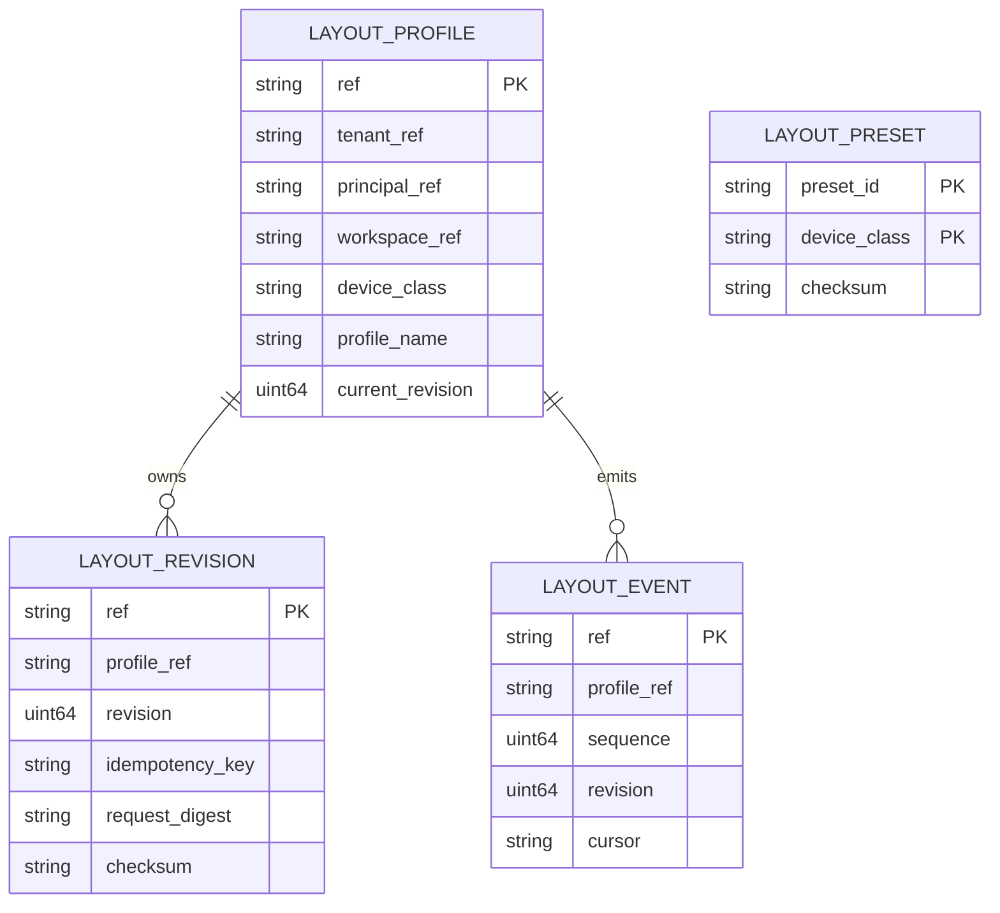
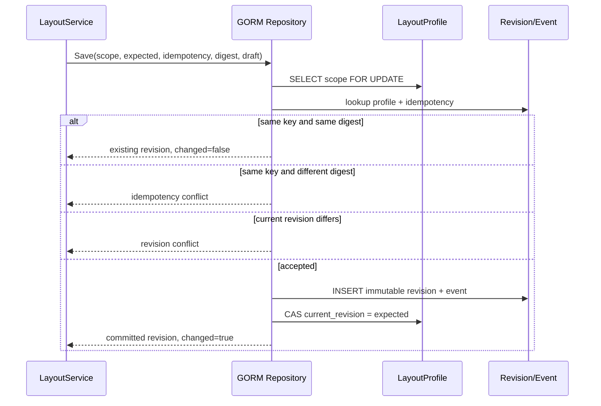

# Layout v3 Persistence Baseline

## 1. 完成范围

本切片完成 R3 任务 3.1 和集成包 L1：

- 新增 `service/internal/layout` domain types、稳定 repository errors 与 repository interface。
- 新增 GORM Profile、Revision、Preset、Event models。
- schema 晋级为 `0003_layout_v3_foundation`，SQLite local profile 可显式/自动迁移，managed profile 仍要求 migration command。
- Profile 按 tenant/principal/workspace/device/profile name 唯一隔离。
- Revision 按 profile/revision immutable，按 profile/idempotency key 去重。
- Save 在单事务内创建 revision/event 并以 expected revision CAS 推进 profile。
- duplicate idempotency + same digest 返回原 revision；digest drift 返回 `ErrIdempotencyConflict`。
- stale expected revision 返回 `ErrRevisionConflict`，revision/event/profile 全部回滚。
- Preset 使用 preset/device composite key，可按 device class 有界读取。

## 2. 数据模型



稳定表名：

- `workbench_layout_profiles`
- `workbench_layout_revisions`
- `workbench_layout_presets`
- `workbench_layout_events`

数据库只保存 sanitizer 之后的 adapter/documents/instances state，不保存 token、credential、private path、Owner raw payload、文件正文或 artifact blob。具体 JSON 结构与大小验证属于 L2 service/sanitizer，repository 不自行解释业务内容。

## 3. Save transaction



PostgreSQL 使用 row lock + CAS；SQLite 使用同一 transaction + CAS。任何 revision、event 或 profile update 失败都回滚整个 transaction。

## 4. 迁移与回滚

- Change class：additive database migration。
- OpenSpec owner：`workbench-desktop-daily-operations-r3`。
- Deprecation window：none；没有删除、重命名或收窄既有列/表。
- Managed runtime：`SchemaPolicyExternalMigration`，启动时只做 readiness，不 AutoMigrate。
- Rollback：关闭未来 `layout_v3` capability 并停止新写入；保留 0003 表、revision/event/audit，不执行 DROP 或 downgrade。
- Recovery：重新启用后按 profile current revision/checksum 继续；corrupt content 由 L2 标 recovery，不由 migration 删除。

## 5. Evidence

```bash
task layout:repository:test
task test:layout-repository:component
task test:layout-repository:postgres
```

2026-07-20：

- SQLite component evidence：`temp/integration-test-runs/20260720134220-adb94ec1-5552-4b47-bebb-53060f565a72/`。
- PostgreSQL 14 integration evidence：`temp/integration-test-runs/20260720134118-3360b4be-72ff-4f53-9a72-dbeb4ed60c50/`；两个 expected revision=1 并发 writer 仅一个成功，另一个返回 revision conflict。
- `CGO_ENABLED=1 go test -race ./internal/layout ./internal/repository -count=1` 通过。
- `CGO_ENABLED=0 go test ./... -count=1` 通过。
- local migration `up` / `check` 返回 `0003_layout_v3_foundation` 与批准 checksum。
- `task preview:build`、managed preview restart 与真实 Open Design `task preview:smoke` 通过；运行中 preview database readiness 已确认 schema 0003。

## 6. 后续状态

L2 service/sanitizer 已完成，详见 `layout-v3-service-sanitizer-baseline.md`。下一切片是 L3 registry/transport/BFF parity，不再扩展 repository 业务语义。
