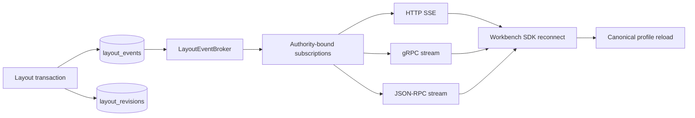

# Layout v3 生产事件流规格与实施计划

## 1. 目标和边界

当前 Layout transport 只完成 bounded catch-up。生产晋级要求把 committed layout events 转换为可长期运行、可恢复、按 authority 隔离、可观测且不会拖垮写路径的事件流。

本计划不引入全局事件总线，不承诺 exactly-once，不允许浏览器持有 bearer，也不把 BroadcastChannel 当服务端事件源。传输至少一次，状态收敛依赖 canonical snapshot、source cursor 和 event id。

## 2. 统一事件信封

| 字段 | 语义 | 约束 |
| --- | --- | --- |
| `source` | `layout:<tenant>:<workspace>:<profile>` 的 opaque digest/ref | 不泄露可枚举内部主键 |
| `cursor` | source 内单调递增位置 | 不声称跨 source 全局顺序 |
| `eventId` | immutable event identity | reconnect/transport parity 去重 |
| `eventType` | `layout.saved/reset/copied/recovered/invalidated` | allowlist、版本化 |
| `profileRef` | canonical profile safe ref | authority-bound |
| `revision` | committed layout revision | 与 checksum 一致 |
| `checksum` | canonical document SHA-256 | 不包含 document body |
| `occurredAt` | server commit timestamp | 不用于排序替代 cursor |
| `sessionRevision` | 发流时 authority revision | 变化触发终止/resync |
| `traceRef` | safe correlation ref | 不含 raw trace payload |

Heartbeat 使用独立 control frame，不伪造业务 cursor。`resync_required`、`permission_revoked`、`server_draining`、`slow_consumer` 是 typed control/terminal 状态，不伪装成成功事件。

## 3. Broker 与 retention



- Repository event row 是 durable source of truth；内存 broker 只负责低延迟通知，不是唯一历史。
- subscriber 建立时先在同一 source 上读取 `cursor > resumeCursor` 的 durable rows，再订阅新通知，并以 cursor 去重关闭 catch-up/live race。
- retention 由行数和时间双预算控制；清理只能删除低于 waterline 且超过最小保留期的事件。
- cursor 小于 retention floor 时返回 `resync_required`；客户端读取最新 profile/revision 后用新的 cursor lease 重连。
- 每 subscriber 使用 bounded queue。队列满时关闭 slow consumer，不阻塞 Save/Reset 事务。

## 4. Authority lease

订阅键固定为 `(tenantRef, workspaceRef, principalRef, sessionRevision, profileRef, transport)`。server principal 只来自认证上下文；请求只能缩小 profile/source，不能替换 principal/tenant authority。

- 每次 heartbeat 周期检查 session validity 或消费 authority invalidation signal。
- tenant switch、logout、membership revoke、session rotation 使 lease 失效并关闭流。
- managed BFF 仅使用 opaque cookie、Origin/Host 与 server context credential；浏览器 CSRF 仅用于建立受保护请求，不转发到后端。
- local single-user profile 使用稳定 local principal，但仍受 workspace/profile scope 和 connection limits 约束。

## 5. Transport 行为

| 能力 | SSE | gRPC | JSON-RPC | SDK |
| --- | --- | --- | --- | --- |
| Resume | `Last-Event-ID` 或显式 cursor，二者冲突拒绝 | request cursor | stream params cursor | 保存最后已应用 cursor |
| Heartbeat | comment/control event | typed control message | typed notification | timeout 后指数退避重连 |
| Gap | `resync_required` terminal event | failed-precondition detail | stable data code | canonical reload |
| Revoke | 403/terminal control | permission denied | permission data code | 清 cache、停止自动重连 |
| Drain | retry hint + close | unavailable + retry info | server_draining | bounded jitter reconnect |
| Slow consumer | typed close | resource exhausted | slow_consumer | reload snapshot 后重连 |

四调用面必须共享同一 event/control DTO 和 error table；transport 只做 wire conversion，不自行决定重试策略。

## 6. 客户端状态机

```text
idle -> connecting -> catching_up -> live
connecting|catching_up|live -> reconnect_wait
live -> resyncing -> connecting
* -> revoked | stopped
```

- 只有 event revision 大于当前已应用 revision 时更新 query cache；同 revision/checksum 重复忽略。
- `layout_conflict` 保留本地 draft，不由 stream 覆盖；UI 提供 Reload、Save Copy、Apply Local。
- `resync_required` 读取 canonical snapshot，成功后替换 cache，但不得删除未保存 draft。
- revoke/stopped 清除 authority-bound query、stream、layout document、recent refs 和预览缓存。
- BroadcastChannel 只广播 `layout_invalidated`、session revision 与 authority changed，不广播 document/event payload。

## 7. 预算和可观测性

初始批准前候选预算：单实例 200 concurrent Layout streams；subscriber queue 128 events；heartbeat 15s；client timeout 45s；drain 20s；重连 jitter 1–30s；catch-up 单批 200、最多 2,000 events。最终值必须由 capacity/soak evidence 确认，不能在测试失败后静默放宽。

Metrics：active streams、open/close reason、catch-up count/latency、cursor lag、retention floor、resync count、duplicate count、slow consumer、revoke latency、broker queue depth、drain duration。日志只记录 safe source digest、cursor、reason、trace ref，不记录 layout document 或 principal PII。

## 8. 实施任务包

| ID | Owner / Paths | Dependencies | Acceptance | Verification |
| --- | --- | --- | --- | --- |
| EV1 Domain | backend implementer；`service/internal/layout/**` | Layout L2 | event/control/cursor/lease 状态机纯测试通过 | `task layout:stream:domain:test` |
| EV2 Repository | backend implementer；`service/internal/repository/**` | EV1 | catch-up/floor/waterline/CAS 在 SQLite/PostgreSQL 一致 | `task test:layout-stream:postgres` |
| EV3 Broker | backend implementer；`service/internal/layoutstream/**` | EV1, EV2 | catch-up/live race 无 gap，queue bounded，drain 无 leak | `task test:layout-stream:race` |
| EV4 Transports | backend implementer；`service/internal/transport/layout*/**` | EV3 | SSE/gRPC/JSON-RPC control/error parity | `task test:layout-stream:integration` |
| EV5 SDK | Web implementer；`packages/task-sdk/**` | EV4 contract frozen | reconnect/resync/revoke/duplicate policy deterministic | `bun test packages/task-sdk/test/layout-stream.test.ts` |
| EV6 Web authority | Web implementer；`apps/web/src/workbench/layout/**` | EV5, R1 authority runtime | tenant switch/revoke 清旧流，draft rescue 完整 | `task test:layout-web:component` |
| EV7 Production | independent verification | EV1–EV6 | 200 streams、restart、revoke、gap、slow consumer、drain evidence | `task test:layout-stream:soak` |

EV1/EV2/EV3 同一 backend write set 串行；EV5 可在 EV4 DTO 冻结后并行；EV7 只验证稳定 diff。所有 integration/race/soak 通过 evidence runner写六件套。

## 9. 生产晋级门禁

1. **Contract**：四调用面 event/control/error/cursor digest 一致。
2. **Correctness**：disconnect、restart、catch-up/live race、duplicate、retention gap 均收敛。
3. **Authority**：cross-tenant、session rotation、tenant switch、revoke、logout 全部关闭旧 lease。
4. **Capacity**：200 streams 与批准 queue/heartbeat/drain 预算通过。
5. **Browser**：双标签、offline、conflict draft、resync、revoke rescue E2E 通过。
6. **Operations**：readiness、metrics、alerts、drain、kill switch、rollback runbook 通过。

以上门禁全部有真实 runtime evidence 前，Layout capability 最高为 `integration_ready`，不得标记 `available`。
