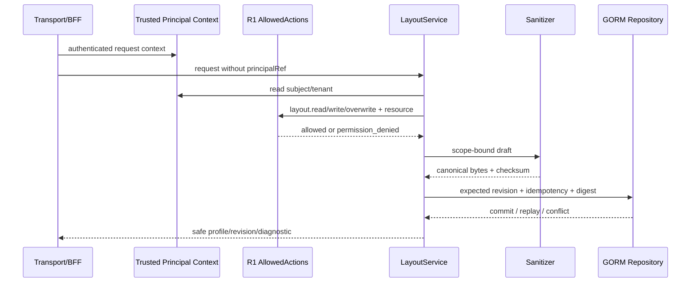
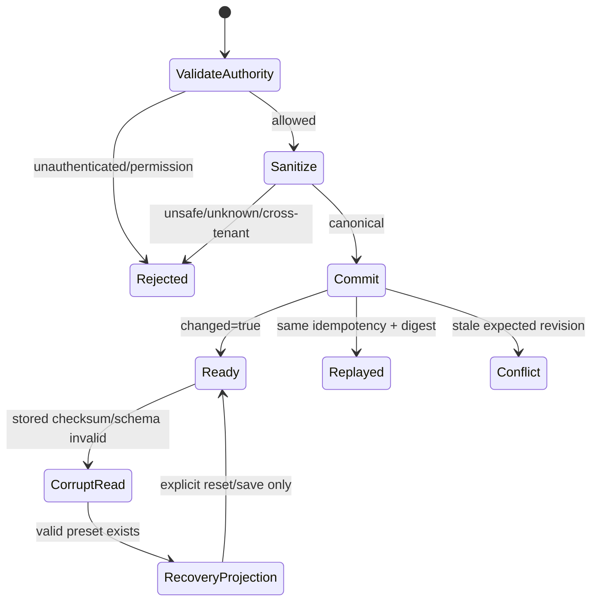

# Layout v3 Service 与 Sanitizer 基线

## 1. 完成范围

本切片完成 R3 任务 3.2 和对接包 L2：

- `LayoutService` 提供 get profile/revision、list preset、save、save copy、reset 与 bounded watch catch-up。
- principal 只从受信 `security.Principal` server context 读取，请求不能提交或替换 `principalRef`。
- `ScopeAuthorizer` 支持本地显式 scope；`IdentityAuthorizer` 把 `layout.read`、`layout.write`、`layout.overwrite` 映射到 R1 `AllowedActions`。
- 新建 profile 使用 `layout.write`；更新和 reset 使用 `layout.overwrite`；读取、copy source 与 watch 使用 `layout.read`。
- adapter、documents、instances 在进入 repository 前完成 canonical serialization、server SHA-256 checksum 与 operation-bound request digest。
- corrupt revision 不删除、不覆盖、不迁移；读取返回安全 recovery preset、`layout_corrupt` diagnostic，并记录 recovery audit/metric。
- repository event cursor 改由事务基于真实 profile ref 与 committed revision 生成，避免现有 profile 写入时使用临时 ref。

## 2. Authority 与调用流



`IdentityAuthorizer` 是 R1 consumer adapter，不复制 membership、role 或 policy canonical state。L3 transport 必须注入 managed Identity service；不得从浏览器 header/body 接受 action decision 或 principal ref。

## 3. Sanitizer 不变量

Dockview adapter 不是 canonical Pane 参数，只能作为版本化 adapter payload 保存。服务执行以下 fail-closed 规则：

| 边界 | 限制 | 失败语义 |
| --- | --- | --- |
| adapter id | 仅 `dockview` | `ErrInvalidArgument` |
| payload bytes | 2–262,144 bytes | 整个 revision 拒绝 |
| JSON root | object | array/scalar/多值拒绝 |
| nesting depth | 最大 32 | 整个 revision 拒绝 |
| object/array items | 单层最大 512 | 整个 revision 拒绝 |
| total nodes | 最大 8,192 | 整个 revision 拒绝 |
| sensitive key | authorization/cookie/credential/password/private path/raw payload/secret/token | 整个 revision 拒绝，不做字段级删除 |
| PaneDocument | 最多 64，显式字段，tenant/workspace 必须等于受信 scope | cross-tenant 返回 permission denied |
| PaneInstance | 最多 64，document 必须存在，ID 唯一，singleton 最多一个实例 | invalid argument |
| pane route | 必须由 PaneRegistry 支持 type/version | `ErrUnsupportedPane` |

Adapter map key 由 Go JSON encoder 稳定排序；documents/instances 使用 typed struct 顺序编码。checksum 只覆盖 canonical draft，request digest 额外绑定 operation、scope 与 expected revision。客户端 checksum 永远不作为写入权威。

## 4. Conflict、Replay 与 Recovery



- replay 返回原 revision，observer status 为 `replayed`。
- stale expected revision 返回 `ErrRevisionConflict`，不会创建 partial revision/event。
- idempotency digest drift 返回 `ErrIdempotencyConflict`。
- corrupt read 返回安全 preset 投影；原始损坏 bytes 不离开 service result，也不在 read path 被覆盖。
- recovery audit 只包含 operation/status、opaque refs、revision、request digest/checksum 和时间，不记录 adapter JSON、文档内容、credential 或 private path。

## 5. Observability

- `Observer.ObserveLayoutOperation` 已接入现有 observability `Calls` 快照，transport dimension 固定为 `layout_service`。
- operation/status 经 low-cardinality sanitizer；非法或超长 dimension 归一为 `unknown`。
- `SlogAuditSink` 仅输出安全字段；`AuditEvent.RawBytes` 保持 0，作为不携带 raw payload 的显式约束。
- repository cursor 在事务内生成 `<profileRef>:<revision>`，watch 只接受与 profile 匹配的 cursor。

## 6. Evidence

可执行命令：

```bash
task layout:service:test
task layout:sanitizer:fuzz
task test:layout-service:component
task test:layout-sanitizer:fuzz
```

2026-07-20：

- component evidence：`temp/integration-test-runs/20260720140854-0559fdbb-61fe-402d-9d23-6a027bad5ec4/`。
- fuzz evidence：`temp/integration-test-runs/20260720141043-24af53a5-b696-405e-b2b2-6556eb7db8bc/`。
- `CGO_ENABLED=1 go test -race ./internal/layout ./internal/repository ./internal/observability -count=1` 通过。
- `CGO_ENABLED=0 go test ./... -count=1` 通过。
- evidence runner 对测试名中的敏感词执行了 redaction；summary 显示 `status=passed`、`exit_code=0`。

## 7. 下一任务 L3

L3 只做已冻结 service contract 的 transport/runtime 集成：

1. 注册 Layout operations 与 capability/readiness，不新增 feature-specific bypass handler。
2. 实现 HTTP、gRPC、JSON-RPC、SDK 四面 parity 与稳定 error mapping。
3. 实现 same-origin BFF layout routes、CSRF/Host/Origin、session revision 与 managed Identity authorizer 注入。
4. 将 watch 从 bounded repository catch-up 接入受限 SSE stream、resume cursor、lease/gap semantics。
5. 补 conformance、security、component evidence；完成后才进入 Web canonical migration 和 legacy shadow import。
