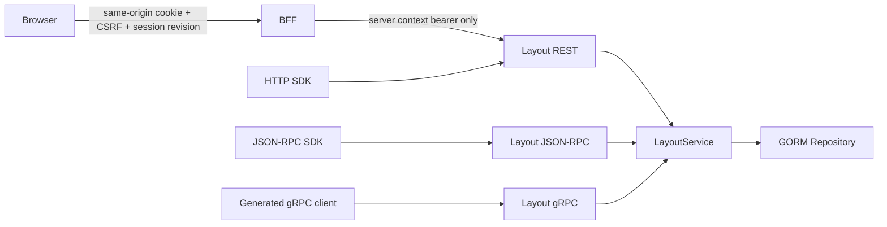

# Layout v3 Transport 与 BFF 基线

## 1. 状态边界

本切片完成 Layout L3 的 adapter/BFF 与真实 runtime registration baseline，但不宣称 production live stream 已晋级：

- 已完成 REST、gRPC、JSON-RPC、SDK `WorkbenchClient.layout`。
- 已完成统一 revision/profile/preset/event JSON 投影、stable errors 与 idempotency header 绑定。
- 已完成 local single-user authority、managed R1 `IdentityAuthorizer` fail-closed 接线与版本化 PaneRegistry。
- 已完成 default/recovery preset 模板的 checksum 验证、tenant/workspace 安全重绑定和 checksum 变更才 upsert。
- 已完成 managed BFF POST 的 Host/Origin/JSON/CSRF/session revision/session/context credential 门禁。
- 已完成 REST/JSON-RPC bounded event catch-up；long-lived watch、gap/heartbeat/reconnect 尚未完成。
- 已完成 runtime HTTP/gRPC/JSON-RPC registration、actual-listener parity、preset seeding 与 shutdown 验证。

## 2. 调用面



REST routes：

- `GET /v1alpha1/layout/profile`
- `GET /v1alpha1/layout/revisions/:profileRef`
- `GET /v1alpha1/layout/presets`
- `POST /v1alpha1/layout/save`
- `POST /v1alpha1/layout/save-copy`
- `POST /v1alpha1/layout/reset`
- `GET /v1alpha1/layout/profiles/:profileRef/events/watch`

JSON-RPC namespace 固定为 `workbench.layout.v1alpha1`；gRPC 使用 generated `workbench.layout.v1alpha1.WorkbenchLayoutService`。JSON/SDK 使用合同已有 flat scope，proto 继续使用 `LayoutScope` message，adapter 负责显式转换，不能把两种 wire shape 混用。

## 3. Stable errors

| Domain | HTTP | JSON-RPC data.code | gRPC |
| --- | --- | --- | --- |
| authentication | 401 | `authentication_required` | `Unauthenticated` |
| authorization | 403 | `permission_denied` | `PermissionDenied` |
| invalid/unknown pane | 400 | `invalid_argument` | `InvalidArgument` |
| not found | 404 | `not_found` | `NotFound` |
| stale revision | 409 | `layout_conflict` | `Aborted` |
| idempotency drift | 409 | `idempotency_conflict` | `AlreadyExists` |
| corrupt without recovery | 422 | `layout_corrupt` | `DataLoss` |
| dependency unavailable | 503 | `unavailable` | `Unavailable` |

Conformance 以同一次 REST save 生成的 profile/revision 为基准，通过 JSON-RPC 与 gRPC 读取并比较 revision/checksum，再分别验证 stale conflict。HTTP 与 JSON-RPC event catch-up 也比较相同 `layout.save` event。

## 4. Managed BFF

Mutation 必须同时满足：

1. exact public Host 与 Origin；
2. `application/json`；
3. opaque session cookie；
4. `X-CSRF-Token` 对应当前 session digest；
5. `X-Session-Revision` 等于当前 session revision；
6. session active/stale/selection state 未超 idle/absolute TTL；
7. context vault 中存在未过期 server credential。

BFF 转发前删除 browser `Authorization`、Cookie、proxy/forwarded headers、CSRF 和 session revision，只注入 context vault credential。SDK transport 新增 `credentials`、`csrfToken`、`sessionRevision`，不持久化这些值。

## 5. Runtime 与 preset

- local bearer 使用稳定 `local-user` principal；tenant 只在 local single-user scope 内由请求绑定。
- managed runtime 默认使用 `IdentityAuthorizer`；R1 provider 未接入时 mutation/read fail-closed，不退回 local scope policy。
- PaneRegistry 仅接受批准的 `workbench.*` 与 `studio.*` v1 panes，未知 type/version 拒绝。
- default/recovery preset 是已校验模板；消费时先验证模板 checksum，再把 document tenant/workspace 重绑定到受信 scope。
- runtime seeding 只在 preset 缺失或 checksum 变化时 upsert，避免每次启动无意义写入。

## 6. Evidence

```bash
task layout:transport:test
task test:layout-transport:component
task layout:runtime:test
task test:layout-runtime:component
```

已通过：

- component evidence：`temp/integration-test-runs/20260720143606-3c3d86c4-9446-4787-844a-1208004849e5/`。
- runtime component evidence：`temp/integration-test-runs/20260720144434-f7da75e6-10af-41d7-b722-c91969a33978/`。
- Go layout service/repository/registry/observability/security/transport/conformance。
- SDK layout model/client/HTTP/JSON-RPC route tests。
- managed BFF GET/POST、CSRF、session revision、credential stripping。
- 真实 runtime HTTP/gRPC/JSON-RPC listener、preset seeding、conflict parity 与 shutdown。
- root 与 Web TypeScript typecheck。

待通过：

- 把 bounded catch-up 晋级为 heartbeat、resume、retention gap、duplicate suppression、authority lease、backpressure 与 drain-aware live stream。
- Web authority runtime 消费真实 stream，并证明 tenant switch/revoke 后旧流不会复活。

## 7. 下一批对接

1. **EV1**：实现 Layout event broker/supervisor、heartbeat、resume cursor、retention gap、duplicate suppression、backpressure 与 stream lease evidence。
2. **EV2**：统一 SSE/gRPC/JSON-RPC stream envelope、typed reset/resync、readiness/drain 和 SDK reconnect policy。
3. **WEB1**：在 `WorkbenchClient.layout` 上实现 authority-bound query key、canonical load/save、debounce 与 conflict draft rescue。
4. **WEB2**：实现 allowlist legacy localStorage shadow import；成功后 localStorage 只保留非敏感 bootstrap hint。
5. **E2E1**：managed browser 覆盖 login→load→drag/save→second-tab conflict→save copy→corrupt recovery→tenant switch/revoke。
