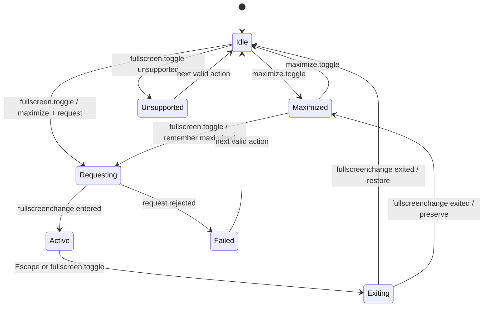

# Pane 与文件预览 Presentation Baseline

## 1. 目标与边界

本切片把现有 Studio Dockview 与文件预览从“可演示交互”推进为可迁移、可测试的 presentation baseline。它只拥有客户端 Pane 展示状态，不创建 Layout v3 canonical persistence、Identity authority、Owner 文件权威或 Daily Operations 领域状态。

已完成能力：

- 用纯状态机统一 Dockview maximize 与 browser fullscreen，避免组件内布尔状态漂移。
- 未最大化 Pane 进入 fullscreen 时先最大化，退出后恢复原布局；原本已最大化时退出后保持最大化。
- 处理 `requesting`、`active`、`exiting`、`unsupported`、`failed`，浏览器拒绝时 fail-closed，不展示伪 fullscreen。
- 提供 Pane toolbar 与 File Preview header 的显式进入/退出按钮。
- 提供 `Ctrl|Cmd+Shift+Enter` fullscreen、`Ctrl|Cmd+Shift+F` preview maximize、`Escape` 分层恢复/关闭。
- compact viewport 不展示 float/maximize/reset 等桌面布局控制，保留单 Pane 切换基线。
- HTML 继续使用同源安全投影与 sandbox iframe；raster 继续使用 allowlist preview gateway；SVG 不进入 raster allowlist。

## 2. Presentation 状态机



关键不变量：

1. `document.fullscreenElement` 只有指向 Workbench Pane workspace 时才确认进入。
2. unrelated fullscreen change event 不得改变 Pane presentation。
3. fullscreen active/requesting 时禁止独立 maximize 操作，避免 Dockview 与浏览器状态竞争。
4. fullscreen 退出必须使用进入前的 `restoreMaximized` 决定是否恢复 Dockview。
5. `fullscreenEnabled`、`requestFullscreen`、`exitFullscreen` 任一缺失即视为 unsupported。

## 3. 验证入口

```bash
task studio:pane-preview:test
task test:studio-pane-preview:component
task preview:build
task preview:up
task preview:smoke
```

专项测试覆盖纯状态转换、已最大化恢复、API 不支持/拒绝、无关 fullscreen event、Pane 实际 API 调用、Preview 显式按钮、安全 HTML/raster/SVG 预览边界和 mobile toolbar 降级。

2026-07-20 当前证据：

- `task studio:pane-preview:test`：3 files / 13 tests 通过，根与 Web TypeScript typecheck 通过。
- `task test:studio-pane-preview:component`：证据写入 `temp/integration-test-runs/20260720130559-28317938-3b73-4dde-820b-007846da2907/`。
- `bun run web:test`：Web 21 files / 103 tests 与 BFF 48 tests 通过；5 个真实 PostgreSQL tests 因未提供 integration DSN 保持 skip。
- `bun run --cwd apps/web e2e`：Chromium 8/8 通过，覆盖现有 Workbench browser、a11y、mobile 与 visual regression；尚未覆盖 Studio 真实 browser fullscreen journey。
- `task preview:build && task preview:smoke`：生产资产构建与真实 Open Design project projection smoke 通过。

## 4. 未完成的生产能力

以下能力继续属于 R3 未完成任务，不得由本 baseline 宣称完成：

- root `WorkbenchDesktop`、版本化 Pane registry、`PaneDocument`/`PaneInstance` 与纯 route/history reducer。
- authority-bound LayoutService v3、服务端 revision/checksum/conflict、legacy localStorage shadow import 与 recovery preset。
- deep link 打开指定文件/版本、刷新/back-forward、focus/scroll restoration 与跨标签页 authority 收敛。
- stale file version、permission denied、offline、tombstone、contract mismatch 和 tenant revoke rescue。
- dirty editor Save/Discard/Cancel、suspend/re-authorize 与 20 Pane restore 性能预算。
- managed Playwright 对真实 browser fullscreen、移动端、200% zoom、keyboard-only、screen reader announcement 的证据。
- compare、批注、媒体时间轴、下载/打开来源 descriptor 与真实 Owner canary。

## 5. 下一实施顺序

1. 定义 Pane/Layout v3 contracts 与 authority-safe params allowlist。
2. 实现 root Pane registry 和 route/history reducer，把 Studio baseline 作为 presentation adapter 接入。
3. 实现 LayoutService v3 persistence、conflict/recovery 和 legacy shadow import。
4. 实现 File Preview deep link、source version/stale rescue 与 approved download/open descriptor。
5. 运行 managed browser、disposable PostgreSQL、真实 Identity 与真实 Owner 联合门禁后再晋级 R3。
