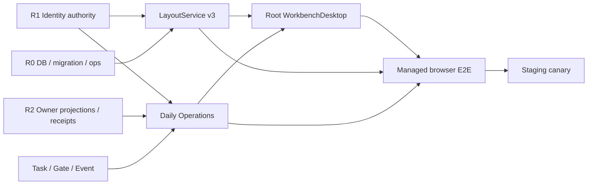

# R3 生产对接与交付矩阵

## 1. 目标

本矩阵把 R3 从合同基线推进到真实 daily loop。任何依赖只交付类型或 mock 都不得标记 integration-ready；每个对接必须同时具备 provider 输出、Workbench consumer、失败语义、证据与回滚。

## 2. 对接合同

| ID | Provider 输出 | Workbench consumer | 必须失败状态 | 晋级证据 | Rollback |
| --- | --- | --- | --- | --- | --- |
| INT-R1-01 | PrincipalContext、authorityKey、tenant/membership version | Layout/Asset/WorkItem repository scope 与 query key | unauthenticated、tenant selection、stale、revoked | two-tab login/switch/revoke system + browser | 关闭 managed capability，不能回退伪造 principal |
| INT-R1-02 | `layout.read`、`layout.write`、`layout.overwrite` allowed actions | LayoutService auth policy、conflict rescue UI | permission_denied、membership_version_conflict | object-level permission matrix | flag 关闭 mutation，保留 read/recovery |
| INT-R0-01 | GORM SQLite/PostgreSQL、migration/backup/restore | Layout profile/revision/event repositories | DB unavailable、migration pending、checksum mismatch | disposable PostgreSQL + restore evidence | 停写 Layout v3，保留 additive tables/revisions |
| INT-R2-01 | Owner safe Asset/File projection、source version、freshness、cursor | File Preview、Asset Detail、Search/WorkItem links | owner_offline、projection_stale、contract_mismatch、tombstone | real test project read/event canary | owner capability 降为 degraded/needs_contract |
| INT-R2-02 | typed download/open/handoff descriptor | Preview actions、Delivery/Studio return | descriptor expired、origin denied、template mismatch | tamper/offline/expiry component + browser | 隐藏 action，不生成任意 URL |
| INT-TASK-01 | operation schema、permission/cost gate、receipt/status/reconcile | Inbox、Approval、Activity、Delivery | approval_required、unknown_accept、version_conflict | real mutation canary + duplicate/reconcile | mutation capability off，read/event 保持 |
| INT-EVENT-01 | Identity/Layout/Owner/Task cursors 与 resume | SSE registry、query invalidation、stale badge、recovery | cursor_expired、gap、duplicate、out-of-order | reconnect/gap/revoke system evidence | polling degraded mode，仅用于 read refresh |
| INT-WEB-01 | same-origin BFF session/CSRF/correlation | `WorkbenchClient.layout` 与 root Desktop | session stale、CSRF、network offline | managed Playwright，无 browser bearer | `layout_v3` off，恢复 legacy read-only layout |

## 3. 可执行任务包

### Package L1：Layout persistence

- **Owner**: backend implementer
- **Dependencies**: INT-R1-01 contract、R0 migration runner
- **Paths**: `service/internal/layout/**`, `service/internal/repository/**`, `service/internal/migrations/**`
- **Deliverables**: GORM models/repository、additive migration、unique/index constraints、expected revision transaction、checksum、event cursor。
- **Acceptance**: duplicate idempotency 返回同 revision；并发旧 revision 只有一个成功；corrupt revision 保留且返回 recovery preset。
- **Verification**: `task test:layout-repository:postgres && CGO_ENABLED=1 go test -race ./service/internal/layout ./service/internal/repository -count=1`
- **Current status (2026-07-20)**: complete；SQLite component evidence、PostgreSQL 14 CAS integration、race、0002→0003 migration 与 full service suite 已通过，详见 `layout-v3-persistence-baseline.md`。

### Package L2：Layout service and sanitizer

- **Owner**: backend implementer
- **Dependencies**: L1、Layout contract baseline
- **Paths**: `service/internal/layout/**`, `service/internal/registry/**`
- **Deliverables**: get/save/save-copy/reset/watch、safe params、adapter limits、R1 auth policy、structured errors/audit/metrics。
- **Acceptance**: principal 只能来自 server context；敏感/未知 payload 原子拒绝；permission/conflict/corrupt 可驱动 rescue。
- **Verification**: `task test:layout-service:component && task test:security`
- **Current status (2026-07-20)**: complete；get/save/save-copy/reset/preset/watch、R1 AllowedActions adapter、canonical SHA-256、bounded fail-closed sanitizer、corrupt recovery projection、safe audit 与 low-cardinality metrics 已完成；组件与 fuzz evidence 见 `layout-v3-service-sanitizer-baseline.md`。

### Package L3：Transport parity and BFF

- **Owner**: backend + Web implementer（串行接口冻结，路径不重叠）
- **Dependencies**: L2
- **Paths**: `service/internal/transport/**`, `packages/task-sdk/**`, `apps/web/server/**`
- **Deliverables**: HTTP/gRPC/JSON-RPC/SDK parity、same-origin routes、CSRF/Host/Origin、SSE resume。
- **Acceptance**: 四调用面 revision/checksum/error/idempotency 一致；浏览器无 bearer/Owner credential。
- **Verification**: `task test:layout-transport:component && bun run test:contract`
- **Current status (2026-07-20)**: adapter/BFF 与 runtime registration baseline complete、production live stream pending；REST/gRPC/JSON-RPC/SDK conformance、managed CSRF/session revision、stream limiter、真实 listener parity、preset seeding 和 runtime evidence 已通过。剩余 SSE/gRPC/JSON-RPC 长连接、resume/gap/heartbeat/backpressure/authority lease 完成前，L3 不得整体标记 production complete。详见 `layout-v3-transport-bff-baseline.md`。

### Package L4：Root Desktop migration

- **Owner**: Web implementer
- **Dependencies**: L3、INT-R1-01
- **Paths**: `apps/web/src/workbench/desktop/**`, `apps/web/src/workbench/router/**`, `apps/web/src/workbench/panes/**`
- **Deliverables**: registry、route reducer、deep link/history、Layout v3 shadow load/save、legacy import、focus/scroll/dirty rescue。
- **Acceptance**: tenant switch/revoke 清除旧 authority layout/query/stream；失败保持未保存 draft；关闭 flag 可恢复旧 read-only layout。
- **Verification**: `task test:desktop-layout:component && task test:desktop-e2e`

### Package D1：Owner projection ingestion

- **Owner**: backend implementer
- **Dependencies**: INT-R2-01、L2 scope policy
- **Paths**: `service/internal/assets/**`, `service/internal/projection/**`, `service/internal/repository/**`
- **Deliverables**: safe projection inbox/cursor/freshness、Asset/File index、rebuild与 tombstone。
- **Acceptance**: duplicate/out-of-order/gap 可收敛；Owner raw payload 不持久化；tenant revoke 停止消费。
- **Verification**: `task test:owner-projection:integration`

### Package D2：WorkItem and daily loop

- **Owner**: backend + Web implementer
- **Dependencies**: D1、INT-TASK-01、INT-R1-02
- **Paths**: `service/internal/workitems/**`, `service/internal/operations/**`, `apps/web/src/workbench/panes/**`
- **Deliverables**: Inbox/Search/Asset/WorkItem/Approval/Activity/Delivery、version/dependency/receipt links、rescue states。
- **Acceptance**: Inbox→WorkItem→Task/Gate→Review→Delivery 闭环由真实 receipt/event 确认；unknown_accept 不自动 retry。
- **Verification**: `task test:daily-ops-integration && task test:daily-ops-e2e`

## 4. Promotion gates

1. **Contract gate**：provider/consumer digest、version range、error/cursor/idempotency 一致。
2. **Authority gate**：cross-tenant/object authorization/revoke/two-tab 通过。
3. **Data gate**：managed PostgreSQL migration、backup/restore、corrupt/conflict evidence 通过。
4. **Owner gate**：至少一个真实 Owner 同时通过 read/event/mutation/receipt/status/reconcile。
5. **Browser gate**：deep link/back-forward/fullscreen/mobile/keyboard/offline/permission rescue 通过。
6. **Capacity gate**：100k Assets、50k WorkItems、20 Pane restore、200 SSE 满足批准预算。
7. **Rollback gate**：每个 capability 独立关闭，数据 additive，不删除 revision/receipt/audit。

任一 gate 仅有 fixture、截图或单元测试时，最高状态只能是 `contract_validated` 或 `integration_ready`，不得标记 production `available`。
