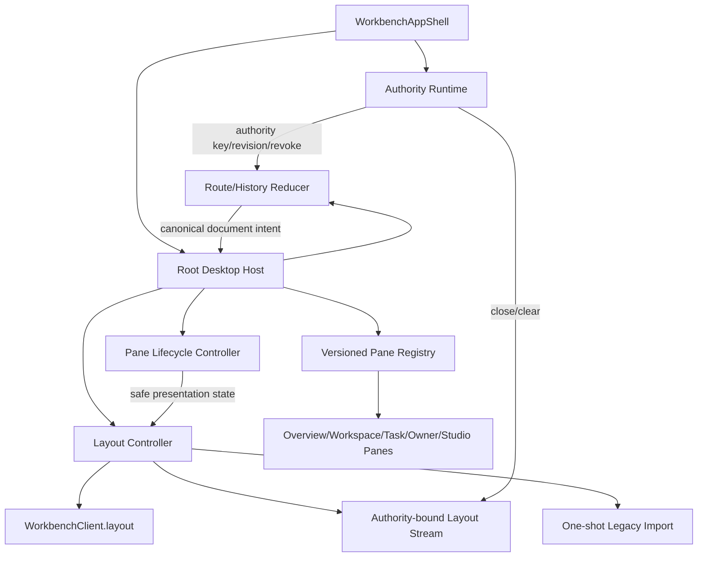

# Root Desktop 与 Layout Web 生产落地计划

## 1. 当前证据与迁移目标

当前 Workbench 已具备 Dockview 页面、Studio Pane 全屏/预览基线、Layout v3 SDK、AuthorityProvider 清理命令和服务端 Layout v3，但仍存在以下 Demo 边界：

- `apps/web/src/workbench/shell.tsx` 同时承担 chrome、路由副作用、Dockview 生命周期、查询、命令面板与业务 Pane 组合，无法独立验证状态迁移。
- `apps/web/src/workbench/layout.ts` 直接把 Dockview JSON 写入 `localStorage`，localStorage 仍是 canonical layout。
- Pane kind 是扁平字符串列表，没有版本化 PaneDocument、document key、instance policy、allowed params 与 unknown-pane rescue。
- route、active Pane 与 browser history 通过组件 effect 耦合，缺少 deterministic reducer 和 duplicate push 证明。
- Layout SDK 已支持 profile/revision/save/copy/reset/watch，但 Web 尚未建立 canonical load/save、conflict draft、legacy import 和 authority-bound stream controller。

目标不是重写现有视觉页面，而是把它们迁入稳定 Root Desktop 平台，使所有业务 Pane 通过相同 registry、route、layout、authority 和 lifecycle 合同运行。

## 2. 目标模块边界



目标路径：

```text
apps/web/src/workbench/app-shell/
apps/web/src/workbench/desktop/domain/
apps/web/src/workbench/desktop/registry/
apps/web/src/workbench/desktop/router/
apps/web/src/workbench/desktop/lifecycle/
apps/web/src/workbench/layout/controller/
apps/web/src/workbench/layout/adapter/
apps/web/src/workbench/layout/legacy-import/
apps/web/src/workbench/layout/stream/
apps/web/src/workbench/panes/
```

原 `workbench/shell.tsx` 最终只保留 route composition 或删除；原 `workbench/layout.ts` 降级为受测试的 legacy adapter，不能继续被生产保存路径调用。

## 3. PaneDocument 和 Registry

Pane registry entry 必须声明：

| 字段 | 作用 |
| --- | --- |
| `paneType` | 版本化 allowlist id，如 `workbench.asset-detail.v1` |
| `routeVersion` | deep-link parser/serializer 版本 |
| `instancePolicy` | `singleton` 或 `multiple` |
| `documentKey(input)` | tenant/workspace/resource 生成稳定 opaque key |
| `paramsSchema` | 只允许 safe refs、枚举、短文本和 bounded view state |
| `requiredAction` | R1 object-level authorization action |
| `suspendPolicy` | revoke/offline/background 时 clear/suspend/retain-safe-summary |
| `routeCodec` | URL 与 canonical PaneDocument 的纯转换 |
| `component` | 静态 import 的批准组件，不接受动态 module URL |
| `fallback` | unknown/version/permission/tombstone rescue |

Registry 规则：

- unknown type/version、非法 params、cross-tenant ref 必须 fail-closed，不动态 import。
- singleton 重复打开只 focus；multiple 使用稳定 document key + instance id。
- PaneDocument 保存 domain identity；PaneInstance 只保存 group/order/active/maximized/suspended 等展示状态。
- title/icon 不作为 authority 或 document identity；失权后不能从旧 title 泄露资源。
- Studio 现有 `pane-presentation.ts` 状态机作为 presentation adapter 复用，不复制第二套 fullscreen 逻辑。

## 4. Route 和 History 状态机

输入事件：`bootstrap`、`open_document`、`focus_instance`、`close_instance`、`browser_pop`、`replace_invalid`、`authority_changed`、`resource_tombstoned`。

输出 effect：`dock_open/focus/close`、`history_push/replace/none`、`focus_restore`、`rescue`。Reducer 本身不访问 DOM、router 或 Dockview。

History policy：

- 用户显式打开新 document：`push`。
- 同一 document 内 tab/focus/view mode：默认 `replace`，除非产品合同声明为可导航状态。
- Dockview restore/bootstrap：`none`，避免启动时重复 history。
- back/forward：只消费 `pop`，不得再次 push。
- permission/tombstone/unknown route：`replace` 到安全 rescue URL，不回显原 title、path 或 payload。
- authority changed：清除旧 route intent，再以新 authority 的安全 landing route `replace`。

每个 reducer test 保存 action/effect 序列，覆盖 StrictMode 双 effect、快速双击、back-forward、refresh、duplicate singleton 和 revoke race。

## 5. Layout Controller

Layout Controller 是纯状态机 + effects executor，React hook 只负责绑定 Dockview、SDK、Authority Runtime 和 QueryClient。

```text
idle -> loading_profile -> loading_revision -> applying -> live
live -> dirty -> save_wait -> saving -> live
saving -> conflict | retryable_error | recovery
live|dirty -> resyncing -> applying
* -> revoked | stopped
```

Controller state 至少包含：authority key/session revision、scope/device/profile、profileRef、server revision/checksum、applied adapter version、draft digest、dirty since、save attempt/idempotency、stream cursor、conflict/recovery diagnostic。

Effects：`get_profile`、`get_revision`、`list_presets`、`capture_dockview`、`apply_revision`、`save`、`save_copy`、`reset`、`open_stream`、`close_stream`、`clear_authority_cache`、`announce_rescue`。

不变量：

- 服务端 revision 是 canonical；Dockview snapshot 是内存 draft，不直接写 localStorage。
- apply 期间忽略 Dockview change callback，避免 restore 立即产生虚假 save。
- save 使用 expected revision 和由 snapshot digest 派生且在同一 attempt 内稳定的 idempotency key。
- debounce 候选 750ms，最长 dirty flush 5s；最终预算由交互/写放大 evidence 决定。
- unload 不使用未经证明的 `sendBeacon` mutation；dirty 时提示用户并保留内存 draft，不能绕过 CSRF/revision/idempotency。
- offline 默认禁止 mutation；恢复网络后先 reload profile/revision，再决定是否进入 conflict rescue。

## 6. Dockview Adapter

Adapter 只在稳定 PaneDocument/PaneInstance 与 Dockview `SerializedDockview` 之间转换：

- 输出只包含 registry 批准 pane、safe document key、group/order/active/maximized/suspended 和 bounded adapter payload。
- 不保存 React state、query cache、token、URL、private path、raw Owner payload、完整文件内容、prompt 或任意 params。
- restore 先通过 SDK contract normalization，再通过前端 registry 二次校验；unknown pane 显示安全 placeholder，并允许 Reset/Recovery，不执行动态组件。
- adapter version 不兼容时不尝试“猜测修复”，进入 recovery preset；原 revision 保留供诊断和未来迁移。

## 7. Legacy Shadow Import

Legacy import 只执行一次，且只能从旧 `yeisme-workbench:layout:v3:` 精确前缀读取当前 authority/owner/project/route 的候选。

流程：

```text
scan exact key -> size/schema/authority check -> registry allowlist
  -> convert to PaneDocument/Instance -> server SaveLayout expectedRevision=0
  -> verify returned checksum/revision -> write non-sensitive imported marker
  -> stop reading legacy layout
```

- 未知字段、未知 pane、超限 JSON、authority mismatch 或解析失败不得上传；UI 提供 Discard + Recovery preset。
- imported marker 只保存 schema version、safe digest 和完成时间，不保存 document。
- server save 成功前不删除旧值，避免中途失败造成数据丢失；成功后可清除精确旧 key。
- 多标签同时 import 依赖 idempotency + expected revision 收敛；loser 读取 canonical revision，不重复覆盖。
- authority revoke 的 cleanup 必须删除旧 authority legacy key 和 marker。

## 8. Conflict、Recovery 和 Stream

Conflict UI 必须保留本地 draft，并提供：

1. **Reload Server**：放弃 draft，应用 canonical revision。
2. **Save as Copy**：创建新 profile，保留当前 draft。
3. **Apply Local**：重新基于最新 expected revision 保存，必须再次确认，不静默覆盖。

Corrupt/incompatible revision 不删除或回写；展示 diagnostic，允许 Recovery preset、选择批准 preset 或查看安全 revision metadata。

Stream 行为遵循 `layout-v3-production-event-stream-plan.md`：重复忽略、gap canonical resync、conflict draft 不覆盖、revoke 终止且不自动复活。BroadcastChannel 只广播 `layout_invalidated` 和 authority/session revision，不广播 layout payload。

## 9. Responsive、Fullscreen 与 Focus

- Desktop 使用 root Dockview；tablet 允许 reduced split；mobile 使用单 Pane stack/sheet，但仍消费相同 PaneDocument 和 route。
- maximize 是 Dockview 状态；browser fullscreen 是浏览器能力。两者通过现有 presentation reducer 协调，不能伪造 fullscreen。
- 所有 drag/drop 提供 command/keyboard equivalent；focus 在 close、restore、fullscreen exit、dialog close 后回到触发元素或安全 Pane heading。
- suspend 后销毁敏感 query/preview，保留的 safe summary 必须由 registry policy 明确批准。
- 200% zoom、reduced motion、touch target、screen reader landmarks/live announcements 纳入 browser gate。

## 10. 实施包

| ID | Owner / Paths | Dependencies | Deliverable | Verification |
| --- | --- | --- | --- | --- |
| RD1 Registry domain | Web implementer；`desktop/domain/**`, `desktop/registry/**` | Layout PaneRegistry contract | PaneDocument、instance policy、safe params、unknown rescue | `bun test apps/web/test/desktop-registry.test.ts` |
| RD2 Route reducer | Web implementer；`desktop/router/**` | RD1 | parse/serialize/history reducer/effect snapshots | `bun test apps/web/test/desktop-routing.test.ts` |
| RD3 Root host | Web implementer；`app-shell/**`, `desktop/host/**` | RD1, RD2 | 拆分 monolithic shell，root Dockview 只执行 effects | `bun test apps/web/test/desktop-host.test.tsx` |
| RD4 Lifecycle | Web implementer；`desktop/lifecycle/**` | RD3, Studio presentation baseline | maximize/fullscreen/suspend/focus/dirty rescue | `task test:pane-lifecycle:component` |
| WEB-L1 Controller | Web implementer；`layout/controller/**`, `layout/adapter/**` | RD1, Layout runtime | canonical load/apply/capture/save state machine | `bun test apps/web/test/layout-controller.test.ts` |
| WEB-L2 Import/recovery | Web implementer；`layout/legacy-import/**` | WEB-L1 | one-shot import、conflict/corrupt rescue | `task test:layout-web:component` |
| WEB-L3 Stream/authority | Web implementer；`layout/stream/**`, auth integration | WEB-L1, EV4, R1 authority | reconnect/resync/revoke/two-tab convergence | `task test:layout-web:integration` |
| RD5 Responsive/a11y | Web implementer；desktop/components/styles | RD3, RD4 | desktop/tablet/mobile/keyboard/zoom/a11y | `task test:desktop-e2e` |

同一 Web writer 串行执行 RD1→RD2→RD3；WEB-L1 可在 RD1 后由不重叠路径并行，但合并前必须冻结 PaneDocument DTO。RD4 与 WEB-L2 可在 RD3/WEB-L1 稳定后并行。RD5 最后验证稳定整合结果。

## 11. 生产验收矩阵

| 场景 | 必须证明 |
| --- | --- |
| Fresh local | 无 localStorage layout 也能从 default preset 启动并保存到 local service |
| Legacy local | 合法旧 layout 一次导入；恶意/超限/unknown 不上传 |
| Managed login | 只通过 BFF load/save，不暴露 bearer/CSRF/session secret |
| Two tabs | stale revision 进入 conflict；Save Copy/Reload/Apply Local 行为明确 |
| Restart/reconnect | stream resume 或 typed resync 后收敛 canonical revision |
| Tenant switch/revoke | 旧 route/query/layout/stream/preview 全部清理，不复活 |
| Corrupt revision | 原数据不被删除/覆盖，Recovery preset 可用 |
| Deep link/history | refresh/back/forward/singleton 无 effect loop/duplicate Pane |
| Fullscreen | maximize/fullscreen/escape/denial/focus 恢复正确 |
| Mobile/a11y | 核心打开、查看、救援、保存流程键盘和触摸可用 |

只有 component、managed browser、security、200-stream integration 和 rollback evidence 全部通过后，`desktop_v3`/`layout_v3` 才能从 `integration_ready` 晋级 canary。
