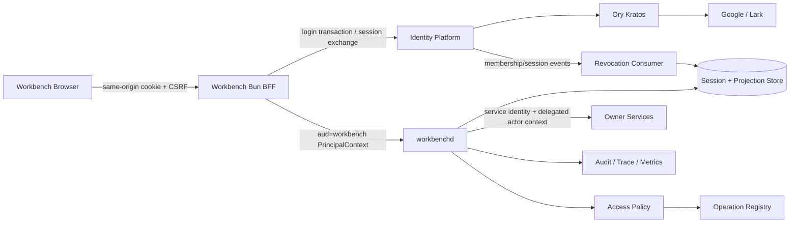
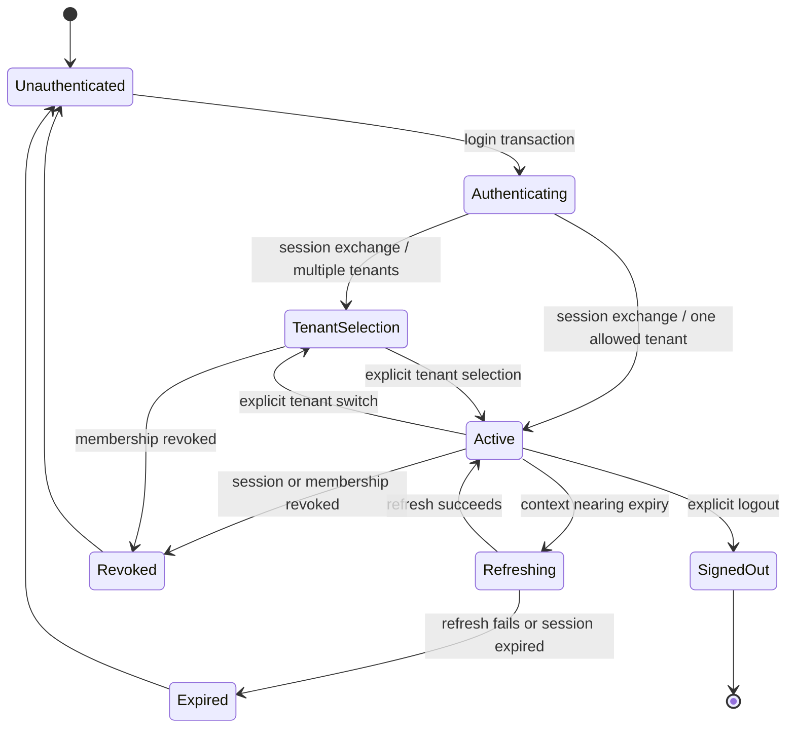

# Workbench Identity、Tenant 与 Access R1 设计

## Context

Workbench 当前的 local profile 使用 loopback bearer token，适合单机开发，但它没有远程用户、tenant、membership、session revoke 或 service identity 语义。根级 `unified-multitenant-login-v1` 已确定未来 `backend-server/identity-platform` 是 User、Tenant、Membership 与 platform session 的唯一 owner，并由 Ory Kratos 处理 Google/Lark browser authentication；该 provider 目前尚未成为仓库中的可运行子项目，因此 Workbench R1 必须采用 provider-first、fail-closed 的消费设计，不能用本地用户表或外部 provider token 填补缺口。

R1 的利益相关方包括：Workbench Web/BFF、`workbenchd`、Identity Platform、Owner services、Studio clients、安全/运维人员和 tenant 管理员。R1 是 `workbench-owner-backend-integrations`、durable workflow/reconcile、production UI 和 managed release 的前置门禁。

约束：

- 浏览器只能访问同源 BFF，不得读取 Identity/Owner bearer token。
- Workbench 不拥有全局 User/Tenant/Membership，不解析 Google/Lark token，也不把 email/domain/display name 当作授权事实。
- 所有稳定 HTTP/gRPC/JSON-RPC/SDK/schema 字段必须 additive 演进。
- managed profile 必须使用 PostgreSQL + GORM、approved issuer/audience 与可轮换 key；local profile 保持 pure-Go 和 `CGO_ENABLED=0`。
- 日志、trace、审计和 evidence 不得包含 cookie、Authorization、OAuth code、provider payload、credential、完整个人资料或完整思维链。

## Goals / Non-Goals

**Goals:**

- 建立 Workbench 可验证的 human、automation 与 service principal。
- 提供安全 browser session、显式 tenant selection/switch、membership freshness/revoke 和 operation authorization。
- 让 BFF、workbenchd、Owner connector 与 Studio launch 使用相同的 tenant/actor authority，不从 query、localStorage、Owner projection 或 return payload 接受 tenant authority。
- 让 managed readiness、capability、审计、错误和测试证据能证明跨租户隔离与撤销传播。
- 以 shadow → enforce → canary 的方式迁移，不中断 local preview。

**Non-Goals:**

- 不实现 Identity Platform、Kratos、Google/Lark OAuth 或账号关联内部逻辑。
- 不让 Workbench 成为组织目录、HR、billing entitlement 或复杂 ABAC owner。
- 不在 R1 实现 Owner 领域 permission、跨 Owner saga、resource sharing 或公网匿名访问。
- 不在浏览器保存 refresh token，不复用 human cookie 作为 service credential。
- 不提供绕过 Identity Platform 的 emergency local token 作为 managed production fallback。

## Architecture



浏览器登录状态机：



## Decisions

### 1. Identity Platform 是唯一身份权威

Workbench 只消费 Identity Platform 的 discovery、session、tenant、membership、JWKS/context token 与 event contract。Provider 未交付时 managed identity capability 为 `needs_contract`，不能创建本地 production 用户或从 Google/Lark claim 直接构造 tenant。

**Alternatives considered:**

- 在 Workbench 建用户/tenant 表：会复制全局真源并使撤销漂移，拒绝。
- 直接验证 Google/Lark token：外部 token audience、tenant 和生命周期不等于 Yeisme 授权，拒绝。
- 将 Aigora principal 当全局身份：会让单一 Gateway 成为所有产品隐式 owner，拒绝。

### 2. 浏览器只持有 opaque Workbench session cookie

BFF 发起受控 login transaction；Identity/Kratos 完成 provider flow 后，Workbench 只接收一次性 transaction receipt。BFF 用 receipt 交换 platform session，并在 server-side session store 保存 identity session ref、selected tenant/membership refs、membership version、auth time、expiry 和 token cache metadata。浏览器 cookie 只包含高熵 opaque session id，必须 `Secure`、`HttpOnly`、`SameSite=Lax` 或更严格、限定 path/domain，并轮换 session id 防止 fixation。

所有 state-changing BFF route 必须同时验证 Origin/Host、CSRF token、session status 和 request content type。登录 `return_to` 只能来自服务端 allowlist，不接受任意 URL。

**Alternatives considered:**

- JWT/refresh token 放 `localStorage`：XSS 后可长期外泄，拒绝。
- 浏览器直接调用 Identity/Owner：导致 token 暴露、多套 CORS 与授权逻辑，拒绝。

### 3. `PrincipalContext` 必须 audience-bound 且完整校验

workbenchd 只接受 approved issuer 签发、`aud=workbench` 的短期 context。标准化字段：

```text
issuer, audience, subject, session_ref,
tenant_ref, membership_ref, membership_version,
actor_type, scopes, auth_methods, auth_time,
issued_at, expires_at, token_id
```

验证顺序固定为：签名/算法 → issuer → audience → time/skew → required claims → actor type → tenant/membership binding → membership freshness → operation policy。`X-Tenant-ID`、URL/query、Studio return 和 Owner payload 只能作为 selector/ref，不能覆盖 context tenant。

JWKS 以 bounded TTL 缓存并按 `kid` 刷新；未知 key 只允许一次受限 refresh，失败即 `authentication_required`/`identity_unavailable`，不得降级为未验证 token。

### 4. Tenant switch 是原子安全边界

tenant switch 由 BFF 请求 Identity Platform 验证 active membership 并签发新的 Workbench audience context。成功后原子更新 server session binding，轮换 cookie/session id，并清除所有 subject/tenant-bound query cache、SSE cursor、Pane selection、recent resource、pending approval context 和 token cache。

若任一步失败，旧 tenant session 保持有效但不改变当前 UI authority；浏览器不得先切 UI tenant 再等待服务端确认。跨 tenant resource 查询统一返回安全 404，避免枚举。

### 5. Membership version 与 revoke 双通道传播

Identity Platform 发布 `membership.created/changed/revoked`、`tenant.suspended`、`session.revoked` 和 signing-key lifecycle event。Workbench 通过可恢复 event cursor 更新本地安全投影；同时使用短 token TTL 和按风险分级的在线 freshness check 防止 event 延迟成为授权绕过。

- 低风险 read：在签名有效、缓存 membership version 匹配且未过 bounded freshness window 时可继续。
- 高风险 mutation、invite、role change、export/handoff：必须使用当前 membership version；Identity 不可达或 version stale 时 fail-closed。
- revoke/suspend event 到达后：立即撤销对应 BFF session、清理 token/cache/SSE，并拒绝新请求；进行中的 owner task 按 Task/Owner policy 对账，不伪造 cancelled。

目标 revoke enforcement window 为 60 秒以内；最终数值由 Identity provider SLO 与 security review 冻结。

### 6. Authorization 使用显式 policy input/output

授权输入：PrincipalContext、operation descriptor、tenant/workspace/project/resource refs、Owner capability、expected version、cost/approval gate 和 request risk class。授权输出固定为：

```text
decision_id, allowed, reason_code, policy_version,
membership_version, required_scopes, required_gates,
expires_at, audit_ref
```

UI 只展示服务端返回的 allowed actions；隐藏按钮不是安全控制。拒绝 reason 使用稳定代码，不返回内部 policy、角色图或资源存在性。policy cache key 必须包含 issuer、subject、tenant、membership id/version、operation、resource ref/version 和 policy version。

R1 使用 Workbench 内建显式 policy registry，不引入 OPA/Casbin；当 policy 复杂度和跨服务复用有测量证据后再独立评估。

### 7. Human、automation、service identity 严格分离

`actor_type` 至少区分 `human`、`automation`、`service`。浏览器 cookie 只能代表 human session；automation 使用独立短期 credential 和明确 tenant/scope；workbenchd 调用 Owner 使用 workload identity，并通过 Identity token exchange 获得 owner-audience delegated actor context或不可伪造 delegation receipt。

不得把 `aud=workbench` token 原样转发给 Owner，也不得把 service credential 解释为最终用户授权。Owner 必须同时验证 caller service、delegated actor tenant/scope、operation idempotency 和自己的领域 permission。

### 8. Team projection 与成员 mutation 仍由 Identity owner 执行

Workbench 可缓存 tenant/member 的安全展示字段、membership status/version、allowed actions 和 freshness。invite、accept invite、remove member、change role 等 mutation 通过 Identity Platform typed command，包含 idempotency key、expected membership/tenant version 与审批上下文，并返回 receipt；Workbench 不直接修改本地投影表示成功。

mutation 超时且接受状态未知时进入 `unknown_accept`，使用原 idempotency key/receipt/status lookup 对账，不自动重放。

### 9. Profile 与 readiness 分层

- `local`：保留 loopback local-session，不模拟 multi-tenant 或 managed auth；UI 明确标识 local authority。
- `managed`：必须配置 approved issuer、audience、JWKS/discovery、BFF session store、cookie policy、CSRF secret、service identity 和 audit sink。缺失时启动失败或 identity readiness 为 false。
- Identity 暂时离线但已有有效 JWKS/cache 时：进程 liveness 保持；identity capability 为 `degraded`。已有低风险 read 可在 freshness window 内继续，高风险 mutation、登录、refresh、tenant switch fail-closed。
- JWKS 从未成功加载、session store 不可用、policy registry 未 seal 或 revoke cursor 无法恢复且超过阈值：核心 readiness 为 false。

### 10. 数据最小化、审计与观测

Workbench session store 只保存 opaque refs、版本、状态、过期时间、hash 后 session id 与加密 token cache；禁止 provider token、OAuth code、raw Kratos identity、完整 profile、email 作为授权键。审计记录 actor/tenant/session safe ref、operation、decision/result、policy/membership version、correlation/receipt ref、source IP/UA 的受控摘要与时间。

指标至少覆盖 login/session exchange、tenant switch、auth decision、deny reason、JWKS refresh、membership freshness、revoke lag、session revoke、CSRF/origin rejection 和 audit sink failure；label 不得包含 user/tenant/session id。trace 只记录 safe refs 的 hash/digest。

## Stable Errors

| Condition | Workbench error | Retry |
| --- | --- | --- |
| no/expired session | `authentication_required` | user login |
| recent re-auth required | `reauth_required` | user action |
| tenant not selected | `tenant_selection_required` | explicit select |
| inactive/stale membership | `membership_inactive` / `membership_stale` | refresh/check |
| scope or resource denied | `permission_denied` | no automatic retry |
| Identity unavailable | `identity_unavailable` | bounded safe read only |
| incompatible provider contract | `contract_mismatch` | no |
| CSRF/origin/session mismatch | `invalid_session_request` | no |
| mutation acceptance unknown | `unknown_accept` | reconcile only |
| rate limited | `rate_limited` | honor retry-after |

错误响应不得泄露 issuer internal URL、token、cookie、membership existence、resource existence 或 policy internals。

## Migration Plan

1. **Contract draft**：Identity owner 创建 `identity-platform-google-lark-login-v1`，发布 OpenAPI/JWKS/events/fixtures 与 schema digest；Workbench R1 保持 `needs_contract`。
2. **Workbench shadow**：新增 Principal/session/policy interfaces 和 managed config，但 local behavior 不变；测试 token 只来自 disposable Identity fixture/service。
3. **Read-only canary**：接入 current session、tenant list/switch、membership freshness、revocation event；与 local/test policy 比较但不开放 managed mutation。
4. **Enforce managed reads**：managed BFF/workbenchd 强制 audience/tenant/membership 校验；跨 tenant、revoke、key rotation 和 outage evidence 通过。
5. **Team mutation canary**：invite/role/remove 通过 Identity receipts、expected version、approval 和 reconcile；只允许 test tenant。
6. **Owner delegation canary**：向 Scaena/Auctra 等 Owner 交换 audience token/delegation context，完成 provider/consumer/cross-product evidence。
7. **Production promotion**：7 天 canary SLO、安全 review、rollback drill、audit completeness 和 incident runbook 通过后晋级。

Rollback：可关闭新登录/tenant mutation 并回滚到上一兼容 consumer，但不得让 managed listener 回退到 local token 或忽略 tenant。已创建的 session/projection 表保持 additive；回滚后现有 managed session fail-closed，用户重新登录，不复用未知状态 token。

## Test and Evidence Plan

- Unit：claim validation、clock skew、cookie/CSRF、tenant switch reducer、policy key、redaction、error mapping。
- Contract：Identity OpenAPI/JWKS/event/schema digest、HTTP/gRPC/JSON-RPC/SDK projection parity。
- Integration：真实 disposable Identity + PostgreSQL + Workbench BFF/workbenchd；登录 exchange、tenant switch、revoke、membership stale、key rotation、provider outage。
- Security：token confusion、wrong issuer/audience/alg/kid、session fixation、CSRF、open redirect、cross-tenant cache、resource enumeration、service/human credential confusion。
- Concurrency：双 tenant switch、refresh/revoke race、role change during mutation、duplicate invite/idempotency、event reconnect。
- Browser E2E：Google/Lark test identity、multi-tenant selection、logout/revoke、two-tab switch、expired session rescue。
- Evidence：所有 integration/system/e2e 写入 `temp/integration-test-runs/<run-id>/` 六件套；记录 contract/policy digest、provider/consumer version、redaction status 与 rollback result。

## Risks / Trade-offs

- **[Identity provider 尚不存在]** → R1 先冻结 consumer contract 与 fail-closed state；不得用 fixture 晋级 production。
- **[Revocation event 延迟]** → 短 token TTL、risk-based online check、revoke lag metric 和 bounded readiness threshold。
- **[Identity outage 放大]** → 缓存 JWKS/安全投影仅支持 bounded low-risk read；高风险操作全部 fail-closed。
- **[Session store 成为高价值目标]** → opaque/hash session id、加密 token cache、最小权限、rotation、TTL、审计与不记录 secret。
- **[多标签页 tenant 漂移]** → server authority、session revision、BroadcastChannel 仅做通知；每个请求仍由服务端校验。
- **[Owner delegation 复杂]** → R1 只冻结 token exchange/delegation envelope；各 Owner 仍在自己的 OpenSpec 实现 permission。
- **[Local 与 managed 行为差异]** → 明确 profile badge、独立测试矩阵；local success 不作为 managed evidence。

## Open Questions

- Identity provider 最终选择 platform context JWT、opaque token introspection，还是两者并存；Workbench 只依赖稳定 validation interface。
- managed BFF session store 首版是否复用 Workbench PostgreSQL，还是采用独立 Redis；需根据 HA、revocation latency 和运维复杂度决策。
- revoke enforcement window 的最终 SLO、high-risk operation 清单和在线 freshness threshold。
- automation actor 的创建/rotation owner，以及是否在 R1 后半段或独立 R2 capability 交付。
- Owner delegation 是 Identity token exchange 还是签名 delegation receipt；必须与 Scaena/Auctra provider contract 联合冻结。
