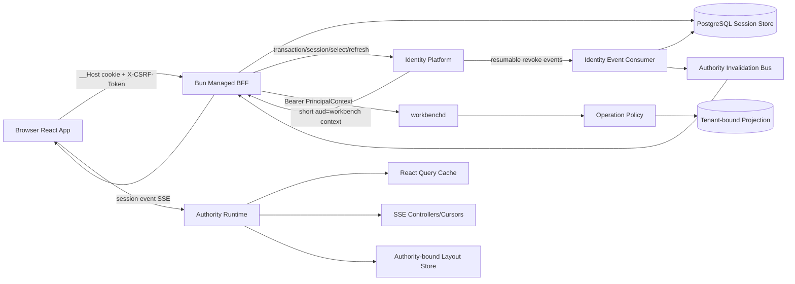
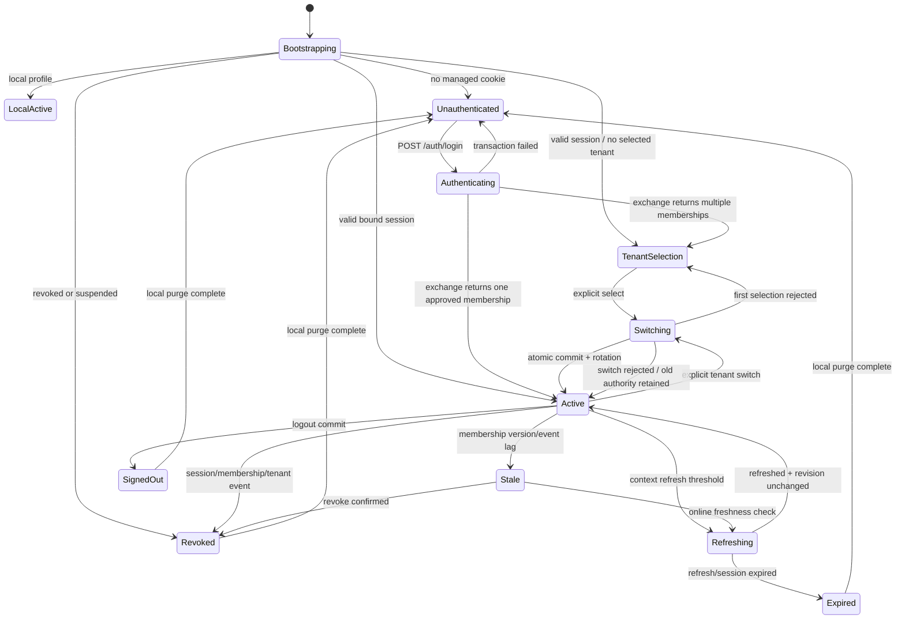
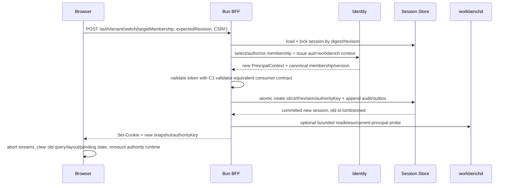
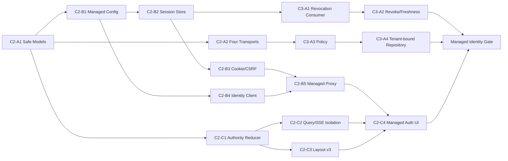

# C2/C3 Browser Session、Tenant Authority 与 Revocation 工作流

## 1. 目标与当前差距

该计划把当前 local-only Bun proxy 演进为完整 managed BFF，并把 tenant authority、session rotation、cache/SSE/layout 清理、membership freshness 与 operation policy 变成一个可验证的工作流。它不是在现有页面外包一层登录壳；所有读取、mutation、event、layout 和恢复状态都必须消费同一个 authority generation。

当前代码的主要差距：

- `apps/web/server/handler.ts` 在进程启动时读取 local token，所有请求固定注入该 token，没有 managed session store、cookie、Identity exchange 或 revoke。
- BFF 只检查 loopback Host/Origin；没有 synchronizer CSRF token、session revision、cookie rotation、login return allowlist 或 managed proxy mode。
- React Query key 只包含 owner/project/resource，不包含 subject/tenant/membership/version/authority generation。
- Task/Owner SSE cursor 保存在组件内存，tenant switch 时没有统一 abort、cursor discard 与 reconnect generation。
- Dockview layout 存在 `localStorage`，key 只包含 owner/project/route 或 project，tenant switch 后旧 tenant layout 仍可恢复。
- URL 中的 owner/project ref 会直接驱动查询；没有先通过当前 authority 解析 safe resource ref。

## 2. 总体架构



核心不变量：

1. 浏览器只持有 opaque Workbench session cookie 和可轮换 CSRF token，不持有 Identity/Owner token。
2. `authorityKey` 是 BFF 根据 issuer/subject/tenant/membership/version/session revision 生成的不可逆版本化摘要；浏览器只用它隔离 cache/layout/stream generation，不把它当授权凭据。
3. BFF 只从 server session binding 获取 tenant authority；query/header/route/Owner payload 只能作为 selector。
4. workbenchd 必须再次验证 PrincipalContext，并由 operation policy 校验 tenant/resource/scope/version；BFF 认证不是后端授权替代品。
5. tenant switch、membership revoke 与 session rotation 必须先提交服务端 authority，再发布新的 UI authority；失败时 UI 保留旧 authority，不做乐观切换。

## 3. Browser session 状态机



前端 reducer 的 authority-bearing states 必须包含：

```text
profile, status, sessionRevision, authorityKey,
subjectSafeRef, tenantSafeRef, membershipSafeRef,
membershipVersion, actorType, authTime, expiresAt,
csrfToken, allowedSessionActions, diagnosticCode
```

不得包含 provider token、Identity context token、cookie value、email 授权键、raw profile 或 provider payload。

## 4. BFF HTTP 合同

所有响应使用版本化 envelope 和 stable error。除 callback 外，managed mutation 必须同时满足 exact Host、allowed Origin、opaque cookie、session revision 与 `X-CSRF-Token`。

| Route | Method | Authority | Result | Notes |
| --- | --- | --- | --- | --- |
| `/auth/session` | GET | optional cookie | session snapshot | `no-store`；不会刷新 context；返回 `authorityKey`，CSRF proof 只通过受控响应头交给 BFF client |
| `/auth/login` | POST | unauthenticated + CSRF bootstrap | transaction redirect | provider id 只能是 Identity contract 支持值；return path 固定 allowlist |
| `/auth/callback` | GET | one-time state cookie | exchange result | 只接收一次性 receipt/state；成功后 rotation 并 303 到 allowlisted path |
| `/auth/tenant/select` | POST | selection session | active snapshot | 首次选择；要求 membership safe ref + expected session revision |
| `/auth/tenant/switch` | POST | active session | rotated active snapshot | 非乐观；失败保留旧 cookie/session authority |
| `/auth/refresh` | POST | active/stale session | refreshed snapshot | singleflight；revision compare；Identity outage fail-closed |
| `/auth/logout` | POST | active session | signed-out receipt | server revoke/close 后清 cookie；失败进入 durable pending revoke |
| `/auth/session/events` | GET | active session | resumable SSE | event 只包含 safe code、revision、authority generation 与 cursor |

Cookie 固定策略：

```text
Name: __Host-yeisme_workbench
Secure: true
HttpOnly: true
SameSite: Lax (需要跨站 POST 时必须重新评审，不能直接改 None)
Path: /
Domain: absent
Value: 256-bit opaque random id
```

数据库只保存 session id 的 keyed digest；响应正文、共享 SDK model、日志、trace、evidence 和 audit 不记录 cookie 或 CSRF proof。CSRF 使用 synchronizer token：服务端保存 digest，明文只通过 `X-CSRF-Token` 响应头交给同源 BFF client 并保存在前端内存；session/login/tenant switch/privilege refresh 时轮换。通用 Workbench transport 不暴露该 header，只有 auth session client 可以读取。

## 5. Server session storage model

建议由 BFF application service 管理，PostgreSQL 通过 Drizzle ORM；不在 handler 拼 SQL。

```text
WorkbenchSession
  id_digest, status, revision
  identity_session_ref, subject_ref
  selected_tenant_ref?, selected_membership_ref?, membership_version?
  actor_type, auth_time, context_expires_at
  csrf_digest, authority_key
  created_at, last_seen_at, idle_expires_at, absolute_expires_at
  revoked_at?, revoke_reason_code?

IdentityContextCacheMetadata
  session_id_digest, context_generation, expires_at
  cache_state, refresh_after, last_refresh_status
  token bytes MUST remain in bounded encrypted/in-memory custody, not ordinary logs/assets

SessionEventCursor
  consumer_id, cursor, contract_version, schema_digest
  last_event_at, lag_state, updated_at

SessionAuditRef
  event_id, session_digest, authority_key, action, result_code
  request_id, trace_id, created_at
```

Session status：`selection_required | active | stale | revoking | revoked | expired | signed_out`。所有 update 使用 expected revision；不允许 handler 直接覆盖 binding。

## 6. Tenant selection/switch 原子事务



必须满足：

- 调用 Identity 前先验证 old session/CSRF/expected revision；调用后再次 compare-and-swap，避免两标签页竞态。
- Identity 返回的 tenant/membership 必须等于用户选择且 active；外部 query/header 不能覆盖。
- commit 成功才设置新 cookie。旧 id 进入短期 tombstone，阻止 fixation/replay；失败不改变旧 authority。
- 两个并发 switch 最多一个成功；另一个返回 `session_revision_conflict` 并重新读取 `/auth/session`。
- 首次 selection 与 active switch 共用同一 reducer/transaction service，但失败后的目标状态不同。
- workbenchd probe 失败不能回滚已被 Identity 确认并提交的 authority；新 session 标记 `degraded`，业务请求 fail-closed，UI 展示恢复操作。

## 7. Browser authority runtime 与清理协议

`AuthorityProvider` 是 React 根级 provider，拥有 `QueryClient`、stream registry、layout registry、pending action registry 与 session reducer。`authorityKey` 变化时按固定顺序执行：

1. 阻止新 mutation，冻结当前 navigation resolution。
2. abort 全部 Task/Owner/session SSE 与 fetch；丢弃 cursor。
3. `queryClient.cancelQueries()` 后 `queryClient.clear()`；新 QueryClient 或所有 key 必须以前缀 `authorityKey` 开始。
4. 清除 selected project/resource/candidate/evidence、pending approvals、mutation draft、recent resource 与 inspector selection。
5. 删除旧 authorityKey 对应的 layout index 和 layout values；不得扫描/删除无关 origin 数据。
6. 应用新 session snapshot，创建新 stream/query generation。
7. 重新解析当前 deep link；resource 不属于新 tenant 时使用安全 404/tenant home，不显示旧标题。

Layout v3 key：

```text
yeisme-workbench:layout:v3:<authorityKey>:<ownerId>:<projectRef>:<route>
yeisme-workbench:layout-index:v3:<authorityKey>
```

layout value 只允许 pane id、owner id、opaque resource ref、projection kind 和 safe display params；禁止正文、prompt、token、private URI、Owner payload。local profile 使用固定 `authorityKey=local-session`，保持现有 preview 体验。

## 8. Revocation、freshness 与 session event workflow

Identity event consumer 必须使用 resumable opaque cursor、schema/contract digest 和 inbox dedupe：

| Event | Persistent action | Browser action | workbenchd action |
| --- | --- | --- | --- |
| `session.revoked` | 匹配 session 置 revoked、revision++、outbox | SSE revoke → purge → login | 拒绝后续 context/session ref |
| `membership.changed` | 更新 projection/version；active session 置 stale | 禁止高风险 mutation，触发 refresh | version mismatch fail-closed |
| `membership.revoked` | 绑定 session revoked | purge；可回 tenant selection | 安全 404/permission deny |
| `tenant.suspended` | tenant 全部 session stale/revoked | 全局 tenant rescue state | tenant operation deny |
| `identity.signing_key.rotated` | 记录安全事件 | 无直接 UI | bounded JWKS refresh |
| `identity.contract.changed` | capability `contract_mismatch` | managed rescue diagnostic | readiness false / fail-closed |

Event 处理顺序：verify envelope → contract/schema gate → inbox dedupe → projection/session transaction → outbox → cursor commit。cursor 不能先提交；duplicate/out-of-order 不得恢复旧 membership version。高风险 mutation 在 event lag 超阈值时必须在线调用 Identity authorize/freshness，低风险读取可按批准 staleness window 降级。

## 9. Operation policy 与 tenant-bound data

C2 完成认证后仍不能自动开放业务能力。C3 必须建立：

```text
Authorize(
  principal issuer/subject/tenant/membership/version/actor/scopes,
  operation descriptor + policy version,
  workspace/project/resource tenant binding + resource version,
  owner capability + expected owner version,
  cost/approval/risk
) -> allowed, reasonCode, requiredScopes, requiredGates, decisionRef, expiresAt
```

- `CallerScope` 只作为幂等 principal/tenant 摘要；权限必须读取独立 scopes/policy decision。
- 所有 repository list/get/mutation 必须接收 tenant-bound authority，并在 GORM repository 内过滤；不能只靠 UI/BFF。
- 其他 tenant opaque ref 统一安全 404；permission deny 不暴露资源存在性。
- policy cache key 必须包含 issuer/subject/tenant/membership/version、operation、resource/version 与 policy version。
- human、automation、service actor 使用不同 credential/session/delegation；human context 不转发 Owner。

## 10. 原子实施任务

### Lane C2-A — Safe contracts

1. `C2-A1`：新增 identity schema/proto/SDK safe models；Paths: `api/schema/workbench/identity/**`, `api/proto/workbench/identity/**`, `service/gen/**`, `packages/task-sdk/**`；Acceptance: session snapshot、tenant/membership、authority state、stable errors 四层 parity，无 token/cookie/raw profile。
2. `C2-A2`：注册 current session/principal、tenant list/select/switch 与 identity readiness read operations；Paths: registry + four transports；Acceptance: 同一 operation id/schema/error，local 返回明确 `local-session`。
3. `C2-A3`：定义 BFF HTTP contract 与 MSW fixtures；Paths: `apps/web/src/features/auth/**`, `apps/web/server/contracts/**`；Acceptance: fixture 只能到 `contract_validated`，不得标记 provider available。

实现状态：`C2-A1` safe model baseline、`C2-A2a` identity read parity 与 `C2-A3` managed BFF auth contract baseline 已完成，分别见 `details/c2-a1-safe-model-contract.md`、`details/c2-a2-identity-read-operations.md`、`details/c2-a3-bff-auth-contract.md`。真实 Provider adapter、server-side session、cookie/CSRF middleware 与 tenant select/switch transaction 仍未实现，因此 managed capability 保持 `needs_contract`。

### Lane C2-B — BFF session foundation

1. `C2-B1`：拆分 `local`/`managed` BFF mode 与 validated config；managed 缺 Identity/session/cookie/audit prerequisite 时 fail-fast。
2. `C2-B2`：建立 Drizzle session schema、migration CLI、repository/service；session id/CSRF 只存 digest，所有 update expected revision。
3. `C2-B3`：实现 cookie/CSRF/Host/Origin/return allowlist middleware；fixation、open redirect、missing Origin、stale revision 全部拒绝。
4. `C2-B4`：实现 Identity transaction/exchange/refresh client；固定 contract digest、timeout、redirect、body limit、stable error/redaction。
5. `C2-B5`：managed proxy 在每个请求从 server session 获取短期 context；浏览器 Authorization/cookie 不转发，Identity token 不进入响应。

### Lane C2-C — Tenant authority UI

1. `C2-C1`：实现 pure session reducer 与 `AuthorityProvider`；固定 generation transition/cleanup command 顺序。
2. `C2-C2`：所有 Query key、SSE registry、cursor 与 mutation context 加 `authorityKey`；提供统一 abort/clear API。
3. `C2-C3`：layout v3 authority binding/migration；managed switch 删除旧 authority layout，local v2 可受控迁移。
4. `C2-C4`：实现 login/selection/switch/expired/revoked/rescue UI；两标签页 revision conflict、deep link 与 keyboard/a11y 完整。

### Lane C3-A — Freshness/revoke/policy

1. `C3-A1`：Identity event inbox/outbox/cursor + consumer；duplicate/out-of-order/gap/contract drift tests。
2. `C3-A2`：session revoke/freshness service 与 browser session SSE；revoke SLO 指标、lag threshold 和 reconnect。
3. `C3-A3`：operation policy model/evaluator/cache；registry required scope/gate，stable deny codes。
4. `C3-A4`：tenant-bound GORM repository/query/mutation；cross-tenant same-name/ref probing matrix。
5. `C3-A5`：service identity/delegation interface；Owner audience exchange、expiry、tenant/scope binding、audit ref。

## 11. 并行与依赖



可并行：A1 与 B1、C1；B2 与 B4；C2 与 C3；A3 policy contract 与 revoke consumer。必须串行：B2 → B3；B3+B4 → B5；B5+C2+C3 → C4；policy + tenant repository + revoke + UI → managed gate。

## 12. Evidence 与 Taskfile 目标

计划增加的真实命令：

```text
task identity:models:test
task identity:bff:test
task identity:session:component
task identity:tenant-switch:component
task identity:revoke:integration
task identity:policy:test
task test:identity-integration
task test:identity-security
task test:identity-e2e
task identity:revoke-drill ENV=staging
```

| Gate | Required evidence | Failure injection |
| --- | --- | --- |
| Unit | reducer、cookie、CSRF、revision、policy、layout key | malformed claims/cookie、duplicate command、old revision |
| Component | BFF + disposable session DB + fake contract server | exchange timeout、redirect、rotation race、proxy outage |
| Integration | real Identity + PostgreSQL + workbenchd | key rotation、provider outage、multi-tenant、event gap |
| E2E | real browser/BFF entrypoint | login callback、selection、switch、two-tab、deep link、refresh |
| Security | fixation/CSRF/open redirect/token confusion/cross-tenant | attacker headers/query/provider token/layout cache |
| Drill | staging revoke/lag/rollback | session revoke、tenant suspend、contract drift、old artifact rollback |

所有 component/integration/system/e2e 使用 evidence runner，除标准六件套外记录 provider/consumer contract digest、safe tenant/session digest、authority generation transition、redaction result 与 rollback/kill-switch result。不得记录 cookie、context token、OAuth code、email、raw profile、private endpoint 或 Owner payload。

## 13. Promotion gate

```text
missing
  -> needs_contract
  -> contract_validated
  -> session_component_ready
  -> tenant_isolation_ready
  -> revoke_policy_ready
  -> integration_ready
  -> canary
  -> available
```

只有真实 Identity/PostgreSQL/BFF integration、cross-tenant matrix、revoke SLO、security/browser gate、24h soak 与 rollback drill 全部通过，managed identity 才能进入 `available`。C1 validator、fixture contract 或 local preview 通过均不能跳级。
