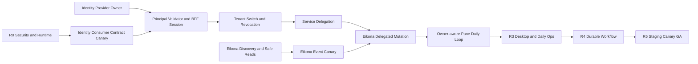

# R1 Identity → R2 Owner 生产对接执行计划

## 1. 目标与完成定义

本计划把 Workbench 从 local demo 推进为 managed 多租户产品，覆盖真实用户登录、tenant authority、权限撤销、服务身份、Owner delegation、真实资源读取、事件观察、mutation receipt/reconcile 与 UI 恢复。最终范围仍包括 Scaena、Eikona、Pinax、Sonora 等 Owner；执行顺序先建立共享 identity/delegation spine，再用 Eikona 完成第一个端到端 canary，之后按同一合同扩展其他 Owner，避免形成四套认证和恢复机制。

“计划完成”不等于“功能完成”。只有代码、真实 provider、真实 consumer、测试、evidence、review、rollback 和 canary 同时满足，R1/R2 capability 才能从 `needs_contract` 晋级。

## 2. 当前证据

| Boundary | Current evidence | Decision |
| --- | --- | --- |
| R0 security | local/current-managed loopback 已有 bearer、exact Host/Origin、body/header/query limits、SSE lease 和 component evidence | 可作为 consumer spine 基础，不可作为公网身份 |
| Identity provider | `backend-server/identity-platform` 当前不存在 | provider owner 未建立，managed login/revoke/delegation 不可宣称可用 |
| Identity consumer | R1 proposal/design/spec/tasks 与 handoff 已 strict valid；consumer canary 已有实现 | 可继续 safe model、config、validator interface 与 fail-closed UI |
| Eikona provider | `/api/v1/instance`、projects/assets、`eikona.asset_handoff.v2`、OpenAPI 与 Go SDK 已存在 | 适合作为首个 R2 read canary |
| Workbench Eikona consumer | loopback-only connector 与 handoff sanitizer tests 已存在 | 仍缺 discovery digest、event、delegation、mutation receipt/reconcile 与 managed canary |
| Scaena provider | production facade、receipt/reconcile 设计和大量领域合同存在 | 作为第二个复杂 Owner canary；先避免 Workbench 重复领域聚合 |

## 3. 关键依赖图



不可跳过：Identity provider owner、R1 revoke/cross-tenant gate、至少一个真实 Owner mutation/reconcile canary、R0 container/readiness、R5 restore/rollback/SLO。

## 4. 工作包

### I0 — Identity Provider Owner 建立

- **Owner**：root + Identity provider team。
- **Owned paths**：新独立 `backend-server/identity-platform` submodule；Workbench 只读消费。
- **Deliverables**：`AGENTS.md`、OpenSpec `identity-platform-google-lark-login-v1`、OpenAPI 3.1、discovery/JWKS、browser transaction/session exchange、Tenant/Membership、PrincipalContext、events、delegation、audit/outbox、migration、container、test commands。
- **Acceptance**：provider strict valid；`CGO_ENABLED=0 go test ./...`；disposable PostgreSQL + Kratos/test identity 可运行；无真实 credential 入库或 evidence。
- **Failure behavior**：路径、合同或真实服务任一缺失时 Workbench managed identity 保持 `needs_contract`。

### C0 — Workbench Consumer Contract Gate

- **Owner**：Workbench contracts。
- **Deliverables**：固定 `contractId=yeisme.identity.platform`、SemVer、schema digest、HTTPS issuer/JWKS、required capabilities/events/errors/claims、TTL/algorithm policy；只读 probe。
- **Current implementation**：`scripts/identity-contract-canary.ts` 与 `tests/identity-contract-canary.test.ts` 已覆盖完整合同、缺 capability/event/error、unsafe issuer/JWKS/algorithm/TTL、redirect、credential URL、Content-Type、1 MiB body 与原始值不回显。
- **Verification**：`task identity:contract:test`；真实 provider 出现后执行 `task test:identity-contract-canary IDENTITY_CONTRACT_URL=http://127.0.0.1:<port>/contract`。
- **Promotion rule**：fixture/unit 通过只表示 consumer contract frozen；必须有 live provider digest evidence 才能完成 R1 `0.2`。

### C1 — Principal Validator 与 Managed Configuration

- **Owner**：Workbench security/runtime。
- **Deliverables**：provider-neutral `PrincipalValidator` interface；固定 issuer/audience/algorithm/clock skew/TTL/required claims；bounded JWKS cache/refresh；managed config validation；readiness component；stable errors。
- **Acceptance**：wrong issuer/audience/alg/kid/time/actor/tenant binding 全部 fail-closed；未知 `kid` 最多一次 bounded refresh；日志无 token/claim/issuer URL。
- **Verification**：Go table tests、race、JWKS rotation/outage component evidence。
- **Dependency**：C0 可先做 interface/fixtures；live integration 等待 I0。

### C2 — BFF Session、Tenant Switch 与 Revocation

- **Owner**：Workbench Web/BFF + identity consumer service。
- **Deliverables**：opaque HttpOnly cookie、transaction receipt exchange、session rotation、CSRF/Origin/Host、tenant list/select、two-tab notification、server authority、revoke event consumer、cache/SSE/Pane/pending approval 清理。
- **State machine**：

```text
anonymous -> authenticating -> session_unbound -> tenant_selection_required
          -> active -> refreshing -> active
          -> reauth_required
          -> revoked / expired / identity_unavailable
```

- **Atomic switch**：只有 provider 已确认新 membership 且新 PrincipalContext 验证成功后，才旋转 session revision 并提交 tenant；失败保持旧 authority，UI 不预展示目标 tenant 数据。
- **Acceptance**：session fixation、open redirect、CSRF、stale membership、two-tab race、revoke reconnect、Identity outage tests 通过。

### D0 — Workload Identity 与 Owner Delegation

- **Owner**：Identity provider + Workbench BFF/workbenchd + Owner provider。
- **Deliverables**：workload identity、actor context、owner audience、tenant/membership version、operation/resource scope、TTL、jti、policy digest；禁止浏览器 Authorization 透传。
- **Invariant**：`aud=workbench` PrincipalContext 永不转发给 Owner；每个 Owner 只接收 `aud=<owner>` 的短期 delegation 或等价签名 receipt。
- **Acceptance**：human/service token confusion、wrong audience、stale membership、replay、delegation expiry、Owner auth outage 全部 fail-closed。

### E0 — Eikona Read Canary

- **Owner**：Eikona provider + Workbench Eikona connector。
- **Provider deliverables**：versioned discovery/schema digest、instance/project/asset/handoff limits、stable errors、event contract、published Go SDK version、disposable project fixture。
- **Consumer deliverables**：优先消费发布的 typed SDK 或 generated contract；保留 current sanitizer；增加 contract range/digest、pagination/cursor、freshness/tombstone、offline/circuit diagnostics。
- **Acceptance**：真实 Eikona process 的 discovery→projects→asset handoff→offline recovery 通过；raw prompt、provider payload、path、grant、token、bytes 不进入 Workbench。

### E1 — Eikona Event Canary

- **Owner**：Eikona events + Workbench connector。
- **Deliverables**：source-local resumable cursor、event schema/version、heartbeat/reconnect、cursor expired/gap recovery；Workbench 只使对应 query stale，不直接把 event payload 当 canonical projection。
- **Acceptance**：disconnect/reconnect、duplicate/out-of-order、cursor expired、contract change 和 permission revoke tests 通过；SSE 使用 R0 stream limits。

### E2 — Eikona Delegated Mutation Canary

- **Owner**：Eikona provider + Workbench Operation/Task/Admission。
- **首批 operation**：`eikona.generation.submit`、`eikona.generation.cancel`、`eikona.review.decide`、`eikona.handoff.prepare`。未满足 provider 合同的 operation 保持 `needs_contract`。
- **Required contract**：schema、permission、cost、expected owner version、idempotency、receipt/status/reconcile、cancel acknowledgement、event、rate/timeout。
- **Acceptance**：所有 mutation 由 TaskService dispatch；timeout-after-send 进入 `unknown_accept`；禁止自动重放；reconcile 收敛 canonical owner state；delegation 与 audit evidence 完整。

### UI0 — Owner-aware Production Pane Loop

- **Owner**：Workbench Web。
- **User loop**：Tenant context → Owner Project → Asset/Run Pane → Review/Action → Task/Approval → Owner receipt/event → Reconcile → Evidence/Handoff。
- **Pane states**：`loading`、`ready`、`stale`、`offline`、`needs_contract`、`permission_required`、`contract_mismatch`、`tombstoned`、`unknown_accept`。
- **Acceptance**：Pane 可 dock/split/maximize/close/restore；layout 只保存 owner ID、opaque refs、projection type 与 safe params；tenant switch 清空 tenant-bound layout/cache/cursor；浏览器 network 只到 BFF。

## 5. Provider / Consumer 合同冻结表

| Contract | Provider owns | Workbench owns | Promotion evidence |
| --- | --- | --- | --- |
| Identity discovery/JWKS | issuer、keys、capability、limits、digest | supported range、validation、readiness | live canary + rotation/outage |
| PrincipalContext | claims/TTL/signature/actor binding | audience/tenant/membership validation | wrong-token matrix |
| Browser session | transaction/session authority | opaque cookie/BFF state/CSRF | browser E2E + fixation test |
| Tenant/membership | canonical membership/version/events | projection/cache/switch reducer | cross-tenant + revoke |
| Delegation | audience authority/exchange | operation/resource request and token custody | provider-consumer-owner integration |
| Eikona projection | canonical resource/version/URI/digest | sanitizer/typed projection/freshness | real process read/event |
| Eikona mutation | idempotency/receipt/reconcile/cancel | Task/admission/unknown_accept/UI | test project mutation canary |

## 6. Evidence 与晋级状态

每个 capability 使用同一状态：

```text
missing -> needs_contract -> contract_validated -> integration_ready
        -> canary -> available
        -> degraded / disabled / rolled_back
```

- `contract_validated`：只证明 schema/canary。
- `integration_ready`：真实 provider + consumer integration 通过。
- `canary`：仅批准 test tenant/project 与受控 actor。
- `available`：SLO/security/rollback/operations 通过后扩大范围。
- 任一 digest drift、revoke lag、cross-tenant、secret、unknown_accept 重放或 rollback 失败立即降级对应 capability，不影响无关读取。

所有 integration/component/system/e2e 写标准六件套，并额外记录 provider/consumer version、contract/schema/policy digest、test tenant/project safe ref digest、redaction result、rollback/kill-switch result。不得复制 raw token、claims、user profile、Owner payload 或私有 endpoint。

## 7. 并行与串行规则

可立即并行：C0 consumer canary、C1 interfaces/config、E0 read contract audit、R0 container/readiness、R3 Pane registry pure state。必须串行：I0 → live C1/C2；C2 → D0；D0 + E1 → E2；E2 → managed daily loop；完整 daily loop → R4 workflow dispatch；R0-R4 stable artifact → R5 canary。

同一 stable contract 的 provider 和 consumer 不得同时无版本地修改。Provider 先发布 draft digest，consumer 实现 supported range，provider 发布 candidate，双方在 disposable environment 生成新 evidence，最后才晋级 capability。

## 8. 下一批实际任务

1. 保持 R1 `0.1` 未完成，root 建立 Identity provider owner/submodule 与 provider OpenSpec。
2. 为已完成的 C2 AuthorityProvider/login/tenant/rescue/query isolation 生成最新 component evidence；provider 出现前保持 R1 `0.2` partial。
3. 在已完成 Session Event Hub 与 durable revocation consumer core 上接入 Provider watch source/lease/gap recovery、lag/SLO telemetry、跨实例 admission 与 two-tab Playwright；不把 local session 或 fixture 当作 production user。
4. 在 Eikona owner change 中补 discovery digest、events、delegation/mutation receipt/reconcile；Workbench 只读审计其合同。
5. 将 Eikona connector 作为第一个 R2 canary，先 read/event，后 delegated mutation；Scaena 作为第二个复杂 daily-loop canary。
6. R0 同时继续 container、release readiness、PostgreSQL restore 与 staging telemetry，防止 R1/R2 在 demo runtime 上晋级。
