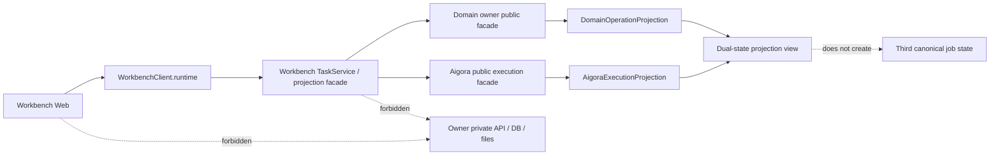

## Context

Workbench 只组合 owner 的公开合同，Aigora 保有其 execution/job 的 canonical truth，领域 owner 保有 domain Operation 的 canonical truth。现有 Task/Runtime 设计已要求 adapter fail closed、safe projection、typed `WorkbenchClient` facade，以及默认关闭的 runtime mutation 能力。本变更仅定义 Workbench 如何把这两份真相并列投影，供后续小范围实现；不得复制任何 owner 状态机。

## Goals / Non-Goals

**Goals:**

- 为同一用户操作提供 `DomainOperationProjection` 和 `AigoraExecutionProjection` 两个独立、可比较的安全快照。
- 只经 `WorkbenchClient.runtime` 的 typed facade、Workbench service 和批准的 Aigora public facade 读取或触发显式 reconcile。
- 用 permission-first、existence-hiding、版本/时间戳和 fail-closed capability 状态表达不确定性。
- 作为 additive experimental capability 默认关闭，并可仅隐藏投影完成回滚。

**Non-Goals:**

- 不创建第三个 canonical job state，不把 Workbench Task、投影或 UI cache 提升为 owner truth。
- 不把 Aigora `succeeded` 解释成 domain admission、领域 Operation 成功、artifact 可用或结算完成。
- 不允许浏览器调用 owner 私有 API、数据库、CLI、本地文件或直接读取 credential/session token。
- 不存储 raw receipt、provider payload、credential、private refs/path、artifact blob 或完整 owner job payload。

## Decisions

### 1. 两个 owner 真相只并列投影

公开 DTO 固定为 `AigoraOperationExecutionProjection`，其中 `domain` 与 `execution` 是独立子对象：

- `domain` 至少含 `operation_ref`、`admission_state`、`domain_state`、`observed_at`、`version_ref`；它仅来自负责领域 Operation 的公开 facade。
- `execution` 至少含 `binding_ref`、`job_ref`、`execution_state`、`observed_at`、`cursor_ref`、`reconcile_state`；它仅来自 Aigora 的公开 facade。
- safe refs 必须为 owner 签发的 opaque、可授权校验的稳定引用；不可放入 provider id、URL、私有路径、credential scope 或可反查的内部主键。

投影服务只按关联 ref 读取两个已授权快照，不写入或推导 owner 状态。Aigora `succeeded` 只能表示 `execution_state=succeeded`；`admission_state` 仍须由领域 owner 单独确认。领域已 admission 也不表示 Aigora job 已接受、运行或成功。

替代方案是把 Aigora job 写入 Workbench Task 或构建聚合状态机；两者都会制造竞争性 truth，故拒绝。UI cache 仅是可丢弃的查询缓存，不能成为可恢复的 canonical state。

### 2. capability、状态和 unknown UX 均 fail closed

`aigora_execution_projection` 是 experimental additive capability，默认 `disabled`。只有 Workbench、Aigora adapter 与相关 domain binding 都通过版本/contract discovery、permission 与安全 ref 校验时，facade 才能显示可用投影。

- `unknown` 或 `reconcile_required` 时，UI 显示“状态待确认”，禁止显示成功、自动重放 mutation 或猜测 terminal state；只提供有权限且 capability 已启用时的显式 `ReconcileAigoraExecution`。
- `stale` 在 `observed_at` 超出公开 freshness window 时出现；保留上次安全摘要并标出更新时间，不将其解释为当前状态。
- `offline` 仅表示当前无法获得新快照；不得用 cache 宣称 owner 成功。
- `contract_mismatch` 表示公开合同版本、schema digest 或 capability 不兼容；禁用读取后的操作性 UI 和 reconcile，不泄露底层错误。
- 未知 enum、未知 event 或不完整 binding 一律映射为安全 `unknown`/`contract_mismatch`，不可映射为 `succeeded`。

替代方案是以轮询或 Aigora terminal event 自动收敛 domain state；这会把 transport 观察误作 domain admission，故拒绝。

### 3. facade-only、permission-first 与存在性隐藏

浏览器只能调用 `WorkbenchClient.runtime.getAigoraOperationExecutionProjection` 和已批准的 `reconcileAigoraExecution` typed methods；transport 只做认证、解码、编码并进入统一 service。Workbench service 在向任一 owner 查询前校验 caller、tenant/workspace/project scope、operation/binding relation 与 capability。无权限、ref 不存在、ref 属于另一 scope 或 relation 不匹配必须返回同一安全 `not_found` 投影/错误，不得以 timing、字段、日志或 status code 区分。

服务仅持久化或缓存投影所必需的 safe refs、有限状态、safe code、`observed_at`、cursor/version refs 和脱敏摘要。raw receipt/provider payload/credential/private refs 均在 adapter 边界丢弃；日志、事件、测试 evidence 也只能记录 redacted safe fields。

替代方案是浏览器对 Aigora 直接调用或把原始 receipt 作为调试数据保存在 Workbench；前者破坏 owner 权限边界，后者扩大秘密与私有数据面，故拒绝。

### 4. 显式 reconcile 只读取 canonical truth

`ReconcileAigoraExecution` 需要 `operation_ref`、`binding_ref`、`job_ref`、对应 safe version/cursor ref 和 Workbench expected projection version。它不得创建 idempotency key、重放生成、发起新 job、更新领域 Operation 或假设接受结果。若任一 owner 返回不确定、离线、contract mismatch 或缺少 binding，facade 只刷新相应安全状态并保留另一 owner 的最近安全投影。

## Risks / Trade-offs

- [双 owner 的观察时刻不同] → DTO 分别保留 `observed_at` 与 version/cursor ref，UI 不以其中一侧覆盖另一侧。
- [safe ref 被跨 scope 重放] → permission-first 校验 tenant/workspace/project 和 binding relation，失败统一 existence-hidden `not_found`。
- [旧 client 不认识状态] → 未知状态 fail closed 为 `unknown`，capability 默认关闭，不改变现有 DTO 的必填字段。
- [长期 stale cache 被误读为成功] → 明确 `stale`/`offline` 标签并禁止自动 terminal 推断。
- [投影扩大数据泄露面] → adapter allowlist、redaction tests、禁止 raw payload/receipt/credential/private refs 的持久化与日志。

## Migration Plan

1. 以独立 experimental DTO、facade method、schema 和 capability discovery 增量加入，不修改既有 Operation 或 Task state machine。
2. 默认保持 `aigora_execution_projection=disabled`；仅在 Aigora、领域 owner、Gateway 与 Workbench 的公开 contract/version checks 全部通过后，由显式本地配置启用。
3. 关闭 capability 或回滚时，registry/catalog 和 UI 隐藏该投影与 reconcile action；既有领域 Operation、Aigora job、Task、safe refs 和 owner canonical truth 不迁移、不删除、不重放。

## Open Questions

- Aigora public facade 的最终 schema digest、freshness window 与 safe `job_ref` 格式应在其 owner contract 完成后锁定。
- Eikona/Scaena 关联的 domain binding 是否需提供统一的跨 owner `binding_ref`，需由各 owner 公开合同确认。
