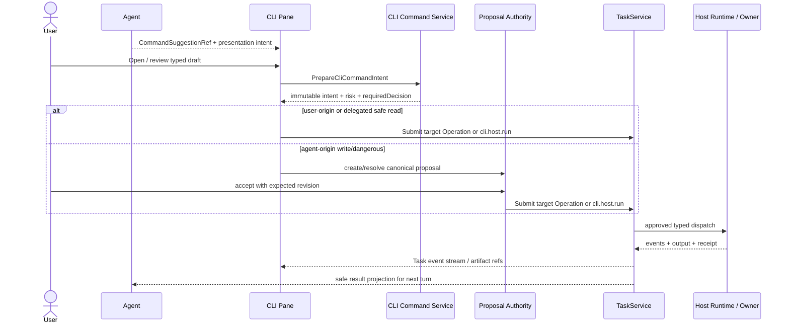

## Context

Workbench 的 `/agent` 已经形成一个不可关闭的 conversation anchor、一个 versioned Pane registry 和统一 `TaskService`。当前 Pane registry 只允许 first-party renderer、closed params、server-authored availability，并固定 desktop 默认最多 3 个可见 Pane、硬上限 4、split depth 2。Terminal 在产品蓝图和 UI Spec 中被保留为 required retain-next，但没有 owner contract，因此只能显示 `needs_contract`。

服务端已经具备适合 CLI 控制面的基础：sealed Operation registry、四 transport 自动投影、permission/cost/expected-version/idempotency gate、Task event、artifact、receipt、cancel、retry 和 `unknown_accept` reconcile。多个现有 CLI 也已经采用同一 projection 的 human、`--agent`、`--json`、`--explain` 输出，`scripts/production-build.ts` 额外提供 `--events` NDJSON。这些能力尚未被组合成浏览器和 Agent 可安全使用的命令会话。

该能力涉及三个权威边界：

| 边界 | 决策 | 责任 |
|---|---|---|
| Workbench UI / BFF / SDK / TaskService | `fit` | Pane 组合、command catalog 安全投影、intent 预检、Task、event、artifact、receipt 与审计入口 |
| sealed Workbench Operation | `fit` | 企业自研任务流的首选执行路径；直接复用 Operation schema、gate 和 owner adapter |
| 获批 Host Runtime | `split-owner` | 进程、工作区挂载、可执行文件、环境、secret 注入、网络和资源隔离；仅暴露 typed command contract |
| 任意 shell / unrestricted PTY | `reject-now` | 不提供 `bash -c`、自由命令行、任意 cwd/env/path、浏览器直接 spawn 或交互式 stdin |

设计的核心问题不是“如何在网页中嵌入终端模拟器”，而是：**如何让用户和 Agent 在一个可复核的 Pane 中调用企业批准的命令，并把结果可靠地回到 Task/Agent 工作流。**

## Goals / Non-Goals

**Goals:**

- 交付一个 first-party `agent.cli.v1` Pane，支持 catalog、typed args、预检、执行、观察、取消、对账和证据查看。
- 让 Agent 能从显式 Context Pack 提议命令、准备 intent、请求打开 Pane、在授权范围内执行低风险读取、观察结构化结果并提出下一步。
- 让企业自研任务流优先投影为 Operation-backed commands；仅在需要真实进程边界时进入 approved Host Runtime。
- 使用一份 canonical command/result projection 驱动 human、agent、JSON、events 和 explain，不从 human output 猜测状态。
- 保持 TaskService 是唯一执行状态机；CLI session/run 是 Task、event、artifact 和 receipt 的派生视图。
- 保持 pure Go、`CGO_ENABLED=0` 默认路径；不为本能力引入 Rust、cgo、Electron 或 Tauri。
- 为权限、幂等、取消、并发、输出上限、脱敏、审计、恢复和四 transport parity 给出可测试合同。

**Non-Goals:**

- 不提供任意 shell prompt、命令历史重放器、shell expansion、管道、重定向、glob、subshell 或自定义启动脚本。
- 不提供交互式 PTY、vim/top/ssh 等长驻 TTY 应用；未来若需要，必须单独定义 sandbox、stdin、resize、signal 和录屏/审计合同。
- 不允许 Agent 获得浏览器 bearer token、用户 credential、absolute path、raw env、process handle 或 Owner 私有 payload。
- 不把 CLI Pane 做成第二个 Agent composer、第二个 Task 控制面或第二套 proposal authority。
- 不在 Pane 中创建通用 JSON/YAML/raw file editor；结构化资产继续由 CLI/service authoritative writer 生成。
- 不把 Host Runtime 的进程/文件系统真相复制到 Workbench 数据库。

## Decisions

### 1. CLI Pane 是结构化 command workspace，不是终端模拟器

注册新的 Pane kind：

```text
kind: cli
paneType: agent.cli.v1
manifestVersion: workbench.agent-pane-manifest.v1
permission: read
requiredCapabilities: [workbench.cli.catalog.read]
closedParams: [sessionRef, runtimeRef, scopeRef, projectRef, selectedTaskId]
instancePolicy: singleton
suspendPolicy: retain-safe-summary
preferredPlacement: right
desktopWidthHint: 620
mobilePresentation: sheet
```

Pane 的 canonical document identity 为 `(tenantRef, workspaceRef, sessionRef, runtimeRef, scopeRef)`。同 identity 重复打开只聚焦已有实例；不同项目/Host scope 不共用 draft 或输出。`selectedTaskId` 只改变 Pane 内选择，不参与 identity。

Pane 内存在一个 command draft 和一组派生 run history，而不是“每条命令开一个 Pane”。关闭 Pane 不取消 Task；重新打开后从 Task/event/artifact/receipt 恢复 run history。browser-local draft 只保存 descriptor ID、safe typed values 和 safe refs，登出、scope 变化、descriptor revision 变化或 TTL 到期时清除。

选择该方案而不是 xterm/PTY，是因为当前产品需要的是可审计任务流，而不是完整 shell 兼容性；typed form 同时为用户、Agent、权限系统和测试提供稳定语义。

### 2. Command catalog 是 sealed Operation 与批准 Host binding 的统一安全投影

新增 closed `CommandDescriptorV1`，客户端可见字段至少包括：

```yaml
contractVersion: workbench.cli_command_descriptor.v1
commandId: workbench.release.readiness
descriptorRevision: sha256:<digest>
actionId: cli.workbench.release.readiness.run
targetOperationType: workbench.release.readiness
label: 发布就绪检查
description: 检查当前环境是否满足发布门禁
group: release
executionKind: operation | host_cli
effectClass: read | bounded_write | dangerous
risk: low | medium | high
argumentSchemaRef: schema:<digest>
contextBindings: [projectRef, artifactRef, evidenceRef]
requiredRoles: [operator]
requiredScopes: [project]
agentPolicy: prepare_only | delegated_read | never
confirmation: none | user | approver
supportsEvents: true
supportsCancel: true
supportsReconcile: true
maxDurationMs: 300000
maxOutputBytes: 1048576
availability: ready | needs_contract | permission_required | offline | stale | unavailable
reasonCode: <stable-code>
recoveryHint: <safe-localized-key>
```

客户端投影明确不包含 binary path、argv template、cwd、env、secret name/value、URL、credential 或 executable digest。服务端内部 `HostCommandBindingV1` 才持有 allowlisted executable identity、固定 subcommand prefix、argument encoder、workspace/network/resource policy refs 和 output parser contract。

`CommandDescriptorV1` 是 command form/catalog 的专用安全投影，不替代既有 `ActionDescriptorV1`。每个可执行 command 必须绑定 stable `actionId`；Context Menu、Inspector、Command Palette、Agent 和 CLI Pane 在真正显示/启用 CTA 时仍解析同一 `ActionDescriptorV1` availability、reason、scope 和 target Operation。Command descriptor 只补充 typed arguments、output 和 Host policy 元数据，不能让某个入口拥有不同的执行权限。

两类 descriptor 使用同一 Pane：

- `executionKind=operation`：优先路径。typed args 直接编译为 sealed Operation input，仍由对应 Owner adapter 执行。
- `executionKind=host_cli`：桥接路径。typed args 编译为 `workbench.cli.host.run.v1` 的 prepared intent，由 Host Runtime 以 argv 数组调用批准 CLI。

catalog 必须 seal、排序并生成 digest；未知字段、未知 execution kind、缺少 schema/gate/output contract、Host binding 不匹配或 local renderer 未注册时 fail closed。Command Palette、Context Menu、Inspector、Agent 和 CLI Pane 必须消费同一 descriptor，不维护各自命令表。

### 3. Browser 与 Agent 只提交 immutable prepared intent

新增 `PrepareCliCommandIntent`。输入仅包含：

- `commandId`、`descriptorRevision`；
- tenant/workspace/project/session/runtime 的 opaque refs；
- 符合 closed argument schema 的 typed values；
- `contextPackRef` 与 revision；
- owner expected-version refs；
- bounded resource request；
- origin：`user | agent` 与安全 actor/delegation refs。

参数类型限定为 enum、boolean、bounded number、safe text、opaque object ref、artifact ref、secret ref 和数组；path 必须是 workspace/artifact mount ref，secret 必须是 host-resolved secret ref。未知属性、control character、过长文本、raw path、raw env、shell metacharacter escape channel 或过期 descriptor 均在 dispatch 前拒绝。

服务端生成 immutable、短 TTL 的 `CliCommandIntentV1`：

```yaml
intentRef: cli-intent:<opaque>
descriptorRevision: sha256:<digest>
scopeRefs: <safe refs>
argumentDigest: sha256:<canonical typed args>
safeArgumentSummary: <redacted labels/values>
effectClass: read | bounded_write | dangerous
requiredDecision: none | user | approver
expectedVersions: <safe version refs>
expiresAtUnixMs: <ttl>
version: 1
```

Task input 只持久化 `inputRef=intentRef`、`contextPackRef`、revision 和 bounded limits，复用现有 `PersistSafeInput` 约束。intent repository 使用 GORM、closed schema、TTL 和 immutable digest；它不是执行状态机。

命令预览由服务端产生 token list 和 localized effect summary。允许“复制命令”时只能复制服务端生成、已脱敏的 copy-only preview；执行 API 永远不接收该字符串。现有客户端拼接 shell fallback 应迁移为 preview-only，不能成为 Pane runner。

### 4. 所有执行进入 TaskService；CLI session 只做派生投影

Host CLI 使用 sealed Operation `workbench.cli.host.run.v1`：

```yaml
Mode: owner
Mutation: true
PersistSafeInput: true
RequiresIdempotency: true
SupportsEvents: true
SupportsStreaming: true
SupportsCancel: true
SupportsReconcile: true
RequiresPermission: true
RequiresCost: true
```

即使 descriptor 是 read effect，启动受控进程本身仍是需要幂等、资源和审计的 Task mutation。gate evaluator 可依据 descriptor、actor 和 delegation grant 判定 gate 已满足或需要交互，但不得绕开 TaskService。

Operation-backed command 直接提交 descriptor 指向的 target Operation，不再包一层 Host Task。Host-backed command 才提交 `workbench.cli.host.run.v1`。两种路径最终都返回 Task ID，并用现有 Task status：

```text
awaiting_permission -> awaiting_cost_confirmation -> queued -> running
running -> cancel_requested -> cancelled | unknown_accept
running -> succeeded | partial | failed | unknown_accept
failed | partial -> retry_wait -> queued
unknown_accept -> reconcile only -> running | succeeded | partial | failed | cancelled
```

`draft`、`validating`、`preflight_ready` 和 `preflight_blocked` 是 UI/intent 阶段，不新增持久化 run status。`CommandSessionProjectionV1` 只是按 `(sessionRef, runtimeRef, scopeRef)` 聚合相关 Task、安全 command summary、event cursor、artifact/receipt refs；可丢弃并重建。



### 5. Agent 获得受限 command agency，不继承用户 ambient authority

Agent 支持四类动作：

1. `discover`：读取当前 principal 可见的 descriptor safe projection。
2. `prepare`：基于显式 Context Pack 生成 typed command suggestion，并请求服务端准备 intent。
3. `present`：通过 allowlisted `AgentPresentationIntentV1` 建议 open/focus CLI Pane 或选择某次 run；不得关闭 Pane、替换 dirty draft 或夺取焦点。
4. `observe`：读取 Task/event/result 的 safe facts、summary、artifact refs 和 receipt disposition，用于下一轮建议。

Agent 自动执行只允许 `effectClass=read`、`agentPolicy=delegated_read` 且存在有效 `AgentExecutionGrantV1`。现有 Task `Gate` 仅表达 permission/cost gate 的 task-local 状态，不能表达 session、command allowlist、expiry、resource ceiling、revoke/version 与 concurrency 边界，因此不得把 Gate receipt 重新解释为 delegation。`AgentExecutionGrantV1` 是独立的短期授权元数据：签发必须引用已批准 decision 与 approval receipt，绑定 tenant/workspace/project/session/runtime/scope、command group/IDs、initiating principal、expiry、resource ceiling 与最大并发，并以 versioned revoke receipt 支持即时撤销。grant lookup、当前 descriptor policy、resource ceiling 或并发计数任一不可用时均 fail closed 为 Prepare；只有 `effectClass=read` + `agentPolicy=delegated_read` + `confirmation=none` 可消费 grant。执行 actor 记录为 `system-agent`，canonical CLI intent 保留 `initiatingPrincipalRef` + `delegationGrantRef`，grant 保留 approval/revoke receipt refs。默认无 grant，且未配置 approval verifier 时服务端禁止签发。

grant 的最终执行准入不是进程内“先查询再计数”，而是 `AgentExecutionGrantAdmissionV1` 的数据库事务。事务对 grant authority row 取得写锁，在同一事务内重新验证 revoke/expiry/scope/initiator/command allowlist/current descriptor resource ceiling，统计 canonical active Task 与未过期 reservation，并为 immutable intent 建立唯一 reservation；revoke 使用同一 authority-row 锁，因此两者提交顺序就是授权顺序。reservation 成功即为 Task acceptance 前的 durable linearization point：若 Task 提交确定失败则 release，成功则绑定 Task ref；进程在绑定前崩溃时 reservation 仅保留短 lease，Task 已存在时仍由 canonical Task 状态计数。相同 intent 的 reservation 幂等 replay，不同 intent 在 `maxConcurrentRuns` 达上限时只允许一个。任何 admission store/lock/count/current-policy 不可用都退化为 `delegation_required`，不得仅依赖较早的 preflight。

Agent-origin `bounded_write` 或 `dangerous` 必须形成 canonical proposal；只有用户/approver 接受后才能创建 Task。Agent 不得自动确认 cost/permission、不得扩大 scope、不得自动 retry `unknown_accept`、不得自动 reconcile。Agent 可建议 Cancel；只有同 grant 启动的 read Task 且 policy 明确允许时可请求取消，否则需用户操作。

Agent 消费结构化 facts 和 safe summary，不读取未脱敏 raw stdout/stderr。Command result 被加入后续 Context Pack 时只加入 result/artifact/receipt refs 与 revision，不复制大段日志。

### 6. Host Runtime 使用 argv 执行与闭合的资源策略

Host Runtime contract 接收 prepared intent ref 与 server-private binding，解析后使用等价于 Go `exec.CommandContext(executable, argv...)` 的 argv 数组执行；禁止 `/bin/sh -c`、`cmd.exe /C`、PowerShell expression、shell expansion、字符串模板执行和 client-provided executable。

Host Runtime 负责：

- 把 opaque workspace/artifact mount ref 解析为允许目录，cwd 不可由客户端任意指定；
- 从批准的 secret store 解析 secret ref，环境只含 allowlist keys，secret 不回传；
- 应用 network policy、CPU/memory/process count、duration、output bytes 和并发 ceiling；
- 拥有 process group、signal、cancel deadline、shutdown 和 orphan cleanup；
- 生成稳定 `hostSessionRef`、dispatch receipt 和 lookup/reconcile 结果；
- 在持久化前脱敏 stdout/stderr/event，并在 API 层再次脱敏；redaction failure fail closed；
- diagnostics 使用结构化 JSON stderr/file sink，不污染 CLI protocol stdout。

首版 Host Runtime 为独立 pure-Go process boundary，正常构建保持 `CGO_ENABLED=0`。不引入 Rust；当前没有 parser/codec/native kernel 或测量证据证明需要 Rust。若未来需要真实 PTY 或平台 sandbox binding，必须另行评估 native package/Rust，并保留当前非 PTY fallback。

### 7. CLI 输出只执行一次，由 canonical projection生成全部视图

Host binding 声明 output contract：

- 非流式命令调用 `--json`，stdout 必须是一个 envelope；
- 流式命令调用 `--events`，stdout 必须是 NDJSON `start -> fact/progress/artifact -> end|error` 且 sequence 严格递增；
- stderr 只用于 diagnostics，不决定业务成功；
- 没有结构化 output contract 的命令为 `needs_contract`，不得进入 Pane。

服务端将输出归一为 `CliCommandResultProjectionV1`：`specVersion`、`command`、`status`、`summary`、`facts`、`actions`、`evidence`、`data`、`error`、`outputTruncated`、`sourceMode` 和 digest。Pane 的 Summary、Facts、JSON、Events、Explain、Evidence 都从该 projection 和 Task event log 渲染，不为切换 tab 重跑命令，也不解析默认 human summary。

`--agent` 仍是 CLI 对外稳定接口，并用于独立 agent/automation consumer；Workbench 内置 Agent 可直接读取等价 facts projection。`--explain` 只展示 bounded rationale、risk、confidence 和 next action，不展示 chain-of-thought。Raw console 为 secondary disclosure：仅显示已脱敏、去 ANSI/control sequence、按字节/行截断的输出；没有权限时隐藏。

长输出超过 live buffer 后落为 Task Artifact，Pane 保留摘要、tail、size、checksum 和 evidence ref。artifact 只通过现有 artifact API/permission 读取，不暴露 Host private path。

### 8. Pane 交互以一次“选择—预检—执行—观察—继续”为主循环

桌面默认结构：

```text
┌ CLI: 发布就绪检查 ─ staging ─ medium risk ─ running ───────┐
│ [Command catalog] [Scope] [History]       [Cancel] [···]  │
├────────────────────────────────────────────────────────────┤
│ Typed arguments / attached context                          │
│ Environment [staging]  Evidence [artifact:…]                │
│ Read-only command preview: workbench-readiness …            │
│ Permission ✓  Cost ✓  Version ✓  Runtime ✓     [Run]        │
├────────────────────────────────────────────────────────────┤
│ Summary | Console | Events | Artifacts | Explain | Details  │
│ status, facts, next action, errors, receipt                  │
└────────────────────────────────────────────────────────────┘
```

- primary CTA 只在 intent 当前、preflight ready 且没有未解决 decision 时启用；按钮文案按状态为 `Run`、`Review proposal`、`Resolve permission`、`Reconcile`。
- command preview 只读，以 token/chip 分段，不提供可编辑 `$` prompt；copy 是可选 secondary action。
- history 默认是 header popover/可折叠 rail，避免在窄 Pane 内形成三列；同 session 最近 runs 分页，running/attention 置顶。
- 每次 run 有独立 selection；切换 run 不改变当前 draft。点击 result action 解析同一 ActionDescriptor，并重新走 capability/permission/version/idempotency gate。
- running 时关闭 Pane不弹“是否取消”；Task 继续，conversation timeline/session attention 显示进度，可从 run card 重新打开。
- descriptor/scope/context 变化使 prepared intent 失效；UI 保留 safe draft，显示 `stale` 并要求重新预检，绝不使用旧 intent。
- 达到 Pane hard limit 时使用现有 close/replace chooser。Agent suggestion 不得静默替换 Pane；重复 suggestion 通过 `(sessionRef, intentRef, sourceSequence)` 去重。

### 9. Responsive、keyboard 和 focus 行为延续 Orbital Pane grammar

- `>=1440px`：conversation 维持至少 560px 和 52% 左右主权重；CLI Pane 建议 560–720px，可与一个 Evidence/Run Pane 组成 depth 2 split，但默认不自动 split。
- `1024–1439px`：CLI Pane 为右侧 Sheet，session rail 与 Pane 互斥，同一时刻一个 overlay；运行状态留在 timeline。
- `<768px`：CLI Pane 为 full-screen Sheet；history 使用 drawer，argument form 单列，Run/Cancel/Reconcile 为 sticky footer；large JSON/raw console 默认折叠。
- `Cmd/Ctrl+K` 打开 Pane/command palette；`Cmd/Ctrl+Enter` 仅在 preflight ready、焦点不在 multiline 且不会跳过确认时触发 Run；Escape 关闭 popover/dialog/Sheet，不取消 Task。
- command catalog 使用 combobox/listbox；所有参数有 visible label、description、error；状态变化通过 polite live region，阻断错误通过 assertive announcement；进度不只依赖颜色。
- Pane drag、resize、close、replace 都保留现有 keyboard/menu 等价路径和 focus restore。200% zoom 不产生页面级横向滚动。

### 10. 并发、幂等与恢复沿用 Task/Host receipt

默认每个 `(runtimeRef, scopeRef)` 同时最多 1 个 `bounded_write|dangerous` Task 和 3 个 delegated reads；descriptor/tenant policy 可进一步收紧，不可由客户端放宽。排队使用 TaskService，不在 React 内做权威队列。

幂等 key 至少覆盖 actor/delegation、workspace/project、command ID、descriptor revision、intent digest 和 expected owner version。完全相同请求返回原 Task；同 key 不同 digest 返回 `idempotency_conflict`。

cancel 先进入 `cancel_requested`，只有 Host/Owner receipt 证实才显示 `cancelled`。dispatch/cancel 接受结果不确定时进入 `unknown_accept`；UI 只提供显式 Reconcile，Agent 只能解释和导航。Host reconcile 使用原 request key/hostSessionRef 查询，不创建第二个进程或重放 command。

### 11. 持久化、错误、审计和可观测性分层

Workbench 新增的 durable 数据仅限 immutable/TTL command intent safe metadata；run/session 从现有 Task records 派生。Task Artifact 保存输出对象引用与 checksum，不保存 Host private path。必要 GORM 表至少含 `id/ref`、scope refs、descriptor digest、argument digest、safe summary、origin actor refs、expiry、version、created/updated timestamps；建立 scope/expiry/digest indexes 和 unique idempotency constraint。

稳定错误至少覆盖：`descriptor_stale`、`invalid_argument`、`permission_denied`、`cost_required`、`delegation_required`、`runtime_offline`、`runtime_contract_mismatch`、`concurrency_limit`、`output_contract_invalid`、`output_truncated`、`redaction_failed`、`task_version_conflict`、`idempotency_conflict`、`cursor_expired`、`unknown_accept`。错误包含 retryable、trace ID 和 safe recovery，不回显 raw values。

审计记录 actor、initiating principal、delegation grant、scope、command ID/revision、effect/risk、intent digest、decision、Task/Attempt/receipt refs、timestamp 和 redacted summary。JSON logs、TraceEvent、audit、CLI stdout/stderr 和 product artifact 是不同通道；所有 subprocess call 具有 call ID、duration、exit disposition、bytes 和 redacted target。

### 12. API 与 transport 组合

`WorkbenchClient.cli` 增加：

```text
ListCliCommandDescriptors
GetCliCommandDescriptor
PrepareCliCommandIntent
GetCliCommandIntent
ListCliCommandRuns
GetCliCommandResult
```

上述 read/prepare contract 在 SDK、HTTP、gRPC 和 JSON-RPC 中保持 schema、permission、error 和 revision parity。执行、取消、retry、gate、event watch、artifact、receipt 和 reconcile 继续复用 `WorkbenchTaskClient`；不为每个 CLI Pane 建立独立 SSE，也不增加 operation-specific transport handler。

## Risks / Trade-offs

- [结构化 CLI 不兼容任意终端习惯] → 以高频企业命令 catalog、typed form、copy-only preview 和快速搜索补偿；PTY 作为独立后续能力评估。
- [一个 generic Host Operation 的风险由 descriptor 动态决定] → Operation 本身始终走 permission/cost/idempotency/cancel/reconcile 全 gate，descriptor 只能收紧；catalog seal 和 gate tests 验证每条 binding。
- [Agent delegated read 仍可能读取敏感投影] → 默认 prepare-only；grant 绑定 session/scope/command/expiry/resource，Agent 只接收 safe result projection，raw output 不进入 Context Pack。
- [CLI 输出合同在现有命令间不一致] → 首批只晋级满足 JSON/events contract 的命令；共享 renderer/parser 逐步迁移，未迁移命令保持 `needs_contract`。
- [长事件流拖慢 Pane] → server cursor pagination、bounded live buffer、虚拟化、artifact spill 和 backpressure；不把全部输出写入 React state。
- [Host 断连造成不确定接受] → hostSessionRef + dispatch receipt + lookup/reconcile；禁止自动重试。
- [关闭 Pane 后用户误以为命令停止] → running 状态在 timeline/session attention 常驻；关闭动作不提供隐式 cancel 语义。
- [多 Pane 与小屏拥挤] → 默认只打开一个 CLI Pane，history 内聚；tablet/mobile 单 Sheet；Evidence 按需另开且受 hard limit。
- [command descriptor 与 executable drift] → catalog/binding 双 digest、startup seal、runtime handshake 和 contract mismatch fail closed。

## Migration Plan

1. 先添加 contracts、descriptor registry、safe intent repository 和 SDK read/prepare methods，不注册可执行 CLI Pane；生产 catalog 仍显示 `needs_contract`。
2. 将现有 Operation 投影为 read-only command catalog，CLI Pane 先支持 Operation-backed commands，验证 UI/Agent/Task/receipt 主链。
3. 实现 Host Runtime interface、pure-Go reference host 和 `workbench.cli.host.run.v1`，默认关闭；只接入 2–3 个已有结构化 Workbench CLI canary。
4. 完成 permission/cost/idempotency/cancel/reconcile、output redaction、artifact spill、audit/metrics 和四 transport parity 后，按 capability flag 对 internal tenant 灰度。
5. 将 Agent command suggestion 与 delegated read grant 接入；mutation 始终保留 proposal/用户决策。
6. 逐步把现有 copy-only shell fallback 迁移为 server-authored preview/deep link，移除任何把该字符串当执行输入的可能路径。
7. 通过 contract、component、integration、race、Playwright/a11y 和 redaction evidence 后再将 Terminal catalog 状态改为 `ready`。

回滚时关闭 CLI capability/Host binding，catalog 返回 `needs_contract`；既有 Task、event、artifact 和 receipt 仍可从 Run/Evidence Pane 阅读，不能删除或伪造终态。新增 schema 采用 additive migration；不在本 change 中 drop/rename existing fields。

## Open Questions

- 首批 production Host Runtime 是 workbenchd 同机的独立 sidecar，还是企业统一 runner 服务？两者必须实现同一 hostSession/receipt/reconcile contract；建议先 sidecar canary，再以 provider adapter 替换。
- delegated read grant 的边界已在任务 8.4 决策：现有 permission Gate receipt 无法表达 session + command allowlist + expiry + resource/concurrency + revoke/version，因此使用独立短期 `AgentExecutionGrantV1`，并强制引用已批准 decision/receipt；不得由 transport 自报批准结果。
- 哪些现有 CLI 首批满足完整 `--events` contract？非流式 `--json` 命令可先进入 canary，流式命令必须补齐 NDJSON sequence、终止事件和 parser golden。
- `ListCliCommandRuns` 是直接通过 Task metadata filter 派生，还是建立可重建 projection table？首版优先直接派生并测量；只有分页/查询基线不达标时再引入 projector。

## 切片说明（2026-08-22，由 workbench-agent-pane-direct-interfaces 提前交付；该 change 已于 2026-08-23 归档，主 spec `workbench-agent-pane-interfaces`）

- 本 change 任务 7.1 的**注册脚手架**已由 `workbench-agent-pane-direct-interfaces` 提前交付：`agent.cli.v1` 已进入 `agent-pane-{registry,manifest,catalog}.ts`（closed params：`sessionRef/runtimeRef/scopeRef/projectRef/taskId`，`standardDocumentKey("sessionRef")`，`agent.cli.read`，execution 分组，620px 宽度提示，palette 恒禁用 `agent.pane.palette.disabled.cliNeedsContract`，host 渲染分支为空）。该注册满足本 change MODIFIED pane-composition requirement 的 fail-closed 语义。
- 任务 7.1 **保持未勾**：其 Deps（1.5 SDK、1.6 locale 合同键、6.2 cli-client）与 closed params 冻结（runtime/scope/project 升级为 canonical identity 组成部分）仍由本 change 完成。后续实现者应**扩展既有注册**（收紧 documentKey、补渲染器、启用 palette），不得重注册或引入第二 identity。
- 本 change 拥有 `agent-pane-{registry,manifest,catalog}.ts` 的后续写入租约回归本 change；direct-interfaces 批次已在该租约下完成并记录。
