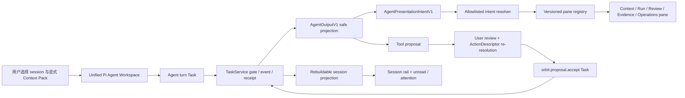
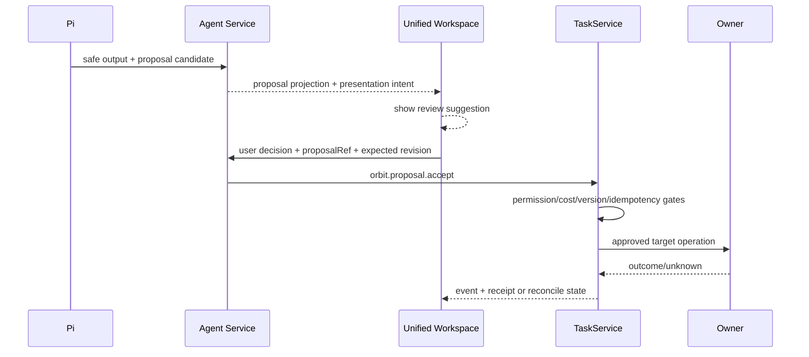

## Context

Workbench 当前已经拥有三组可以复用、但尚未收束的能力：

1. 已归档的 `workbench-agent-runtime-chat-v1` 已同步为主 spec `workbench-agent-runtime-chat`，把 Agent turn 建模为 Task，并提供派生 session、Context Pack、safe output、tool proposal、event、receipt、cancel/reconcile；Agent 没有 mutation 权限。
2. 已归档的 `workbench-agent-spatial-operations-v2` 实现了 Context Canvas、Activity Rail、Inspector、ActionDescriptor 与 Owner handoff 等安全操作组件；其旧 Operations Orbit 主壳要求未同步为当前主 spec。
3. `workbench-orbital-owner-operations` 与现有 pane registry 已规定 Workbench 只渲染 Owner 安全投影，通过 typed facade、ActionDescriptor 和批准的 deep link 组合专业能力。

此前 `/agent` 通过 feature flag 在 `AgentConversationWorkspace` 与 `AgentOperationsWorkspace` 之间二选一，形成两个 shell、两套状态组合和重复的 Context/Activity/Inspector 呈现；该双 shell 已被收束。conversation 路线已经拥有真实 session rail、timeline、composer 和 pane host，但用户确认的新视觉基线暴露了下一层产品/架构缺口：

- session 是从有限 Task 扫描中派生，缺少稳定分页、服务端 attention/unread 投影和用户作用域的 rename/pin/archive；运行中的 turn 还会阻止用户切换 session。
- session draft、scroll、open pane、selected output 等 UI 状态全部在浏览器；这是正确的组合状态边界，但目前没有清晰区分“浏览器瞬时状态”和“跨设备 presentation metadata”。
- Pi output 已能用受约束 intent 表达“建议打开 Review pane、聚焦 safe ref、展示 receipt、预填未发送草稿”，但当前 shell 只保留一个 detail pane，无法同时组织文件、预览、Task、Evidence 等多个上下文视图。
- Overview、Orbit、Boards、Studio、Gateway 和专业页面仍以并列顶层入口存在，主产品问题不明确；这些能力需要迁入 Pane、advanced route 或 Owner deep link，而不是继续扩张导航。
- spatial route 适合作为组件来源和高级视图，不适合作为第二条 Agent 控制面；继续并行演进会产生双 event subscription、双 composer 和 action 状态漂移。

应用级主壳、对象模型、页面/Pane 归属和 Definition of Usable 统一由 `docs/product/agent-workbench-blueprint.md` 定义；前端/BFF/service/Owner 合同由 `docs/interfaces/agent-pi-workspace.md` 定义。Review 的真实 decision authority 由独立 change `workbench-agent-proposal-authority-v1` 承接，本 change 不再允许以浏览器 `basisRefs` 或 generic Task submit 补洞。

本 change 将这些能力收束为单一 Agent-first Pane workspace。Pi 是首个 runtime，但 UI 合同不把产品锁死到单一 Agent 实现。TaskService 仍是执行权威；session lifecycle 仍从 turn Tasks 派生；session index 只是可重建 read model，用户 rename/pin/archive/seen 是独立 presentation metadata。Agent 对 UI 的“控制”被限制为版本化、allowlist、可审计的 presentation intent；它不能控制 DOM、提交表单、接受 proposal、任意插入代码或调用 Owner mutation。

### 参与者与权威

| 参与者 | 权威内容 | 明确不拥有 |
| --- | --- | --- |
| `core.TaskService` | turn/action Task、gate、attempt、event、receipt、cancel、reconcile | session UI、pane layout、Owner canonical state |
| Agent session projector | 从 Task/event/proposal 生成可重建 session summary、attention、activity cursor | 新状态机、执行权、空 session lifecycle |
| Agent presentation service | 当前 principal 的 title override、pinned、archived、last-seen cursor、revision/idempotency | Task 状态、Owner 状态、raw chat/history |
| Context Pack service | 显式重新授权、不可变 revision、freshness/expiry | 自动替换上下文、永久 session memory |
| Pi / Agent runtime | safe output 与 presentation intent 候选 | DOM、pane implementation、ActionDescriptor availability、mutation |
| Browser | 未发送草稿、当前 session、scroll、临时 pane/focus、follow-mode consent | canonical session/proposal/Task/unread/receipt/context state |
| Owner / Scaena 等 | canonical domain state、Owner descriptor、专业客户端 | Workbench session/presentation state |

### 目标数据流



## Goals / Non-Goals

**Goals:**

- 交付一个 session-first、conversation-first 的 Agent 工作区：一个 session rail、一个 timeline、一个 composer、一个有界 plugin Pane dock、一个 Agent transport/control plane。
- 桌面支持默认最多 3 个可见 Pane、硬上限 4、split depth 最大 2；达到上限时必须显式关闭或替换，不静默丢弃用户上下文。
- 将 `/agent` 定义为默认产品入口；旧顶层页面按能力迁入注册 Pane、advanced route 或 Owner deep link。
- 支持安全的 session 搜索、rename、pin、archive、unread/attention 和运行中后台切换；所有状态都能恢复并说明下一步。
- 用可重建服务端投影替代有限 Task 扫描热点，但不把 session 提升为新的 canonical state machine。
- 定义 Pi 到 UI 的 semantic presentation intent，并通过静态 pane registry、scope/revision/expiry 校验和用户 consent 控制应用。
- 复用 Context、Run、Review、Evidence、Inspector、Activity、Operations 组件，逐步淘汰 `/agent` 的双 shell，而不复制 Owner 专业产品。
- 保持 proposal -> ActionDescriptor -> 用户复核 -> TaskService -> receipt/reconcile 的唯一工具执行路径。
- 形成可执行的 contract、migration、canary、rollback、browser/accessibility/security/evidence 计划。

**Non-Goals:**

- 不引入新的 Task 状态机、gate kind、canonical session lifecycle、session = Task、空 session 服务端实体或跨 session long-term memory。
- 不保存 raw prompt、完整历史消息、provider payload、chain-of-thought、tool raw args、credential、private path、artifact blob 或 Owner 私有数据。
- 不允许任意 DOM selector、XPath、HTML、JavaScript、CSS、键盘注入、任意 URL、动态组件加载、任意 component props 或浏览器自动化。
- 不让 Pi 自动接受 proposal、提交 Task、执行 Owner mutation、切换 Provider、取消未知结果或把 `unknown_accept` 当失败重试。
- 不在本 change 中实现 multi-agent DAG、任意第三方插件/Python tool、任意 shell、provider/model 主选择器、语音、分享/fork/regenerate 或专业生产 Canvas。
- 不以本地 reference adapter、component test 或截图声明真实 Pi、Owner Provider、部署或 production 已证明。

## Decisions

### 1. 单一 Agent-first shell，功能以热插拔 Pane 进入对话

**决策：** `AgentConversationWorkspace` 是唯一产品 shell；session rail、timeline 和 composer 是不可关闭的主工作区。Context、Run、Review、Evidence、Context Map、Operations，以及后续获批的 Files、Browser、Terminal、Assets 等能力只能通过 versioned Pane registry 进入 `AgentPaneDock`，或在确有必要时使用明确标记的 advanced route / Owner deep link。Pi 是首个 runtime，但导航、品牌和 Pane 合同不绑定单一 Agent 实现。

首屏必须回答：**当前 Agent 正在做什么、使用了什么显式上下文、哪里需要用户注意、下一项授权动作是什么。**

桌面宽屏（内容 viewport >= 1440px）：

```text
┌────────┬──────────────┬──────────────────────────────┬──────────────────────┐
│ Icon   │ Session rail │ Conversation timeline        │ Plugin Pane dock     │
│ rail   │ 248–272      │ 52–68% 可用宽度              │ 1–3 visible panes    │
│ 48–56  │              │ turn/progress/output/review  │ Context / Run        │
│        │ Pinned       │                              │ Review / Evidence    │
│ Agent  │ Recent       ├──────────────────────────────┤ Operations / Map     │
│ Search │ Unread       │ Composer 104–176             │                      │
│ More   │ Archived     │                              │                      │
└────────┴──────────────┴──────────────────────────────┴──────────────────────┘
```

- conversation 是布局锚点，必须保持 52–68% 的可用宽度和不少于 560px 的可读区，不能被 Pane 关闭或完全覆盖。
- desktop 默认最多同时显示 3 个 Pane，硬上限 4，split depth 最大 2；达到上限返回 `limit_reached`，由用户显式关闭或替换，不静默丢弃上下文。
- Pane 拖拽只改变浏览器本地布局；对象拖入 Pane 必须先解析为 typed intent / safe ref，不把 DOM 拖拽数据当业务输入。
- 1024–1439px：session rail 为左 Sheet；Pane dock 退化为一个右 Sheet，同一时刻只显示一个 overlay。
- `<768px`：timeline 单列；session 为全高 drawer；Pane 为 bottom/full-screen Sheet；Operations 表格转为带 label 的 record list。
- 顶部只保留 session/runtime/context、搜索和 Pane 控制；不新增 KPI 卡片墙、第二 composer、raw JSON editor、provider 主选择器或永久 Spatial Canvas。

**理由：** conversation 路线已经承载真实 Task/session/event/control semantics；空间路线提供了可复用的对象化组件，但不能升级为第二 shell。以 Agent 对话为主、Pane 为功能载体，同时保留 Codex Desktop / OpenCode Web UI 一类工具工作区的上下文并行能力。

**否决方案：**

- 继续让 Overview、Orbit、Boards、Studio 等并列为主要工作入口：主任务不清晰，且 session、订阅和 action 状态容易漂移。
- 永久维持单 Pane：无法同时核对上下文、运行状态和证据，会迫使用户频繁覆盖当前工作。
- 用 Spatial workspace 替换 conversation：会弱化 timeline/session，并把组合视图误认成新的控制面。

### 2. Session 仍由 Task 派生；新增可重建 projection 与独立 presentation metadata

**决策：** 不创建新的 Agent session lifecycle。服务端新增 `AgentSessionWorkspaceSummaryV1` read projection，来源是已持久化 turn Task、event、proposal/receipt 安全索引；projection 可丢弃并重建，不能覆盖或修正 Task/Owner 状态。

建议的安全字段：

```text
contractVersion
sessionRef
projectionRevision
startedAt / updatedAt
turnCount / activeTurnCount
lastTurnTaskId / lastTurnState
attentionState / attentionCount
activityCursor
pendingReviewCount
lastContextPackRef? / lastContextPackRevision?
safeSummaryCode / boundedSafeSummary
projectionFreshness
```

projection 不持有 raw prompt/history。`lastContextPackRef` 只用于显示“上次上下文”；用户要继续使用时仍必须显式 refresh/reauthorize，不得自动 attach 或替换 revision。

当前 principal 的跨设备 UI metadata 单独建模为 `AgentSessionPresentationV1`：

```text
sessionRef
titleOverride?
pinned
archived
lastSeenActivityCursor?
presentationRevision
updatedAt
```

- key 必须绑定 server-resolved tenant/workspace/principal 与已授权 sessionRef；请求体不得携带任意 actor identity。
- `titleOverride` 是最多 80 字符的显式用户 label，执行 Unicode/control-character/sentinel/secret-like 校验；它不是 raw prompt，也不能从 provider output 自动生成。
- write 使用 field mask、expected revision/ETag 与 idempotency key。不同 payload 复用同一 key 返回 conflict。
- presentation write 的网络结果不明时，客户端先 read/compare，不得直接创造成功 toast；未观察到目标状态时才提供使用同一 idempotency key 的显式重试。
- archive 只隐藏默认目录，不删除/取消 Task、不丢失 evidence。存在 active Task、pending review 或 `unknown_accept` 时 archive 必须不可用并给出原因；rename/pin 仍可用。
- 一个尚未提交首个 turn 的“新会话”只是浏览器内未发送 draft，不进入 session list，也不能写 presentation metadata。首个 Task 被服务端接受后，session projection 才出现。

**理由：** rename/pin/archive/unread 需要跨刷新和多设备一致性，但不需要新 state machine。可重建 projection 解决有限 Task 扫描、分页和 background attention；独立 presentation 表达用户偏好而不污染 Agent execution authority。

**否决方案：**

- 建立显式 canonical session record：会与 chat-v1 的派生语义冲突，并引入空 session、删除、状态迁移、receipt 等新的产品问题；若未来确实需要跨设备 raw draft/空 session，应另开 change。
- 把 metadata 放 localStorage：无法跨设备、无法做 principal scope/ETag，并容易把 raw draft/history 一并持久化。
- 把 session 建模为 Task：错误地把展示协调状态混入 permission/cost/receipt 生命周期。

### 3. Attention、unread 与后台切换由服务端序列驱动

**决策：** session rail 不从颜色、时间戳或浏览器是否访问过页面猜测状态。projector 为每个 session 生成 opaque `activityCursor` 和 deterministic `attentionState`；presentation service 保存当前 principal 的 `lastSeenActivityCursor`，服务端在 list/snapshot 中计算 `unread`。

attention 优先级固定为：

```text
unknown_accept
> waiting_review
> permission_required
> needs_contract
> running
> queued_or_cancel_requested
> partial
> failed
> stale_or_offline
> idle
```

- 仅列出或选中 session 不得自动清除 unread。只有 timeline 已可见、当前最新 cursor 已加载且页面处于 foreground 后，客户端才发送 `AcknowledgeAgentSessionRead(seenThroughCursor)`。
- ack 后若又产生新 cursor，unread 保持 true；客户端不比较或生成 cursor。
- routine progress 可以 coalesce；proposal、gate、terminal、partial、failed、`unknown_accept` 必须产生 attention activity。
- 一个 workspace 只建立一个 session-directory safe stream，另加当前选中 turn 的 detail event stream；不得为每个 session 打开 SSE。
- directory stream 支持 durable cursor/resume。断线时 UI 显示 last-confirmed time 和 degraded/offline 状态，并做有界 refresh；不得假装实时。
- 用户可以在 `running`、`waiting_review`、`unknown_accept` session 之间切换或创建本地新 draft。切换不 cancel、不 pause、不修改 Task。`unknown_accept` 只让受影响 session 的 composer 进入 Reconcile-only，其他 session 可继续工作。
- 每个 session 的未发送 draft、timeline scroll、open pane 和 selected output 只保留在当前浏览器内存；切换时保留，reload 后不声称恢复。

**理由：** 多 session 的价值在于让长任务后台继续；全局锁会把 session rail 退化为装饰。单一目录流兼顾实时性和连接上限，Task detail 仍使用既有 durable event semantics。

### 4. Presentation intent 是受限 UI 命令，不是 DOM 或执行命令

**决策：** 在 `AgentOutputV1` 上 additive 投影 `AgentPresentationIntentV1[]`。它是 untrusted candidate，必须经过服务端 schema/redaction 与浏览器 registry/scope 校验；基础 output 即使 intent 被拒绝也继续安全渲染。

建议合同：

```text
contractVersion: workbench.agent_presentation_intent.v1
intentRef
sessionRef
sourceTurnTaskId
sourceOutputRef?
sequence
kind
paneTarget?
focusTarget?
safeDraftTemplate?
expectedContextPackRevision?
registryVersion
applicationPolicy: suggest | follow_eligible
createdAt / expiresAt
```

allowlist：

| kind | 能力 | 是否可自动应用 |
| --- | --- | --- |
| `attention_raise` | 在当前/后台 session 显示安全 attention | 可以；只更新 badge/aria live，不移动焦点 |
| `open_pane` | 打开一个已注册 pane 到 safe target | 默认建议；follow mode 可自动 |
| `focus_safe_ref` | 在当前 pane/timeline 高亮已授权 safe ref | 默认建议；follow mode 可自动，但不取得键盘焦点 |
| `show_evidence` | 指向 receipt/evidence pane | 默认建议；follow mode 可自动 |
| `request_review` | 展示 proposal review 入口 | 必须用户激活 |
| `prefill_draft` | 将 bounded safe template 放入空 composer | 必须用户激活；不得覆盖 dirty draft、不得 submit |

明确禁止：`pane_close`、任意 layout persistence、任意路由/URL、dynamic import、HTML/Markdown script、CSS selector、element id、XPath、keyboard injection、form submit、ActionDescriptor availability、proposal accept、Task submit/cancel/reconcile、Owner mutation、credential-bearing 参数。

解析顺序：

1. 校验 contract version、intent kind、session/source refs、sequence、expiry、registry version。
2. 只解析 closed target fields：pane type/version、safe resource/task/proposal/receipt/evidence ref、requested-view enum。
3. 重新校验 tenant/workspace scope、Context Pack revision、目标 availability 和 pane registry capability。
4. 按 `(sessionRef, intentRef)` 与 source sequence 去重；未知、过期、scope mismatch、stale revision、unsupported pane fail closed。
5. 默认渲染“Pi 建议视图”卡片，由用户激活。只有用户显式开启当前 session 的临时 **Follow Pi**，且 intent 为 `follow_eligible`、来源是 live foreground turn、无 modal/review/dirty editor、目标已授权时，才允许自动改变 pane/focus。
6. replay/resume 的历史 intent 永不自动应用；只恢复为可点击建议。Follow Pi 不跨 reload 持久化，关闭或切换 session 时停止。
7. intent 不得夺取键盘焦点。pane close 后焦点回到真实用户触发器；自动 pane change 只更新视觉 target 和 polite announcement。

失败只展示安全 reason code，例如 `unsupported_safe_view`、`stale_view_request`、`scope_mismatch`，不得回显原始不安全字段。客户端可记录脱敏诊断，但 intent application 不是 Task outcome、receipt 或 Owner success。

**理由：** 这给 Pi 一条真实可实现的 UI 控制通道，同时把“组件选择”和“业务执行”拆开。默认建议模式避免模型抢夺界面；临时 Follow Pi 提供受 consent 的可逆自动呈现，而不扩大 mutation 权限。

### 5. 只使用一个 versioned Pane plugin catalog 与 resolver

**决策：** 现有 Workbench versioned pane registry 是唯一运行时解析点；新增 closed Pane plugin catalog 描述标题、分组、宽度、能力依赖和 closed param schema，`AgentPaneKind` 只作为迁移 alias，不创建第二套动态插件系统。首版 pane type/version 固定为：

| pane | closed params | 典型宽度 |
| --- | --- | --- |
| `agent.context.v1` | sessionRef、contextPackRef?、revision? | 360px |
| `agent.run.v1` | taskId | 400px |
| `agent.review.v1` | outputRef、proposalRef?、taskId | 420px |
| `agent.evidence.v1` | outputRef?、receiptRef?、taskId? | 480px |
| `agent.operations.v1` | projectRef 或 safe target ref、requestedView enum | 560px |
| `agent.context-map.v1` | contextPackRef、revision | 480px |

- desktop 默认允许 1–3 个可见 Pane，硬上限 4、split depth 最大 2；tablet/mobile 同一时刻只显示一个 Sheet/Dialog，并正确 trap/restore focus。
- `open`、`focus`、`close`、`replace` 是 typed layout action。重复打开同一 Pane 时聚焦已有实例；达到上限返回 `limit_reached`，不能隐式替换。
- opening/focusing/closing Pane 必须保留 timeline scroll、session draft、selected Task 和 event subscription；关闭 Pane 不影响任何 Task、proposal、receipt 或 Owner 状态。
- `AgentPaneLayoutState` 只按 `sessionRef` 保存在浏览器组合状态；首版不声称跨设备同步，不把 raw Pane payload 写入服务端 presentation metadata。
- `requestedView` 只能是 `summary|tasks|operations|receipts|context_map` 等 closed enum，不能是组件名、props map、URL 或 selector。
- Files、Browser、Assets、Terminal 只能先进入 catalog 的 `needs_contract`/unavailable 候选状态；在 owner contract、safe refs、权限和证据未完成前不得动态加载或伪造功能。
- `OrbitRuntime`/Operations Pane 必须要求真实 typed facade；production 组合禁止 mock fallback 或虚构 Owner data。
- presentation intent 可以建议 `open`/`focus`，但不得持久化布局、关闭任意 Pane、覆盖 dirty editor 或夺取键盘焦点。
- hover/focus preview 只能显示已加载 safe summary；不得触发 fetch、authorization、Context Pack prepare 或 Owner deep-link resolve。

### 6. Tool 控制继续走 proposal 与 ActionDescriptor；UI intent 无执行权

**决策：** composer 可以暴露服务端 tool catalog 和 availability，Pi 可以输出 tool proposal，Review pane 可以解释 basis、expected versions、permission/cost gate 和下一步；但 UI intent 只负责把用户带到 review/evidence，不改变 action authority。



- Accept 请求只引用 server-authoritative proposal/action descriptor；浏览器提交的 basis refs、tool args 或 availability 不得成为权威。
- 在 `orbit.proposal.accept`、真实 target Operation、Owner adapter 和 proposal authority 未完成 owner gate 前，新 workspace 只能展示 `needs_contract`/read-only review，不得因为 UI 已完成而开启 action canary。
- `unknown_accept` 保留原 attempt/idempotency identity，只显示 query/reconcile；不得 replay proposal、创建 fallback Task、切 Provider 或伪造 cancelled。
- Stop 只是 cancel request；服务端确认前 UI 不显示 cancelled。Retry 仅在新 descriptor 明确授权时出现。

**理由：** 用户要的是 Pi 操作网页应用，但网页操作不能成为绕过 control plane 的第二套执行协议。presentation intent 解决“看哪里”，ActionDescriptor/TaskService 解决“能否做”。

### 7. API、SDK 与 persistence 采用 additive compatibility

**决策：** 在 `workbench.agent.v1alpha1` 及 `WorkbenchClient.agent` additive 增加 session workspace/presentation/directory 方法；既有 `ListAgentSessions`、`ListAgentTurns`、Context Pack、turn submit/watch 保持兼容。

建议方法：

```text
ListAgentSessionWorkspaceSummaries
GetAgentSessionPresentation
UpdateAgentSessionPresentation
AcknowledgeAgentSessionRead
WatchAgentSessionDirectory
```

- list/search/filter/pagination 在服务端完成；默认分组为 pinned、recent，archived 单独请求。查询必须有 page-size 上限，不做 per-row Task/event/presentation query。
- presentation update 是用户 UI metadata service，不注册为 Owner Operation，也不创建业务 Task/receipt；它必须像 navigation layout 一样由共享 service 实现，各 transport 只做 typed projection，不能各自拥有业务规则。
- query/update/ack 在 SDK、HTTP、gRPC、JSON-RPC 保持相同 revision/idempotency/error semantics。directory live update 复用既有 durable event index；HTTP browser 使用 SSE + cursor resume，其他 transport 至少能以同一 cursor 做 query/catch-up。
- repository 使用纯 Go/GORM，SQLite 默认 `CGO_ENABLED=0`；projection/presentation schema migration 可前向添加和回滚禁用，但回滚不得删除 Task/event/receipt 或 unknown outcome。
- projector 必须维护 high-water mark 并可从 canonical Task/event/proposal/receipt 安全索引重建；projection lag 必须可观测并在 UI 显示 degraded freshness，不能静默当最新事实。

### 8. UI truth、optimistic boundary 与状态矩阵

**决策：** 浏览器可以保存未发送 draft 和显示明确的 non-authoritative `submitting` affordance，但不能在服务端接受前把 user turn、proposal acceptance、child Task、cancelled/succeeded/reconciled、Context Pack revision、receipt、evidence 或 unread ack 标记为已提交/已确认。

| 状态 | 呈现 | 下一项安全动作 |
| --- | --- | --- |
| loading | 稳定 skeleton、`aria-busy` | 等待或取消本地加载 |
| empty | 不伪造 conversation/operation data | 准备 context 或提交首个 turn |
| ready | runtime/context 状态明确 | Send、inspect、打开 allowlisted pane |
| running | run card + safe stream | Stop request、切换 session |
| waiting_review | proposal 固定在对应 turn | 显式 Review/Accept/Reject，继续其他 session |
| permission_required | required scope/reason | descriptor 声明的请求权限动作 |
| needs_contract | 缺失 operation/bridge/descriptor | 查看合同，不显示伪可用执行按钮 |
| stale | revision/expiry 可见 | 显式 refresh 或 detach context |
| offline/degraded | cached safe projection + last confirmed | reconnect/read receipt；不声称实时 |
| partial | 只显示已确认 output/evidence | review evidence，不显示 complete |
| conflict | expected/observed revision | refetch/resolve，不自动覆盖 |
| unknown_accept | 强 attention + attempt/receipt ref | affected session 仅 Reconcile；可切换其他 session |
| failed | safe failure + evidence availability | 仅在新 descriptor 授权时 Retry |

### 9. 视觉、交互与可访问性沿用 Workbench semantic system

**决策：** 借鉴 Open WebUI 的 conversation-dominant 中央列、可折叠 history rail、搜索/组织和 persistent composer，但不复制 model picker、任意插件、raw JSON、reasoning、任意 URL/file attachment、fork/share/regenerate 或 consumer-chat message density。

- 使用现有 semantic tokens；禁止业务组件写新 hex。间距 4/8/12/16/24/32，control 32/36/40，touch target >=44px，radius 6/8/12/16。
- `zh-CN` primary、`en-US` fallback。opaque IDs、Owner names、commands、receipts、paths 和用户输入不翻译。
- timeline 使用 `role=log`；session rail 为 `navigation`；desktop pane 为 `complementary`；mobile pane 为 `dialog`。状态不可只靠颜色。
- Enter 发送、Shift+Enter 换行；auto-scroll 只在用户距底部不超过 80px 时保持。event 按 task + sequence 去重。
- motion 120/180/240ms，位移不超过 8px；`prefers-reduced-motion` 去除 transform movement 但保留状态/focus 反馈。
- 200% zoom 不产生页面级横向滚动；宽 Operations content 在 pane 内滚动或转 record list。
- pane close 恢复真实 trigger；Follow Pi 自动 pane change 不移动键盘焦点；所有 icon action 保留 accessible name 和 tooltip。

### 10. Eikona 视觉基线与实现优先级

**决策：** 三张 Eikona 图片用于冻结信息层级和空间关系，不作为运行时合同、真实数据或功能完成证据：

1. [`02-plugin-pane-workspace.png`](../../../prompts/product/ui-reference/workbench-agent-pane/deliverables/02-plugin-pane-workspace.png) 是主布局规范：紧凑 icon rail、session rail、conversation 主区和多 Pane dock。
2. [`01-agent-conversation.png`](../../../prompts/product/ui-reference/workbench-agent-pane/deliverables/01-agent-conversation.png) 补充 timeline、composer、run/progress 与上下文呈现细节。
3. [`03-agent-review.png`](../../../prompts/product/ui-reference/workbench-agent-pane/deliverables/03-agent-review.png) 补充 review、gate、receipt、evidence 和 attention 状态层级。

图片与文字合同冲突时，以本 design、delta spec、Owner typed contract 和 truth-preserving state semantics 为准。实现验收比较结构、密度、层级和交互，不要求逐像素复制，也不得用截图替代 browser/contract/integration evidence。

## Risks / Trade-offs

| 风险 / 取舍 | 缓解 |
| --- | --- |
| session projection 漂移或 lag | projection 可重建、high-water mark、shadow compare、freshness/degraded 状态；Task/event 始终为权威 |
| 派生 session 无法持久化空会话 | 首版接受“首个 Task 后出现”；若需要跨设备空 draft，另开 canonical-session change，不在本 change 偷渡 |
| presentation metadata 被误当 Agent state | API/type/table 命名包含 Presentation；不能写 phase/task/owner 字段；独立 repository 和 tests |
| 多 session 增加连接和查询压力 | 一个 directory stream + 一个 selected-task stream；page-size 上限、无 N+1、routine event coalesce |
| Pi presentation intent 抢夺用户界面 | default suggest；Follow Pi 显式临时 consent；dirty editor/modal/review 时禁止；历史 replay 不自动应用 |
| pane registry 代际并存 | 先冻结唯一 versioned registry 和 pane IDs；local `AgentPaneKind` 只做迁移 alias，不再扩展第二 registry |
| Operations pane accidental mock | production composition 强制 typed facade；mock 仅 test/dev，并在 build/contract test 阻断 |
| session 切换隐藏 unknown outcome | rail 保持最高优先 attention/unread；archive 被阻止；受影响 session reconcile-only，但不全局锁死用户 |
| proposal 当前 authority/owner adapter 未就绪 | action canary 设独立 owner gate；UI 完成只证明 read/review，不证明执行可用 |
| 新 direct metadata write 与 TaskService 边界混淆 | 仅允许非业务 presentation metadata，采用 navigation layout 已有 CAS/idempotency 模式；任何 domain/tool mutation 仍必须 TaskService |
| dirty worktree 与并行 change 造成重叠 | 实施阶段单 writer 拥有 Agent proto/service/SDK 路径，Web 重构串行；每阶段先检查 lease 和 diff |

## Migration Plan

1. **Contract freeze**：批准本 proposal/design/spec，冻结 derived session + presentation metadata 边界、pane registry/IDs、intent allowlist、attention precedence 和 evidence tiers；不发布 wire field numbers 前不得实现并行版本。
2. **Projection/presentation read model**：新增 migration、repository、projector/high-water mark、rebuild 和 principal-scoped presentation CAS；保持当前 `ListAgentSessions` 行为，先做 shadow compare。
3. **Transport/SDK parity**：additive 增加 summaries/presentation/ack/directory cursor 方法，完成 HTTP/gRPC/JSON-RPC/SDK contract tests；现有 chat-v1 client 不移除。
4. **Unified read-only workspace**：feature flag 默认关闭；将 `ThreadSidebar`、timeline、composer、pane host 重组为统一 shell，Operations 只作为 pane；不启用 presentation intent 自动应用或 tool accept。
5. **Multi-session behavior**：接入 directory stream、background attention/unread、running session switch、per-session in-memory draft/scroll/pane；验证断线 resume 和 no duplicate subscription。
6. **Presentation intents**：先 suggest-only canary，完成 registry/scope/revision/expiry/dedupe/redaction/browser tests；再为受控 cohort 开启临时 Follow Pi，仍不包含 mutation。
7. **Tool review integration**：接入 server-authored tool/proposal/ActionDescriptor review。只有 owner-approved `orbit.proposal.accept`、target Operation、adapter、cost/permission/version gate 和 unknown reconciliation 均有独立证据后，才启用 action canary。
8. **Promotion**：server-authoritative cohort capability 逐步从 read-only 到 intents 到 actions；每阶段记录 focused、transport、browser、owner/provider、deployment/production 独立 evidence。
9. **Rollback**：关闭 `pi-workspace-v1` capability，回到现有 conversation workspace；停止 projector/intent consumers 但保留 projection/presentation 表和 cursors。不得删除/改写 Task、attempt、proposal、receipt、evidence 或 `unknown_accept`。修复后可从 canonical records 重建 projection。

## Open Questions

- 当前 checkout 存在多个 pane registry/alias 层；实施前必须由 owner 选定 `apps/web/src/workbench/desktop/registry/pane-registry.ts` 或其正式 successor，并冻结 pane IDs。此决定是 wire/UI compatibility gate。
- directory stream 是复用现有 task/layout event broker 还是新增 Agent directory topic？首选复用 durable broker 和 cursor semantics；实现前需确认不会产生 operation-specific transport handler。
- presentation metadata 的 principal storage key 采用现有 identity subject 还是不可逆 subject key？必须复用 identity owner 的 server-resolved contract，不在浏览器创造 actorRef。
- Context Pack 当前 persistence/readiness 若仍为 dev/test 形态，unified workspace 的 context restore 只能保持 `unavailable/needs_contract`；本 change 不以 UI fallback 绕过该 gate。
- Follow Pi 首次 canary 是否仅允许 `open_pane/show_evidence`，把 `focus_safe_ref` 推迟一阶段？默认建议采用更窄 canary，并以 browser focus/typing evidence 决定扩展。
