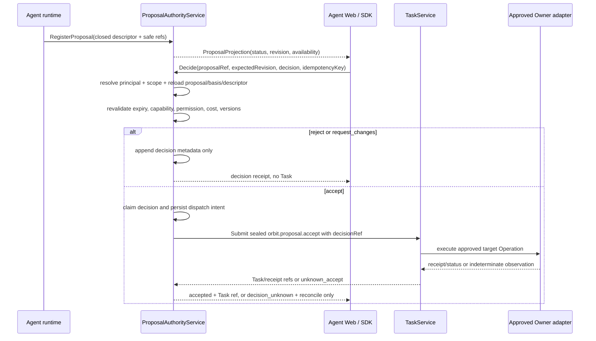

## Context

Agent runtime 已能产生 bounded proposal projection，Web 也能在 timeline、Review Pane、Activity 与 Inspector 中展示 `ActionDescriptorV1`。当前接受路径仍由浏览器组装 `proposalId`、`basisRefs`、`sourceTurnTaskId` 与通用 `expectedOwnerVersion`，再直接提交 `orbit.proposal.accept` Task。`TaskService` 会执行通用 Operation gate，但不会在 Task 创建前重新加载 proposal、descriptor、basis visibility、proposal revision 和目标 Owner 版本，因此 UI 投影不能安全升级为执行权威。

仓库已有两个可复用基础：

- `service/internal/core` 与 Operation registry 是 Task lifecycle、permission/cost、idempotency、receipt 和 `unknown_accept` 的唯一权威。
- Mission Brief 的 acceptance service 已验证“先 claim、服务端重载安全事实、dispatch 边界持久化、未知结果只 reconcile”的模式，但它绑定 Mission Brief Item，不能成为 Agent proposal 的隐式旁路。

本 change 建立一个通用 proposal authority kernel，由 Agent proposal 作为首个直接消费者；Mission Brief 可以通过适配器复用同一 kernel，但其产品语义和现有规范不在本 change 中重写。

### 权威与参与者

| 参与者 | 权威职责 |
| --- | --- |
| Agent runtime adapter | 产生候选 proposal；只能提交 closed safe projection，不能直接授权执行 |
| ProposalAuthorityService | proposal、revision、decision、idempotency、scope、descriptor snapshot 与 decision audit 真相源 |
| TaskService / Operation registry | 接受已封装的 server decision ref，执行 permission/cost/expected-version/idempotency gate 与 Task lifecycle |
| Owner adapter | 执行获批目标 Operation，返回 receipt/status/reconcile；不信任浏览器输入 |
| Agent Web / SDK | 读取 projection，提交 closed decision intent，显示 Task/receipt/recovery；不持有 proposal authority |
| Presentation intent resolver | 仅打开/聚焦 Review 等 Pane；不能调用 decision 或 Task mutation |

### 目标数据流



## Goals / Non-Goals

**Goals:**

- 让 Review Pane 的真实 `accept` 能在服务端重新加载全部授权事实后安全进入现有 TaskService。
- 为 proposal projection、decision、idempotency、revision conflict、receipt 与 reconcile 建立一个跨 transport 的 typed contract。
- 让 `reject` 与 `request_changes` 成为 Workbench-owned decision metadata，不产生隐式 Owner mutation 或 Agent turn。
- 让 `unknown_accept` 永远保留原 decision/idempotency/correlation，并只通过 status/receipt/reconcile 收敛。
- 保持 Agent-first UI、Pane catalog、TaskService、Owner adapter 和 presentation intent 之间只有一条 mutation 链。
- 复用 Mission Brief 已证明的 claim/dispatch/reconcile 安全模式，避免形成第二套不兼容的审批协议。

**Non-Goals:**

- 不引入任意 tool/plugin/URL/shell/Provider 执行。
- 不让 Workbench 持有 Owner canonical domain state 或完整 action payload。
- 不把打开 Review Pane、Follow Pi、hover/focus 或 keyboard preview 解释为用户决策。
- 不在本 change 中设计多 Agent DAG、批量自动批准、规则引擎自动批准或跨租户审批队列。
- 不让 `request_changes` 自动提交新 Agent turn；首版只记录决策并提供显式 composer handoff。
- 不以 fixture、mock adapter、focused component test 或截图证明真实 Owner/action readiness。

## Decisions

### 1. 新建共享 Proposal Authority kernel，不把浏览器 Task submit 包装成权威

新增 `service/internal/proposalauthority` 作为 shared application/domain boundary。Agent API 调用该 service；service 再通过受限 port 调用 `TaskService`，而不是让 SDK 直接构造通用 Task input。

选择原因：proposal revision、basis visibility、descriptor digest、actor scope 与目标 Operation 必须在一个事务性决策边界内重新加载。继续扩展浏览器 `acceptProposal()` 只会把更多安全事实交给不可信客户端。

替代方案：

- 继续使用当前 `WorkbenchTaskClient.submitTask`：拒绝，因为 TaskService 只能看到浏览器组装的 proposal input。
- 在 Web BFF 中补验证：拒绝，因为 BFF 不是 proposal 真相源，也无法替代 service/repository concurrency。
- 直接复用 Mission Brief `AcceptService`：拒绝直接复用其 Item 模型；采用同一 claim/dispatch/reconcile 模式并提供适配器，避免产品对象耦合。

### 2. Proposal 是服务端 canonical approval object，Agent output 只是 projection

`ProposalRecordV1` 至少包含：

- `proposalRef`、`contractVersion`、`tenant/workspace/project/session/sourceTurn/sourceOutput` safe refs；
- closed `actionId`、`targetOperation`、`targetRef`、`descriptorRevision/digest`；
- bounded `basisRefs` 与服务端可重载的 expected domain versions；
- `status`、`revision`、`expiresAt`、`createdAt`、`updatedAt`；
- capability/permission/cost/approval policy refs 的安全版本引用。

状态为 closed enum：

```text
open -> deciding -> accepted
                  -> decision_unknown -> accepted
                                      -> open (reconciled_not_accepted, revision++)
open -> rejected
open -> changes_requested
open -> expired
open -> superseded
```

`deciding` 是持久化 dispatch boundary，不是 UI 乐观状态。`accepted` 表示 acceptance 已被 Task control plane 接受，并不表示目标 Task 已成功；UI 必须并列显示 proposal decision 与 Task status。

### 3. 浏览器 decision request 使用最小 closed input

`DecideAgentProposalRequestV1` 只允许：

- `proposalRef`
- `expectedProposalRevision`
- `decision`: `accept | reject | request_changes`
- 可选 bounded `reasonCode`
- 可选 bounded `userNote`，仅在 policy 允许时作为审计安全摘要；不得作为 Owner/tool input
- `idempotencyKey`

actor、tenant、workspace、project、session、basis、descriptor、target Operation、target ref、expected Owner versions、permission/cost claims 和 endpoint 全部由服务端解析。SDK normalizer 对 unknown field、unsafe ref、超限文本和 closed enum 之外的值 fail closed。

### 4. Decision claim、revision 与 idempotency 在 dispatch 前持久化

Repository 使用 `(principal-scope, proposalRef, idempotencyKey)` 唯一约束和 request digest：

- 同 key + 同 digest 返回原结果；
- 同 key + 不同 digest 返回 `idempotency_conflict`；
- stale expected revision 返回当前安全 projection 与 `revision_conflict`；
- 同一 proposal 同时只允许一个 active acceptance attempt；
- reject/request_changes 与 accept 竞争时，由成功 claim 的 revision 决定，其余请求读取 typed conflict。

DecisionAttempt 记录 `decisionRef`、proposal revision、server-resolved actor、decision、digest、state、Task/receipt/correlation refs 和 bounded failure reason。任何可能越过 dispatch 边界的失败都必须保留 `decision_unknown`，不能删除记录后重试。

### 5. 接受时重新加载全部授权事实，再提交 sealed decision ref

`accept` claim 后，service 必须重新验证：

1. authenticated principal 与 tenant/workspace/project/session/source visibility；
2. proposal 仍为 `open`、未过期、未 supersede；
3. source turn/output、basis refs 和 descriptor revision/digest 仍与 server projection 一致；
4. target Operation 仍在 registry，descriptor 指向同一 operation/target；
5. Owner capability、permission、cost、approval、expected domain versions 仍满足；
6. action canary 与 adapter contract digest 允许执行。

通过后，`ProposalAuthorityService` 向 `TaskService` 提交 `orbit.proposal.accept`，input 只携带 `proposalDecisionRef`。Operation handler 再从 authority repository 加载 sealed snapshot，不接受浏览器 basis/action/target/version 覆盖。

确定的 pre-dispatch failure 关闭本次 attempt 并让 proposal 保持 `open` 或转为真实 `expired/superseded`；可能已 dispatch 的错误进入 `decision_unknown`。

### 6. 非接受决策不调用 Owner，也不自动生成 Agent turn

`reject` 将 proposal 置为 `rejected`；`request_changes` 置为 `changes_requested`。两者只追加 principal-scoped decision/audit metadata 和 UI event，不创建 Task、不调用 Owner、不向 composer 写入内容，也不自动提交 Agent turn。

UI 可以提供“带入 composer”按钮，把服务端返回的 bounded suggestion 放入空 composer；这仍属于显式本地交互，并遵循现有 prefill 不覆盖、不自动 submit 规则。

### 7. `unknown_accept` 只读取原 attempt 并 reconcile

`ReconcileAgentProposalDecisionRequestV1` 只包含 `proposalRef`、`decisionRef`、`expectedProposalRevision` 与新的 reconcile idempotency key。服务端从 DecisionAttempt 加载原 Task/receipt/correlation/idempotency refs，调用原 Task/Owner 的 status/receipt/reconcile 合同：

- 证明已接受：proposal -> `accepted`，保留原 Task/receipt；
- 证明未接受：attempt -> `reconciled_not_accepted`，proposal revision++ 后回到 `open`；再次 accept 必须使用新 idempotency key；
- 仍不确定：保持 `decision_unknown`，只更新 last-observed safe metadata；
- 不允许 replay 原 mutation、切换 adapter/provider 或创建 fallback Task。

### 8. API、SDK 与事件保持四 transport parity

共享 service method：

| Method | HTTP | gRPC | JSON-RPC |
| --- | --- | --- | --- |
| Get proposal | `GET /v1alpha1/agent/proposals/{proposalRef}` | `GetAgentProposal` | `GetAgentProposal` |
| Decide proposal | `POST /v1alpha1/agent/proposals/{proposalRef}:decide` | `DecideAgentProposal` | `DecideAgentProposal` |
| Reconcile decision | `POST /v1alpha1/agent/proposals/{proposalRef}/decisions/{decisionRef}:reconcile` | `ReconcileAgentProposalDecision` | `ReconcileAgentProposalDecision` |

HTTP 使用 `If-Match`/expected revision 与 `Idempotency-Key`；其他 transport 使用等价 typed fields。错误映射固定为 `invalid_argument`、`not_found`、`permission_denied`、`proposal_expired`、`proposal_superseded`、`revision_conflict`、`idempotency_conflict`、`capability_unavailable`、`cost_confirmation_required`、`approval_required`、`decision_in_progress`、`unknown_accept`。

Proposal event 进入现有 Agent/session directory 与 selected-turn event projection，不为每个 proposal 新建独立 SSE。事件只携带 proposal/decision/Task/receipt safe refs、revision、status 和 reason code。

### 9. Review Pane 只渲染 server-authored capability

`AgentProposalProjectionV1` 包含 decision status、Task status、ActionDescriptor、可见 basis safe refs、expiry、revision、reason/recovery 与 capability。Review Pane 的控制规则：

- `ready` 才显示可用 accept；permission/cost/approval 使用标准 gate UX；
- `needs_contract/offline/stale/expired/superseded` 显示真实原因与恢复路径；
- `decision_unknown` 只显示 reconcile；
- accepting/accepted 与目标 Task status 分开；
- repeated click、hover、focus、intent activation、Follow Pi 都不能触发 decision；
- presentation intent 只可 `request_review`，不能携带 decision 或自动点击。

### 10. 存储、审计和可观测性默认脱敏

允许持久化 proposal metadata、safe refs、closed descriptor、version/digest、bounded reason/user-note safe summary、decision attempt、Task/receipt/correlation refs 和 idempotency digest。禁止持久化 raw prompt、provider output、chain-of-thought、credential、Authorization、private path、signed URL、artifact blob、任意 tool args 或 Owner private payload。

日志/trace/metric 只使用低基数 status/reason/operation family/capability cohort；原始 principal、tenant/project/session/proposal refs 只通过受控 hash/correlation 关联。安全测试必须把敏感 sentinel 注入 proto/schema/repository/log/event/SDK/UI/evidence 全链路并证明不会泄露。

### 11. Default-off 分层晋级，不以 UI 完成替代 Owner readiness

Capability 至少分为：`proposalRead`、`proposalDecision`、`proposalReconcile`、`toolActionCanary`。读取可以先晋级；decision 只有在 repository/transport/TaskService 安全 gate 完成后对测试 cohort 开启；真实 accept 还要求目标 Owner adapter、receipt/status/reconcile、rollback owner 与 environment evidence。

路由、localStorage、query param、fixture 或 mock 不能开启 capability。关闭 decision capability 不删除 proposal、attempt、Task 或 receipt；已 accepted/unknown 的记录继续可读和 reconcile。

## Risks / Trade-offs

- **[双重 proposal authority]** Mission Brief 已有 Item acceptance，新增 kernel 可能形成重复实现 → 抽取共享 claim/dispatch/reconcile primitive，并通过 adapter 保留 Mission Brief 行为与测试；不让两个 repository 各自调同一 Owner mutation。
- **[accepted 与 succeeded 被混淆]** 用户可能把 proposal accepted 当成工作完成 → projection 与 UI 强制并列 decision status、Task status 与 receipt/reconcile。
- **[descriptor/source drift]** proposal 可见后 Owner 或 source 已变化 → decision 时重载所有版本；任何不一致 fail closed，不信任浏览器缓存。
- **[dispatch 后进程崩溃]** 可能无法判断 Task 是否创建 → dispatch intent 先持久化；重放转 `decision_unknown` 并使用原 correlation reconcile。
- **[大范围迁移风险]** 从当前浏览器 `submitTask` 切到 typed decision API 会触及 SDK/Web/transport → additive 引入新 API，旧 accept 始终保持 disabled；新链通过后再删除内部旧调用，不破坏公开 Task API。
- **[用户说明泄露]** request_changes note 可能含敏感内容 → 首版默认只允许 closed reason code；free-form note 必须由 policy 明确开启、限长、脱敏且不进入 Owner input。
- **[事件连接膨胀]** 每 proposal SSE 会增加连接数 → 复用 workspace directory + selected-turn stream，proposal event 只是现有流中的 closed event。

## Migration Plan

1. 新增 proto/schema/domain/repository/migration 与 read-only proposal projection，默认 capability off。
2. 从 Agent output projector 注册 canonical proposal，并进行 shadow compare；现有 UI 继续只读，旧 `acceptProposal` 保持 disabled。
3. 新增 typed decide/reconcile service 与四 transport/SDK parity；使用 reference adapter 验证 pre-dispatch、idempotency、revision 和 unknown 边界。
4. 将 `orbit.proposal.accept` handler 改为只接受 `proposalDecisionRef` 并从 authority store 加载 sealed snapshot；拒绝旧浏览器 basis/action payload。
5. 迁移 Review Pane 到 `DecideAgentProposal`，先启用 reject/request_changes，再为本地 allowlist 开启真实 accept。
6. 为一个低风险、可 reconcile 的 approved Owner Operation 运行真实 canary、browser journey、kill switch 与 rollback drill。
7. 满足 evidence gate 后晋级 action capability；旧 SDK 内部 accept helper 标记 deprecated，并在兼容窗口后按独立 migration 删除。

Rollback：关闭 `proposalDecision/toolActionCanary`，保留 read/reconcile；停止新 accept，不删除 additive tables；已存在 Task 继续由 TaskService/Owner 完成或 reconcile。旧 binary 可忽略新表和新字段，但不得重新开启浏览器直接 accept。

## Open Questions

- 首个真实 canary 的 Owner Operation 由 R2 owner matrix 选择；必须低风险、成本有界、支持 receipt/status/reconcile 且可在测试 tenant 回滚。
- `request_changes` 首版是否只允许 reason code，还是允许 policy-gated bounded note；在安全评审完成前默认仅 reason code。
- Mission Brief 迁入共享 kernel 的兼容切片需在实现阶段冻结 repository migration 顺序；规范语义保持不变。
