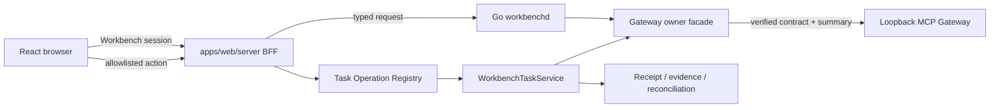

## Context

Gateway 已通过 `gateway.console.contract.v1` 与 `gateway.console.summary.v1` 定义 owner-owned console contract。Workbench 只负责把该合同投影为 operator experience，并把允许的 mutation 编排为既有 Task operations。浏览器不得直连 Gateway，也不得看到 Gateway bearer token、credential ref 或 private URL。

## Goals / Non-Goals

**Goals:**

- Add `WorkbenchClient.gateway` as an additive typed facade using `workbench.gateway.v1alpha1`.
- Render Overview, Backends, Approvals, and Activity from bounded Gateway projections.
- Preserve typed loading, empty, error, offline, unavailable, down, stale, and permission states.
- Route the three approved mutations through Task lifecycle, permission, expected-version, idempotency, audit, receipt, and reconciliation gates.
- Meet desktop/tablet/mobile and WCAG 2.2 AA requirements with keyboard and screen-reader parity.

**Non-Goals:**

- Generic Gateway owner registration, arbitrary `/v1/**` proxying, raw JSON explorer, or browser-to-Gateway fetch.
- Gateway token provisioning, credential editor, registry/policy editor, tool playground, artifact bodies, or P0 runtime restart.
- Copying Gateway schema, backend state, tool state, approval state, audit records, or operations into Workbench canonical storage.
- Treating stale or partial owner data as live, retrying `unknown_accept` automatically, or hiding permission failures.

## Decisions

### Dedicated facade, not generic owner

`WorkbenchClient.gateway` is a first-class additive namespace backed by typed SDK models. Gateway is not inserted into a generic owner fallback, and the adapter accepts only known contract versions and operation types.

Alternative rejected: reuse a generic HTTP owner adapter. It would permit arbitrary path/body forwarding and erase schema, scope, redaction, and reconciliation guarantees.

### Browser trust terminates at the Workbench BFF

The browser sends only Workbench session context and typed action input. The BFF calls `workbenchd`; `workbenchd` resolves the local Gateway endpoint and credential from server-side configuration or secret storage. Browser payloads, storage, URLs, telemetry, and logs never contain Gateway credentials.

### Page and state matrix

| Page | User question | Source contract | Primary actions | Recovery | Responsive / accessibility |
| --- | --- | --- | --- | --- | --- |
| Overview | Is Gateway usable and what needs attention? | summary overview, runtime, aggregate freshness | refresh, open affected section, runtime reload when permitted | retry projection, open evidence, reconcile unknown outcome | desktop two-column evidence layout; tablet one-column; mobile priority list; headings and live status |
| Backends | Which backend or catalog is degraded? | backend/tool typed refs and section errors | inspect backend, refresh tools when permitted | retry section, follow owner diagnostic ref | table becomes labeled cards below tablet; keyboard sortable headers; no color-only status |
| Approvals | Which decisions are waiting and what is safe to decide? | approval refs, revision, expiry, safe request summary | approve/reject through Task operation | revision conflict refresh, unknown accept reconcile, permission guidance | persistent decision context; focus confirmation; destructive intent text; mobile stacked controls |
| Activity | What happened and which operation needs follow-up? | audit/operation refs, cursor, receipt/evidence refs | inspect receipt, reconcile operation, copy safe ref | cursor retry, stale marker, owner unavailable message | virtualized bounded list; chronological labels; `aria-live` only for meaningful updates |

All four pages support these explicit states:

| State | Required presentation and recovery |
| --- | --- |
| `loading` | skeleton preserving page geometry; no fake KPI values |
| `empty` | explain what qualifies as data and offer one valid next action |
| `error` | stable code, safe explanation, correlation/evidence ref, bounded retry |
| `browser_offline` | local connectivity message; no owner mutation attempt |
| `workbench_unavailable` | BFF/daemon recovery command or retry; no Gateway inference |
| `gateway_unavailable` | preserve last safe snapshot as stale when allowed; show owner recovery |
| `backend_down` | isolate affected backend; unrelated sections remain usable |
| `stale` | show observation time and freshness threshold; mutations require refreshed revision |
| `permission` | name required capability without exposing policy internals; no disabled-action ambiguity |

### Mutations remain Task operations

Only `gateway.approval.decide`, `gateway.tools.refresh`, and `gateway.runtime.reload` are registered. Each operation requires server-side authorization, current owner revision, idempotency key, safe request digest, and an owner receipt or operation reference. Network ambiguity enters `unknown_accept`; the UI offers explicit reconcile and never automatic replay.

### Projection storage is bounded

Workbench may cache query data and persist only Task metadata, safe refs, revisions, receipt/evidence refs, and transport receipts. It does not persist raw Gateway owner payloads, credentials, private URLs, artifact bodies, or tool arguments.

### Contract mismatch and partial failure fail visibly

Unknown Gateway contract major versions produce `contract_mismatch` and disable pages/actions. Section-local failures remain typed; one backend failure does not erase approvals or activity. The UI never treats a missing field as permission or capability success.

### Interaction and visual rules

- Investigation paths and recovery actions outrank decorative KPI cards.
- Real owner state drives status; no fake percentages, fake real-time, or inferred health.
- Keyboard order follows page hierarchy; dialogs restore focus; all pointer actions have keyboard alternatives.
- Status uses text/icon plus color, meets WCAG 2.2 AA contrast, and honors `prefers-reduced-motion`.
- Desktop uses bounded split/detail panes, tablet collapses secondary detail, mobile uses stacked routes and sheets without horizontal workflow dependence.

## Risks / Trade-offs

- [Gateway contract drifts] → Negotiate major version and run generated fixture/conformance tests against the owner contract.
- [BFF becomes a proxy] → Keep route allowlist and typed DTOs; add negative arbitrary-path/body tests.
- [Stale revision causes unsafe action] → Disable mutation until summary/approval revision refreshes; require `expected_revision` server-side.
- [Unknown outcome is replayed] → Persist receipt/request refs and force explicit reconcile through Task lifecycle.
- [Credential reaches browser] → Add sentinel tests across JSON, HTML, logs, URLs, local/session storage, and Playwright network captures.
- [Dense operator UI loses accessibility] → Add keyboard, focus, semantics, screen-reader, contrast, zoom, reduced-motion, and viewport gates.

## Migration Plan

1. Add typed fixtures and SDK facade behind an unavailable capability default.
2. Add daemon adapter and BFF read paths; enable only after contract negotiation succeeds.
3. Add four pages with read-only states and fixture/contract tests.
4. Register one mutation at a time through Task operations, starting with approval decision.
5. Run contract, integration, process E2E, accessibility, and credential-leak evidence; then enable the local capability.
6. Roll back by disabling the Gateway capability and routes; existing Workbench Task/Design surfaces remain intact.

## Open Questions

- Final default page item limits and freshness presentation thresholds follow measured Gateway contract values before release.
- Runtime reload may remain hidden in the first client canary even when the owner advertises it; this does not widen the allowlist.
