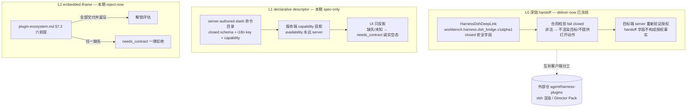

## Context

dsh（deepseek harness）是外部 agent 工具/生态，与 Workbench 通过 `HarnessDshDeepLink` 合同（`workbench.harness.dsh_bridge.v1alpha1`，冻结于 `packages/task-sdk/src/harness/types.ts:292`）做互补客户端集成。跨仓准入已判定为 `split-owner`（见 PRD `docs/product/workbench-dsh-plugin-lane.md` §2）：Workbench 拥有合同、准入判定与 handoff 证据要求；dsh 侧渲染与 Director Pack 归外部仓 `agent/harness-plugins`，本仓不复制其状态机。

上位红线来自 `docs/design/plugin-ecosystem.md`：无运行时安装/更新/卸载 API、无服务端下发可执行代码、无 fail-open 预留口、浏览器不直连 owner、capability 不得来自浏览器侧事实、不用 mock fallback 冒充可用。本 design 是这些红线在 dsh 车道的落点，不得放宽。

并行工作树中存在其他功能修改；本 change 只新增 spec 与文档，不改任何代码（包括 composer.tsx）。

## Goals / Non-Goals

**Goals:**

- 建立 dsh 插件三层车道准入模型（L0/L1/L2），每层有明确的合同范围、交付状态与 fail-closed 语义。
- spec 化 L0 已冻结的 `HarnessDshDeepLink` 消费语义，含目标端 server 重新验证授权。
- spec 化 L1 server-authored declarative surface descriptor 与 slash 命令目录合同，作为取代 composer.tsx:260-264 前端硬编码的目标方向（本期不实现）。
- 写明 L2 embedded iframe 的 reject-now 判定与精确解锁条件（plugin-ecosystem.md §7.2 六前提）。

**Non-Goals:**

- 不实现 L1 命令目录服务端投影或 composer 切换；不新增/修改任何 Operation。
- 不交付 L2 embedded iframe，不为其预留任何执行口或 flag。
- 不实现 dsh 侧渲染、Director Pack 或任何 `agent/harness-plugins` 仓能力。
- 不重解释已冻结的 `HarnessDshDeepLink` 字段语义，不在本期扩字段。
- 不让浏览器直连 dsh 服务，不保存 dsh payload、credential、私有路径或 artifact blob。

## Decisions

### 1. 三层车道准入模型

- **L0 = 既有冻结合同的消费语义**。`HarnessDshDeepLink` 只携带 `contractVersion/targetRef/sourceSurfaceId/resourceRef(+resourceVersion)/mode/embedded 约束/handoffNonce`；`mode: "embedded"` 仅是 layout-only 窗口约束元数据，不授权 iframe 加载。合同校验失败即 fail closed。该 lane 的实现与测试已存在（`harness-asset-library`/`harness-contract-gates` DSH 用例），本 change 只把语义写进 spec 作为准入真源。
- **L1 = server-authored 声明式描述**。slash 命令目录是版本化、closed schema 的服务端投影：每条命令携带稳定 id、dotted i18n key、icon semantic、closed 参数 schema、`requiredCapabilities` 与 `ActionDescriptorV1` 风格 availability；forbidden field 清单沿用 plugin-ecosystem.md §3.5 同原则（URL/component/JS/credential 语义字段一律拒绝）。UI 只投影、只派生；目录缺失、版本未知、枚举未知一律 `needs_contract`/诚实空态，**禁止回退前端硬编码清单**。composer.tsx:260-264 的硬编码是过渡实现，迁移时一次性切换并删除，本 change 不动它。
- **L2 = 关闭中的 iframe 车道**。本期 reject-now：不是"下期做"，而是六前提逐项交付并留证前的显式拒绝。

替代方案是为 dsh 单开一条"轻量 iframe"旁路。它会复制 plugin-ecosystem.md §7 已经设计好的三段门禁之外的第二套信任模型，违反"唯一候选车道"原则，拒绝。

### 2. 目标端重新验证授权（L0 核心安全语义）

handoff 是导航与关联，不是授权。目标端（dsh server 或 Workbench server）收到 handoff 后必须基于自身 session/tenant/workspace/principal 重新验证授权与资源版本；`sourceSurfaceId`/`handoffNonce` 只用于关联、审计与防重放线索。验证失败返回安全拒绝（existence-hiding deny），不得依据 handoff 字段授予任何能力或泄露资源存在性。

### 3. L2 解锁条件（逐项引用 plugin-ecosystem.md §7.2）

1. 控制面签名发布（浏览器只认 digest 比对）；
2. content-addressed artifact 存储，加载前校验真实字节 digest；
3. `releaseDigest`/`artifactDigest` 进入构建期静态 allowlist（empty-by-default 先例）；
4. sandbox/CSP/bridge/egress 维持 default-deny，action 与 navigation 永不跨 bridge；
5. capability cohort kill switch，flag off 不影响既有 Task/receipt；
6. 供应链审计与接口合同 §12 分层证据。

六项全部交付且各自留证后才进入解锁评估；此前任何接入请求一律 `needs_contract`。

### 4. 跨仓边界与 handoff 证据

`agent/harness-plugins` 交付 dsh 侧渲染/Director Pack 时，须向 Workbench 提供 contract digest/version、schema fixtures、failure/tenant 隔离证据与 release compatibility。Workbench 只在 provider ready 与 consumer adoption evidence 同时存在时把相关 capability 显示为 `available`；其余为 `needs_contract`/`contract_mismatch` 等真实状态。合同 digest 不匹配时做 stale/needs_contract 归一，不做版本猜测。

## Risks / Trade-offs

- [composer 硬编码与目录合同并存期漂移] → spec 明确硬编码为过渡实现；实现 change 落地时一次性切换，不双写。
- [外部仓合同演进不同步] → handoff 证据要求入 spec；digest 不匹配归一 `needs_contract`/`contract_mismatch`。
- [reject-now 被误读为排期承诺] → spec/PRD 显式写明解锁条件与"缺一保持关闭"。

## Migration Plan

1. 本 change：spec 与 PRD 交付，`openspec validate workbench-dsh-plugin-lane-v1 --strict` 通过；无代码改动。
2. 后续 change（另立）：L1 服务端命令目录投影（Operation 注册 + `Seal()` 门禁 + 四种 transport parity）与 composer 一次性切换，删除 composer.tsx:260-264 硬编码；复跑 composer-triggers 既有回归。
3. L2：仅在六前提证据齐备后另立 change 评估解锁。

## Open Questions

- L1 命令目录的运输形态：复用 session workspace 合同投影还是独立 Operation；合同最终命名（候选 `workbench.agent.slash_catalog.v1alpha1`）。
- dsh → Workbench 方向深链目标集合如何映射到 `allowedDeepLinkTargets` 静态 allowlist 先例。
