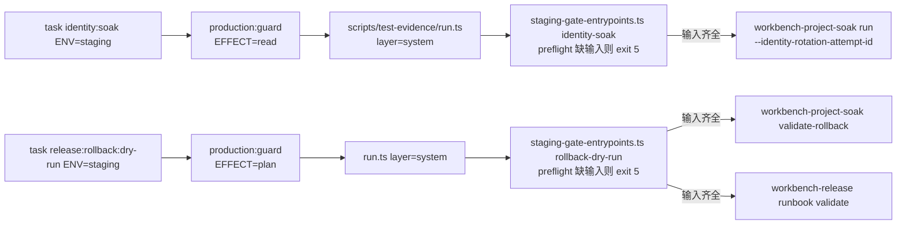

# Workbench Staging 门禁入口设计

## 上下文

R1 6.4 与 R3 8.2–8.5 的 verification 命令引用 `identity:soak` 与 `release:rollback:dry-run`，但 Taskfile 中二者不存在；registry 定义（`service/cmd/workbench-release/production_targets.go`）已预声明 `release:rollback:dry-run` 的 available-when-present 合同（RequiredInputs `[ENV]`、EvidenceLayer `system`、ProviderDependencies `deployment_platform`、RollbackOrFailureAction "block rollback target"），incident runbook 已把它登记为四个 P0/P1 事件的 Recovery target。本 change 只建立入口与 fail-closed 合同，不实现 staging 环境本身。

## 接线关系

## 决策

- **fail-closed preflight 脚本**：新增 `scripts/staging-gate-entrypoints.ts`，子命令 `identity-soak` / `rollback-dry-run`。preflight 只检查环境变量/输入是否存在，缺失时 stderr 输出变量名清单（永不输出值）并以 exit 5 拒绝——与 `incident drill` blocked 的 exit 5 语义一致。输入齐全时 spawn 既有二进制并透传 exit code。
- **输入命名**：沿用仓内 `WORKBENCH_STAGING_*` 前缀。`identity-soak` 需要 `WORKBENCH_STAGING_SOAK_BASE_URL`、`WORKBENCH_STAGING_SOAK_TOKEN_FILE`、`WORKBENCH_STAGING_SOAK_FIXTURE_RECEIPT`、`WORKBENCH_STAGING_SOAK_START_RECEIPT`、`WORKBENCH_STAGING_IDENTITY_ROTATION_ATTEMPT_ID`；`rollback-dry-run` 需要 `WORKBENCH_STAGING_ROLLBACK_RECEIPT`（staging 演练中已记录的脱敏 rollback action receipt）。soak 自身产物写到 `temp/staging-soak/identity/`（soak 二进制自带脱敏），run.ts 的 artifacts 目录只收 PNG，不混用。
- **证据包装**：两个 target 的 cmds 均为单条 `bun scripts/test-evidence/run.ts --layer system --environment "{{.ENV}}" --project client/yeisme-workbench -- …`，fail-closed 拒绝也落 `temp/integration-test-runs/<run-id>/` 失败证据。
- **registry/runbook 一致性核验**：`release:rollback:dry-run` 出现在 Taskfile 后 registry 状态由 `planned` 翻 `available`（registry 定义中唯一受影响的 target；`identity:soak` 不在 registry 定义内）。经逐 target 核验，runbook 四个引用它的事件行（INC-CONFIG/INC-DEPLOYMENT/INC-IDENTITY/INC-WORKFLOW）仍同时引用其他 planned 或 provider-blocked target（deploy:validate、deployment:lookup、tenant:cutover:plan、release:canary 等尚未进入 Taskfile），聚合 Current gate 不变；runbook 与 `runbook_test.go`/`incident_drill_test.go` 无需改动，`task runbook:validate` 与既有 incident drill 断言（INC-CONFIG 仍 blocked exit 5）保持全绿。
- **不做的事**：不实现 24h soak 本身、不新建 staging 环境、不执行真实 rollback、不修改 `docs/operations/active-execution-dag.md`、不动其他未提交改动。

## 风险

- runbook gate 不翻转：每个引用 `release:rollback:dry-run` 的事件行仍有其他 planned/provider-blocked target 压住聚合 gate，incident drill 的 blocked 语义不受影响。
- 缺 staging 环境时入口永远 exit 5；staging operator 到位前 R1 6.4/R3 8.5 不得勾选，这正是门禁目的。
