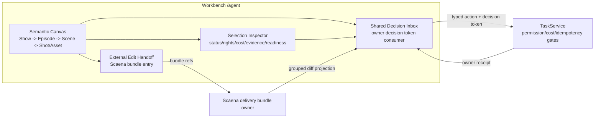

## Context

根级 `ai-drama-director-workspace-editor-roundtrip-v1` 已冻结组合合同：Workbench 是默认导演工作区，DSH 是异常优先导演台，两端只通过 typed action / decision token 与 owner projection / receipt 闭环。DSH Bridge V2 ingress（`workbench-dsh-ai-drama-bridge-consumer-v1`）已解决从 DSH 进入 Workbench 的重新鉴权与 lens 定位，但 `/agent` 内还没有导演工作区本体。本设计只记录 Workbench 侧落地决策；画布语义、决策箱与外编 round-trip 的 canonical 合同分别在根 change 与 Scaena/DSH owner change。

## Decisions

1. **画布落在 `/agent` 现有 spatial runtime**：Director Workspace 是 Unified Spatial Creative Runtime 的一个 workspace 模式，复用 Conversation/Split/Spatial Focus 与 Creative Production/Review/Evidence lenses；不新增独立路由、不恢复 `/show-control-room`。
2. **语义层只投影 owner refs**：`Show -> Episode -> Scene -> Shot/Asset` 节点与边全部来自 owner 安全投影的 `DramaContextRef`/`ArtifactRef`，带 owner、version、freshness；画布本地只保存 layout、camera、selection、expanded set，刷新后从 projection 重建，不做本地持久化的领域关系。
3. **选区驱动 inspector**：选择 scene/shot 后定位关联 shots、assets、review decisions、delivery readiness，经 owner refs 拉取预览与证据；自由节点文本不用于推断缺失关系。
4. **决策箱是 consumer，不是审批状态机**：Workbench 渲染 owner-authored decision token 的 typed action 与 visual diff，提交走 `TaskService` mutation gate；receipt 返回后只刷新 projection。本地 dismissed/selected 不等于 accepted；已终态 token 幂等返回原 receipt 或 stale/already_decided。
5. **外编 handoff 走 Scaena bundle**：精确时间线操作（trim/track/transition/effect/color）只提供受控 handoff action 打开 Scaena delivery bundle 流程；Workbench 不实现 NLE timeline，不读写编辑器私有工程。
6. **证据分层**：画布渲染 snapshot/golden（Vitest）、decision 状态转换 golden、handoff 路径 Playwright e2e；e2e 证据写 `temp/integration-test-runs/<run-id>/`，脱敏 secret/raw prompt/绝对路径。

## Goals / Non-Goals

**Goals:**

- 单一默认入口完成建剧、续作、跨集比较、媒体审阅与交付 handoff。
- 媒体优先视觉（缩略图、序列预览、比较）与异常 overlay 分离。
- 与 DSH 共用同一 decision identity，任一端决定后另一端只刷新 projection。
- 画布状态可测试：`update(state, event)` / `render(state)` 确定性 golden 覆盖。

**Non-Goals:**

- 不实现完整 NLE timeline、effect、color、插件宿主。
- 不保存 owner canonical state、scheduler、provider runtime 或 production state machine。
- 不做浏览器直连 owner、iframe bridge 或 raw URL/文件路径消费。
- 不在本 change 实现 Scaena 的 bundle、semantic diff、quarantine 或 rebase（属 `scaena-openchatcut-editor-roundtrip-v1`）。

## Risks / Trade-offs

- [画布退化为第二领域图] → 节点/边只允许来自 owner projection 的 typed ref；持久化层只存 UI layout/selection，code review + golden 测试守住边界。
- [决策箱双写] → 所有 mutation 走 `TaskService` idempotency gate，幂等 receipt 语义由 owner 保证；Workbench 不建本地审批记录表。
- [e2e 依赖外部编辑器] → handoff e2e 以 Scaena 公开 bundle 合同 + fake adapter 边界验证到 bundle 入口为止；真实 OpenChatCut 启动属 Wave 2 canary。

## Migration Plan

1. 先实现 projection 类型与画布渲染（additive），默认入口开关关闭。
2. 接决策箱 consumer 与 handoff 入口，跑 golden + e2e。
3. canary 期间打开 Director Workspace 默认入口；失败回滚为关闭 workspace flag、回到现有 `/agent` 默认，不迁移、不删除、不回写 owner state。

## Open Questions

- 画布大规模 shot 数的虚拟化阈值与缩略图代理策略，实现阶段以性能预算实测决定。
- 跨集比较的并排视图是否进入 V1 首切片，由实现阶段切片评审决定（capability 语义不变）。

## References

- 根 change：`openspec/changes/ai-drama-director-workspace-editor-roundtrip-v1/`（`ai-drama-client-composition` delta）。
- `docs/product/agent-workbench-blueprint.md`、`docs/ui/agent-first-workbench.md`（本仓产品/UI 真源）。
- `client/yeisme-workbench/openspec/changes/workbench-dsh-ai-drama-bridge-consumer-v1/`（ingress 消费合同）。
- `agent/scaena/openspec/changes/scaena-openchatcut-editor-roundtrip-v1/`（bundle / grouped diff 投影合同）。
