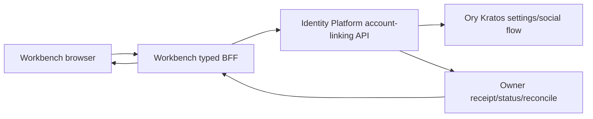

# Workbench Identity Account Linking UX 设计

## Boundary and dependency



- Identity Platform 是 external identity binding、transaction、conflict、recent re-auth、audit/outbox 与 session fence 的唯一 owner。
- Workbench 只拥有 UI 组合状态、短期查询缓存、安全投影和 owner receipt 展示，不保存 canonical binding 或 provider credential。
- Browser 不直连 Identity Platform/Kratos API，不读取 platform session token；所有请求通过 Workbench typed client/BFF 和 `Secure`、`HttpOnly` cookie。
- 依赖能力不可用、版本漂移或响应形状不合同时 fail closed 为 `needs_contract` / `contract_mismatch`。

## User state model

```text
ready
  -> reauth_required
  -> confirming_link | confirming_unlink
  -> redirecting_provider
  -> pending_owner_receipt
  -> linked | unlinked
  -> identity_conflict | last_login_method | session_expired | needs_contract
  -> reconciling_unknown_outcome
```

关键规则：

- `reauth_required` 必须由 owner session projection 决定，Workbench 不使用本地计时器伪造 recent re-auth。
- provider callback 只携带 opaque transaction/receipt reference；authorization code、provider token 与 raw identity payload 不进入 Workbench JavaScript 状态、URL analytics、日志或 evidence。
- `identity_conflict` 只展示安全 reason code、恢复入口和支持说明，不展示另一个 global user、email、tenant 或 provider payload。
- `last_login_method` 阻止 unlink，界面必须先引导添加另一种登录方法或使用 owner 批准的恢复流程。
- 超时或网络中断后的未知结果进入 status/reconcile；mutation 不自动重放。
- link/unlink 成功只改变登录方式投影，不改变 tenant selector、membership、role 或当前 project authority。

## Typed consumer contract

Workbench 只消费 Identity Platform 冻结的 additive 合同：

- provider/link discovery：provider id、enabled、link capability、safe display metadata；
- start re-auth/link/unlink：closed request、idempotency、expected session/auth version、allowlisted return intent；
- callback/finalize：opaque transaction ref 与 owner receipt；
- list/status/reconcile：安全 identity-link projection、stable state/reason code；
- errors：`reauth_required`、`identity_conflict`、`last_login_method`、`session_expired`、`callback_replayed`、`provider_disabled`、`needs_contract`、`contract_mismatch`、`rate_limited`。

任何 unknown field、unsupported contract version、provider URL/return intent 漂移、超大响应或非 JSON 响应都 fail closed。UI 不根据 email 或 domain 推断 provider 已关联，也不把 Lark `tenant_key` 当作 Yeisme membership。

## Interaction and accessibility

- destructive unlink 使用独立确认步骤，清楚说明将撤销登录方式但不删除 Yeisme 数据或 tenant membership。
- 错误和 pending 状态使用可聚焦的 status region；键盘、屏幕阅读器、窄屏与双页签状态变化均需覆盖。
- 返回登录方式页后从服务端刷新 projection，不依赖浏览器历史状态作为成功证据。
- 所有 provider 名称和安全提示来自 allowlisted projection；不得把 owner 返回的 HTML 或原始错误串直接渲染。

## Compatibility and rollout

本 change 对现有登录和 tenant UI 是 additive/default-off。Identity Platform child contract、Workbench typed client 与测试证据未全部通过前不显示 link/unlink mutation。回滚只关闭入口并保留只读安全投影、owner binding 和 audit history；不得在 Workbench 删除 owner 数据。

真实 Google/Lark OAuth callback、regional app、staging browser canary、24h soak 与 key rotation 是外部环境晋级门禁，不是本地合同实现的替代品，也不由根任务伪造完成。
