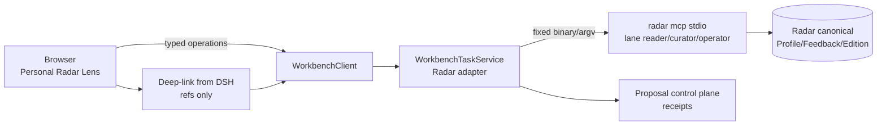

## Context

Workbench 已有 React/Bun Web、typed `WorkbenchClient` 与纯 Go `WorkbenchTaskService`；浏览器只能通过 typed client 访问服务端 operation。Radar owner 提供 `radar mcp --transport stdio --lane reader|curator|operator` 与 `radar.mcp.handoff.v1` 脱敏 fixtures。本变更把根 change 冻结的 Personal Radar Lens 合同落到 Workbench：browser → `WorkbenchClient` → `WorkbenchTaskService` Radar adapter → allowlisted Radar MCP。

## Goals / Non-Goals

**Goals:**

- For You 首屏直接回答：机会是什么、为什么适合我、证据是否可靠、下一步是什么。
- Detail 分开展示 market score / personal fit / evidence confidence 三类分数与 reason codes。
- My Projects 只读 Workbench proposal/downstream owner receipt 真源。
- Taste & Feedback 展示 Profile 安全摘要与近期反馈，编辑只给 CLI suggestion。
- 所有 mutation 经 typed operation + idempotency key + owner receipt。

**Non-Goals:**

- 不做 Profile 编辑表单、长问卷或黑盒综合分。
- 不暴露 collect/daily_run/任意 MCP method 给浏览器。
- 不让 Lens 成为 Radar 运行前提，不保存第二份 canonical state。

## Decisions

### 1. Server-side adapter 固定命令与 lane/operation 交集

Adapter 从用户级/服务端配置读取 binary 路径与 lane，固定 argv 为 `mcp --transport stdio --lane <lane>`。浏览器请求只能携带 typed operation 参数（ref、idempotency key、filter），任何 binary/argv/cwd/env/未注册 method 一律 fail closed，不启动子进程。

有效动作矩阵（交集）：

| operation | Radar lane | Workbench allowlist | 说明 |
| --- | --- | --- | --- |
| search/profile/edition/opportunity/evidence/source/capabilities 读取 | reader | reader projection | 默认 |
| `feedback_add`、`opportunity_review` | curator | curator mutation | 带 idempotency key |
| `edition_build` | operator | operator，仅此一项 | 需明确确认提示 |

Radar operator lane 自身含 collect/score/cluster_build/daily_run，Workbench operation allowlist 显式排除；更高 lane 不扩大浏览器可见动作。

### 2. 四视图信息架构

- **For You**：latest Edition + active profile revision + freshness + 机会卡（每卡最多 3 个主 reason + 1 个主要风险）+ source status。`profile_required` 时显示三步 CLI setup（命名、核心题材/受众、blocked topics），不建隐式默认 Profile。
- **Opportunity Detail**：三类分数、reason codes、市场信号/Profile match/风险、证据条目、跨平台差异、known limitations；动作：Save/Dismiss/Not relevant/Too risky/Already seen/Compare/Draft proposal。
- **My Projects**：Workbench proposal/downstream owner receipt + deep-link；只有 Radar `used` 而无下游回执时标记 “reported as used”，不伪造项目状态。
- **Taste & Feedback**：Profile 安全摘要 + revision + 近期反馈 + 排序变化解释；编辑入口渲染 CLI suggestion（如 `radar profile set ...`），不直接 mutation。

### 3. 状态与恢复

覆盖 ready/empty/degraded/stale/offline/permission_denied/contract_mismatch/action_pending/reconcile_required；非 ready 状态必须给安全 next action，不只靠颜色。缓存只用于只读占位，显示 observed_at/freshness。mutation 超时或断线后按 idempotency key 查原 receipt，查不到保持 unknown，不自动重放 feedback 或 edition build。

### 4. Handoff 与 proposal

消费/生成 `PersonalRadarOpportunityHandoffV1`（source owner、edition/opportunity/profile revision refs、reason/evidence refs、target owner、user intent、idempotency key）。deep-link 只携带 refs，Detail 打开时重新向 owner 读取投影并校验 digest/freshness；stale profile revision 显示历史上下文并让用户选择继续审查或回到最新 Edition。proposal 与 accept 分离：Draft proposal 只创建 pending review 草稿，accept 后才由目标 domain owner 创建 canonical project。

### 5. 响应式与可访问性

Desktop 默认列表 + detail inspector，Compare 才用双栏；<768px 用单一 sheet/stack，复杂 compare 提示 desktop required。键盘等价、可见焦点、screen-reader label、成功后焦点回到原机会上下文；状态用文本+图标双表达。

## Risks / Trade-offs

- [adapter 变成任意 shell gateway] → 固定 binary/argv + fail closed 校验，单测覆盖拒绝路径。
- [重复反馈] → 全链路 idempotency key + receipt lookup。
- [Profile 泄露] → safe projection、profile-scoped cache key、切换时清理。
- [Radar 未安装/不可用] → capability probe 驱动 empty/degraded 状态与 owner-side 修复指引，不伪造 ready。

## Migration Plan

1. 先交付 read-only For You/Detail（reader lane）。
2. 再加 curator 反馈（idempotency + receipt）。
3. 再加 confirmed `edition_build` 与 proposal handoff。
4. 验证 empty/degraded/stale/offline/mismatch、重复提交、断线 reconcile、profile switch。
5. 回滚只移除 Lens/adapter 入口，Radar canonical state 不动。

## Open Questions

- operation namespace 最终名称随 `service/internal/registry` 现有惯例确定（如 `workbench.personal_radar.*`），本 change 冻结语义。
- 第一个 proposal target（Auctra 或 target picker）待 Radar canary 后决定，不在本 change 锁定。
