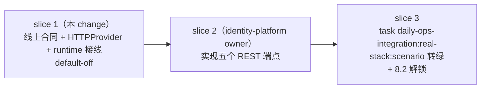

# Workbench Identity Provider HTTP 合同设计

## 上下文

R1 冻结的 consumer 合同 `workbench.identity.v0.1`（`service/internal/identity/service.go` 的 `ContractVersion`）定义了 `identity.Provider` 五方法，但从未有实现接进 `identity.NewService` 第三参。8.2 真实栈勘察（2026-08-28）确认这是 managed profile 授权链 fail-closed 的根因。本 design 冻结消费端 HTTP 线上合同，并交付 Workbench 侧消费端实现与 runtime 接线；identity-platform 侧端点（slice 2）由其 owner 依本合同实现。

## 切片划分与依赖



- slice 1（本 change，Workbench）：合同文档、`http_provider.go`、runtime 接线。验证 = 本包测试 + workbenchd 构建 + openspec strict。default-off：URL 为空时行为与现状逐字节一致。
- slice 2（identity-platform 仓，owner change）：按本合同实现 GET `/v1alpha1/identity/provider/ready` 与四个 POST 端点；接受 `X-Workbench-Provider-Contract: workbench.identity.provider.v1alpha1` 请求头与 closed 请求体；按 §错误映射 返回状态码。
- slice 3（Workbench，gated on slice 2）：以真实 provider 端点运行 `task daily-ops-integration:real-stack:scenario`，覆盖 workitems identity authorizer 链路，8.2 方可勾选。

## 线上合同：workbench.identity.provider.v1alpha1

### 版本与标识

- transport 绑定合同 ID：`workbench.identity.provider.v1alpha1`（本合同；未来不兼容变更升级 minor/major）。
- 域名载荷合同版本：`workbench.identity.v0.1`（R1 冻结 `ContractVersion`）。每个成功响应体顶层 `contractVersion` 必须逐字节等于该值；不匹配 → `ErrContractMismatch`。两版本职责分离：前者命名端点/envelope 形状，后者命名 domain 载荷语义。

### 请求头

- `Accept: application/json`（必须）。
- `X-Workbench-Provider-Contract: workbench.identity.provider.v1alpha1`（必须；slice 2 可用它拒绝旧消费端）。
- POST 端点追加 `Content-Type: application/json`。
- 不得携带 Authorization 头：provider 信任的是请求体中已验证 PrincipalContext 的投影（opaque refs），raw bearer token 不离开 workbenchd。

### 端点

| 方法 | 路径 | 请求体 | 成功响应体 |
| --- | --- | --- | --- |
| GET | `/v1alpha1/identity/provider/ready` | 无 | `{"contractVersion":"workbench.identity.v0.1","data":{"status":"ready"}}`（status 恒 `ready`） |
| POST | `/v1alpha1/identity/provider/session` | providerRequest | SessionSnapshot（R1 形状） |
| POST | `/v1alpha1/identity/provider/tenants/list` | providerRequest（PageToken/PageSize） | TenantPage |
| POST | `/v1alpha1/identity/provider/members/list` | providerRequest（TenantRef/PageToken/PageSize） | MembershipPage |
| POST | `/v1alpha1/identity/provider/actions/allowed` | providerRequest（TenantRef/ResourceType/ResourceRef/ActionIDs） | AllowedActionsResult |

`providerRequest`（closed 形状，字段固定）：

```json
{
  "principal": { "subjectRef": "…", "sessionRef": "…", "tenantRef": "…", "membershipRef": "…", "membershipVersion": "7", "actorType": "human", "scopes": ["…"], "authMethods": ["…"], "authTimeUnixMs": 0, "expiresAtUnixMs": 0 },
  "tenantRef": "…", "resourceType": "…", "resourceRef": "…", "actionIds": ["…"], "pageToken": "…", "pageSize": 100
}
```

principal 是 `projectPrincipal` 的输出（已验证 PrincipalContext 的投影，全部 opaque refs），不存在 token、cookie、email 或 raw profile 字段。

### 错误映射（与 `providerError` 语义对齐）

| provider 状态码 | 消费端错误 | 后续语义（`Service`/`AuthorizeResource`） |
| --- | --- | --- |
| 401 | `ErrAuthenticationRequired` | transport 层 unauthenticated |
| 403 | `ErrPermissionDenied` | `security.ErrResourceDenied` |
| 5xx、网络错误、超时、redirect 拒绝、非 JSON Content-Type、解码失败（JSON 语法/体积超限） | `ErrUnavailable` | `security.ErrIdentityUnavailable` |
| 200 但 `contractVersion` 漂移、unknown field、trailing JSON、计数越界、字段无效 | `ErrContractMismatch` | `security.ErrIdentityUnavailable` |

fail-closed 顺序：任何情况都不得把失败解释为 allow；`AuthorizeResource` 把 needs_contract/unavailable/contract_mismatch 统一映射为 identity unavailable，把 permission_denied 映射为 resource denied。

### URL policy

- BaseURL 缺失 → `ErrNeedsContract`（不尝试连接）。
- ownersec `URLPolicy` 全部硬约束：拒绝 userinfo、query、fragment、非 http/https scheme。
- provider 专属 loopback-or-HTTPS 规则：loopback host（`localhost` 或 loopback IP）允许 http；其余 host 必须是 HTTPS origin。
- 任何 redirect（`ownersec.SafeHTTPClient` 的 `CheckRedirect` 恒拒绝）→ `ErrUnavailable`。

### Bounded response

- 响应上限默认 `ownersec.MaxResponseBytes`（1 MiB），可用 `HTTPProviderConfig.MaxResponseBytes` 收紧（测试用）；超限 → `ErrContractMismatch`。
- Content-Type 必须 JSON（`application/json` 或 `application/+json`），否则 → `ErrUnavailable`。
- 集合计数有界：tenants/members ≤ 256、actions ≤ 64、单页 ≤ 200（`validatePage`）、requiredGates ≤ 16；越界 → `ErrContractMismatch`。
- 解码 closed：`DisallowUnknownFields` + 单值（trailing JSON 拒绝）；domain 校验复用 `Service` 既有验证器（validTenant/validMembership/validAllowedAction/validateSession），双层拒绝任何漂移。

### 脱敏

- 错误值与日志不回显 provider URL、响应原文、token 或 principal 的非 opaque 字段；网络错误统一折叠为 `ErrUnavailable`。
- 请求体只含 opaque refs；`service.go` 既有纪律（provider raw response、token、私有路径不进入响应、日志、DB、event、evidence）原样适用。

## 决策

### D1: 消费端双合同版本（transport ID + domain ContractVersion）

`workbench.identity.provider.v1alpha1` 只在请求头出现并命名 transport 绑定；响应体仍回 R1 冻结的 `workbench.identity.v0.1`。这让 identity-platform 不需要感知或修改既有 domain 合同版本即可实现端点，也让消费端可以在 domain 版本不变的情况下独立演进 transport（端点路径、envelope）。

### D2: GET ready + POST 方法集，复用 Service 层全部校验

HTTPProvider 只做「传输形状 + 边界计数」的封闭校验，domain 校验（principal 回显、tenant 绑定、去重、token 有效）交给 `Service.ListTenants/ListMembers/AllowedActions/validateSession` 既有逻辑，不复制校验器。这保证 provider 与未来任何实现（fake、gRPC）走同一套校验路径。

### D3: runtime default-off，URL 为空时行为零增量

`LoadConfig` 只在 managed 分支读 `WORKBENCH_IDENTITY_PROVIDER_URL`（该函数在 flag.Parse 之前运行，profile 来自 `WORKBENCH_PROFILE` env 或 user config——已知陷阱，`-profile` flag 单独不足以让 env 生效）。`New()` 仅在 managed + URL 非空时构造 provider；为空保持 nil provider，`identity.NewService` 收到的第三个参数与历史完全一致。`Validate` 对称禁止 local profile 携带该 URL（对齐「identity provider configuration is only supported by managed profile」既有校验风格），managed 携带时在 startup 阶段跑 URL policy 验证，fail-fast。

### D4: 不转发 raw bearer token

provider 请求体只携带 `projectPrincipal` 投影。即使 transport ctx 中存在 Authorization（`security.BearerTokenFromContext`），也不随 provider 调用外发——与「owner-audience context 不原样转发」的 R1 要求同向，且避免 provider 端点成为 token exfiltration 面。provider 信任模型：workbenchd 已完成 JWT 验签与 claims 绑定，provider 按 opaque refs + 自有 session/tenant 状态返回决策；403/401 是 provider 对该 principal 的权威否决，不是重放信号。

## Non-Goals

- 不实现 identity-platform 侧端点（slice 2，owner change）。
- 不新增 gRPC/JSON-RPC provider 面（Provider 是 server→identity 的出站调用，非 four-transport operation 面；不触发 parity 要求）。
- 不改动 `identity.NewService`、`providerError`、`Service` 校验逻辑的任何既有行为。
- 不在 Taskfile/docs/operations 添加任务（并行代理在写树，避免租约冲突）。
