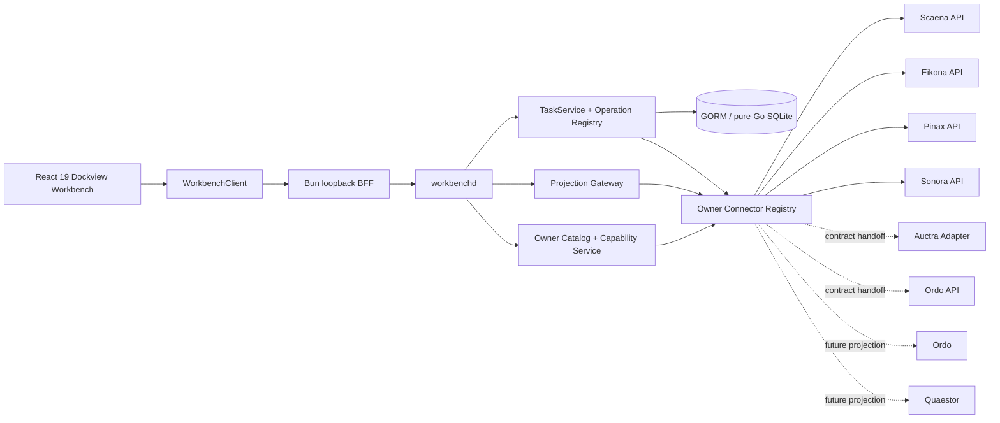
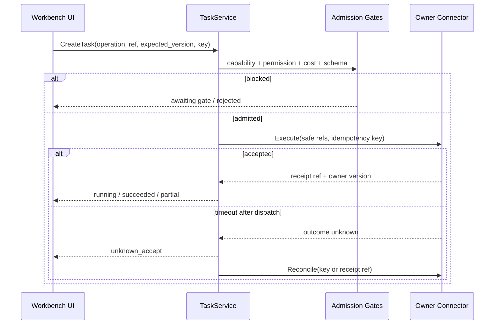

# Workbench 真实 Owner 后端集成设计

## 1. 设计原则

1. **Owner 仍是权威**：Workbench 只保存 task metadata、safe refs、event index 和 receipt ref，不复制 canonical domain state。
2. **服务端组合**：浏览器只连接 Bun BFF；多 owner 认证、contract negotiation、timeout、redaction 和 cursor 由 `workbenchd` 负责。
3. **读写分离**：读取走 owner typed projection；写入统一走 Workbench Operation registry 和 Task 状态机。
4. **能力先于界面**：UI 动作可用性只来自 capability，不根据按钮所在页面、缓存数据或 HTTP 200 自行猜测。
5. **原生类型不丢失**：共享信封只统一 identity、health、ref、version、event、gate 和 error；领域 payload 使用版本化 typed projection，不压成不透明 `map`。
6. **失败关闭**：owner 未配置、不可达、schema 不兼容或权限不足时，保留 Workbench shell，但关闭相关读取或 mutation。

## 2. 总体架构



Workbench 不让浏览器维护多个 owner session。Scaena 聚合的短剧生产工作流继续只连接 Scaena facade，不让浏览器再直连 Ordo、Auctra、Eikona 和 Sonora 拼装一条 production mutation。

Provider discovery、schema digest、event cursor、typed mutation、receipt/status、reconcile、cancel 与 partial child 的字段级冻结见 `details/owner-provider-receipt-event-contract-freeze.md`。该文件同时定义 Provider Ready 与 Workbench Consumer Done 的交接边界；Provider 未交付可生成合同、SDK 和真实证据时，Workbench 不得从本设计推断 capability 已可用。

## 3. Public Contract

新增 additive `workbench.owner.v1alpha1.WorkbenchOwnerService`，并在 REST、gRPC、JSON-RPC、JSON Schema 与 `@yeisme/workbench-task-sdk` 中同步投影：

| RPC | REST | 用途 |
| --- | --- | --- |
| `ListOwners` | `GET /v1alpha1/owners` | 列出已配置 owner、版本、readiness 与健康摘要。 |
| `GetOwnerCapabilities` | `GET /v1alpha1/owners/{ownerId}/capabilities` | 获取 capability、权限要求、mutation gate 与 schema version。 |
| `ListOwnerProjects` | `GET /v1alpha1/owners/{ownerId}/projects` | 返回 path-free 项目摘要与 opaque project ref。 |
| `GetOwnerProject` | `GET /v1alpha1/owners/{ownerId}/projects/{projectRef}` | 返回项目详情和可用 projection links。 |
| `ListOwnerResources` | `GET /v1alpha1/owners/{ownerId}/projects/{projectRef}/resources` | 按 `kind`、cursor、filter 读取 typed resource summary。 |
| `GetOwnerResource` | `GET /v1alpha1/owners/{ownerId}/resources/{resourceRef}` | 显式读取一个安全 typed projection。 |
| `WatchOwnerEvents` | `GET /v1alpha1/owners/{ownerId}/events` | 以 Workbench SSE 信封转发安全 owner event。 |
| `GetOwnerDiagnostics` | `GET /v1alpha1/owners/{ownerId}/diagnostics` | 返回脱敏 health、版本、contract mismatch 和修复动作。 |
| `GetOwnerOperation` / `ListOwnerOperations` | `GET /v1alpha1/owners/{ownerId}/operations...` | 返回批准 operation descriptor、schema digest 与 capability。 |
| `GetOwnerReceipt` | `GET /v1alpha1/owners/{ownerId}/receipts/{receiptRef}` | 返回 safe receipt projection。 |
| `GetOwnerOperationStatus` | `GET /v1alpha1/owners/{ownerId}/operations/{operationRef}/status` | 返回 canonical safe status projection。 |

`FindOwnerReceipt`、`ReconcileOwnerOperation` 与 `CancelOwnerOperation` 只作为 Task/Daily internal typed command 暴露，不进入浏览器可直接调用的 Owner client。SDK 新增 `WorkbenchOwnerClient`，并以 `WorkbenchClient.owner` 暴露只读 descriptor/receipt/status；现有 `task` 与 `design` client 不重命名。JSON-RPC method 使用 `owner.list`、`owner.capabilities.get`、`owner.projects.list`、`owner.project.get`、`owner.resources.list`、`owner.resource.get`、`owner.events.watch`、`owner.diagnostics.get` 以及对应只读 operation/receipt/status method；mutation/reconcile/cancel notification 一律拒绝。

### 3.1 共享信封

共享字段只包含：

```text
owner_id
owner_kind
contract_id
contract_version
resource_ref
resource_kind
resource_version
project_ref?
display_name
status
updated_at
freshness
links[]
typed_projection
```

`typed_projection` 必须由注册的 `projection_type` 与 JSON Schema 校验，例如 `scaena.output.v1`、`eikona.asset.v1`、`pinax.note_card.v1`、`sonora.strategy_comparison.v1`。未知 optional 字段可忽略；未知 required contract 或类型进入 `contract_mismatch`，不得把未经校验的 raw owner payload返回浏览器。

### 3.2 Opaque ref

- Workbench 对 project/resource 使用 `base64url(sha256(ownerId + NUL + canonicalOwnerRef))` 作为浏览器可见 ref。
- connector 在进程内保存短期 reverse mapping；必要时通过重新列举匹配 owner ref，不把私有路径持久化。
- API 不接受请求级 path、base URL、host、provider credential 或任意 owner ref。
- 可公开的 owner URI（如 `eikona://`、`sonora://`、`scaena://`）只能作为 sanitized metadata 返回，不能转成本机路径。

## 4. Capability 与 readiness

每个 capability 返回：

```text
capability_id
mode: read | observe | mutate
state: available | degraded | offline | needs_contract | contract_mismatch | permission_required
contract_id
contract_version
operation_type?
requires_permission
requires_cost_confirmation
supports_idempotency
supports_expected_version
supports_events
reason_code?
diagnostic_action?
```

`degraded` 仅表示仍可安全读取但存在 stale cursor、部分 projection 或次要依赖失败；不能把 mutation 的未知安全性降级成 `degraded`。`diagnostic_action` 只能是安全命令模板或文档引用，不能包含 token、路径或任意 shell 参数。

Owner support maturity 用于描述场景覆盖深度，不是 production capability promotion 状态。Production promotion 仍统一使用 `needs_contract -> contract_validated -> integration_ready -> canary -> available`；support maturity 不得直接映射为 `available`。

| Readiness | 条件 |
| --- | --- |
| `exploratory` | 只有 CLI/schema 草案或 fixture；Workbench 仅展示 catalog。 |
| `first_support` | 真实 API、schema、auth、health、projection、integration evidence 可用；高风险 mutation 可保持关闭。 |
| `mature` | 读写 parity、事件恢复、reconcile、负载与安全门禁均有证据。 |

## 5. Owner 接入矩阵

| Owner | 当前真实合同 | 首个 Workbench projection | Mutation 路径 | 当前证据成熟度 | 目标成熟度 |
| --- | --- | --- | --- | --- | --- |
| Scaena | `/api/v1` OpenAPI、session、project、scene/shot、run/output、review、delivery、events | ProductionGraph board、run/output inspector、review、lineage、delivery | 仅 Scaena Operation；`Idempotency-Key`、owner version、permission/cost gate | `exploratory`，待真实 provider/consumer evidence | `first_support` |
| Eikona | `/api/v1/projects|runs|assets|library|workflows`、run events、`eikona://` | visual run、candidate asset、lineage、library、assessment | generate/correction 经 Eikona Operation；默认 model 保持 `openai/gpt-5.4-image-2` | `exploratory`，仅 local read baseline | `first_support` |
| Pinax | `/v1/capabilities|projects|notes|folders|inbox|drafts|memory`、RPC | vault/project board、note card、memory summary | 默认只读；write 必须 owner `--allow-write`、preview、approval/snapshot gate | `exploratory`，待真实 provider/consumer evidence | `first_support` |
| Sonora | `/api/v1/voice-models|strategy-*|render-estimates`、Go SDK、`sonora.voice_event.v1` | cast/strategy、estimate、rights/review status | 当前只开放 safe planning；真实 render 等 owner audio job 合同 | `exploratory`，待真实 provider/consumer evidence | `first_support` |
| Auctra | Operation Catalog、CommandEnvelope、events/parity tests；生产 adapter 未晋级 | project/text unit、run evidence、review queue、Story World | adapter promotion 前全部 `needs_contract` | `exploratory` | `first_support` |
| Ordo | `/api/v1` resource groups、SSE、worker protocol 文档 | Writers' Room run、assignment、review、handoff、worker health | creator/admin scope 分离；先完成机器可校验 OpenAPI/SDK | `exploratory` | `first_support` |
| Ordo | CLI、protocol、run/event/receipt/evidence | team run、approval、receipt | owner 服务投影落地前 `needs_contract` | `exploratory` | `first_support` |
| Quaestor | CLI、structured asset 草案、future event | thesis、evidence ledger、experiment、report | owner capability/API 落地前 `needs_contract` | `exploratory` | `first_support` |

外部媒体库（用户自选，例如 Jellyfin/Immich/NAS/对象存储；MediaHub 产品已于 2026-08-22 退役）、Capsa、未来获批的通信桥与 MediaOps 在 P0 只通过 `ListOwners` 返回 readiness。Workbench 不直接承接通信 provider payload、Capsa encrypted object、MediaOps 平台 payload 或 owner 私有同步状态。

## 6. Connector 结构

每个 connector 实现统一生命周期接口，但保留独立 typed mapper：

```text
Handshake(ctx) -> identity + contract versions
Capabilities(ctx) -> declared capability set
ListProjects(ctx, cursor) -> sanitized project projection
ListResources(ctx, project, kind, cursor) -> typed projection
GetResource(ctx, ref) -> typed projection
WatchEvents(ctx, cursor) -> owner event stream
Execute(ctx, operation) -> owner receipt / status
Reconcile(ctx, request key or receipt ref) -> authoritative outcome
```

connector 必须配置：allow-listed base URL、owner kind、timeout、response byte limit、redirect policy、auth source ref、supported contract range。配置来自启动参数或用户级配置；浏览器和 owner payload 均不能修改连接目标。

### 6.1 连接策略

- 默认 loopback；非 loopback owner 必须显式 allow-list，并通过独立 OpenSpec 安全评审。
- 拒绝 URL userinfo、动态 redirect、私网地址漂移、错误 Content-Type、超大响应和 schema drift。
- token 从用户级 token file/secret store 读取，只在 server-to-server 请求注入。
- owner 原始响应不进入日志、事件、数据库或 integration evidence。
- P0 read timeout 默认 3 秒，explicit resource read 10 秒，event stream 使用 heartbeat 与 idle timeout；具体值可配置但有上限。

## 7. Mutation、gate 与恢复

UI 不直接调用 owner mutation endpoint。动作先解析到 registry `operation_type`：



- `unknown_accept` 永不自动重新提交。
- cancel 只有 owner 明确确认后才进入 `cancelled`；否则保留 `cancel_requested` 或 `unknown_accept`。
- partial 保留成功 artifact/receipt，只允许按 owner 声明的 repair/retry operation 处理未完成部分。
- Scaena production mutation 始终走 Scaena facade；Workbench 不编排 Auctra→Ordo→Eikona→Sonora 的浏览器端 saga。
- Pinax write、voice clone、真实生成、发布、删除、export 等操作必须保留 owner 的 approval、snapshot、rights、cost 或 permission gate。

## 8. Web 与多 Pane 映射

共享 Panel 类型扩展为 owner-aware：

- `Project Navigator`：跨 owner 项目与绑定关系。
- `Canvas/Board`：按 projection type 渲染 Scaena board、Pinax board、Eikona candidate grid 等。
- `Inspector`：资源字段、版本、owner、freshness、capability 与允许动作。
- `Timeline`：合并 Workbench Task events 与 owner public events，保持来源标签和各自 cursor。
- `Evidence/Lineage`：只展示 safe refs、digest、decision、receipt 和公开 lineage。
- `Review`：owner typed review projection；decision 统一创建 Task。
- `Diagnostics`：health、contract、permission、staleness 和真实修复命令。

Tab 合并、split、floating、layout persistence 只保存 `ownerId`、opaque refs 和 panel parameters；不保存 token、正文、raw payload 或 owner 私有 URI。关闭或恢复布局时，如果 capability 已失效，Panel 转为 offline/needs-contract 状态而不是抛弃整个布局。

## 9. 查询、缓存与一致性

- TanStack Query key 必须包含 `ownerId`、opaque ref、projection type 和 contract version。
- project/resource 列表只做短期内存缓存；敏感正文、note body、prompt body、audio/image bytes 不持久化到 localStorage。
- event cursor 按 owner/project/resource 分离；Workbench SSE 额外提供自身单调 sequence，不宣称跨 owner 全局 exactly-once。
- owner event 只更新对应 query 或 task；不得用事件 payload直接覆盖未校验 typed projection。
- 显示 `observed_at`、`owner_updated_at` 与 `freshness`，offline 时不得把缓存标为 current。

## 10. Owner 侧 handoff

本 change 只拥有 Workbench 代码。需要 owner 新增或晋级合同的工作必须在对应子项目建立独立 OpenSpec：

- Auctra：生产 HTTP/RPC adapter、capability discovery、auth、idempotency、events 与 schema export。
- Ordo：OpenAPI/SDK 生成、creator/admin scope、SSE cursor 与 reconcile parity。
- Ordo：只读 service projection、run/approval/event/receipt schema 和 local session auth。
- Quaestor：capability catalog、thesis/evidence/experiment/report projection 与 event schema。
- 其他 owner：只有在真实用例和稳定合同成立后加入 connector，不通过通用 shell 执行 CLI。

## 11. 风险与取舍

| 风险 | 处理 |
| --- | --- |
| 统一层吞掉领域语义 | 共享信封 + 注册 typed projection，不使用任意 raw JSON。 |
| 多 owner 版本漂移 | handshake、contract range、schema validation、`contract_mismatch`。 |
| Web 获得 token 或私有路径 | Bun BFF 注入 token、opaque ref、DTO allow-list、日志脱敏。 |
| mutation 超时导致重复副作用 | Task idempotency、owner receipt、`unknown_accept`、reconcile。 |
| 接口未完成却展示“可用” | capability 是唯一动作事实源，未晋级保持 `needs_contract`。 |
| 多事件流排序被误解 | 每 owner cursor + Workbench sequence，UI 标识来源，不承诺全局因果顺序。 |
| 首版范围过大 | P0 只实现四个真实 read projection 和有限 safe mutation；其余只做 catalog/handoff。 |

## 12. 发布阶段

1. **Phase A — Contract spine**：OwnerService、SDK、catalog、capability、opaque ref、diagnostics、conformance。
2. **Phase B — P0 reads**：Scaena、Eikona、Pinax、Sonora 真实只读 projection 与 event。
3. **Phase C — Safe actions**：将已具备 owner contract 的 mutation 注册到 TaskService，完成 gates、receipt 和 reconcile。
4. **Phase D — Workspace composition**：owner-aware Panels、Project Navigator、Timeline、Inspector、Diagnostics、布局恢复。
5. **Phase E — Owner promotions**：按独立 OpenSpec 晋级 Auctra、Ordo、Ordo、Quaestor。
