# Owner Provider Event、Mutation、Receipt 与 Reconcile 合同冻结

## 1. 两层合同边界

Owner 集成分为两层，不能混为同一个泛型 payload：

1. **Provider handoff contract**：由 Eikona、Scaena、Pinax 等 Owner 在自己的仓库发布 OpenAPI/proto/SDK，定义 discovery、safe projection、events、typed mutation、receipt/status/reconcile/cancel。
2. **Workbench consumer contract**：`workbench.owner.v0.1` / `workbench.owner.v1alpha1`，向 Workbench Web/SDK 暴露 catalog、safe projection、capability、event、operation/receipt projection；不暴露 provider credential、base URL、raw response 或私有引用。

Workbench 不要求所有 Owner 使用同一内部数据模型，但每个 Provider SDK 必须满足本文件的语义字段和故障行为。Connector 只能通过批准 SDK/typed adapter映射，不能让 Panel直接调用 provider endpoint。

## 2. Provider Discovery

`OwnerProviderDescriptor` 必填：

| Field | 说明 |
| --- | --- |
| `providerId` | 稳定 owner id，如 `eikona` |
| `instanceRef` | opaque instance identity，不是 URL |
| `contractId` / `contractVersion` | provider发布合同 |
| `schemaDigest` / `sdkVersion` | machine contract与批准SDK版本 |
| `capabilities` | typed capability descriptors |
| `eventSources` | source id、cursor version、retention/heartbeat limits |
| `auth` | workload audience、required scopes/actions、token transport |
| `limits` | body/page/concurrency/rate/idempotency/receipt retention |
| `health` / `readiness` | provider本身状态与safe diagnostic |
| `observedAt` | RFC3339Nano |

`OwnerProviderCapability` 必填：capabilityId、state、readOnly、projectionTypes、operationTypes、input/output schema refs+digests、requiredAction、costPolicy、supportsExpectedVersion/idempotency/events/receipt/status/reconcile/cancel、eventSource、limits、diagnostic code。

Capability state 使用 `available/degraded/offline/needs_contract/contract_mismatch/permission_required/unavailable`；存在 endpoint、CLI command 或 fixture 不能推断 `available`。Mutation capability 缺 receipt/status/reconcile 任一项时必须 `needs_contract`。

## 3. Provider Safe Projection

Provider project/resource projection 必须包含：provider/instance、project/resource opaque ref、projectionType/version、sourceVersion、projectionDigest、status/freshness、safe title/summary、rights/review/lineage/evidence refs、allowed operation types、occurredAt/observedAt、tombstone。

禁止字段：private filesystem path、raw prompt/provider request/response、artifact bytes、credential/token/grant、download endpoint secret、任意 command、任意 metadata map。公开 URI 仅在 projection type明确允许时返回，并校验 scheme/origin/digest/expiry。

Projection ref 是 provider公开 opaque ref；Workbench 可再包装 owner-bound ref，不能把 ref 当 path/URL解析。

## 4. Provider Event Contract

`OwnerProviderEvent` 字段：contractId/version、eventId、eventType、source、cursor、providerId、instanceRef、projectRef?、resourceRef?、receiptRef?、sourceVersion?、projectionDigest?、occurredAt、observedAt、safeSummary、traceRef?。

事件只用于 invalidation/projection推进，不能携带 raw resource/receipt body。批准 event types：

- projection：`project.upserted/tombstoned`、`resource.upserted/stale/tombstoned`；
- operation：`operation.accepted/running/progress/terminal`；
- receipt：`receipt.updated/reconciled/cancel_acknowledged`；
- control：`stream.heartbeat/resync_required/server_draining`。

### 4.1 Cursor 语义

- cursor 只在单一 `source` 内单调/可比较，不声称跨 source 全局顺序。
- client 使用 `(source, cursor, eventId)` 去重；provider 至少一次传输。
- resume 从最后已确认 cursor 之后返回；重复允许，已提交事件不得跳过。
- cursor 早于 retention floor 返回 typed `resync_required` + snapshot/relist hint，不返回空成功。
- snapshot/rebuild 使用 `snapshot fence cursor`，流程为 list snapshot→apply→tail after fence。
- heartbeat 不推进业务 cursor；slow consumer/server drain 返回 typed close/retry hint。
- event retention、receipt retention 和 idempotency window 必须在 discovery 中声明，receipt retention不得短于idempotency window。

## 5. Typed Mutation Contract

每个 mutation 是独立 versioned operation type和独立 input/output schema。Provider SDK 必须生成 typed method；不得只提供 `map<string, any>`、任意 URL、shell command 或未校验 JSON blob。

通用 dispatch metadata：

| Field | 规则 |
| --- | --- |
| `operationType` | versioned allowlist，如 `eikona.generation.submit.v1` |
| `projectRef` / `resourceRefs` | provider opaque refs，bounded |
| `expectedSourceVersion` | mutation 合同要求时必填 |
| `idempotencyKey` | 1–128 safe chars；provider不回显 |
| `requestDigest` | Workbench canonical typed input digest |
| `correlationRef` / `taskRef` | safe Workbench refs |
| typed input | operation-specific generated message |

Actor、tenant、workspace、delegation、audience、actions 和 expiry 来自经过验证的 workload token/claims，不接受 request body中的 `principalRef`、role、approved、allowedActions 或 bearer。

Provider 在发送外部副作用前持久化 dispatch intent/idempotency record；同 key+digest replay返回同 receipt，同 key不同 digest返回 idempotency conflict。

## 6. Receipt 模型

`OwnerOperationReceipt`：

| Field | 说明 |
| --- | --- |
| `receiptRef` | provider opaque immutable identity |
| `providerId` / `instanceRef` | receipt authority |
| `operationType` | versioned operation |
| `projectRef` / `resourceRefs` | safe affected refs |
| `version` | receipt CAS/version |
| `state` | stable state enum |
| `idempotencyRef` | key 的不可逆 digest/ref，不返回原 key |
| `requestDigest` | dispatch typed input digest |
| `statusRef` | canonical status query ref |
| `expectedSourceVersion` / `observedSourceVersion` | version evidence |
| `progressBucket` | `none/queued/running/near_complete/complete`，非任意百分比 |
| `outputRefs` / `evidenceRefs` | safe refs only |
| `children` | bounded child receipt summaries |
| `diagnostic` | stable safe code/summary/retryAfter? |
| `acceptedAt/updatedAt/terminalAt` | RFC3339Nano |

Receipt states：`accepted/running/succeeded/rejected/failed/unknown/cancel_requested/cancelled/partial`。

- `accepted` 证明 provider 持久化接收，不证明业务成功。
- `unknown` 表示 provider已知 receipt 但 canonical outcome 暂不可确认；Workbench transport timeout且无receipt时使用 Task `unknown_accept`。
- `partial` 必须携带每个 child state/receipt；成功 child不可因失败重试而重复执行。
- terminal states：succeeded/rejected/failed/cancelled；partial 只有所有unknown child已收敛后才可视为稳定终态。

`OwnerChildReceipt`：childRef、resourceRef?、state、version、receiptRef/statusRef、idempotencyRef、output/evidence refs、diagnostic、updatedAt。最多100 children；更多使用分页child status API。

## 7. Receipt Lookup 和 Status

Provider 必须支持：

1. `GetReceipt(receiptRef)`；
2. `FindReceiptByIdempotency(operationType, projectRef, idempotencyKey)`；
3. `GetOperationStatus(statusRef|receiptRef)`；
4. child receipt/status pagination。

`FindReceiptByIdempotency` 是 timeout-after-send 且 response丢失时的关键恢复路径。它只在同一 verified actor/delegation scope内可查询，不在日志/evidence回显 key。

Status response 返回同一 receipt identity/version/state与safe refs，不能创建新 operation或推进副作用。receipt/status identity mismatch返回 typed `receipt_mismatch`。

## 8. Reconcile 语义

`ReconcileOperation` 输入：receiptRef或 operationType+projectRef+idempotencyKey、expectedReceiptVersion?、correlationRef。Reconcile 必须：

- 只读取 provider canonical operation truth和必要的safe projections；
- 返回最新 receipt/status，不创建新 idempotency key、不重放 mutation；
- 检测 provider receipt与Task operation/project/request digest mismatch；
- 对 terminal output更新safe projection/event；
- 对仍未知状态返回 `unknown` + nextPollAfter，不伪造failed或succeeded。

Workbench TaskService 对 reconcile 结果使用 expected task/attempt version推进状态；并发 reconcile replay必须幂等。

## 9. Cancel 语义

`RequestCancel` 输入：receiptRef、expectedReceiptVersion、cancelIdempotencyKey、reasonCode。返回 receipt：

- provider 接受请求但尚未确认停止：`cancel_requested`；
- provider确认未执行或已停止且不会产生新副作用：`cancelled`；
- operation已terminal：返回原terminal receipt + `already_terminal` diagnostic；
- 不支持取消：typed `cancel_not_supported`，不能标cancelled。

Cancel 是独立 idempotent command。网络超时后先 Get/Find/Reconcile receipt；禁止自动创建第二个 cancel key或把请求已发送等同取消成功。

## 10. Delegation 和安全

Provider workload token至少绑定：issuer、subject/actor、tenant、workspace/project scope、audience=`providerId`、allowed operation actions、delegationRef、issuedAt/expiry、jti/session revision。Provider验证签名、audience、expiry、tenant/project/object scope和revocation。

- 浏览器 bearer/cookie/CSRF/token不得转发给 Owner。
- Workbench server从R1获取短期owner-audience delegation；credential只存在server context/secret store。
- approval/cost gate refs可以作为audit correlation，但 Provider仍按自身policy和claims授权，不信任body `approved=true`。
- revoke 后禁止新dispatch；已接受operation只允许status/reconcile/cancel。

## 11. Stable Provider Errors

必须提供 machine code：`authentication_required`、`permission_denied`、`not_found`、`invalid_argument`、`version_conflict`、`idempotency_conflict`、`contract_mismatch`、`needs_contract`、`rate_limited`、`owner_offline`、`receipt_not_found`、`receipt_mismatch`、`cancel_not_supported`、`already_terminal`、`cost_limit_exceeded`、`rights_blocked`、`resync_required`、`unavailable`。

Provider SDK返回 typed error code/retryAfter/traceRef，不要求 Workbench解析raw HTTP body或message。Unknown provider error映射为 `owner_offline/unavailable` safe diagnostic，不能直接返回浏览器。

## 12. WorkbenchOwnerService 扩展

现有 read methods 保留并生成正式 `workbench.owner.v0.1` contract：ListOwners、GetOwnerCapabilities、List/GetProjects、List/GetResources、WatchOwnerEvents、GetDiagnostics。

新增 consumer-facing methods：

| Method | 作用 |
| --- | --- |
| `GetOwnerOperation` / `ListOwnerOperations` | 返回已批准 operation descriptor/schema digest/capability |
| `GetOwnerReceipt` | safe receipt projection |
| `FindOwnerReceipt` | 仅 server/task internal，按 Task safe idempotency ref查找 |
| `GetOwnerOperationStatus` | safe status projection |
| `ReconcileOwnerOperation` | Task/internal typed reconcile command |
| `CancelOwnerOperation` | Task/internal typed cancel command |

Browser SDK默认只开放 descriptor、receipt/status read；mutation/reconcile/cancel 由 `WorkbenchTaskClient` 和 Daily Operations source command触发，不能让 Panel绕过 Task gates直调 Owner method。

## 13. Eikona 首批 operation freeze

| Operation | Required action | Expected version | Cost | Receipt/reconcile/cancel |
| --- | --- | --- | --- | --- |
| `eikona.generation.submit.v1` | `eikona.generation.submit` | project/workflow version | required estimate/limit | receipt/status/reconcile/cancel |
| `eikona.review.decide.v1` | `eikona.review.decide` | asset/review version | no generation cost | receipt/status/reconcile；cancel通常不支持 |
| `eikona.handoff.prepare.v1` | `eikona.handoff.prepare` | asset/handoff version | no hidden export | parent/child receipt/reconcile |

Generation input只包含 projectRef、workflow/template safe ref、promptVersionRef（不含raw prompt）、inputAssetRefs、approved model id（默认 `openai/gpt-5.4-image-2`）、bounded resource/cost limits。Output只返回 run/asset/receipt/evidence safe refs。

Review input：assetRef、expectedReviewVersion、decision enum、bounded reason/evidence refs。Handoff input：assetRefs、expected versions、destination descriptor id、manifest checksum；不接受 dynamic URL/grant/path。

## 14. Provider/Consumer 对接顺序

```mermaid
flowchart LR
  P1[Provider OpenSpec + schemas] --> P2[Provider generated SDK]
  P2 --> P3[Provider disposable contract tests]
  P3 --> C1[Workbench descriptor/digest validation]
  C1 --> C2[Read + event canary]
  C2 --> C3[R1 delegated mutation]
  C3 --> C4[Receipt/status/reconcile/cancel drills]
  C4 --> C5[Daily Ops + Delivery canary]
  C5 --> G[Capability promotion receipt]
```



Provider ready 必须交付：contract/version/schema digest、generated SDK、disposable project、no-cost/dry-run或成本上限、event retention、idempotency/receipt retention、kill switch、rollback、security/evidence。

Consumer done 必须证明：digest drift/offline/revoke/gap/duplicate/timeout-after-send/receipt loss/mismatch/cancel/partial/rollback，且browser network只到BFF。

## 15. Contract verification

Provider owner repository：

```bash
task owner-contract:test
task owner-receipt:test
task owner-event:test
task owner-canary:prepare
```

Workbench consumer：

```bash
task owner:contract:test
task test:owner-transport:component
task test:owner-eikona-read-canary
task test:owner-eikona-mutation-canary
```

验证覆盖 generated clean、SDK compile、discovery/digest、typed operation schemas、idempotency replay/drift、receipt lookup/status/reconcile/cancel、event resume/gap、delegation/revoke、raw payload/path/token/grant redaction和六件套 evidence。
