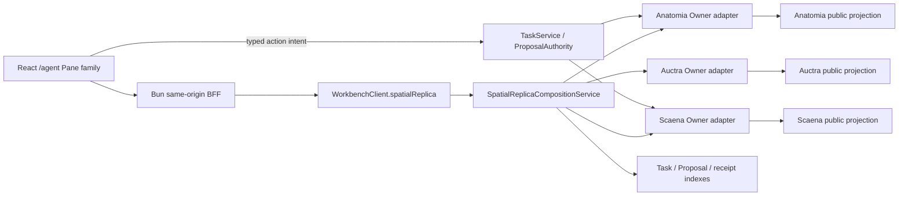
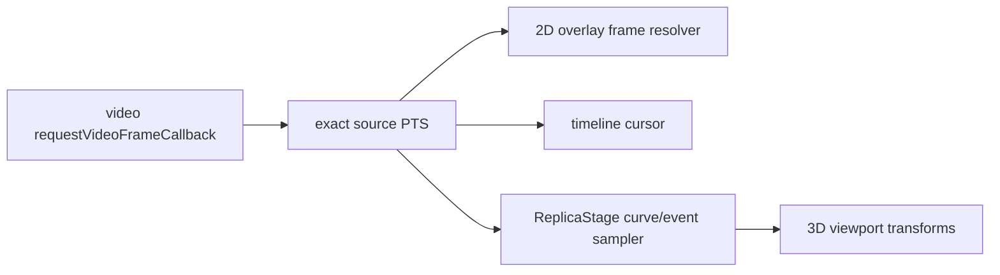

## Context

Workbench 已有单一 `/agent` shell、versioned Pane registry、TaskService、ProposalAuthority、owner connector、safe projection、server capability、responsive Sheet 和 Spatial Focus 约束。它可以组合 owner 的安全状态，但不能保存或重解释 Anatomia evidence、Auctra screenplay、Scaena storyboard/ReplicaStage，也不能让浏览器直连 owner。

空间复刻审阅同时需要四类时间/空间数据：

1. Anatomia source media、grayscale/depth/mask/flow/skeleton/camera evidence；
2. Scaena SceneGEO/ReplicaStage、motion/constraint/event、review/freeze 和 derivative refs；
3. optional Auctra screenplay safe projection；
4. Workbench Task/owner receipt、permission、availability 和 recovery。

这些 owner 不共享数据库或事务。Workbench 必须把它们组合成一个 exact、可降级、可重建的 read projection，并让所有 mutation 回到对应 owner。Open Design native CLI 当前不可用，只有 HTTP wrapper；本设计使用既有 Agent-first 产品、UI、接口和 token system 作为唯一视觉/交互真源。

## Goals / Non-Goals

**Goals:**

- 在 `/agent` 单一主壳中提供 episode/shot、source/evidence、3D stage、timeline、inquiry、owner panels 和 receipt 的统一审阅体验。
- 通过 `workbench.spatial_replica_workspace_projection.v1alpha1` exact-compose 多 owner safe refs，而不保存第四套 replica state。
- 让 VFR/cut/gap 源视频、二维 overlays、3D camera/actors 和 timeline 在同一 PTS 语义下同步。
- 让用户明确看见 Evidence、Candidate、Production Override、Frozen、unknown、scale/claim 和 quality/currentness。
- 让 evidence correction、stage edit、completion selection、review/freeze 和 reconcile 走 typed owner action + TaskService/ProposalAuthority。
- 在桌面提供专业工作区，在窄屏提供完整审阅/批准的等价路径，不把手机变成缩小的 3D IDE。
- 为 keyboard、screen reader、200% zoom、reduced motion、WebGL loss、large artifact 和 slow/offline owner 提供可测试恢复。

**Non-Goals:**

- 不实现 Anatomia/Scaena/Auctra 的 canonical domain logic、Provider runtime、模型路由或生成。
- 不保存 screenplay body、storyboard graph、ReplicaStage geometry canonical copy、dense evidence 或 artifact blob。
- 不新增并列 Replica Studio、第二 composer、第二 Task/Proposal/Pane registry 或 browser owner client。
- 不做自由 mesh sculpt、DCC 替代、手机 3D production edit、replica video 或 ProductionGraph promotion。
- 不以 mock、截图或 WebGL 可渲染宣称 owner/runtime/production ready。

## Architecture



Browser 只访问 same-origin BFF。BFF 只做代理、CSRF、preview proxy、body/timeout/header；Go composition service 负责 scope、contract、version、freshness、closed join 和 action descriptor。Owner adapters 只访问批准的 public APIs/structured bridges。

## Decisions

### 1. 空间复刻是注册 Pane family，不是新主壳

Additive Pane types：

| Pane type | Responsibility | Preferred desktop width |
| --- | --- | --- |
| `agent.spatial-replica.v1` | episode/shot、player、overlays、3D viewport、timeline | 560–720px |
| `agent.spatial-replica-inspector.v1` | selection、provenance、quality、inquiry、typed edit/review actions | 360–420px |
| `agent.auctra-screenplay.v1` | canonical screenplay safe projection/deep link/actions | 400–480px |
| `agent.scaena-storyboard.v1` | storyboard/SceneGEO/ReplicaStage safe projection/actions | 420–520px |
| `agent.owner-receipts.v1` | Workbench Task + owner receipt timeline/reconcile | 400–480px |

它们全部使用现有 registry、layout reducer、PaneChrome、visible/split limit、focus-return 和 server availability。`agent.spatial-replica.v1` 可进入现有 Spatial Focus contextual layout，但 Agent timeline/composer 和同一 session state 始终保留；mode change 不创建新 event stream 或 remount composer。

在 1440px 普通桌面，主 Replica Pane 可以单独打开并把 Inspector/owner sections 作为内部 Tabs；更宽桌面可把 Inspector、Auctra、Scaena 或 receipts 作为独立 Pane 并排。硬上限仍为 4；达到上限显示 `limit_reached`，不静默替换。

备选方案是 `/replica-studio` 独立 route；拒绝，因为会恢复并列 shell、重复导航/Task/owner状态。

### 2. Composition projection 是可重建 read model，不是 canonical join

`SpatialReplicaWorkspaceProjectionV1` 包含：

- workspace/project/episode/shot safe identity；
- per-owner segment：owner、contract/version/digest、resource refs、readiness、currentness、last-confirmed；
- source playback manifest 和 authorized overlay manifests；
- stage safe scene graph、camera/motion/event summaries 和 derivative refs；
- capture profile、scale tier、claim scope、quality/currentness/limitations；
- Auctra/Scaena panel summaries；
- spatial inquiry capabilities/result refs；
- server-authored `SpatialReplicaActionDescriptorV1[]`，其中复用既有共享 `ActionDescriptorV1` 作为 availability/target Operation/reason/recovery/scope 权威，并附加空间复刻 owner binding；
- owner/Task receipt events and cursor；
- `composition_token`，由 exact segment identities 和 policy/registry digest 计算。

Projection 在查询时或短 TTL 内存 cache 中重建；不写入 canonical DB。Workbench 可以沿用已有 Task/event safe index 和布局 metadata，但不持久化 owner payload、stage elements、screenplay/storyboard body。`composition_token` 只用于发现 UI stale，不是 mutation authority；action 执行时 service 必须重新加载 owner current state。

备选方案是建立 Workbench episode aggregate；拒绝，因为它会成为第四套状态机并要求分布式一致性。

### 3. 多 owner read 使用 exact snapshot tuple 与 per-segment partial

Composition service 为每个 segment 设置独立 deadline、contract range、schema/digest validation 和 safe sanitizer。返回的 snapshot tuple 精确列出：

```text
anatomia attachment/bundle/snapshot/qualification refs
scaena storyboard/scene_geo/replica_stage refs
optional auctra screenplay ref
workbench task/receipt cursor
registry/policy digest
```

一个 owner offline/needs_contract 不会删除其他 current segment。Projection 总状态为 `ready | partial | stale | offline | revoked | needs_contract | permission_required | contract_mismatch`，同时保留每个 segment 的真实状态和 last-confirmed timestamp。

禁止规则：

- 不根据 HTTP 200、endpoint、localStorage 或旧 cache 推断 capability；
- 不把不同时间获取的 owner segment 描述为 atomic distributed snapshot；
- 不在 stale stage 上启用 mutation；
- 不因 Scaena unavailable 推断 Anatomia evidence 错误，反之亦然。

### 4. 浏览器状态严格限于 presentation 与未提交 draft

Browser 可持有：selected episode/shot、exact PTS cursor、overlay toggles/opacity、viewport camera、selected safe ref、expanded tracks、Pane layout、unsent question 和 unsent typed edit draft。

Browser 不持有：owner availability authority、accepted edit、review/freeze state、canonical stage joins、owner expected versions 的可写副本。

未提交 edit draft 只能描述 closed operations：transform/primitive dimension/keyframe/time-warp/constraint/completion selection/review note。它以 basis action descriptor/composition token 标记，留在当前 session memory。提交前必须显示 diff 和 owner；离开 shot/session/Pane 时提示 `discard | stay`。提交后 UI 进入 pending Task，不乐观修改 owner projection；receipt/current projection 到达后清除 draft。

### 5. 所有时间同步使用 owner 提供的 exact PTS map

Browser 使用 `MediaTimeCursorV1`，包含 source PTS、time base、optional frame id/index、segment/cut id 和 wall-clock playback state。Float seconds 只用于显示，不作为 join key。

同步链：



- 播放优先由 `HTMLVideoElement.requestVideoFrameCallback` 驱动；不支持时以 owner frame map + `requestAnimationFrame` 有界降级。
- VFR、cut、gap、missing/invalid frame 必须使用 explicit map；不得按 `time * fps` 猜 frame。
- scrub 先更新本地 preview cursor，再 seek media；video confirmed frame 到达后标记 synchronized。
- 2D overlay、3D stage 和 timeline 的 visible drift 必须不超过一个 source frame；无法确认时显示 `sync_degraded`，不伪造 frame lock。

### 6. Source/evidence player 使用 same-origin media proxy 与独立 layers

Source video、grayscale preview、depth preview、mask/flow/skeleton/camera overlays 由 BFF 授权 preview proxy 提供；浏览器不接收 owner credential、base URL、private path 或 durable signed URL。

Layer contract 包含 kind、media/ref/digest、PTS/frame map、coordinate frame、coverage、invalid regions、opacity/blend recommendation 和 limitations。Numeric depth/evidence 与 colorized preview 分开；UI 不能用 preview 冒充 numeric artifact。

渲染：video 使用 `<video>`；mask/depth/flow/skeleton 通过一个 bounded 2D canvas overlay adapter 组合，React 只管理 layer state，不逐像素重绘组件树。Canvas 同步提供 DOM legend、selected entities 和 textual evidence summary。

### 7. 3D viewport 使用 `three` core 的窄适配层

当前 Web 无 3D engine。实现引入 `three` core，封装为 `ReplicaViewportAdapter`，不把 Three 类型暴露到 SDK、service、Pane props 或 tests。React 负责 Pane/controls/selection/DOM state；adapter 负责 scene graph、camera、picking、render loop 和 resource disposal。

选择理由：

- 需要真正的 perspective camera、frustum、proxy geometry、skeleton/capsule、depth ordering 和 GLB preview；Pixi/React Flow 只能表达 2D。
- 媒体驱动的 imperative frame update不应导致 React 每帧 commit。
- 单一 core dependency 比同时引入 R3F/Drei 更小，P1 primitives/GLB loader 足够；若 implementation evidence 证明维护成本不可接受，必须在同一 contract 下替换 adapter，而不是把 Three 类型泄漏到产品合同。

Viewport 显示：planes、boxes、convex proxies、anchors、unknown volumes、actor skeleton/capsules、prop proxies、primary camera/frustum、source/retarget curves、contact/occlusion events、selected completion ghost。颜色只表达语义状态；unknown、evidence、candidate、override、frozen 有形状/线型/legend 辅助，不只靠颜色。

WebGL context loss、artifact decode error 或 capability unsupported 时，保留 source player、timeline 和 accessible object list，Viewport 显示可恢复 unavailable，而不是空黑 canvas。

### 8. Timeline 是精确 PTS 的虚拟化 track view

Timeline track family：source cuts/gaps、camera、actor root/joints、retarget keyframes、contact、occlusion、enter/exit、source audio ref、quality/findings/receipts。

使用现有 `@tanstack/react-virtual` 虚拟化 rows，CSS/SVG/canvas 只负责 bounded visible window。事件 identity 使用 owner safe ref + track/event id + exact PTS range。Zoom/pan/selection 不修改 owner state。

Keyboard：Left/Right 按最小可用 frame map移动；Shift 跳 event；Home/End 到 shot 范围；Enter 打开 Inspector；Space 播放/暂停（焦点在 text input 时除外）。每个 event 都有 DOM row/list 等价物。

### 9. Inspector 固定四层真相和 claim ladder

Inspector 顶层 segment：

1. `Evidence`：Anatomia observed pass、coverage、unknown、uncertainty；
2. `Candidate`：model/DCC completion or inference，未接受；
3. `Production Override`：Scaena explicit correction/selection；
4. `Frozen`：exact current approved/frozen stage or derivative receipt。

同一 selected entity 可并列 source vs stage vs override diff。Inspector 必须显示 capture profile、scale tier、metric claim allowed、quality profile/results、currentness、rights/permission、limitations 和 evidence/receipt refs。禁止全局 `replica_complete`。

### 10. Owner actions 只使用 server-authored descriptors

Workbench 已有共享 `ActionDescriptorV1`，其 `actionId`、`targetOperationType`、`availability`、reason/recovery、descriptor revision 与 tenant/workspace scope 保持原义、零重类型。本 change additive 新增 `SpatialReplicaActionDescriptorV1`：它内嵌既有 descriptor，并提供 canonical owner、target ref、expected owner version、required capability、closed input schema、confirmation、idempotency、expiry、receipt/reconcile binding。空间复刻 wrapper 不得形成第二套 availability 或 permission authority；wrapper 与 base descriptor 任一缺失、stale 或不一致都 fail closed。

Action routing：

| User intent | Owner | Path |
| --- | --- | --- |
| correct mask/pose/camera/scale observation | Anatomia | typed correction proposal/Task |
| revise proxy/keyframe/constraint/retarget | Scaena | typed stage mutation Task |
| select/reject completion | Scaena | human decision Task |
| submit review / approve / request changes / freeze | Scaena | owner review/freeze Task |
| accept an Agent-generated proposal | ProposalAuthority | decide → TaskService |
| ask spatial question | Anatomia | typed inquiry read/compute contract |

Browser 只发送 spatial binding ref、既有 action id/descriptor revision、expected owner/projection revision、closed user inputs 和 idempotency key。Service 重新加载 wrapper 与 base descriptor，并验证 principal/scope/capability/permission/cost/owner versions/currentness。Pending action 禁止同一 logical duplicate；response 不明进入 `unknown_accept`，仅原 attempt reconcile。

Workbench 不把 direct user stage edit先写入自己的 Spatial Draft service；P1 只使用 ephemeral draft，避免 domain state shadow。未来协作 draft 需要独立 user decision/OpenSpec。

### 11. Auctra、Scaena 与 receipt panes 保持独立 owner semantics

`agent.auctra-screenplay.v1`：展示 episode/scene/beat/line safe projection、canonical ref/version/digest、review/currentness 和 approved deep link/action。它不保存 screenplay body，不恢复退役 GUI。

`agent.scaena-storyboard.v1`：展示 storyboard shots、SceneGEO、ReplicaStage revisions、review/freeze/currentness 和 typed actions。它不复制 Scaena production state machine。

`agent.owner-receipts.v1`：按 Workbench task sequence + owner cursor显示 action intent、gate、dispatch、owner receipt、stale/revoked/reconcile。它明确标注 owner/sequence，禁止把不同 owner event声称为全局 exactly-once 顺序。

Pane capability 不就绪时保留 catalog entry 和具体 reason，但无 sealed contract 的 Pane 不打开 stub；已注册 read contract 的 Pane可打开 partial/offline/stale presentation。

### 12. Browser 只建立一个 workspace observation stream

Composition service 把 owner safe events、Task/proposal receipts 和 currentness变化投影到一个 `SpatialReplicaWorkspaceEventV1` cursor stream。Browser 对当前 workspace最多一个 stream；Pane 共享 TanStack Query cache/store，不各自订阅 owner。

每条 event 包含 workspace cursor、source owner、owner cursor/sequence（如果有）、kind、safe refs、freshness/currentness 和 bounded reason。断线使用 opaque cursor catch-up；cursor gap 复用既有 `resync_required` control/error，要求按 snapshot fence重建当前 projection而不清空其他 owner safe cache。

### 13. Spatial inquiry 是 evidence-backed read，不是 Agent hallucination

首批 inquiry：人物/道具位置、相对深度、距离范围、遮挡、相机运动、动作/接触事件、证据缺口和 readiness。Workbench 可以从 Agent composer或 Inspector question presets提交 typed query，但结果必须来自 Anatomia contract并携带 exact Snapshot/bundle、time range、coordinate/unit、confidence/uncertainty、limitations/evidence refs。

回答可建议“创建 owner correction/stage proposal”，但不得直接 mutation。Metric evidence 不足时，UI 明确拒绝米制答案。

### 14. UI Spec 使用 operation-console posture 和三阶段实现

设计方向只使用项目现有 Agent-first dark semantic system：克制、高密度、低饱和、非营销。禁止 hero、KPI 卡墙、厚玻璃、渐变装饰、假实时、假成功和嵌套卡片。

Implementation 顺序：

1. grayscale wireframe：episode rail、source、3D、timeline、inspector/owner panes；
2. design-system pass：现有 tokens、PaneChrome、Radix、lucide、controls；
3. polish：states、focus、responsive、motion、performance，不改变 IA。

详细 layout、component tree、control inventory、responsive substitutions 和 screenshot matrix 固化在 `docs/ui/spatial-replica-review-workspace.md`（wave-0 task 0.3 冻结；字段级合同见 [details/02-contract-freeze.md](./details/02-contract-freeze.md)，capability truth table 见 [details/04-capability-truth-table.md](./details/04-capability-truth-table.md)，fixture/依赖预算见 [details/05-p1-fixture-dependency-budget.md](./details/05-p1-fixture-dependency-budget.md)，基线与 path lease 见 [details/01-baseline-ownership.md](./details/01-baseline-ownership.md)）。

### 15. Responsive/accessibility 不把 WebGL 当唯一界面

| Viewport | Behavior |
| --- | --- |
| `>=1800` | conversation anchor + main Replica Pane + optional Inspector/owner pane；source/3D/timeline 同时可见 |
| `1440–1799` | session rail 可折叠；main Replica Pane 内 Source/3D tabs + timeline，Inspector/owner 作为最多一个辅助 Pane |
| `1024–1439` | conversation 常驻；Replica 作为一个 labelled Sheet，Source/3D/Timeline/Inspector tabs；只读 3D 可用时挂载 |
| `<1024` | 不挂载完整 3D editor；source player、timeline event list、selected object summary、review/approval/reconcile 和 owner deep link |

所有 WebGL objects 有 DOM accessibility mirror；keyboard 能搜索、选择、定位、比较和打开 Inspector。Drag/orbit/resize 有 toolbar/menu/keyboard 等价路径。Dialog/Sheet 定义 focus trap、Escape、scroll lock/restore；desktop complementary Pane 不 trap。200% zoom 无页面级 overflow。

### 16. Performance、resource lifecycle 与 evidence 分层

P1 fixture：单 shot、1–2 actors、scene proxies、camera、10 个 overlay/track groups。Local browser gate：

- confirmed video/overlay/3D/timeline cursor drift ≤ one source frame；
- playback/scrub 不产生 >50ms repeated main-thread long tasks；
- pointer/keyboard selection feedback在100ms内可见；
- WebGL buffers/textures/observers在 Pane close/shot switch/capability off 后释放；
- first 3D frame、frame time、heap/bundle delta记录环境和 p50/p95，不把单机 fixture冒充 production SLO。

Large stage 使用 frustum culling、LOD/simplified proxies、lazy GLB/control artifact、visible track virtualization。若 stage超过 owner-declared browser budget，显示 `view_too_large` + summary/deep link，不静默降采样成错误几何。

### 17. Compatibility 和 rollout 都是 additive/default-off

新 proto/schema/SDK methods、Pane types 和 capability fields additive加入。现有 Agent/Spatial/Panes、routes 和 stable deep links 不移除、不改义。Server capability至少分：projection read、media/viewport、inquiry、Anatomia correction、Scaena stage mutation、review/freeze、owner panels。

每层独立 default-off。Feature off 会卸载 renderer/stream/action capability、保留 conversation和现有 Pane；不删除 Task/receipt/layout。No persistence migration means rollback is capability/config only。

## Risks / Trade-offs

- [多 owner projection 产生“看似一致”的错觉] → exact tuple + per-segment freshness + non-atomic声明，mutation时重新验证。
- [3D renderer 形成第二产品壳] → only registered Pane/Spatial Focus，conversation/composer/session/layout仍由现有 shell拥有。
- [浏览器 local edit 被误认为已提交] → ephemeral draft、visible diff、navigation guard、server receipt前不改 canonical projection。
- [VFR/overlay/3D漂移] → owner PTS map + requestVideoFrameCallback + one-frame gate + `sync_degraded`。
- [WebGL context/device不支持] → source/timeline/DOM object list 保持可用，3D truthful unavailable。
- [Three bundle/resource leak] → narrow adapter、lazy load、dispose tests、bundle/heap evidence；Three types不进入 contract。
- [Pane过多挤压 conversation] → main Pane内部 responsive tabs，existing 1–3/hard 4 limit，`limit_reached` explicit。
- [owner events乱序] → workspace cursor与owner cursor分列，不声称global exactly-once；gap触发 snapshot fence。
- [真实人物动作隐私] → same-origin proxy、project permission、safe refs、no private URLs/paths、screenshot/evidence sentinel tests。
- [Owner contract尚未发布] → catalog/projection显示 `needs_contract`，不以 mock开启；Scaena owner change必须提供 local fixture后才能晋级。

## Migration Plan

1. 冻结 projection/Pane/action/PTS/contracts 和 UI Spec；为所有 owner capability建立 default-off truth table。
2. 新增 Go composition service ports、safe fixture adapters、additive proto/schema/SDK facade 和 one-stream cursor；先只读、无 WebGL/无 mutation。
3. 注册 Pane family 和 grayscale/component states；接入 source player/overlays/timeline，验证 VFR/partial/offline/a11y。
4. 添加 lazy `three` viewport adapter、DOM mirror、resource disposal 和 performance evidence；窄屏保持替代路径。
5. 接入 Inspector/inquiry、Auctra/Scaena/receipt panes；Owner unavailable保持 truthful state。
6. 按 owner 独立开启 Anatomia correction、Scaena stage edit、completion、review/freeze；每个 action具备 expected-version/idempotency/receipt/reconcile。
7. 运行 contract/transport/component/Playwright/security/performance/integration evidence 后，才对 exact-principal local canary开启。

Rollback：逐项关闭 projection/viewport/inquiry/action/owner-panel capability，停止 workspace stream，清理 browser caches/drafts/Three resources，返回普通 `/agent` conversation。保留已存在 Task/proposal/receipt 和 owner canonical state；不执行 destructive migration。

## Open Questions

- Auctra 首批 screenplay Pane可展示到 scene/beat/line 哪一层 safe text，必须以 Auctra 已发布 Service API为准；合同不足时先显示 metadata/deep link。
- Scaena `ReplicaStageWorkspaceProjection` 是否直接包含 browser-budgeted primitive graph，还是 separate safe artifact manifest；Workbench只接受 owner versioned contract，不读取 GLB私有路径。
- 3D viewport是否需要在P1支持外部 GLB candidate side-by-side；默认先显示 frozen/selected derivative和candidate ghost summary，不支持DCC自由编辑。
- Owner event aggregation采用poll+cursor还是server-side long-lived connectors，由现有 owner event能力决定；Browser one-stream contract不变。
