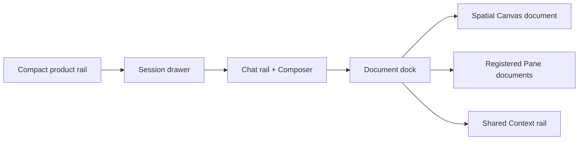
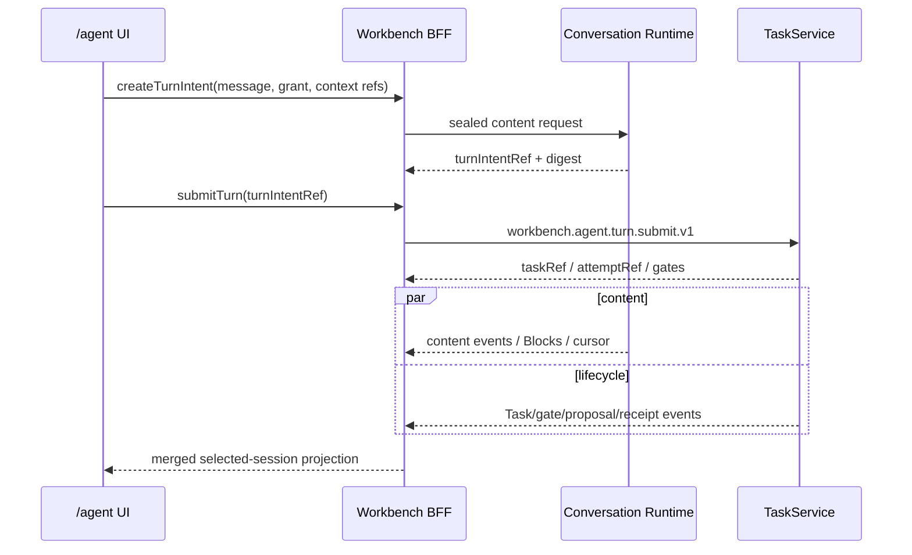

## Context

当前 `/agent` 的真实结构与产品蓝图存在偏差：`AgentRoute` 在 route 层持有 `desktopMode`，并把 `AgentConversationWorkspace` 与 `SpatialSurface` 作为 sibling sections 渲染；conversation 内部又拥有自己的 Pane dock、Context Pack、composer refs 与 session state，Spatial 则拥有独立 camera、selection、Lens、Draft、proposal 和 context rail。两者之间主要只有 Agent output → spatial intent/guard 的单向传递，Canvas selection 无法成为同一 draft 的待附加上下文。

Chat control plane 也未达到用户预期。Composer 把输入压成 `turnIntentDigest`，`WorkbenchAgentClient.submitTurn` 只提交 safe `inputRef`；dev reference adapter 在 permission gate 后产生固定事件脚本，不调用真实模型。`workbench-agent-ui-unification-v1` 明确只改前端组合和文案，因此其归档不能作为真实 Chat/Canvas convergence 的完成证据。

本 change 依赖根设计 `openspec/changes/agent-conversation-runtime-workbench-integration-v1/`。独立 Conversation Runtime、Runtime Plane owner adapter 和 Workbench consumer 分别拥有自己的实现与证据；本 change 只拥有 Workbench Web/BFF/SDK/service consumer、UI composition 和其本地测试。

### Required Capability Ledger

| Capability | 状态 | Canonical owner | Workbench 呈现 | Delivery | Evidence |
| --- | --- | --- | --- | --- | --- |
| 单一自适应 Agent shell | required | Workbench Web | `/agent` | deliver-now | component + Playwright matrix |
| Chat rail + persistent Composer | required | Workbench Web | 左 rail | deliver-now | focus/draft/session tests |
| Canvas/Pane shared document dock | required | Workbench Web layout | 中央 surface | deliver-now | reducer/dock/compat tests |
| 唯一 Context rail | required | Workbench Web composition | 右 rail | deliver-now | selection/review tests |
| 真实结构化回答 | required | Conversation Runtime；Workbench consumer | timeline | deliver-now | contract + real opt-in canary |
| Session Profile/grant/budget | required | Conversation Runtime + Workbench gate | Profile Sheet | deliver-now | scope/expiry/budget tests |
| Pending selection tray | required | Workbench Web + Context service | Composer | deliver-now | stale/revoke/exact-revision tests |
| Soft follow | required | Workbench presentation state | Canvas/Context | deliver-now | no-focus/no-mutation tests |
| 原子 change-set | committed | ProposalAuthority + Spatial owner | Review rail | deliver-now | preview/accept/conflict/reconcile |
| Safe artifact refs | required | artifact/domain owners | Composer chips | deliver-now | allowlist/scope tests |
| Creative Production first-support | required | Workbench consumer + Scaena | Creative Lens | deliver-now | one real vertical slice |
| 其他 Lens | retained | existing owners | same kernel | retain-next | conformance matrix |
| 移动端 Canvas review | required | Workbench Web | Sheet/object list | deliver-now | 390px e2e |
| 完整移动端 Canvas editing | not-requested | future client | none | reject-now | editor not mounted |

## Goals / Non-Goals

**Goals:**

- 用一个 session-scoped layout state 组合 Chat、Canvas、registered Pane、Context rail 和 Session drawer。
- 通过 `WorkbenchClient` typed facade 接入真实 Conversation Runtime 内容与会话 Profile。
- 打通“Canvas 选择 → 显式 Context → 真实回答 → soft follow → 原子 change-set”。
- 让回答成为时间线主线，运行/工具/审批信息保留但降为可展开细节。
- 保持 TaskService、ProposalAuthority、Context/Spatial services 与 owner receipts 的唯一权威。
- 交付本地优先 Beta、兼容旧 deep links，并提供清晰 kill switch。

**Non-Goals:**

- 不在 Workbench 保存加密正文、provider credential、provider payload、隐藏提示或完整推理。
- 不复制 Conversation Runtime、Ordo、Pinax、Scaena 或其他 owner 状态机。
- 不允许 Browser 直连 Conversation Runtime、Runtime Plane、Pi/OMP 或 provider。
- 不实现完整对话分支；首版使用线性 turn + attempt。
- 不逐项接受 Spatial operations；首版 change-set 整包原子审查。
- 不自动切 runtime、不自动刷新 stale ref、不自动提交 Draft/Task/Proposal/Owner mutation。

## Decisions

### 1. 一个 `AgentWorkbenchLayoutV2` 取代 route 级三模式组合

`AgentRoute` 只解析可信 scope、capability 和兼容 ingress，不再分别挂载 conversation/spatial 两套主 surface。新的 session-scoped layout reducer 只保存 UI composition：

```ts
interface AgentWorkbenchLayoutV2 {
  sessionRef: string;
  sessionDrawer: { open: boolean; pinned: boolean; width: number };
  chatRail: { visible: boolean; width: number };
  documents: AgentDocumentLayoutV2[];
  activeDocumentKey: string;
  contextRail: { visible: boolean; tab: "detail" | "inspector" | "review" | "evidence"; width: number };
  pendingSelection: PendingContextSelectionV1[];
  softFollow: { enabled: boolean; grantRef?: string };
  focusReturnRef?: string;
  compatibilityView?: "conversation" | "split" | "spatial-focus";
}
```

该 reducer 不持有 Task、message content、Context Pack body、Board node、proposal、receipt 或 owner data。`?view=` 仅映射初始布局：`conversation` 聚焦 Chat document、`split` 同时展示 Chat/Canvas、`spatial-focus` 聚焦 Canvas；它们不再创建三套模式状态或隐藏不同控制面。

### 2. Canvas 成为中央 document dock 的第一类 document



Canvas 使用注册 descriptor/closed params 加入同一 document registry，并复用 Pane 去重、tab/split、visible limit、focus return 和 responsive presentation。Canvas canonical query/camera/selection 仍由 Spatial modules 持有；dock 只保存 document identity 与布局。

宽屏默认：product rail 52px、Chat rail 360–440px、Canvas/Pane dock `min-width: 640px`、Context rail 320–384px。Session drawer 默认关闭，可 pin；当有效宽度不足时优先把 Context 和 Session 转为 Sheet，而不是压缩 Chat/Canvas 到不可用宽度。

### 3. `WorkbenchConversationClientV1` 是 Browser 唯一内容入口

在现有 `WorkbenchClient.agent` 下 additive 增加 `conversation` facade，预期方法：

- `listRuntimeProfiles(scope)`
- `createSessionGrant(request)` / `revokeSessionGrant(request)`
- `getConversationSession(request)`
- `createTurnIntent(request)`
- `watchConversationContent(request, options)`
- `retryConversationAttempt(request)`
- `deleteConversationContent(request)`
- `exportConversationContent(request)`

BFF 负责 same-origin session/CSRF、response size、SSE heartbeat/cursor 和 owner credential isolation。所有 request 使用 server-resolved principal/scope；Browser 不能传 owner endpoint、provider host、credential、executable、argv、cwd 或 env。

### 4. 一个 selected-session supervisor 合并两路事实



Browser 保持一个 workspace directory stream 和一个 selected-session stream。合并投影必须携带各自 freshness/cursor；content `partial`、Task `running`、proposal `waiting_review` 可并列存在。任何一路断开只降级对应事实，不清空另一条已确认信息。

### 5. Session Profile 取代每回合普通 permission 阻塞

第一次发送前打开 Profile Sheet，显示 server-authored Pi/OMP runtime、model profile、tool classes、Context scope、safe artifact classes、预算上限、期限、retention 和 soft-follow。用户确认后得到 `grantRef`。

- ordinary read/chat turn 在有效 grant 内直接进入 Task accepted/queued；
- mutation、external write、敏感读取、模型切换、工具扩权和预算超限仍进入独立 gate；
- Profile/预算变更生成新 revision/grant，旧 grant 不自动继承；
- Runtime unavailable 时禁用发送并提供 Profile/diagnostics，不自动 fallback reference。

### 6. 回答优先，运行细节折叠

Timeline 顶层只显示 user message、assistant safe Blocks、pending question/decision、proposal summary 和最终/partial状态。Task submission、thinking、tool lifecycle、gate、receipt 与 technical refs 进入每 turn 的 `RunDetail` disclosure；连续重复状态按 `{taskRef, code, state}` 合并并显示 count/last time。

支持 Block kind：Markdown、code、table、quote、artifact ref、proposal summary、status。所有 Block renderer 使用 allowlist，不执行 HTML/JS，不展开任意 URL；artifact 通过批准的 preview/open contract。

### 7. Canvas selection 先进入 pending tray，再显式创建 Context Pack

Spatial selection 通过共享 layout action 投影为 `PendingContextSelectionV1`：`ref`、type、label、ownerRef、projectionRevision、freshness、sourceDocumentKey。它立即显示在 Composer 上方，但状态为“待附加”。

用户点击“用于本次提问”后，Workbench Context service 按 server scope 和 exact revision 重载全部 refs：

- 全部有效才创建/更新 Context Pack；
- 任一 stale/revoked/mismatch 列出对象并阻止附加；
- 用户必须 Refresh 或 Remove，不自动升级或静默丢弃；
- attached refs 成为 per-draft chips，成功提交后清空；Pin/Memory 属后续显式动作。

safe artifact refs 使用同一 pending/attach 状态，但由 artifact owner facade 重载；Workbench 不接收原始上传 bytes 作为本 change 的输入合同。

### 8. Soft follow 在 Profile 明示授权后默认开启

Profile 的 soft-follow 默认值为 `enabled`，用户确认 Profile 即构成 active-session consent。仅 live foreground、authorized safe refs 的 `highlight_refs`、`focus_ref`（不移动键盘焦点）、`open_lens` preview 和 `preview_change_set` 可以自动应用。

自动效果只允许：临时 highlight/compare/preview overlay、Context rail 安全投影更新。禁止：相机自动平移/缩放、键盘焦点移动、Context attach、composer write、Draft persistence、proposal decision、Task/Owner call。dirty composer、active Review、modal、replay、expired/stale/scope mismatch 均降级为 suggestion。

### 9. Canvas 回写继续使用一个原子 server-authored change-set

Agent response 可引用现有 `SpatialChangeSetProposalV1` 或新 proposal ref。Workbench 只显示 preview operations、影响、basis refs、expected Board revision、registry digest、cost/risk 和 one primary review action。Accept/Reject/Request Changes 由 ProposalAuthority 重载并执行；首版不在 Browser 逐项删除 operation。

`unknown_accept` 仅 reconcile 原 decision/Task/receipt；冲突使整包不落地并回到 Request Changes/Refresh，不生成自动重试。

### 10. 移动端只提供 Chat 与画布审阅等价路径

- `>= 1440px`：左 Chat + 中 document dock + 右 Context，可 pin Session drawer。
- `1024–1439px`：Chat + active document；Session/Context 使用互斥 Sheet，Canvas 保持桌面最小交互能力。
- `< 1024px`：真实 Chat、pending selection summary、可访问对象列表、Review/Accept Sheet；不 mount Pixi/WebGL/Draft editor。
- 200% effective-width、keyboard、screen reader、reduced motion 和 focus restore 使用既有质量门。

### 11. Beta rollout 与兼容

新增安全默认关闭的 `WORKBENCH_AGENT_CHAT_CANVAS_V2_COHORT` 和 Conversation Runtime capability。只有 server capability、runtime Profile、content contract 和 Workbench consumer 同时兼容时启用。

| Surface | 分类 | 处理 |
| --- | --- | --- |
| SDK/API/types | additive | 新 methods/types，不改旧签名 |
| Task operation/event | stable | 保留 `workbench.agent.turn.submit.v1` 和四 transport |
| `?view=` query | compatibility alias | 继续解析，不再决定独立 shell |
| reference adapter | retained | dev-only，绝不自动 fallback |
| layout memory | browser-local | v1 mode 转 v2 initial layout；失败即使用安全默认 |
| content DB | external owner | Workbench 不迁移/读取 |

`breaking_surfaces: []`。UI modebar 至少保留一个 Beta release 的 compatibility flag；稳定 deep-link alias 不设移除日期。Rollback 为清空 v2 cohort，恢复旧 shell，不删除 Task/Pane/Context/owner content。

### 12. Aigora Access BFF saga 与双来源面板

Browser 先通过 Workbench same-origin BFF 创建/加载 Conversation session。BFF 才能执行以下 server-side saga：

1. 使用现有 Workbench PrincipalContext 调用 Identity `/api/v1/delegation/exchange`，target audience=`aigora-agent-access`；
2. 调用 Aigora `GET /v1/access/context`，选择 server-authored access profile；
3. 创建 `aigora.session_access_grant.v1alpha1`，再请求 90 秒 single-use non-bearer `launch_ticket_ref`；
4. 调用 Runtime Plane fixed `aigora.agent-access` `launch`；
5. 只把 safe refs、generation、status、freshness、budgets 与 actions 投影给 Browser。

Browser 永不接触 PrincipalContext exchange token、launch ticket、local bearer、loopback endpoint、`aig_live_*`、Gateway token 或 credential resolver。BFF 不把这些写入 query、cookie、localStorage、DOM、logs、trace 或 evidence。

Session/Profile additive refs：

```text
aigora_access_profile_ref
aigora_session_access_grant_ref
local_access_ref
key_family_ref
mcp_binding_ref
mcp_generation_ref
```

Profile Sheet 必须分成两张 source-labelled 卡，不能合并为 synthetic global-ready：

1. **Agent Framework**：ACP/adapter version、OMP version、session/cursor/tool readiness、Conversation session budget、partial/cancel/recovery。
2. **Aigora Access**：grant/generation、model protocol、server-authored model alias、MCP bridge、model/MCP budgets、freshness/revoke/recovery。

两卡分别覆盖 `loading|disabled|pending|active|stale|degraded|forbidden|unknown|blocked|recovery`。Conversation Runtime session budget 留在 Agent Framework 卡，Aigora model/MCP budgets 留在 Aigora Access 卡，不计算共享余额。一个 source 失败时保留另一个 source 的已确认事实。

Workbench/Agent Framework 拥有 session create/load/resume/close/cancel、ACP/Pi/OMP controls、tool approval、content delete/export 和 proposal review。Aigora `/identity/keys` 只拥有 Key/MCP/Agent Access safe summary，不显示 ACP/OMP。Deep link 只携带 server-authored project/key-family/profile/consumer opaque refs，不携带 token、ticket、正文、tenant override、endpoint、bearer 或 executable。

ACP v1/OMP 17.0.2 和 ACP v2 alpha 只根据 Agent Framework P0/P1 evidence 显示；Aigora egress gate 单独显示。Workbench 不在 active turn 自动切 ACP/JSON/RPC/reference 或 Chat/Responses protocol。

### 13. Aigora Access 下的 effect 与 approval policy

普通 grant 内 read/chat 可以直接 dispatch。文件写入、终端命令、MCP mutation、外部写、敏感读取和 model/tool/budget escalation 必须进入既有 proposal/gate/receipt flow。MCP grant、Aigora session access grant 或 Conversation grant都不能替代 runtime tool approval。

Gateway `elicitation/create` 经 Aigora Sidecar/Runtime Plane 投影成 safe approval event。Workbench ProposalAuthority 返回 closed decision，Runtime Plane `approval_decide` 关联原 session/elicitation/`tools/call`；Gateway 与 Workbench receipts 相关联但互不替代。UI 倒计时和 BFF timeout 必须容纳 Gateway 5 分钟窗口及传输余量，超时不得触发新 `tools/call`。

当 Aigora grant replacement/revoke、model/MCP generation drift 或 sidecar failure 发生时，Workbench 保留已确认 Agent Framework/content/Task facts，并仅降级 Aigora source。同 authority digest 的旧 read/model stream 最多 60 秒 drain；authority/model/MCP drift 或 mutation pending 时立即取消。`unknown` 只显示 original-operation reconcile；Retry、Profile/protocol switch 在 readback 前保持 disabled。

### 14. AG-UI retain-next boundary

未来 AG-UI 只在 Workbench BFF 把已授权 Conversation content stream 与 Task/proposal/approval events 投影为 HTTP/SSE compatibility surface。它不进入 Aigora、Runtime Plane 或 Browser-direct owner path，不成为 canonical state owner，并禁止 Key、exchange token、ticket、local bearer/endpoint、raw prompt/provider payload/private tool args。实现前必须另立 Workbench owner change；本 change 不显示可操作空壳。

## Risks / Trade-offs

- [中央 dock 重构触碰大文件与现有 Pane tests] → 先引入纯 layout reducer/adapter，再迁移 Canvas document，最后删除 sibling render；每步保持旧 shell feature flag。
- [content/lifecycle stream race] → 独立 cursor/freshness、turn/attempt correlation、无客户端终态推断。
- [soft follow 可能打断用户] → 禁止 focus/camera/mutation，dirty/review/modal 时自动降级 suggestion，Profile 可关闭。
- [Profile 变成重型启动表单] → 首屏只显示推荐 runtime/model、tool scope、预算/期限摘要；高级项折叠。
- [Creative Production 特例污染通用内核] → 通用 selection/content/change-set contract 无领域字段，Scaena 只提供 first-support fixture/owner refs。
- [dirty worktree 存在并行改动] → 实现时按任务 path lease，先稳定 contracts，禁止覆盖现有 OPC/production/PostgreSQL 工作。

## Migration Plan

1. 先落 docs/spec/API contract 和 feature flag，旧 shell 默认不变。
2. 建立 Conversation Runtime mock contract（仅 typed fixture，不伪造 production ready）和 SDK/BFF consumer。
3. 实现 layout reducer v2、Canvas document adapter、Session/Context responsive shell，保留 v1 render 路径。
4. 接入真实 content stream、Profile/grant 和 sealed turn intent；reference adapter 继续 dev-only。
5. 接入 pending selection、Context exact-revision、soft follow 和 atomic change-set。
6. 用 Creative Production 跑通 real opt-in Pi/OMP vertical slice，再执行全矩阵验证。
7. Beta cohort 达到 acceptance 后默认开启本地 Profile；production promotion 另立 change。

Rollback：关闭 `WORKBENCH_AGENT_CHAT_CANVAS_V2_COHORT`，恢复 v1 route/layout；Conversation Runtime 内容保留且可导出/删除，已创建 Task/proposal/receipt 不回滚或删除。

## Open Questions

- ACP 与 JSON invocation 的最终选择由根 change 的 P0 prototype 决定；Workbench consumer 只依赖 provider-neutral owner contract。
