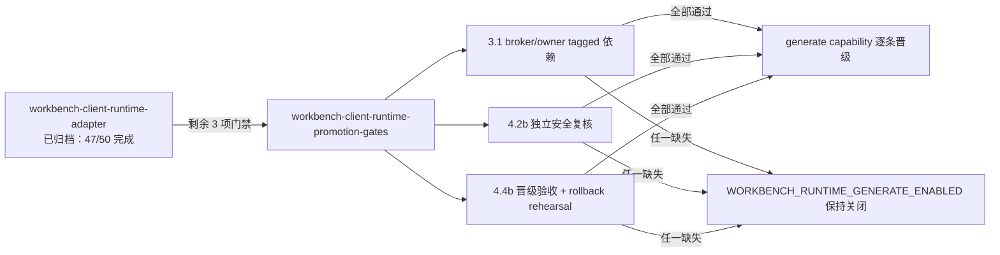

# Workbench Client Runtime 晋级门禁设计

## 上下文

归档 change `workbench-client-runtime-adapter` 已交付 descriptor/readiness、broker-backed admission 与 reconcile pump 的实现和自验证据。本 change 只负责晋级前剩余的外部门禁，不修改实现。

## 门禁关系

## 决策

- **实现者自检不替代独立复核**：4.2b 必须由独立 security reviewer 完成，已归档 change 中的自检证据仅作输入。
- **first-support 只接受真实 Aigora 链路**：不接受 fixture 作为晋级证据；第二 owner 证据作为跨 owner GA gate，不阻塞本 first-support。
- **失败即回退**：任一风险缺负向测试或出现 P0/P1 时关闭 generate flag。
