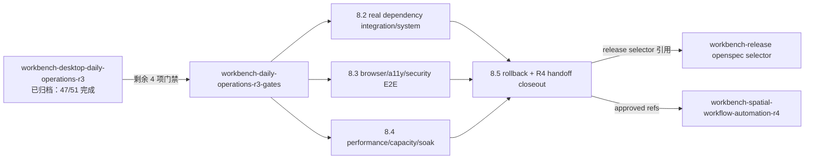

# Workbench Daily Operations R3 验证门禁设计

## 上下文

归档 change `workbench-desktop-daily-operations-r3` 已交付 Pane Desktop、Asset/WorkItem/Inbox/Approval/Delivery 日常闭环与本地/SQLite/PG gated 验证证据。本 change 只承接剩余的真实环境与晋级门禁，不修改实现；`docs/operations/daily-ops-rollback-runbook.md` 定义的 4 个独立 kill switch 仍是 rollback 权威。

## 门禁关系

## 决策

- **真实依赖不降级**：8.2 禁止用 fixture 替代 disposable PostgreSQL、Identity test tenant 与真实 Owner；已有 SQLite/PG gated 证据作为输入而非替代。
- **P0/P1 零容忍**：8.3 critical journeys 未通过或存在 P0/P1 时保持阻塞。
- **rollback 不回退 invariant**：8.5 不得回到跨租户 localStorage/fixture owner，additive schema 不回滚 migration。
- **编号保持**：任务编号沿用 8.2-8.5，使 release selector 只需替换 change ID。
