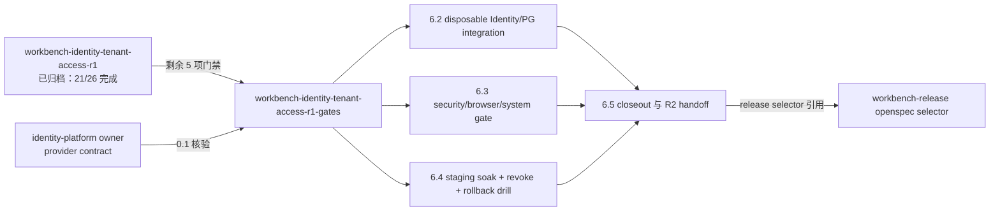

# Workbench Identity R1 验证门禁设计

## 上下文

归档 change `workbench-identity-tenant-access-r1` 已交付 consumer 侧 Principal/session/tenant/policy 能力与本地验证证据。本 change 只承接剩余的真实 provider 与 staging 环境门禁，不修改 consumer 实现；归档 change 的 design.md 仍是 token 边界与 delegation 语义的权威输入。

## 门禁关系

## 决策

- **fixture 不替代 provider**：6.2 禁止使用 mock/fixture 替代真实 Identity provider，缺证据即保持 `integration_ready/degraded`。
- **rollback 不降级**：6.4 rollback drill 不得降级回 local token 路径。
- **编号保持**：任务编号沿用 0.1/6.2-6.5，使 release selector 只需替换 change ID。
