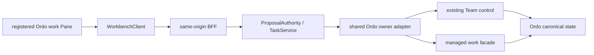

## Context

根 [产品账本](../../../../../openspec/changes/ordo-human-workbench-program-v1/design.md) C10/C12 在此落实，C02–C08 通过 provider-consumer 联合验证。遵循 [Blueprint](../../../docs/product/agent-workbench-blueprint.md)、[主壳 UI](../../../docs/ui/agent-first-workbench.md)、[接口](../../../docs/interfaces/agent-pi-workspace.md)、[UI governance](../../../docs/design/workbench-ui-governance.md)。独立 Ordo 网页的首页不是 Workbench 新的默认首页。

## Decisions

### 1. 消费合同与所有权

新增 typed managed-work facade 与 scope-safe projection。沿用 Workbench Task 作为传输/动作 lifecycle，不复制 Ordo work/run；固定 Task↔owner operation↔work/run refs，receipt 分开显示。Web只提交安全引用、expected revision、idempotency 和类型化决定，actor/授权由服务端重新解析。

新 managed grant 与已有 chat/session/access grant 隔离；TaskService 每次验证动作是否在原 grant 范围，最终 Ordo再次准入。新模式允许的步骤调整由 Ordo记录；旧 Team Plan exact revision approval 仍精确匹配，不自动升级。

同一 shared Ordo server adapter 处理旧 Team control 与新 managed contract；operation 描述、scope 和错误不通过自然语言 CLI 解析。领域模板/simulation/real canary仍调用原 Ordo owner operations。

### 2. 通用能力唯一接收

`workbench-text-development-studio-v1` task 2.4 的通用 Ordo adapter 由本 change task 2.1 承接，旧项改为领域接线与验证，不重复实施。其 7.x Team deck、模板、simulation、Pi canary和 Auctra candidate规则继续由原 change追踪。

新 Pane 将复用本地 Run/Review/Evidence、design-system 和既有 Ordo safe relation语义；Workbench 与 Ordo Web共享 protocol/data semantics/fixtures，不互相加载 React/CSS 或独立网页 iframe。已有主壳不增加永久业务侧栏或第二 composer。

### 3. 事件与控制

沿用 workspace summary 和 selected-session stream owner，Ordo子流由BFF按canonical work/run去重复用；每个Pane不各建一条SSE。保持独立owner cursor、freshness和generation，gap只重取snapshot，重连不重发start/accept。

Surface control只仲裁当前客户端提交新的操作；后台run grant和writer lease归Ordo。切换session、关闭Pane或浏览器不cancel，lost control禁用新mutation而不显示任务停止。独立网页取得control后Workbench进入可读状态，取回control不重复dispatch。

Unknown submission/cancel/adoption只提供原operation reconcile；source/profile drift、过期批准、授权撤销不能借本地presentation状态绕过。

### 4. UI Contract

- Surface classification: `registered-pane`，沿用既有 /agent document dock，必要专业内容进入既有 domain-lens。
- Primary question: 当前工作成果和阻塞是什么，哪一步需要我决定？
- Visual priority: 需决定/候选；阶段与真实进展；refs/租约/runtime技术详情。
- Pattern: Unified Surface + 概览/分工依赖/时间线，Review/Evidence进入既有context rail。
- Shared components: PaneFrame/PaneChrome、StatusChip、DataState、ActionRecovery、Tabs、Dialog/Sheet；只用本地design-system。
- Cards: 确认与候选审阅有存在理由；无KPI墙、新主壳或装饰性卡片。
- Scroll: Pane body为主滚动owner；Context独立bounded scroll。
- Domain allowance: code diff/文本/媒体safe preview，领域采用走原owner action。
- Exceptions: 无；不新增跨仓React/CSS runtime依赖。

| 面 | loading/empty | ready/running | error/offline | stale/partial | permission/cost | unknown |
|---|---|---|---|---|---|---|
| 概览/图 | skeleton/真实起步 | 原owner事实 | last-confirmed | freshness/缺失范围 | 原因与确认 | 只对账 |
| 控制 | 禁用 | owner action | 只读重连 | 重验版本 | 服务端gate | 无retry/start |
| Review | 等候真实candidate | 检查结果与采用预览 | 保留候选 | source冲突 | 独立决定 | 原采用operation reconcile |

1440宽保留Chat+document+Context；1024–1439使用互斥Sheet；小于1024用语义关系表和labelled Sheet。200% zoom无页面溢出；keyboard、Escape/focus-return、屏幕阅读器、reduced-motion完整。新增文案进入本地zh-CN/en-US locale source，不能用inline fallback代替。

### 5. 接入、成熟度与回滚

新capability默认关闭，provider缺合同或不匹配显示needs_contract；有合同但离线显示offline，不能mock成功。独立网页存在不证明Workbench接通。

`breaking_surfaces=[]`；保留旧read-only、exact-plan、领域deep links。关闭managed capability后停止新动作订阅，但原accepted/unknown Task通过原owner finish/reconcile。关闭UI不删record、不停止writer。

## 测试

WB-OMW-CONTRACT：SDK/BFF scope、旧新approval隔离及Task↔owner refs。
WB-OMW-PARITY：同一work在CLI/独立Web/Workbench状态与receipt相同，control接力不重复writer。
WB-OMW-RECOVERY：关Pane、切session、gap、重连、unknown、撤销与deadline。
WB-OMW-UI：三种视口、keyboard、reduced-motion、locale与状态矩阵。
WB-OMW-LEGACY：Text Development、旧Team control、只读scope与稳定deep link不变。

selector须先由本change注册，零匹配/skip不算通过。真实Ordo canary和Workbench consumer各自保留evidence；不以UI fixture替代。
